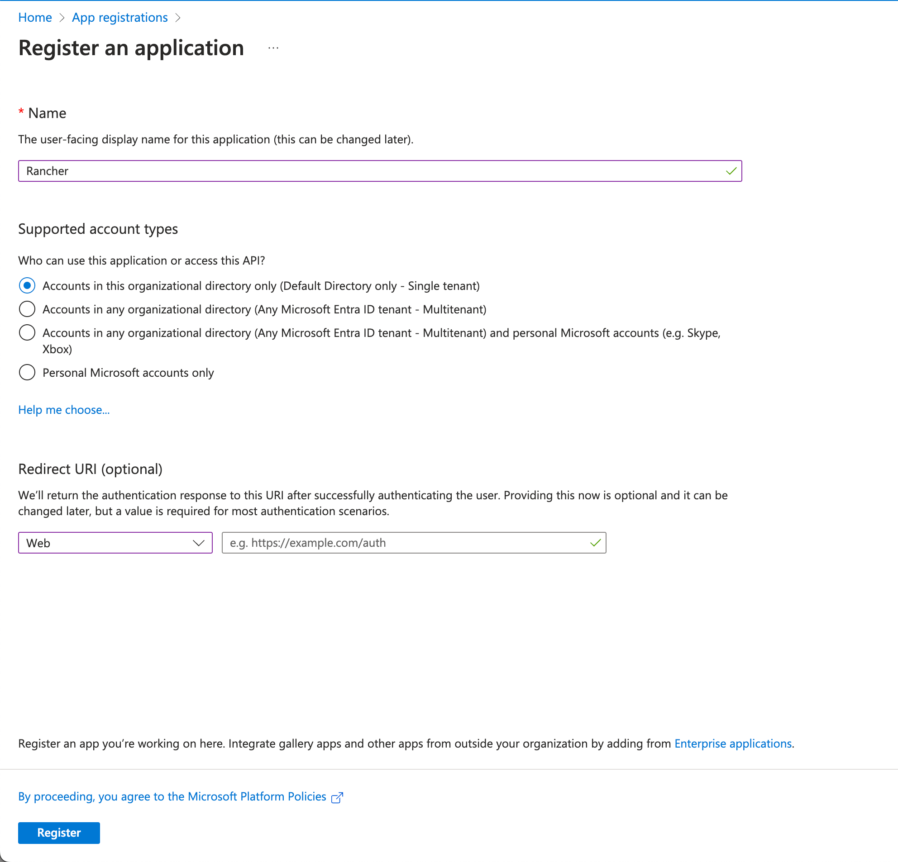
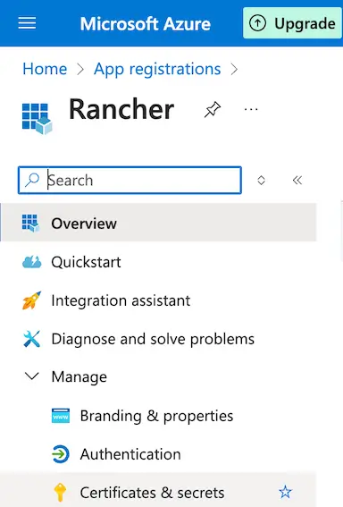
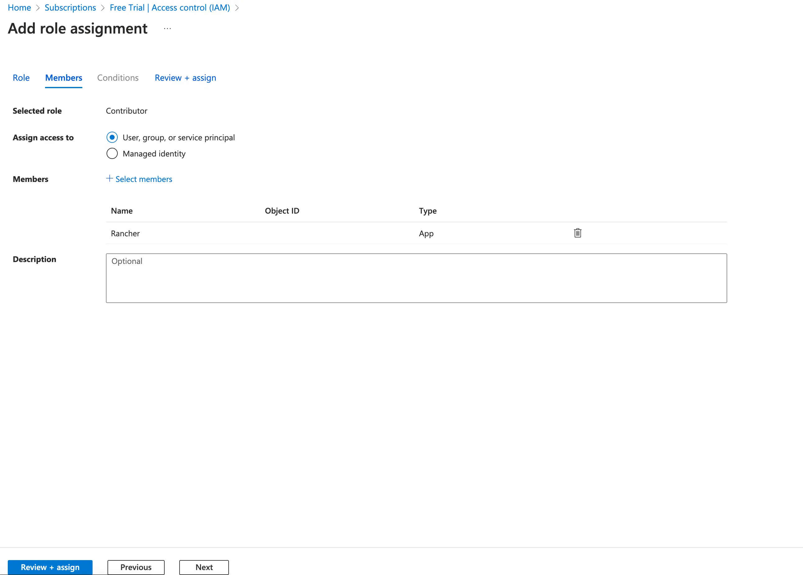
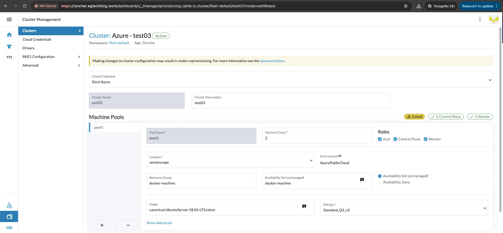
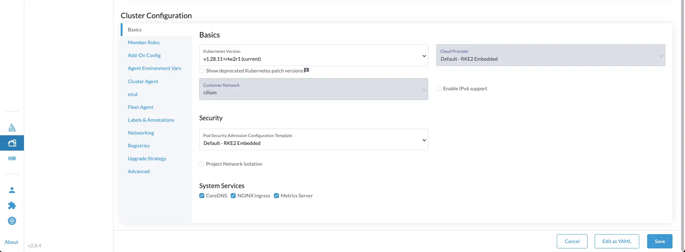
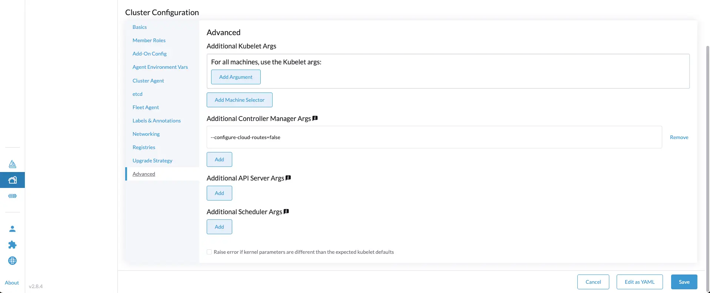
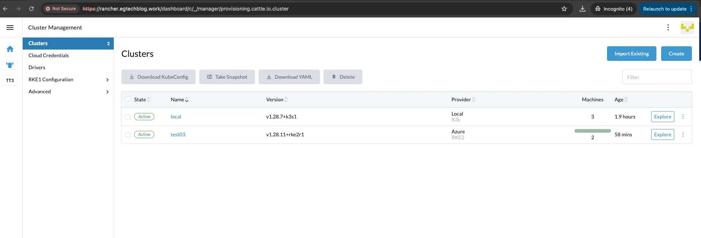

## Introduction

For the last couple of days, I have been working on a new use case installing [RKE2](https://docs.rke2.io/) clusters powered with [Cilium](https://docs.cilium.io/en/v1.15/) on [Azure Cloud](https://azure.microsoft.com/en-us/get-started). The requirement at hand was to use a [Rancher](https://ranchermanager.docs.rancher.com/v2.8) instance and from there start deploying RKE2 clusters. After going through the official Rancher documentation, I have noticed that the instructions provided to pre-configure [Azure Cloud](https://ranchermanager.docs.rancher.com/v2.8/how-to-guides/new-user-guides/launch-kubernetes-with-rancher/use-new-nodes-in-an-infra-provider/create-an-azure-cluster) are outdated.

In today's blog post, we will cover all the required steps taken to configure the [Azure cloud-free credits](https://azure.microsoft.com/en-us/free#all-free-services) to deploy RKE2 clusters with Cilium in that environment. Additionally, we will cover any limitations that come with the `free credit` concept.


<!--truncate-->

## Lab Setup

```bash
+-----------------------------+------------------+----------------------+
|        Cluster Name         |       Type       |       Version        |
+-----------------------------+------------------+----------------------+
|          Rancher            |   k3s cluster    |    v1.28.7+k3s1      |
| Downstream RKE2 cluster     |       RKE2       |  v1.28.11+rke2r1     |
+-----------------------------+------------------+----------------------+

+-------------------+----------+
|    Deployment     | Version  |
+-------------------+----------+
|      Cilium       | 1.15.500 |
+-------------------+----------+

```

## Prerequisites

### Rancher Server

We do not concentrate on installing Rancher. If you are not sure how to install Rancher, have a look at the official documentation [here](https://ranchermanager.docs.rancher.com/getting-started/quick-start-guides) or go through the guide I created a couple of weeks back [here](https://medium.com/@eleni.grosdouli/rancher-on-eks-with-nginx-ingress-and-lets-encrypt-4f041fc1adae). 

### Azure Free Credits

For this demonstration, we will use the Azure [free credits](https://azure.microsoft.com/en-us/free) offering. The approach taken is more than enough to give readers a free and good understanding of how to set up the Azure cloud environment to perform RKE2 deployments with Rancher.

Ensure the below are satisfied.

1. Helm CLI installed (Optional Step)
1. kubectl installed

## Set up Azure Cloud Environment

In this section, we will provide readers with all the needed guidance on setting up their environment for the RKE2 deployment

### Retrieve the Tenant ID

The `Tenant ID` identifies which Azure Active Directory (AD) instance the application sits under. To retrieve the Tenant ID, follow the steps below.

1. Login to Azure [portal](https://portal.azure.com/)
1. Navigate to **Home**
1. Search for `Microsoft Entra ID`
  
1. Navigate to **Manage > Properties**
1. Grab the `Tenant ID` once the new windows appear

### Create a Rancher App Registration

Azure App Registration is the process of registering an application with Azure AD.

1. Access the Azure [portal](https://portal.azure.com/) 
1. Navigate to **Home > App registrations > + New Registration**
1. Choose the below details:
    - `Name`: What is the name your application will have
    - `Supported account types`: In my case, I chose the first one, "Accounts in this organizational directory only (Default Directory only - Single tenant)"
    - `Redirect URI (optional)`: set `Web` and leave the `Sign-on URL` empty or add your own URI
1. Click the **Register** button to create the application

    

### Create an Azure Client Secret for App Registration

1. Access the Azure [portal](https://portal.azure.com/)  
1. Navigate to **Home > App registrations > App name**
1. Navigate to **Manage > Certificates & secrets**
  
1. Click on the **+ New client secret**
1. Provide a `description` and an `expiry date`
1. Click **+ Add**
1. Copy the `Value` and proceed with the configuraition

### Create App Registration Permissions

1. Access the Azure [portal](https://portal.azure.com/) 
1. Navigate to **Home > Subscriptions > Your subscription name > Access Control (IAM)**
    
1. Click on the **+ Add > Add role assigment**
    
1. Open the `Privileged administrator roles` tab
1. For Role, select `Contributor`
1. Click on **Next**
1. Members and **+ Select members** and then choose or type for `Rancher`. If your application name is something else, provide the application name created in a previous step 
1. **Review + assing**
1. Proceed with the creation

## Azure Free Account Limitations

Find below some of the limitations spotted with the `free-credit` subscription.

1. You cannot have more than **one** resource pools
1. You cannot have more than **3** Public IP addresses
1. You cannot create a resource pool with a `VM Size` **greater than** `Standard_D2_v2`

## Set up Rancher Cloud Credentials

Once we have the Azure environment ready, we can move on with Rancher. The first thing we have to do is to create `Azure Cloud Credentials`. The cloud credentials will be used to provision clusters or can be used in other node templates.

1. Login to Rancher
1. Navigate to **Home > Cluster management  > Cloud Credentials > Create > Choose Azure**
1. Provide a `name`, `tenant ID` (**Home > Subscriptions**), `clientID` (**Home > App registrations > Rancher > copy the Application (client) ID**), `client secret` (**Home > App registrations > App name > manage > certificates & secrets**)
1. Click the **"Create"** button and ensure no error appears on the screen


## Create an RKE2 cluster with Cilium

It is time to use the Azure cloud credentials to create an RKE2 cluster on Azure with Cilium.

1. Login to the **Rancher UI**
1. Navigiate to **Home > Cluster management  > Create > ensure RKE2 is selected > Choose Azure**
1. The `Cloud Credentials` field will get populated automatically. Fill out the details below.
    - `Cluster Name`: Set a cluster name
    - `Cluster Description`: Set a cluster description
    - Set the `Machine Pools` details. This reflects the nodes we will have on the cluster and their specified role (controller or worker nodes).
      - `Pool Name`: Left the default
      - `Machine Count`: Set to 2 due to limitations
      - `Location`: Choose your favourable location
        
    - Continue with the **Cluster Configuration > Basics**
      - `Kubernetes Version`: Define the preferred Kubernetes version
      - `Container Network`: Choose **Cilium**
        
        :::tip
        We can leave the rest of the configuration as default. However, if we want to enable Cilium with `kube-proxy` replacement, we can update the cluster by editing the YAML configuration instead. This can be done by clicking the `Edit as YAML` button at the bottom right-hand side.
        :::
    - Continue with the **Cluster Configuration > Advanced**
      - `Additional Controller Manager Args`: Set `--configure-cloud-routes=false`
        
1. Click **"Save"**

:::note
The cluster creation might take up to 20 minutes. Be patient as a couple of resources and Azure items are created for this cluster.

After 20 minutes:
  
:::


## RKE2 Cluster Validation

Now that the RKE2 cluster is up and running, let's perform some validation steps to ensure the cluster is working as expected.

```bash
$ kubectl get nodes -o wide
NAME                          STATUS   ROLES                              AGE   VERSION           INTERNAL-IP   EXTERNAL-IP   OS-IMAGE             KERNEL-VERSION     CONTAINER-RUNTIME
test03-pool1-cff6be83-jfnrw   Ready    control-plane,etcd,master,worker   50m   v1.28.11+rke2r1   192.168.0.5   <none>        Ubuntu 18.04.6 LTS   5.4.0-1109-azure   containerd://1.7.17-k3s1
test03-pool1-cff6be83-wml94   Ready    control-plane,etcd,master,worker   56m   v1.28.11+rke2r1   192.168.0.4   <none>        Ubuntu 18.04.6 LTS   5.4.0-1109-azure   containerd://1.7.17-k3s1

$ kubectl get pods -n kube-system
NAME                                                   READY   STATUS      RESTARTS      AGE
cilium-4wzld                                           1/1     Running     0             49m
cilium-7st9q                                           1/1     Running     0             55m
cilium-operator-695b4bfc8b-rrdpw                       1/1     Running     3 (46m ago)   55m
cilium-operator-695b4bfc8b-wvswc                       1/1     Running     5 (44m ago)   55m
cloud-controller-manager-test03-pool1-cff6be83-jfnrw   1/1     Running     4 (43m ago)   49m
cloud-controller-manager-test03-pool1-cff6be83-wml94   1/1     Running     5 (44m ago)   55m
etcd-test03-pool1-cff6be83-jfnrw                       1/1     Running     0             49m
etcd-test03-pool1-cff6be83-wml94                       1/1     Running     0             55m
helm-install-rke2-cilium-4g9m6                         0/1     Completed   0             56m
helm-install-rke2-coredns-4fcl8                        0/1     Completed   0             56m
helm-install-rke2-ingress-nginx-sllhl                  0/1     Completed   0             56m
helm-install-rke2-metrics-server-djld4                 0/1     Completed   0             56m
helm-install-rke2-snapshot-controller-6vktm            0/1     Completed   0             56m
helm-install-rke2-snapshot-controller-crd-fmr6n        0/1     Completed   0             56m
helm-install-rke2-snapshot-validation-webhook-tj4b8    0/1     Completed   0             56m
kube-apiserver-test03-pool1-cff6be83-jfnrw             1/1     Running     1 (43m ago)   49m
kube-apiserver-test03-pool1-cff6be83-wml94             1/1     Running     1             43m
kube-controller-manager-test03-pool1-cff6be83-jfnrw    1/1     Running     3 (46m ago)   49m
kube-controller-manager-test03-pool1-cff6be83-wml94    1/1     Running     1 (44m ago)   46m
kube-proxy-test03-pool1-cff6be83-jfnrw                 1/1     Running     0             49m
kube-proxy-test03-pool1-cff6be83-wml94                 1/1     Running     0             55m
kube-scheduler-test03-pool1-cff6be83-jfnrw             1/1     Running     3 (46m ago)   49m
kube-scheduler-test03-pool1-cff6be83-wml94             1/1     Running     1 (44m ago)   46m
rke2-coredns-rke2-coredns-84b9cb946c-bd8p6             1/1     Running     0             49m
rke2-coredns-rke2-coredns-84b9cb946c-npgl2             1/1     Running     0             55m
rke2-coredns-rke2-coredns-autoscaler-b49765765-lp244   1/1     Running     0             55m
rke2-ingress-nginx-controller-qk5mc                    1/1     Running     0             53m
rke2-ingress-nginx-controller-wbdf8                    1/1     Running     0             48m
rke2-metrics-server-655477f655-j9vzw                   1/1     Running     0             54m
rke2-snapshot-controller-59cc9cd8f4-8fhwb              1/1     Running     6 (44m ago)   54m
rke2-snapshot-validation-webhook-54c5989b65-9vb9w      1/1     Running     0             54m

$ kubectl get pods,svc -n cattle-system
NAME                                             READY   STATUS      RESTARTS      AGE
pod/cattle-cluster-agent-59df97fc7f-44q74        1/1     Running     2 (43m ago)   46m
pod/cattle-cluster-agent-59df97fc7f-vbvbb        1/1     Running     0             45m
pod/helm-operation-4clvk                         0/2     Completed   0             50m
pod/helm-operation-89qsx                         0/2     Completed   0             51m
pod/rancher-webhook-d677765b4-6vrkh              1/1     Running     1 (44m ago)   44m
pod/system-upgrade-controller-6f86d6d4df-jvd9k   1/1     Running     0             51m

NAME                           TYPE        CLUSTER-IP     EXTERNAL-IP   PORT(S)          AGE
service/cattle-cluster-agent   ClusterIP   10.43.82.34    <none>        80/TCP,443/TCP   56m
service/rancher-webhook        ClusterIP   10.43.80.125   <none>        443/TCP          51m
```

```bash
$ kubectl exec -it ds/cilium -n kube-system -- cilium status
Defaulted container "cilium-agent" out of: cilium-agent, install-portmap-cni-plugin (init), config (init), mount-cgroup (init), apply-sysctl-overwrites (init), mount-bpf-fs (init), clean-cilium-state (init), install-cni-binaries (init)
KVStore:                 Ok   Disabled
Kubernetes:              Ok   1.28 (v1.28.11+rke2r1) [linux/amd64]
Kubernetes APIs:         ["EndpointSliceOrEndpoint", "cilium/v2::CiliumClusterwideNetworkPolicy", "cilium/v2::CiliumEndpoint", "cilium/v2::CiliumNetworkPolicy", "cilium/v2::CiliumNode", "cilium/v2alpha1::CiliumCIDRGroup", "core/v1::Namespace", "core/v1::Pods", "core/v1::Service", "networking.k8s.io/v1::NetworkPolicy"]
KubeProxyReplacement:    False   [eth0   192.168.0.5 fe80::6245:bdff:fe94:cd06]
Host firewall:           Disabled
SRv6:                    Disabled
CNI Chaining:            portmap
CNI Config file:         successfully wrote CNI configuration file to /host/etc/cni/net.d/05-cilium.conflist
Cilium:                  Ok   1.15.5 (v1.15.5-8c7e442c)
NodeMonitor:             Disabled
Cilium health daemon:    Ok   
IPAM:                    IPv4: 9/254 allocated from 10.42.1.0/24, 
IPv4 BIG TCP:            Disabled
IPv6 BIG TCP:            Disabled
BandwidthManager:        Disabled
Host Routing:            Legacy
Masquerading:            IPTables [IPv4: Enabled, IPv6: Disabled]
Controller Status:       52/52 healthy
Proxy Status:            OK, ip 10.42.1.172, 0 redirects active on ports 10000-20000, Envoy: embedded
Global Identity Range:   min 256, max 65535
Hubble:                  Disabled
Encryption:              Disabled        
Cluster health:          2/2 reachable   (2024-07-26T09:19:17Z)
Modules Health:          Stopped(0) Degraded(0) OK(11)

```

## Conclusion

This is it! We performed an RKE2 cluster with Cilium using the Rancher UI in just a few clicks. 🎉 In an upcoming blog post, we will demonstrate how to perform the same with either [Terraform](https://www.terraform.io/) or [OpenTofu](https://opentofu.org/)!

It's a wrap for this post! 🎉 Thanks for reading! Stay tuned for more exciting updates!

## ✉️ Contact

If you have any questions, feel free to get in touch! You can use the `Discussions` option found [here](https://github.com/egrosdou01/blog.grosdouli.dev/discussions) or reach out to me on any of the social media platforms provided. 😊

We look forward to hearing from you!