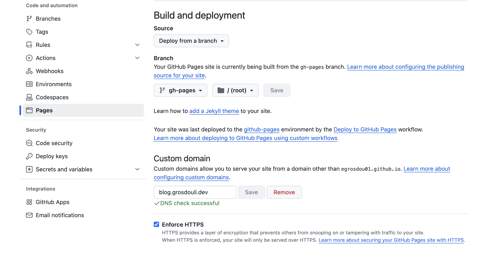
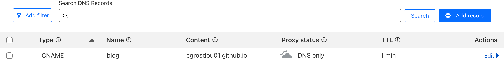

## Introduction

Migration alert! For a while, I wanted to move my [Docusaurus](https://docusaurus.io/docs/next) blog to a new custom domain. In the beginning, it appeared like an overwhelming task due to time constraints and of course DNS! However, after some research, I finally managed to make the migration smooth and hassle-free. This blog post is meant to save you time and frustration if you are looking to deploy a Docusaurus site on GitHub Pages with your custom domain without running into DNS problems along the way!

**Funny Fact**: After spending the last couple of days troubleshooting DNS issues (fun, right?), a colleague and good friend Justus surprised me with this awesome t-shirt! 😂

Now, let's dive into the configuration! 👇


<!--truncate-->

## Private DNS Domain

Before we even begin, ensure you own a valid DNS domain. Once this is done, decide the domain name you would like end-users to reach your blog.

## GitHub Repository

For the GitHub repository, ensure it is publicly available and choose a meaningful name. In my case, I have decided to provide the same name as the domain it will be exposed to. The repository name was set to `blog.grosdouli.dev` where `grosdouli.dev` is the DNS domain.

## Update docusaurus.config.js

To use GitHub pages with a custom domain, we need to perform changes on the `baseURL` and `url` variables within the `docusaurus.config.js` file. Below are the required changes.

```js
// This is the URL for your post. It can also be considered the top-level hostname
url: 'https://blog.grosdouli.dev',
// The baseUrl should be set to /. This field is related to the url field. So, we will resolve the blog post as https://blog.grosdouli.dev/
baseUrl: '/',

// GitHub pages deployment
organizationName: 'YOUR GITHUB Username', // Usually your GitHub org/user name
projectName: 'blog.grosdouli.dev', // Usually your repo name
deploymentBranch: 'gh-pages',
```

## Update Code

After the changes are performed, ensure the `gh-pages` are also updated. To do this, follow the commands listed below.

```bash
$ npm run build
$ npx Docusaurus deploy 
```

The second command will **update** and **push** changes directly to the `gh-pages` branch. This will also trigger a new action to build the page.

## GitHub Pages Settings

To allow the blog to be available under a custom domain, we have to include the custom domain in the GitHub Pages section. To do that, follow the steps listed below.

1. Login to GitHub
1. Open the repository created in a previous step
1. Navigate to **Settings > Code and automation > Pages**
1. On the right-hand-side, locate the `Custom domain` option
1. Add the domain you would like the blog to be available
    - Example: `blog.<your domain>`
1. Click Save
    

:::tip
Once the `save` button is clicked, a `CNAME` file including the custom domain provided will be included in the branch where the GitHub Pages site is being built.
:::

:::note
GitHub will check whether the custom domain is valid, and will also take care of the HTTPS enforcement.
:::

Have a look at the different custom domain resources listed [here](https://docs.github.com/en/pages/configuring-a-custom-domain-for-your-github-pages-site).

## Cloudflare CNAME Setup

We are almost done with the deployment, we just need to create a new `CNAME` in Cloudflare. To do that, follow the steps listed below.

1. Login to Cloudflare
1. Click on your domain name
1. From the left-hand-side navigate to **DNS > Records > Add record**
1. Add the below CNAME entry
    

### Validate

1. Go back to GitHub pages and ensure the Domain check is green
1. Try to reach the blog on the custom domain via a browser or use CURL

:::tip
Depending on your DNS provider and the time to propagate the record, the blog might not be available or be available after some minutes.
:::

## Conclusion

Docusaurus deployment with a custom DNS domain made easy!

It's a wrap for this post! 🎉 Thanks for reading! Stay tuned for more exciting updates!

## ✉️ Contact

If you have any questions, feel free to get in touch! You can use the `Discussions` option found [here](https://github.com/egrosdou01/blog.grosdouli.dev/discussions) or reach out to me on any of the social media platforms provided. 😊

We look forward to hearing from you!
