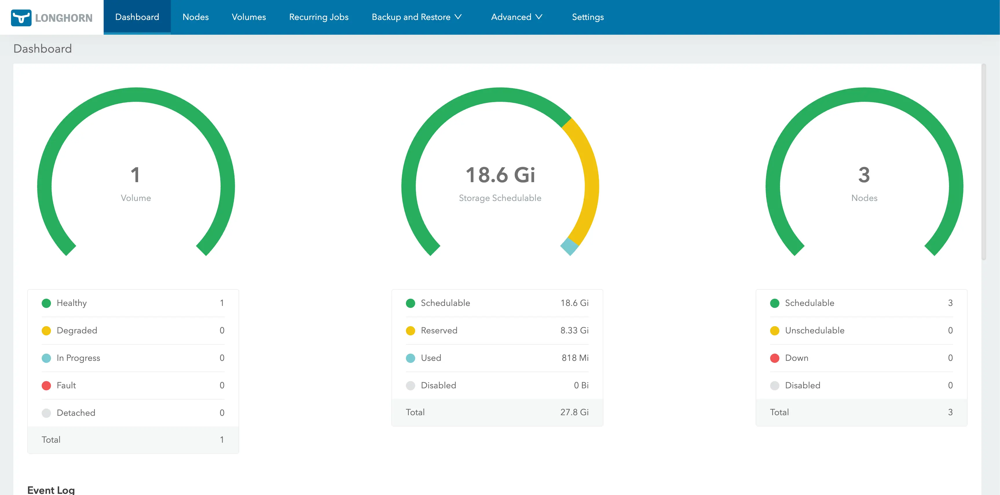
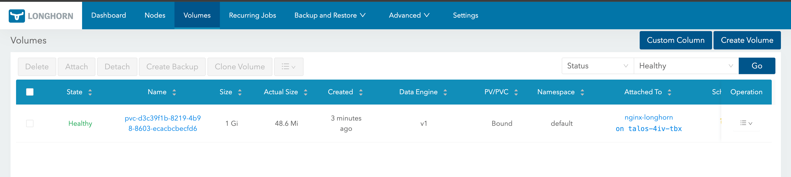

**Summary**:

We continue where we left off in [**part 4**](./talos-proxmox-opentofu-part-4.md). We add Longhorn persistence block storage to the Talos Linux cluster

<!--truncate-->

## Introduction

To allow users to work and use persistent storage, I decided to integrate [Longhorn](https://longhorn.io/) into the setup as it is easy to use, lightweight and reliable. Longhorn significantly enhances Talos Linux Kubernetes clusters by providing robust, highly available persistent block storage, which is crucial for running stateful applications. Longhorn is an open-source project and includes built-in features for [incremental snapshots and backups](https://longhorn.io/docs/1.10.1/snapshots-and-backups/scheduling-backups-and-snapshots/) to [secondary storage](https://longhorn.io/docs/1.10.1/terminology/#secondary-backups) like S3 or NFS, along with [disaster recovery](https://longhorn.io/docs/1.10.1/snapshots-and-backups/setup-disaster-recovery-volumes/) capabilities, all managed through an intuitive GUI.

For this part, we will enable Longhorn on the module and then deploy it using Helm commands. In a future post, the module will be updated to include the storage as a deployment option.

<!--truncate-->

## Lab Setup

```bash
+------------------------------+------------+
|         Deployment            |  Version  |
+------------------------------+------------+
|        Proxmox VE            |   8.2.4    |
|   Talos Kubernetes Cluster   |   1.11.3   |
|         Cilium               |   1.18.0   |
|         Longhorn             |   1.10.1   |
+------------------------------+------------+
+-----------------------------+-----------+
|       OpenTofu Providers    |  Version  |
+-----------------------------+-----------+
|      opentofu/random        |    3.6.2  |
|      telmate/proxmox        | 3.0.2-rc4 |
|      siderolabs/talos       |    0.8.1  |
+-----------------------------+-----------+
+------------------------+-------------------------+
|        Binaries        |         Version         |
+------------------------+-------------------------+
|         tofu           | OpenTofu v1.8.1/v1.9.0  |
|        kubectl         |         v1.34.1         |
+------------------------+-------------------------+
```

## Module Tests

The module underwent testing mainly on a local MacBook; it also underwent testing on an `Ubuntu 24.04` virtual machine within the Proxmox environment.

## GitHub Resources

Check out the [GitHub repository](https://github.com/egrosdou01/blog-post-resources/tree/main/opentofu-talos-cilium-proxmox-module) for the full code.

## Prerequisites

As today's blog focuses on the changes performed due to the OpenTofu provider updates, it is advised to have a look at [part 4](./talos-proxmox-opentofu-part-3.md) of the series. Any prerequisites should already have been satisfied.

## Talos Linux ISO Requirements

The default Talos root filesystem does not include the longhorn binary executables. That means we need to visit the [Talos image factory](https://factory.talos.dev/) and include the extensions below.

- `QEMU Guest Agent`: Allow reporting of the virtual machine status to Proxmox
- `siderolabs/iscsi-tools`: Enable the **iscsid daemon** and **iscsiadm** on all the nodes of the Kubernetes cluster for persistent volume operations
- `siderolabs/util-linux-tools`: Enable the Linux util tools on all the nodes of the Kubernetes cluster

:::tip
As we did in the past, mark down the **First Boot** `.iso` link and the **Initial Installation** link. The details will be used in the module as demonstrated previously.
:::

## Data Path Mount and UserVolumeConfig

We need to provide additional data path mounts to be accessible to the Kubelet. Longhorn’s default data path is **/var/lib/longhorn**. To use the configuration in Talos, we need to change the default data path to **/var/mnt/longhorn**. For this setup, I included the extra mounts for the Kubelet in the `init_install_worker.tfmpl` file.

```hcl
machine:
  install:
    image: ${initial_image}
  kubelet:
    extraMounts:
      - destination: /var/mnt/longhorn
        type: bind
        source: /var/mnt/longhorn
        options:
          - bind
          - rshared
          - rw
```

Additionally, we need to create a `UserVolumeConfig` to mount the disk for Longhorn, which will be mounted to the `/var/mnt/longhorn` directory on the configured nodes. The configuration below was also included in the `init_install_worker.tfmpl` file.

```hcl showlines
---
apiVersion: v1alpha1
kind: UserVolumeConfig
name: longhorn
provisioning:
  diskSelector:
    match: disk.dev_path == '/dev/sdb'
  grow: false
  maxSize: 10GB
```

At line **7**, `/dev/sdb` is the location of the second disk to be used by Longhorn.

:::note
Prior to v1.10, Talos versions, the `.machine.disks` option was supported. However, the recommended approach for later versions is the use of `UserVolumeConfig`. To get a better understanding of what the supported fields of the resource above are, take a look at the [Talos API Configuration](https://docs.siderolabs.com/talos/v1.10/reference/api#string).
:::

## Tofu Execution Plan

```bash
$ tofu init
$ tofu plan
$ tofu apply
```
## talosctl Validation

Once the cluster(s) are successfully created, we will use the `talosctl` utility to check the disks and whether the correct mounts have been created on the nodes. Get a copy of the [talosctl utility here](https://docs.siderolabs.com/talos/v1.10/getting-started/talosctl).

### Collect talos_config Output

```bash
$ tofu output talos_configuration
```

Collect the output between the EOT fields and store it in a file with a name of your preference. For this setup, the filename `talos_config.yaml` is used.

```bash
$ export TALOSCONFIG=~/talos_config.yaml
```

Once the `TALOSCONFIG` is exported, we will be able to interact with our cluster(s).

### Check Disk and Volumes

```bash
$ talosctl get disks --nodes <Node IP Address>

$ talosctl mounts --nodes <Node IP Address> | grep -i "/var/mnt/longhorn"
NODE           FILESYSTEM   SIZE(GB)   USED(GB)   AVAILABLE(GB)   PERCENT USED   MOUNTED ON

<Node IP Address>   /dev/sdb1    9.93       0.22       9.71            2.26%          /var/mnt/longhorn
```

## Install Longhorn - Helm Chart

The easiest way to install Longhorn is by using the available Helm chart. Ensure the `KUBECONFIG` variable is already exported, and you can interact with the underlying cluster.

### values.yaml

Create a `values.yaml` file and define the data path location on the nodes along with other information.

```yaml showlines
defaultSettings:
  defaultReplicaCount: "2"
  defaultDataPath: "/var/mnt/longhorn"
  defaultLonghornStaticStorageClass: longhorn
```

### longhorn-system namespace

To allow Longhorn to use the underlying disk of the Kubernetes nodes, we need to ensure the `longhorn-system` namespace has the right permissions. For that reason, the labels will be included.

```yaml
---
apiVersion: v1
kind: Namespace
metadata:
  name: longhorn-system
  labels:
    pod-security.kubernetes.io/enforce: privileged
    pod-security.kubernetes.io/audit: privileged
    pod-security.kubernetes.io/warn: privileged
```

### Helm Chart

```bash
$ helm repo add longhorn https://charts.longhorn.io

$ helm install longhorn longhorn/longhorn --namespace longhorn-system --values values.yaml
```

#### Validation

```bash
$ kubectl get pods -n longhorn-system
NAME                                                READY   STATUS    RESTARTS        AGE
csi-attacher-5988f5ff9c-czvrx                       1/1     Running   0               5h13m
csi-attacher-5988f5ff9c-fmf2d                       1/1     Running   0               5h13m
csi-attacher-5988f5ff9c-rzt76                       1/1     Running   3 (5h11m ago)   5h13m
csi-provisioner-588d86c74-64pnq                     1/1     Running   2 (5h12m ago)   5h13m
csi-provisioner-588d86c74-jsnr8                     1/1     Running   0               5h13m
csi-provisioner-588d86c74-mtdb2                     1/1     Running   0               5h13m
csi-resizer-76cbbd958d-2qdt8                        1/1     Running   2 (5h11m ago)   5h13m
csi-resizer-76cbbd958d-lvk9f                        1/1     Running   0               5h13m
csi-resizer-76cbbd958d-tlpbv                        1/1     Running   0               5h13m
csi-snapshotter-85d6c5cb94-bj9qm                    1/1     Running   2 (5h12m ago)   5h13m
csi-snapshotter-85d6c5cb94-pqlx6                    1/1     Running   0               5h13m
csi-snapshotter-85d6c5cb94-whzrr                    1/1     Running   0               5h13m
engine-image-ei-26bab25d-4tkzm                      1/1     Running   0               5h14m
engine-image-ei-26bab25d-7pr4h                      1/1     Running   0               5h14m
engine-image-ei-26bab25d-ktv2l                      1/1     Running   0               5h14m
instance-manager-5d3352c3e398ede1baf05ebf20405f10   1/1     Running   0               5h13m
instance-manager-acb5b0d872eea7e659592291c09f3d70   1/1     Running   0               5h14m
instance-manager-b4f38d1a39c9a62925745ef27694e1a2   1/1     Running   0               5h14m
longhorn-csi-plugin-f8tq5                           3/3     Running   0               5h13m
longhorn-csi-plugin-vjp2v                           3/3     Running   1 (5h13m ago)   5h13m
longhorn-csi-plugin-wtffg                           3/3     Running   0               5h13m
longhorn-driver-deployer-74f45ccf86-ntbjj           1/1     Running   0               5h15m
longhorn-manager-m7k9n                              2/2     Running   0               5h15m
longhorn-manager-nf4c4                              2/2     Running   1 (5h14m ago)   5h15m
longhorn-manager-xfgsb                              2/2     Running   0               5h15m
longhorn-ui-7b8657c6cd-fz54x                        1/1     Running   0               5h15m
longhorn-ui-7b8657c6cd-lx5z6                        1/1     Running   0               5h15m

$ kubectl get storageclass
NAME                 PROVISIONER          RECLAIMPOLICY   VOLUMEBINDINGMODE   ALLOWVOLUMEEXPANSION   AGE
longhorn (default)   driver.longhorn.io   Delete          Immediate           true                   8m17s
```

Use `port-forward` or update the Longhorn service to access the portal via a NodePort or a LoadBalancer IP address.

```bash
$ kubectl -n longhorn-system port-forward svc/longhorn-frontend 8080:80
```

Access the link below: https://localhost:8080



## Deploy an Nginx Application

To test the setup, we will create a simple Nginx application. Apply the below manifest to the Talos Linux Kubernetes cluster.

```yaml showlines
apiVersion: v1
kind: PersistentVolumeClaim
metadata:
  name: nginx-longhorn-pvc
spec:
  accessModes:
    - ReadWriteOnce
  storageClassName: longhorn
  resources:
    requests:
      storage: 1Gi
---
apiVersion: v1
kind: Pod
metadata:
  name: nginx-longhorn
  labels:
    app: nginx-longhorn
spec:
  containers:
    - name: nginx
      image: nginx:stable
      ports:
        - containerPort: 80
      volumeMounts:
        - name: nginx-storage
          mountPath: /usr/share/nginx/html
  volumes:
    - name: nginx-storage
      persistentVolumeClaim:
        claimName: nginx-longhorn-pvc
---
apiVersion: v1
kind: Service
metadata:
  name: nginx-longhorn
spec:
  selector:
    app: nginx-longhorn
  ports:
    - protocol: TCP
      port: 80
      targetPort: 80
  type: ClusterIP
```

### Validation

```bash
$ kubectl apply -f nginx_app.yaml

$ kubectl get pods,svc,pv,pvc
NAME                 READY   STATUS    RESTARTS   AGE
pod/nginx-longhorn   1/1     Running   0          27s

NAME                     TYPE        CLUSTER-IP       EXTERNAL-IP   PORT(S)   AGE
service/kubernetes       ClusterIP   10.96.0.1        <none>        443/TCP   40m
service/nginx-longhorn   ClusterIP   10.106.213.223   <none>        80/TCP    27s

NAME                                                        CAPACITY   ACCESS MODES   RECLAIM POLICY   STATUS   CLAIM                        STORAGECLASS   VOLUMEATTRIBUTESCLASS   REASON   AGE
persistentvolume/pvc-d3c39f1b-8219-4b98-8603-ecacbcbecfd6   1Gi        RWO            Delete           Bound    default/nginx-longhorn-pvc   longhorn       <unset>                          25s

NAME                                       STATUS   VOLUME                                     CAPACITY   ACCESS MODES   STORAGECLASS   VOLUMEATTRIBUTESCLASS   AGE
persistentvolumeclaim/nginx-longhorn-pvc   Bound    pvc-d3c39f1b-8219-4b98-8603-ecacbcbecfd6   1Gi        RWO            longhorn       <unset>                 27s
```



## Future Steps

Demonstrate how [Ceph storage using Rook](https://docs.siderolabs.com/kubernetes-guides/csi/ceph-with-rook) looks in the existing setup. This might come in the future, as this is not required for my homelab setup!

## Conclusion

🚀 For storage requirements, the easiest way is to integrate Longhorn storage into the setup!

## Resources

- [Talos API Reference](https://docs.siderolabs.com/talos/v1.10/reference/api#table-of-contents)
- [Talos and Longhorn](https://docs.siderolabs.com/kubernetes-guides/csi/storage#longhorn)
- [Longhorn Details](https://longhorn.io/docs/1.10.1/advanced-resources/os-distro-specific/talos-linux-support/#requirements)

## ✉️ Contact

If you have any questions, feel free to get in touch! You can use the `Discussions` option found [here](https://github.com/egrosdou01/blog.grosdouli.dev/discussions) or reach out to me on any of the social media platforms provided. 😊 We look forward to hearing from you!
