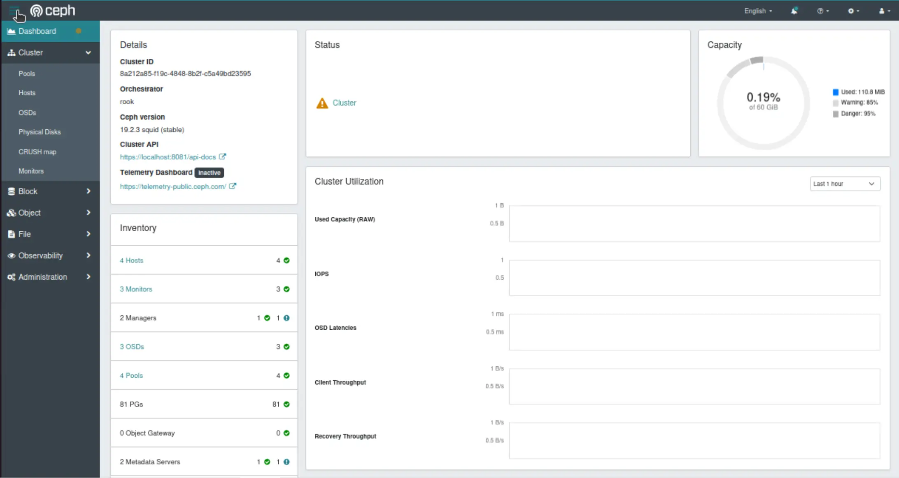

**Summary**:

Taking the latest updates introduced in [**part 4**](./talos-proxmox-opentofu-part-4.md), we will add **Ceph using Rook** for file and block storage suitable for the different applications running in Kubernetes.

<!--truncate-->

## Introduction

As we increasingly use applications that require persistent storage, we need a scalable and flexible solution for Kubernetes environments. In a previous post, we introduced [Longhorn](https://longhorn.io/) as a storage solution due to the simplicity of the setup. The approach works well for my homelab, but production workloads need a more flexible solution. The new approach should support various storage types like file, block, and object. It should also offer scalability, reliability, and strong performance.

The community was comfortable using the open-source project [MinIO](https://github.com/minio/minio), but it entered [maintenance mode in December 2025](https://github.com/minio/minio). [Ceph](https://ceph.io/) to the rescue. Ceph can provide a highly scalable, distributed storage system this can be automatically managed and orchestrated by [Rook](https://rook.io/docs/rook/v1.9/Getting-Started/intro/) as a Kubernetes operator. This combination turns Ceph into **self-manage**, **self-scale**, and **self-healing** storage solution in Kubernetes.

## Lab Setup

```bash
+------------------------------+------------+
|          Deployment          |  Version   |
+------------------------------+------------+
|          Proxmox VE          |   8.4.16   |
|   Talos Kubernetes Cluster   |   1.11.3   |
|            Cilium            |   1.18.0   |
|      Rook Ceph Operator      |   1.18.8   |
|         Ceph Cluster         |  v19.2.3   |
+------------------------------+------------+
```

## Module Tests

The module underwent testing mainly on a local MacBook; it also underwent testing on an `Ubuntu 24.04` virtual machine within the Proxmox environment.

## GitHub Resources

Check out the [GitHub repository](https://github.com/egrosdou01/blog-post-resources/tree/main/opentofu-talos-cilium-proxmox-module/v0.1.1) for the complete code.

## Prerequisites

Take a look at [part 4](./talos-proxmox-opentofu-part-4.md) of the series. Any prerequisites should already have been satisfied.

## Ceph Terminology

### Ceph Monitors

> Ceph monitors serve as the single source of truth for the cluster map. It is possible to run a cluster with only one monitor, but for a production cluster, it is recommended to have at least three monitors provisioned and in quorum. It is best to run an odd number of monitors.

[Source](https://docs.ceph.com/en/latest/rados/operations/add-or-rm-mons/)

### Ceph Manager

> The Ceph manager daemon (ceph-mgr) is a daemon that runs alongside monitor daemons to provide monitoring and interfacing to external monitoring and management systems.

[Source](https://docs.ceph.com/en/latest/glossary/#term-Ceph-Manager)

### Ceph OSD (Object Storage Daemon)

> The Ceph OSD software, which interacts with logical disks (OSD).

[Source](https://docs.ceph.com/en/latest/glossary/#term-Ceph-OSD)

### RADOS (Reliable Autonomic Distributed Object Store)

> RADOS is the object store that provides a scalable service for variably-sized objects.

[Source](https://docs.ceph.com/en/latest/glossary/#term-RADOS)

### Ceph Client

> Any of the Ceph components that can access a Ceph Storage Cluster. This includes the Ceph Object Gateway, the Ceph Block Device, the Ceph File System, and their corresponding libraries.

[Source](https://docs.ceph.com/en/latest/glossary/#term-Ceph-Client)

## Installation

### rook-ceph Helm Chart Installation

The [official rook-ceph Helm chart is located here](https://artifacthub.io/packages/helm/rook/rook-ceph/). Following the [Talos Linux guide](https://docs.siderolabs.com/kubernetes-guides/csi/ceph-with-rook), below are the commands to install the operator on a Talos Linux cluster. As the default PodSecurity configuration prevents execution of privileged pods, we need to label the `rook-ceph` namespace and allow Ceph to start.

```bash
$ helm repo add rook-release https://charts.rook.io/release 
$ helm install --create-namespace --namespace rook-ceph rook-ceph rook-release/rook-ceph --version 1.18.8

$ kubectl label namespace rook-ceph pod-security.kubernetes.io/enforce=privileged
```

```bash
$ kubectl get pods -n rook-ceph -w
NAME                                           READY   STATUS    RESTARTS   AGE
ceph-csi-controller-manager-5dc6b7cf95-zfbf2   1/1     Running   0          85s
rook-ceph-operator-84f6b7f9fb-k76md            1/1     Running   0          85s
```

### Ceph Cluster

Once the rook-ceph operator is running, we can create a Ceph cluster instance. In the beginning, I tried to work with the Ceph Helm chart, but I had to go over so many available options, and as a result, I decided to keep it simple. I used the ceph-cluster manifest provided as an example in the [rook-ceph GitHub repository](https://github.com/rook/rook/tree/master/deploy/examples).

Most of the `cluster.yaml` file includes comments. For my setup, I enabled compression of data on the wire and defined the storage device as `/dev/sdb`. This is the second disk defined on each node in the cluster. If the second is left as it is, all devices will be mapped.

```yaml showLineNumbers
  network:
    connections:
      # Whether to compress the data in transit across the wire. The default is false.
      # See the kernel requirements above for encryption.
      compression:
        enabled: true
  storage: # cluster level storage configuration and selection
    useAllNodes: true
    useAllDevices: true
    devices:
      - name: /dev/sdb
```

The next step is to apply the manifest to the cluster and wait until the Ceph cluster is ready. Depending on the underlying hardware, this could take a few minutes.

```bash
$ kubectl apply -f rook-ceph/ceph_cluster.yaml
```

```bash
$ kubectl get cephcluster rook-ceph -n rook-ceph
NAME        DATADIRHOSTPATH   MONCOUNT   AGE   PHASE   MESSAGE                        HEALTH        EXTERNAL   FSID
rook-ceph   /var/lib/rook     3          14m   Ready   Cluster created successfully   HEALTH_WARN              c9c2e390-99e3-41d1-aa3e-e507926bc914
```

:::note
As the disks available space is limited or not enough, the `HEALTH_WARN` label is defined. However, the cluster has been successfully created.
:::

### File Storage

For the deployment of the different storage options, the rook-ceph examples were used. For the file storage, the following [manifest](https://github.com/rook/rook/blob/master/deploy/examples/filesystem.yaml) was used.

```yaml showLineNumbers
apiVersion: ceph.rook.io/v1
kind: CephFilesystem
metadata:
  name: test-storage-fs
  namespace: rook-ceph
spec:
  metadataPool:
    replicated:
      size: 2
      requireSafeReplicaSize: true
    parameters:
      compression_mode: aggressive
      compression_algorithm: lz4
      compression_required_ratio: "0.99"
  dataPools:
  - name: replicated
    failureDomain: host
    replicated:
      size: 2
    parameters:
      compression_mode: aggressive
      compression_algorithm: lz4
      compression_required_ratio: "0.99"
  preserveFilesystemOnDelete: false
  metadataServer:
    activeCount: 1
    activeStandby: false
    resources:
      limits:
        memory: "2Gi"
      requests:
        memory: "2Gi"
---
apiVersion: storage.k8s.io/v1
kind: StorageClass
metadata:
  name: ceph-fs
provisioner: rook-ceph.cephfs.csi.ceph.com
parameters:
  clusterID: rook-ceph
  fsName: test-storage-fs
  pool: test-storage-fs-replicated
  mounter: fuse
  csi.storage.k8s.io/provisioner-secret-name: rook-csi-cephfs-provisioner
  csi.storage.k8s.io/provisioner-secret-namespace: rook-ceph
  csi.storage.k8s.io/controller-expand-secret-name: rook-csi-cephfs-provisioner
  csi.storage.k8s.io/controller-expand-secret-namespace: rook-ceph
  csi.storage.k8s.io/node-stage-secret-name: rook-csi-cephfs-node
  csi.storage.k8s.io/node-stage-secret-namespace: rook-ceph
allowVolumeExpansion: false
reclaimPolicy: Delete
mountOptions:
  - debug
```

The manifest creates two pools: the metadata and the data pool with a replication factor of 2 for high availability. Ceph will create two copies of all data across different nodes in the cluster. Both pools implement aggressive `LZ4` compression with a `99%` compression ratio requirement to optimise storage efficiency. The` failureDomain: host` definition ensures that data replicas are distributed across different hosts to protect against node-level failures.

```bash
$ kubectl apply -f rook-ceph/cephfs.yaml 
cephfilesystem.ceph.rook.io/test-storage-fs created
storageclass.storage.k8s.io/ceph-fs created

$ kubectl get cephfilesystems,storageclass -n rook-ceph
NAME                                     ACTIVEMDS   AGE   PHASE
cephfilesystem.ceph.rook.io/test-storage-fs   1           66s   Ready

NAME                                  PROVISIONER                     RECLAIMPOLICY   VOLUMEBINDINGMODE   ALLOWVOLUMEEXPANSION   AGE
storageclass.storage.k8s.io/ceph-fs   rook-ceph.cephfs.csi.ceph.com   Delete          Immediate           false                  66s
```

### Block Storage

Check out the [example block storage manifest](https://github.com/rook/rook/blob/master/deploy/examples/pool.yaml).


```yaml showLineNumbers
apiVersion: ceph.rook.io/v1
kind: CephBlockPool
metadata:
  name: test-storage-block-data
  namespace: rook-ceph
spec:
  failureDomain: host
  replicated:
    size: 2
  parameters:
    compression_mode: aggressive
    compression_algorithm: lz4
    compression_required_ratio: "0.99"
---
apiVersion: storage.k8s.io/v1
kind: StorageClass
metadata:
  name: ceth-block
provisioner: rook-ceph.rbd.csi.ceph.com
parameters:
  clusterID: rook-ceph
  pool: test-storage-block-data
reclaimPolicy: Delete
```

Similarly, the manifest provides persistent block storage. The pool uses a replication factor of 2, meaning two copies of all data blocks are maintained across different nodes in the cluster. The `failureDomain: host` definition ensures that replicas are distributed across separate hosts, providing protection against single-node failures and enhancing data durability. For storage optimisation, the pool implements aggressive `LZ4` compression with a stringent `99%` compression ratio requirement, which helps reduce the actual disk space consumed while maintaining performance.

```bash
$ kubectl apply -f rook-ceph/cephfs.yaml 
cephblockpool.ceph.rook.io/test-storage-block-data created
storageclass.storage.k8s.io/ceth-block created

$ kubectl get cephblockpool,storageclass -n rook-ceph
NAME                                            PHASE   TYPE         FAILUREDOMAIN   AGE
cephblockpool.ceph.rook.io/test-storage-block-data   Ready   Replicated   host            22s

NAME                                      PROVISIONER                     RECLAIMPOLICY   VOLUMEBINDINGMODE   ALLOWVOLUMEEXPANSION   AGE
storageclass.storage.k8s.io/ceth-block   rook-ceph.rbd.csi.ceph.com      Delete          Immediate           false                  22s
```

### Validation

#### Command Line View

We will deploy a very simplistic busybox application and test the file system storage.

```yaml showLineNumbers
apiVersion: v1
kind: PersistentVolumeClaim
metadata:
  name: cephfs-test-pvc
spec:
  accessModes:
  - ReadWriteMany
  resources:
    requests:
      storage: 1Gi
  storageClassName: ceph-fs
---
apiVersion: v1
kind: Pod
metadata:
  name: cephfs-test-pod
spec:
  containers:
  - name: cephfs-test-container
    image: busybox
    command: [ "/bin/sh" ]
    args: [ "-c", "while true; do sleep 3600; done" ]
    volumeMounts:
    - name: cephfs-vol
      mountPath: /mnt/cephfs
  volumes:
  - name: cephfs-vol
    persistentVolumeClaim:
      claimName: cephfs-test-pvc
```

```bash
$ kubectl apply -f rook-ceph/test_app.yaml

$ kubectl get pods
NAME              READY   STATUS    RESTARTS   AGE
cephfs-test-pod   1/1     Running   0          11s

$ kubectl exec -it cephfs-test-pod -- ls /mnt/cephfs
cephfs
```

#### UI View

To access the Ceph Manager dashboard, we can port-forward the `rook-ceph-mgr-dashboard` service. Use the username **"admin"** and the password from the decoded `rook-ceph-dashboard-password` secret.




## Tip

If issues appear during the process, apart from checking the pods, the logs, and exec into them, in the rook-ceph GitHub repository, there is the `toolbox deployment` definition available. This will allow us to exec into the pod and perform different `ceph` commands. The manifest is available [here](https://github.com/rook/rook/blob/master/deploy/examples/toolbox.yaml).

Useful commands might be listed below.

```bash
$ ceph status

$ ceph health detail

$ ceph mgr stat

$ ceph osd df

$ ceph osd lspools
```

## Resources

- [Deploy Ceph in Kubernetes: Rook Deep Dive - Travis Nielsen & Subham Rai, IBM](https://www.youtube.com/watch?v=d7tFj6X9JHY)
- [Talos Linux - Ceph with Rook Official Documentation](https://docs.siderolabs.com/kubernetes-guides/csi/ceph-with-rook)

## Conclusion

🚀 The Ceph documentation was a bit of a mystery. Still, the examples in the rook-ceph repository really helped. For production workloads, Ceph using Rook might be a good alternative to MinIO.

## ✉️ Contact

If you have any questions, feel free to get in touch! You can use the `Discussions` option found [here](https://github.com/egrosdou01/blog.grosdouli.dev/discussions) or reach out to me on any of the social media platforms provided. 😊 We look forward to hearing from you!
