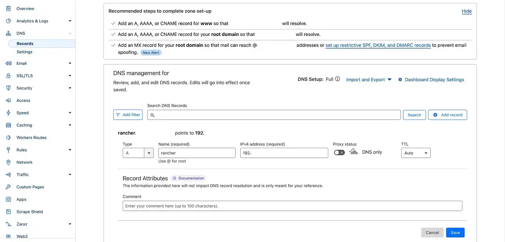

## Introduction

In a [previous post](https://medium.com/@eleni.grosdouli/rancher-on-eks-with-nginx-ingress-and-lets-encrypt-4f041fc1adae), we described installing a [Rancher server](https://ranchermanager.docs.rancher.com/) on an EKS cluster with [Nginx Ingress](https://docs.nginx.com/nginx-ingress-controller/), [Let's Encrypt](https://letsencrypt.org/) for TLS and [Cloudflare](https://www.cloudflare.com/de-de/) for hosting a domain.

Today's post is an **update** of the old deployment which includes the **latest Rancher stable** Helm chart release and Proxy details hoping to fix cloud-init issues. We will provide an easy-to-follow guide outlining what's new, and why updating Rancher to a later version alongside caveats or issues faced during the deployment. For this demonstration, we will use a [k3s](https://k3s.io/) cluster hosted on [Civo Cloud](https://www.civo.com/).


<!--truncate-->

:::note
The Rancher Server **v2.10.3** (stable Helm chart release) was tested on an **EKS** cluster **v1.31** with no issues. The proposed commands are valid and functional.

For the EKS deployment, ensure the **user** interacting with the `kubeconfig` file has the correct permissions to perform actions on the cluster.
:::

## Lab Setup

```bash
+-----------------+--------------+-----------------------+
| Application Name|   Version    |        Comment        |
+-----------------+--------------+-----------------------+
|  K3s Cluster    | v1.30.5k3s1  |      Civo Cloud       |
|     Rancher     |   v2.10.0    |  Installed with Helm  |
|  cert-manager   |   v1.16.2    |  Installed with Helm  |
|  Nginx Ingress  |   v4.11.3    |  Installed with Helm  |
+-----------------+--------------+-----------------------+
```

## Prerequisites

To follow along, ensure the below points are satisfied.

- A valid Kubernetes Cluster that meets the [installation requirements](https://www.suse.com/suse-rancher/support-matrix/all-supported-versions/rancher-v2-10-1/)
- A valid DNS domain name
- kubectl installed
- Helm CLI installed

## Scenario

The deployment demonstrated some months back worked on a Rancher server `v2.8.4` version. However, I came to realise with the latest Rancher version, the same approach no longer works. The issue for me was that I was unable to deploy downstream RKE2 clusters due to a `cloud-init` error pointing to an incorrect TLS certificate hash. Thus, no RKE2 downstream clusters were deployed. I had a similar experience with a `v2.7.x` installation and knew somehow how to overcome the issues.

## What's new with Rancher v2.10.0

With the latest Rancher release, support for Kubernetes **v1.31** was introduced while discontinuing support for **v1.27**, urging users to upgrade to **v1.28** or later before updating. Key enhancements include a new annotation for specifying the creator's principal name, improved handling of SAML authentication, and the capture of token usage times. The **System Upgrade Controller** deployment has been updated for smoother Kubernetes upgrades.

Regarding the **Dashboard**, it has been upgraded to **Vue 3**, improving performance and data configuration options and for authentication, **SAML logout-all** is supported, and **Fleet v0.11.0** enhances log and status messages. **RBAC** now supports user impersonation via Rancher proxy and allows opting out of default RBAC settings for new clusters.

The full release notes are located [here](https://github.com/rancher/rancher/releases/tag/v2.10.0).

:::note
**RKE** is **deprecated** with an EOL by **July 31, 2025**.
:::

## Step 1: Install cert-manager

`cert-manager` is required to automatically issue a TLS certificate to encrypt all traffic to the Rancher server. We will use the Helm chart `v1.16.2`.

```bash
$ helm repo add jetstack https://charts.jetstack.io # Add the Helm repo
$ helm repo update # Update the Helm repositories

$ kubectl apply -f https://github.com/cert-manager/cert-manager/releases/download/v1.16.2/cert-manager.crds.yaml # Install the cert-manager CRDs

# Install the Helm Chart
$ helm upgrade --install cert-manager jetstack/cert-manager \
 --namespace cert-manager \
 --create-namespace \
 --set no_proxy=127.0.0.0/8\\,10.0.0.0/8\\,cattle-system.svc\\,172.16.0.0/12\\,192.168.0.0/16\\,.svc\\,.cluster.local \
 --version v1.16.2
```

Based on the Rancher documentation, if the **cert-manager** is required to communicate with **Let's Encrypt**, the `no_proxy` arguments need to be provided during the installation.

## Step 2: Install Nginx Ingress

```bash
$ helm upgrade --install ingress-nginx ingress-nginx/ingress-nginx \
 --namespace ingress-nginx \
 --create-namespace \
 --set controller.service.type=LoadBalancer \
 --version 4.11.3
```

We perform the Nginx Ingress Controller installation and we expose the service to be of type `LoadBalancer`. The allocated `External-IP` address will be used at the next step to create an `A` DNS record in Cloudflare.

## Step 3: Update DNS Records

Before we log in to Cloudflare, we need to be aware of the Nginx Ingress LoadBalancer IP address.

```bash
$ kubectl get svc -n ingress-nginx | grep -i 'LoadBalancer'
```

Copy the `External-IP` address and head to Cloudflare. Navigate to **Home > click your Domain name > from the left-hand side menu choose DNS > Records > Add Record > Save**.

  

### Validate DNS Deployment

```bash
$ dig +short {your favourable domain}
```
From the `dig` output, we expect to see the defined external IP address.

## Step 4: Install Rancher

Following the Rancher documentation, we will set the `no_proxy` arguments during the Helm chart installation.

```bash
$ helm repo add rancher-stable https://releases.rancher.com/server-charts/stable # Add the stable Helm chart repo
$ helm repo update # Update the Helm repositories

# Rancher Server installation
$ helm install rancher rancher-stable/rancher \
 --namespace cattle-system \
 --create-namespace \
 --set hostname=rancher.<your domain> \
 --set replicas=3 \
 --set ingress.tls.source=letsEncrypt \
 --set letsEncrypt.email=<your email address> \
 --set letsEncrypt.ingress.class=nginx \
 --set bootstrapPassword=<Admin Password (Optional)> \
 --set no_proxy=127.0.0.0/8\\,10.0.0.0/8\\,cattle-system.svc\\,172.16.0.0/12\\,192.168.0.0/16\\,.svc\\,.cluster.local \
 --version 2.10.0
```

Helm will install a Rancher instance with `3 replicas` for redundancy, `Let’s Encrypt` for the TLS certificate with the use of the Let’s Encrypt production instance (enabled by default) alongside the `Ingress class` which in this case should be set to `nginx`.

### Validation

```bash
$ kubectl get certificate,certificaterequest,order -n cattle-system # Resources related to the TLS certificate
NAME                                              READY   SECRET                AGE
certificate.cert-manager.io/tls-rancher-ingress   True    tls-rancher-ingress   54s

NAME                                                       APPROVED   DENIED   READY   ISSUER    REQUESTER                                         AGE
certificaterequest.cert-manager.io/tls-rancher-ingress-1   True                True    rancher   system:serviceaccount:cert-manager:cert-manager   54s

NAME                                                         STATE   AGE
order.acme.cert-manager.io/tls-rancher-ingress-1-380761274   valid   53s

$ kubectl get pods,svc,ingress -n cattle-system

NAME                           READY   STATUS     RESTARTS   AGE
pod/helm-operation-sstdg       0/2     Init:0/1   0          11s
pod/rancher-7844884d55-gjkrx   1/1     Running    0          2m24s
pod/rancher-7844884d55-k2p7s   1/1     Running    0          2m24s
pod/rancher-7844884d55-rcmdt   1/1     Running    0          2m24s

NAME              TYPE        CLUSTER-IP     EXTERNAL-IP   PORT(S)          AGE
service/rancher   ClusterIP   10.43.185.29   <none>        80/TCP,443/TCP   2m24s

NAME                                CLASS   HOSTS                     ADDRESS                                             PORTS     AGE
ingress.networking.k8s.io/rancher   nginx   rancher.<your domain>   xxx.k8s.civo.com   80, 443   2m24s
```

:::note
The `rancher` ingress resource will not include `nginx` as the `IngressClassName`. Update the Ingress resource manually and add the class.
:::

## Step 5: Access Rancher UI

Access the Rancher UI based on the domain defined! If you click on the certificate options on the browser, you will see the TLS certificate used is valid and the connection is secure!

## Step 6: Rancher Downstream Cluster

The easiest way to deploy downstream RKE2 clusters is with the use of an IaC tool like [OpenTofu](https://search.opentofu.org/provider/hashicorp/rancher2/latest) or [Terraform](https://registry.terraform.io/providers/rancher/rancher2/latest/docs). An example deployment can be found [here](../2024-07-26-rancher-rke2-azure/rancher-rke2-cilium-azure.md).

## Conclusion

You have successfully installed the latest Rancher Server in just 4 easy steps! 🎉

That’s a wrap for this guide. Thanks for reading! Stay tuned for more exciting updates coming your way! 🚀

## Resources

- **Choose Rancher Version**: https://ranchermanager.docs.rancher.com/getting-started/installation-and-upgrade/resources/choose-a-rancher-version
- **Install Rancher**: https://ranchermanager.docs.rancher.com/getting-started/installation-and-upgrade/other-installation-methods/rancher-behind-an-http-proxy/install-rancher

## ✉️ Contact

If you have any questions, feel free to get in touch! You can use the `Discussions` option found [here](https://github.com/egrosdou01/blog.grosdouli.dev/discussions) or reach out to me on any of the social media platforms provided. 😊

We look forward to hearing from you!

