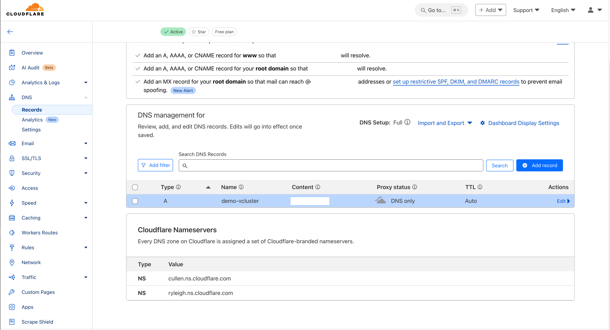

## Introduction

In a [previous post](https://medium.com/@eleni.grosdouli/explore-multitenancy-with-vcluster-using-the-gitops-approach-96381d950372), we described how to install multiple virtual clusters in a [Civo](https://www.civo.com/) cloud environment with [vCluster](https://www.vcluster.com/).

Today's post is an update of the older deployment interacting with virtual clusters via a registered domain hosted in [Cloudflare](https://www.cloudflare.com/de-de/) and using a `LoadBalancer` service to achieve that. Let's dive into it.

<!--truncate-->

## Environment Setup

```bash
+----------------------+--------------------+-------------------------------------+
|    Cluster Name      |      Version       |              Comments               |
+----------------------+--------------------+-------------------------------------+
|   cluster01-test     |   v1.30.5+k3s1     |  Civo 3 Node - Medium Standard      |
|   vcluster-dev       |   v1.31.1+k3s1     |  Defined in the `dev` namespace     |
| vCluster Helm Chart  |     v0.22.0        |               N/A                   |
+----------------------+--------------------+-------------------------------------+
```

## Scenario

The requirement was to create a fast and easy multitenant setup for an upcoming project. However, I came to realise that many things have evolved since the time I wrote the vCluster post. The Loft team performed many changes on how we specify additional vCluster values for a Helm chart deployment. After going through the documentation, I believe more structure and clarity are provided with the [latest release](https://github.com/loft-sh/vcluster/releases). The post is an attempt to show readers how to create virtual clusters using the GitOps approach while utilising a domain for outside reachability.

## Prerequisites
1. Helm version **≥ v3.10.0**
1. **kubectl** installed/available. Find the guide [here](https://kubernetes.io/docs/tasks/tools/install-kubectl-linux/).

## Step 1: Prepare Custom values.yaml file

To allow the virtual cluster to be accessible from the outside, we need a `LoadBalancer` service for reachability. The `External-IP` address assigned will be used during the Helm chart installation and when defining an `A` record in Cloudflare.

```yaml
---
apiVersion: v1
kind: Service
metadata:
  name: vcluster-loadbalancer
  namespace: dev
spec:
  selector:
    app: vcluster
    release: vcluster-dev
  ports:
    - name: https
      port: 443
      targetPort: 8443
      protocol: TCP
  type: LoadBalancer
```

## Apply Service Manifest

```bash
$ export KUBECONFIG=/the/path/to/parent/kubeconfig
$ kubectl create ns dev # vCluster resources will be created in the `dev` namespace
$ kubectl apply -f vcluster-lb.yaml

$ kubectl get svc -n dev
NAME                    TYPE           CLUSTER-IP   EXTERNAL-IP    PORT(S)         AGE
vcluster-loadbalancer   LoadBalancer   10.43.23.1    x.x.x.x       443:31633/TCP   48s
```

## Step 2: Create vCluster.yaml Manifest

From my experience, this is the part that changed the most. The Helm Chart values for vCluster are located [here](https://github.com/loft-sh/vcluster/blob/main/chart/values.yaml). A noted difference is that now we have only one `values.yaml` file for any supported virtual deployment (k8s, k3s, k0s). Also, global variables are defined outside of the virtual cluster configuration which in my opinion makes things clearer.

To come up with the updated `vcluster.yaml` manifest, I did a mapping of what I had before and what changed in the meantime. After going through the manifest, I ended up with the below configuration. For this demonstration, my underlying cluster is a [k3s](https://k3s.io/) cluster.

```yaml
controlPlane:
  distro:
    k3s:
      enabled: true
      extraArgs:
        - --tls-san=EXTERNAL IP Address from LoadBalancer
      image:
        repository: "rancher/k3s"
        tag: "v1.31.1-k3s1"
      resources:
        limits:
          cpu: 100m
          memory: 256Mi
        requests:
          cpu: 40m
          memory: 64Mi
  proxy:
    extraSANs:
      - YOUR Domain - For Example my-vcluster.my-domain.com
  coredns:
    enabled: true
  statefulSet:
    resources:
      limits:
        ephemeral-storage: 2Gi
        memory: 2Gi
      requests:
        ephemeral-storage: 400Mi
        cpu: 200m
        memory: 256Mi
    highAvailability:
      replicas: 1
    security:
      podSecurityContext: {}
      containerSecurityContext:
        allowPrivilegeEscalation: false
        runAsUser: 0
        runAsGroup: 0
    persistence:
      volumeClaim:
        enabled: auto
        retentionPolicy: Retain
        size: 2Gi
        storageClass: ""
        accessModes: ["ReadWriteOnce"]
exportKubeConfig:
  server: "https://Your Domain Name:443"
  context: vcluster-dev
  insecure: false
  secret:
    name: vcluster-dev
experimental:
  deploy:
    vcluster:
      manifests: |-
        ---
        apiVersion: v1
        kind: Namespace
        metadata:
          name: nginx-app
        ---
        apiVersion: apps/v1
        kind: Deployment
        metadata:
          name: nginx-dev
          namespace: nginx-app
        spec:
          selector:
            matchLabels:
              app: nginx
          replicas: 1
          template:
            metadata:
              labels:
                app: nginx
            spec:
              containers:
              - name: nginx
                image: nginx:latest
                ports:
                - containerPort: 80
        ---
        apiVersion: v1
        kind: Service
        metadata:
          name: nginx-dev
          namespace: nginx-app
        spec:
          selector:
            app: nginx
          ports:
            - protocol: TCP
              port: 80
              targetPort: 80
          type: ClusterIP
```

:::tip
**Notable changes**: Include the `controlPlane` and `k3s` configuration at the top level. Set the `extraSANs` to **your custom domain**. Enable `CoreDNS` and set the virtual cluster `statefulSet` details as well. Make changes to the storage requirements that are needed. Use the `exportKubeConfig` section to expose the cluster with a valid domain. Move the application manifest to be created with the virtual cluster deployment under the `experimental` section.
:::

:::note
The `kubeconfig` of the vCluster will be saved as a secret named `vcluster-dev` in the `dev` namespace.
:::

## Step 3: Create A Record Cloudflare

Navigate to **Home > click your Domain name > from the left-hand side menu choose DNS > Records > Add Record > Save**

  

### DNS Validation

```bash
$ dig +short {A Record Name}.{YOUR DOMAIN}
```

The above should return the IP address of the `LoadBalancer` service created in a previous step.

## Step 4: vCluster Installation 

As we have the custom values ready, we can proceed with the installation.

```bash
$ helm upgrade --install vcluster-dev vcluster \
  --namespace dev \
  --values /the/path/to/configuration/vcluster.yaml \
  --repo https://charts.loft.sh \
  --repository-config=''
```

### vCluster Validation

```bash
$ helm list -n dev
NAME        	NAMESPACE	REVISION	UPDATED                            	STATUS  	CHART          	APP VERSION
vcluster-dev	dev      	1       	2024-12-20 08:37:15.71386 +0100 CET	deployed	vcluster-0.22.0	0.22.0  

$ kubectl get pods,svc,secret -n dev
NAME                                                        READY   STATUS    RESTARTS   AGE
pod/coredns-bbb5b66cc-88swh-x-kube-system-x-vcluster-dev    1/1     Running   0          22m
pod/nginx-dev-54b9c68f67-sp5d6-x-nginx-app-x-vcluster-dev   1/1     Running   0          13s
pod/vcluster-dev-0                                          1/1     Running   0          31s

NAME                                                                      TYPE           CLUSTER-IP      EXTERNAL-IP    PORT(S)                  AGE
service/kube-dns-x-kube-system-x-vcluster-dev                             ClusterIP      10.43.113.38    <none>         53/UDP,53/TCP,9153/TCP   22m
service/nginx-dev-x-nginx-app-x-vcluster-dev                              ClusterIP      10.43.171.144   <none>         80/TCP                   17s
service/vcluster-dev                                                      ClusterIP      10.43.89.195    <none>         443/TCP,10250/TCP        23m
service/vcluster-dev-headless                                             ClusterIP      None            <none>         443/TCP                  23m
service/vcluster-dev-node-k3s-cluster02-prod-e2e5-78cf1e-nod-679736c320   ClusterIP      10.43.144.1     <none>         10250/TCP                14s
service/vcluster-dev-node-k3s-cluster02-prod-e2e5-78cf1e-nod-c0aad56b62   ClusterIP      10.43.64.170    <none>         10250/TCP                22m
service/vcluster-loadbalancer                                             LoadBalancer   10.43.23.1      x.x.x.x        443:31633/TCP            72m

NAME                                        TYPE                 DATA   AGE
secret/sh.helm.release.v1.vcluster-dev.v1   helm.sh/release.v1   1      23m
secret/sh.helm.release.v1.vcluster-dev.v2   helm.sh/release.v1   1      21m
secret/sh.helm.release.v1.vcluster-dev.v3   helm.sh/release.v1   1      18m
secret/sh.helm.release.v1.vcluster-dev.v4   helm.sh/release.v1   1      16m
secret/sh.helm.release.v1.vcluster-dev.v5   helm.sh/release.v1   1      7m22s
secret/sh.helm.release.v1.vcluster-dev.v6   helm.sh/release.v1   1      35s
secret/vc-config-vcluster-dev               Opaque               1      23m
secret/vc-k3s-vcluster-dev                  Opaque               1      22h
secret/vc-vcluster-dev                      Opaque               5      22m
secret/vcluster-dev                         Opaque               5      22m
secret/vcluster-dev-certs                   Opaque               25     22m
```

## Step 5: Retrieve vCluster Kubeconfig

Once the virtual cluster is deployed, we can retrieve the `kubeconfig` by decoding the configuration of the secret with the name `vcluster-dev`.

```bash
$ kubectl get secret vcluster-dev -n dev --template={{.data.config}} | base64 -d > /the/path/to/configuration/vcluster-dev.yaml
```

### Validation

```bash
$ export KUBECONFIG=/the/path/to/configuration/vcluster-dev.yaml
$ kubectl get nodes,ns
NAME                                                       STATUS   ROLES    AGE     VERSION
node/k3s-cluster02-prod-e2e5-78cf1e-node-pool-9a30-1ibhr   Ready    <none>   2m16s   v1.31.1+k3s1
node/k3s-cluster02-prod-e2e5-78cf1e-node-pool-9a30-l28od   Ready    <none>   24m     v1.31.1+k3s1

NAME                        STATUS   AGE
namespace/default           Active   22h
namespace/kube-node-lease   Active   22h
namespace/kube-public       Active   22h
namespace/kube-system       Active   22h
namespace/nginx-app         Active   2m20s
```

### vCluster - Nginx Validation

```bash
$ kubectl get all -n nginx-app
NAME                             READY   STATUS    RESTARTS   AGE
pod/nginx-dev-54b9c68f67-sp5d6   1/1     Running   0          2m41s

NAME                TYPE        CLUSTER-IP      EXTERNAL-IP   PORT(S)   AGE
service/nginx-dev   ClusterIP   10.43.171.144   <none>        80/TCP    2m44s

NAME                        READY   UP-TO-DATE   AVAILABLE   AGE
deployment.apps/nginx-dev   1/1     1            1           2m46s

NAME                                   DESIRED   CURRENT   READY   AGE
replicaset.apps/nginx-dev-54b9c68f67   1         1         1       2m42s
```

## Resources

- **vCluster Documentation**: https://www.vcluster.com/docs/vcluster/deploy/basics
- **vCluster External Access**: https://www.vcluster.com/docs/vcluster/next/manage/accessing-vcluster
- **vCluster Schema Validation**: https://github.com/loft-sh/vcluster/blob/main/chart/values.schema.json 

## ✉️ Contact

If you have any questions, feel free to get in touch! You can use the `Discussions` option found [here](https://github.com/egrosdou01/blog.grosdouli.dev/discussions) or reach out to me on any of the social media platforms provided. 😊

We look forward to hearing from you!

## Conclusions

We successfully deployed a vCluster on K3s in just a few simple steps! 🚀 I will be diving deeper into vCluster and exploring more advanced configurations in upcoming posts.

That’s a wrap for this one! 🎉 Thanks for reading, and stay tuned for more exciting updates!
