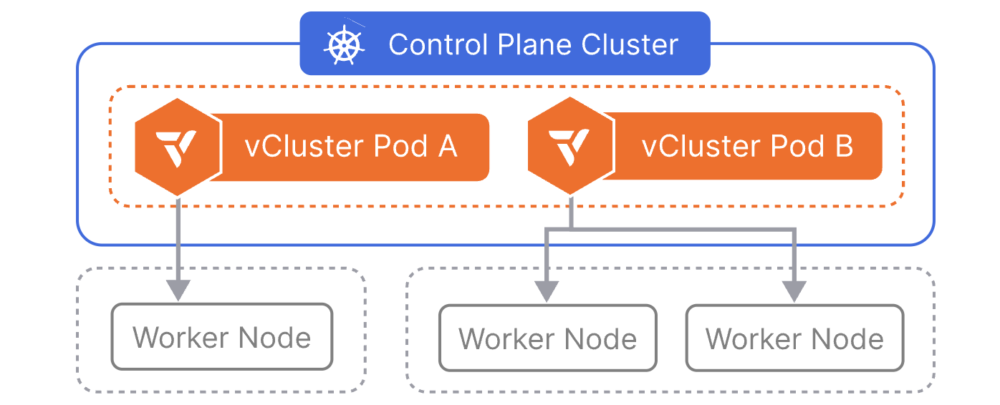
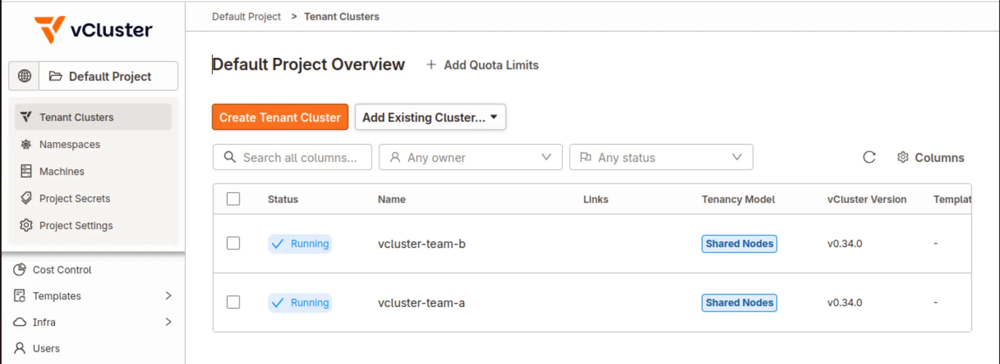

**Summary**:

In [part 1](./vcluster-updates-01.md) of the series, we explored some of the recent vCluster Helm chart changes and how we can create the simplest vCluster possible. We also explored how we can assign specific Kubernetes worker nodes to vClusters based on taints, tolerations, and labels. Today, we will walk through the process of setting up [Cilium L2 Announcements](https://docs.cilium.io/en/v1.18/network/l2-announcements/) to make the vCluster available via a `LoadBalancer` service and then deploy and use the [vCluster Platform](https://www.vcluster.com/docs/platform).

<!--truncate-->


[Source](https://www.vcluster.com/docs/vcluster/introduction/architecture)

## Introduction

While we can use a `NodePort` service to access the vCluster within our setup, this is a single point of failure in case the nodes, for whatever reason, go down. We want to achieve better scalability and ensure the vClusters are accessible via a stable IP address and not dependent on the Kubernetes nodes' availability. Thus, we can use the underlying Cilium functionality, enable IPAM to hand over LoadBalancer IP addresses and then use the L2 Announcements to make the endpoints reachable to the desired network subnet.

As the underlying control plane cluster is an [RKE2](http://docs.rke2.io/) cluster, and Cilium is already installed, we will only need to update the Helm chart values to include the additional functionality. Once this is done, we will update the vCluster Helm chart values and expose the virtual clusters via a `LoadBalancer` IP address instead of a `NodePort`. Finally, by having the vCluster Platform deployed, we can have a single pane of glass when it comes to the management of a fleet of vClusters across different environments.
## Lab Setup

```bash
+-------------------------+--------------+------------------+
|        Resources        |     Type     |     Version      |
+-------------------------+--------------+------------------+
|  Control Plane Cluster  |     RKE2     | v1.34.3+rke2r1   |
|     vcluster-team-a     |     K8s      |     v1.36.0      |
|     vcluster-team-b     |     K8s      |     v1.36.0      |
+-------------------------+--------------+------------------+
```

:::note
The control plane cluster is the cluster that hosts the virtualised control planes for the tenant clusters.
:::

## Prerequisites

1. A Kubernetes cluster available with at least two worker nodes
1. Helm [installed](https://helm.sh/docs/intro/install/)
1. kubectl [installed](https://kubernetes.io/docs/tasks/tools/install-kubectl-linux/)
1. Familiarity with vCluster

## Cilium IPAM and L2 Announcements

As mentioned in the beginning, we will create a pool that reflects the available IPv4 addresses to be assigned to `LoadBalancer` services. We will also define an interface where L2 Announcements should occur. The setup is simple. We will expand on the existing Cilium Helm chart values and enable the ones we need.

### Extract Cilium Helm chart values.yaml

```bash
$ helm get values rke2-cilium -n kube-system -o yaml > values_control_plane.yaml
```

### Expand values_control_plane.yaml

Based on the [documentation](https://docs.cilium.io/en/v1.18/network/l2-announcements/), the values are required to meet our use case.

```yaml showLineNumbers
k8sClientRateLimit:
  burst: 40 # Important value when many services run on a Kubernetes cluster. Check out the documentation https://docs.cilium.io/en/v1.18/network/l2-announcements/#sizing-client-rate-limit
  qps: 20 # Important value when many services run on a Kubernetes cluster. Check out the documentation https://docs.cilium.io/en/v1.18/network/l2-announcements/#sizing-client-rate-limit
kubeProxyReplacement: true # Required
l2announcements:
  enabled: true
```

### Update Cilium Helm Deployment

```bash
$ helm upgrade rke2-cilium rke2-charts/rke2-cilium --version 1.18.300 --namespace kube-system -f values_control_plane.yaml
```

:::note
Once the Helm chart has been updated, feel free to restart the `cilium-operator` deployment and the `cilium` daemonset. This will not happen automatically unless it is defined in the configuration.

```bash
$ kubectl rollout restart deployment.apps/cilium-operator -n kube-system
$ kubectl rollout restart daemonset.apps/cilium  -n kube-system

Ensure the pods have been successfully restarted and that Cilium is using the updated values specified.
```
:::

### Create CiliumLoadBalancerIPPool

The pool will allow us to assign IPv4 addresses to services of type `LoadBalancer`. The configuration needs to reflect your own setup. In my case, I have a dedicated VLAN I can use for handing over IPv4 addresses.

```yaml showLineNumbers
apiVersion: "cilium.io/v2alpha1"
kind: CiliumLoadBalancerIPPool
metadata:
  name: "vcluster-ipv4-pool"
spec:
  blocks:
  - start: "10.10.20.10"
    stop: "10.10.20.20"
```

### Create CiliumL2AnnouncementPolicy

The IPs will be announced from the network interface of a node with the interface name `eth0`. If the interface name in your setup is different, modify the file as needed.

```yaml showLineNumbers
apiVersion: cilium.io/v2alpha1
kind: CiliumL2AnnouncementPolicy
metadata:
  name: vcluster-l2-announcement-policy
  namespace: kube-system
spec:
  interfaces:
    - eth0
  loadBalancerIPs: true
```

:::note
Without a `nodeSelector`, the policy applies to all nodes in the cluster. Ensure the configuration is updated based on your setup.
:::

Apply both manifests to the **Control Plane Cluster**.

```yaml showLineNumbers
$ kubectl apply -f vcluster_ipv4_pool.yaml,vcluster_l2_announcement.yaml

$ kubectl get CiliumL2AnnouncementPolicy,ippools
NAME                                                          AGE
ciliuml2announcementpolicy.cilium.io/vcluster-l2-announcement-policy   24h

NAME                                           DISABLED   CONFLICTING   IPS AVAILABLE   AGE
ciliumloadbalancerippool.cilium.io/vcluster-ipv4-pool   false      False         10              24h
```
## Update vCluster Helm Values

In the initial setup, we defined the Kubernetes API server of every vCluster to be exposed as a `NodePort` service. This can now change with the power that comes with Cilium as our Container Network Interface (CNI). With the new approach, we have a stable way to reach the virtual clusters. For both vClusters, update the `controlPlane.service.spec.type` to `LoadBalancer`.

```yaml showLineNumbers
controlPlane:
  # Service configuration for vCluster control plane access
  # The vcluster-dev will be accessible on a LoadBalancer IP Address and port 443
  service:
    enabled: true
    annotations: {}
    labels: {}
    spec:
      type: LoadBalancer
```

### Update vCluster Helm Deployment

```bash
$ helm upgrade --install vcluster-team-a vcluster \
  --repo https://charts.loft.sh \
  --namespace vcluster-team-a \
  --create-namespace \
  -f vcluster_team_a_lb.yaml
```

### Validation

```bash
$ export KUBECONFIG=control-plane-cluster.yaml 

$ kubectl get pods,svc -n vcluster-team-a
NAME                                                           READY   STATUS    RESTARTS      AGE
pod/coredns-754d567864-f9kgj-x-kube-system-x-vcluster-team-a   1/1     Running   1 (24h ago)   27h
pod/vcluster-team-a-0                                          1/1     Running   0             7m2s

NAME                                               TYPE           CLUSTER-IP      EXTERNAL-IP   PORT(S)                  AGE
service/kube-dns-x-kube-system-x-vcluster-team-a   ClusterIP      10.43.196.115   <none>        53/UDP,53/TCP,9153/TCP   27h
service/vcluster-team-a                            LoadBalancer   10.43.243.114   10.10.20.11   443:30445/TCP            27h
service/vcluster-team-a-headless                   ClusterIP      None            <none>        443/TCP                  27h
service/vcluster-team-a-node-el07                  ClusterIP      10.43.227.82    <none>        10250/TCP                27h
```

:::note
The headless service `vcluster-team-a-headless` is used for internal `StatefulSet` DNS resolution of the vCluster pod and is not intended for external access.
:::

From the above output, the vcluster-team-a cluster will be available at `https://10.10.20.11:443`. This line should be included in the kubeconfig file on the virtual cluster. The `kubeconfig` of `vcluster-team-a` is saved as a `secret` named `vcluster-team-a` in the `vcluster-team-a` namespace.

```bash
$ export KUBECONFIG=vcluster-team-a.yaml 

$ kubectl get nodes -o wide
NAME           STATUS   ROLES    AGE   VERSION   INTERNAL-IP   EXTERNAL-IP   OS-IMAGE               KERNEL-VERSION             CONTAINER-RUNTIME
test-worker1   Ready    <none>   26h   v1.36.0   10.43.227.82  <none>        Fake Kubernetes Image  4.19.76-fakelinux (amd64)  docker://19.3.12

$ kubectl get pods -n kube-system
NAMESPACE     NAME                       READY   STATUS    RESTARTS      AGE
kube-system   coredns-754d567864-f9kgj   1/1     Running   1 (24h ago)   26h
```

:::note
In the nodes outline, we present the end-user with a fake node details. This is defined in the intial configuration of the vCluster. We do not want the end-user to know the real details of underlying host.
:::

Apply the same steps for the `vcluster-team-b` cluster.

## vCluster Platform

Imagine your team or your organisation handles a large number of vClusters. An easy way to manage all of them from a central location alongside providing tenant admins with an intuitive UI to perform operations, RBAC, resource quota, cluster lifecycle, etc., is the vCluster Platform.

### What is the vCluster Platform?

>vCluster Platform is the management plane for your tenant cluster fleet. It provides a web UI, CLI, and API for deploying, configuring, and operating tenant clusters across one or more Control Plane Clusters. Access control, lifecycle automation, resource governance, and node management are all built in.

### vCluster Platform Helm Deployment

#### Helm Chart Values

```yaml showLineNumbers
admin:
  create: true
  username: username
  password: "password"
# Loft service options
service:
  type: LoadBalancer
# Resources of the loft deployment
resources:
  requests:
    memory: 256Mi
    cpu: 200m
  limits:
    memory: 2Gi
    cpu: "2"
config:
  loftHost: https://<Accessible IP Address> # 127.0.0.1 can be set when vClusters are created on the same Control Plane Cluster where the vCluster Platform is installed 
  audit:
    enabled: true
insecureSkipVerify: true # Only for Development environments. Use your own valid TLS certificates for Production deployments.
```

#### Deployment

```bash
$ helm upgrade --install vcluster-platform vcluster-platform \
  --repo https://charts.loft.sh/ \
  --namespace vcluster-platform \
  --create-namespace \
  --version 4.9.0 \
  --values vcluster_platform_values.yaml
```

### Register Existing vClusters

As long as the vCluster Platform is up and running, you should be able to reach the UI using the `LoadBalancer` IP address. As the `vcluster-team-a` and `vcluster-team-b` clusters have been created using a Helm chart, they are not associated with the vCluster Platform. However, we can add them under the vCluster Platform management using either the `vcluster` command-line utility or Helm. The recommended approach is to use the [`vcluster` command-line utility](https://www.vcluster.com/docs/platform/install/quick-start-guide).

1. Log in to the vCluster Platform from the UI
1. Navigate to the bottom left side, click the username of the logged-in user and click `Access keys`. Click the `Create Access Key` button to create a new key. Determine how long the key should be valid and the permissions are assigned to the key
1. On a machine with access to the vcluster CLI, perform the steps below
    1. ```vcluster platform login https://<vCluster Platform UI IP Address> --access-key <access-key-generated-from-UI> --insecure```. In case a valid TLS certificate is used, there is no need to add the `--insecure` flag
    1. ```vcluster platform add vcluster vcluster-team-a -n vcluster-team-a --project default```. The project can also be set to a different value. Default is the default project created by the deployment of the vCluster Platform
    1. ```vcluster platform add vcluster vcluster-team-b -n vcluster-team-b --project default```

Refreshing the UI, the cluster should already be visible.



## Conclusion

In this post, we built on the foundation established in [Part 1](./vcluster-updates-01.md) by enabling Cilium IPAM and L2 Announcements to expose our vCluster API servers via stable `LoadBalancer` IP addresses, eliminating the single point of failure introduced by `NodePort` services. We also deployed the vCluster Platform, giving us a centralised management plane for operating our vCluster fleet across environments. In Part 3, we will take a deeper dive into the networking layer, examining how traffic flows between virtual clusters, how network policies can be enforced at both the host and virtual cluster level, and how Cilium's advanced features can further strengthen isolation and observability in a multi-tenant context. Stay tuned!

## Resources

- [vCluster Documentation](https://www.vcluster.com/docs/vcluster/deploy/basics)
- [vCluster Platform](https://www.vcluster.com/docs/platform)
- [Cilium Docs](https://docs.cilium.io/en/v1.18/)


## ✉️ Contact

If you have any questions, feel free to get in touch! You can use the `Discussions` option found [here](https://github.com/egrosdou01/blog.grosdouli.dev/discussions) or reach out to me on any of the social media platforms provided. 😊 We look forward to hearing from you!

## Series Navigation

| Part | Title |
| :--- | :---- |
| [Part 1](./vcluster-updates-01.md) | vCluster Recent Updates |
| [Part 2](./vcluster-updates-02.md) | Introduction to Cilium L2 Announcements and vCluster Platform |
| [Part 3](./vcluster-updates-03.md) | vCluster Networking and Cilium Under the Hood |
| Part 4 | Cilium and Gateway API shared vCluster Resources |
| Part 5 | Explore vCluster Enterprise Features |
