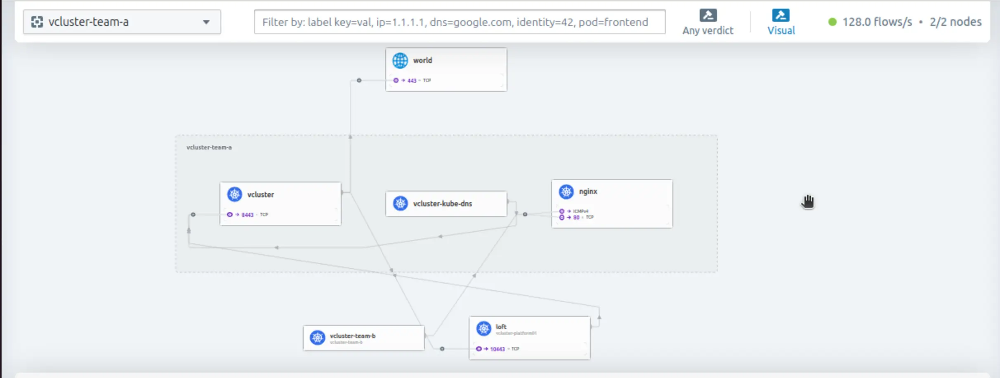
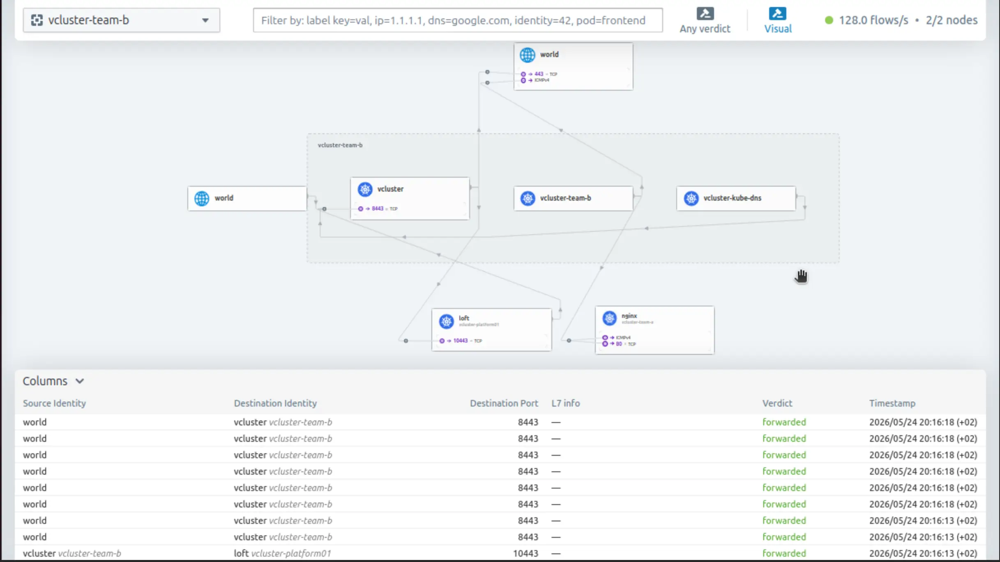
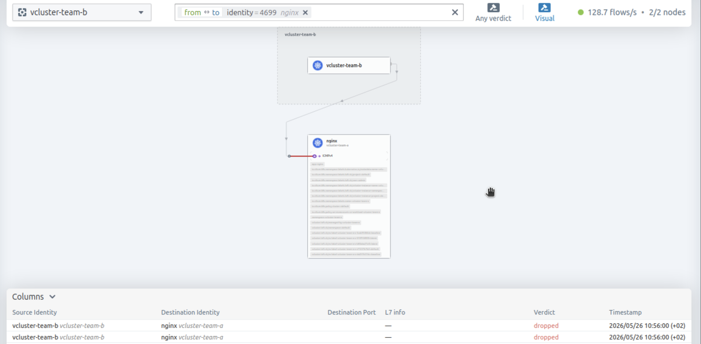

**Summary**:

In parts [1](./vcluster-updates-01.md) and [2](./vcluster-updates-02.md) of the series, we explored the different node assignment strategies, Cilium L2 Announcements, and the vCluster Platform. Today, we take a step further. We will look at how Cilium CNI running on the underlying Control Plane cluster directly enhances networking for virtual clusters. We will cover traffic isolation, policy enforcement, DNS resolution, and traffic observability.

<!--truncate-->


[Source](https://www.vcluster.com/docs/vcluster/introduction/architecture)

## Introduction

The promise of [vCluster](https://www.vcluster.com/docs) is to create separate and isolated control planes for virtual clusters running on top of an underlying Control Plane cluster. The different components are placed in a separate namespace for logical isolation. However, this does not ensure that the running workloads are isolated. In a Kubernetes cluster, every pod can communicate with any other pod by default. What does that really mean? Yes, the end-user will not know they are on a shared cluster, but each of the workloads running could reach workloads on any other virtual cluster.

## Lab Setup

```bash
+-------------------------+--------------+------------------+
|        Resources        |     Type     |     Version      |
+-------------------------+--------------+------------------+
|  Control Plane Cluster  |     RKE2     | v1.34.3+rke2r1   |
|     vcluster-team-a     |     K8s      |     v1.36.0      |
|     vcluster-team-b     |     K8s      |     v1.36.0      |
+-------------------------+--------------+------------------+
```

:::note
The control plane cluster is the cluster that hosts the virtualised control planes for the tenant clusters.
:::

## GitHub Resources

The YAML outputs are not complete. Have a look at the [GitHub repository](https://github.com/egrosdou01/blog-post-resources/tree/main/experimenting-vcluster-multitenancy/updates-2026/pt3).

## Prerequisites

Go through parts 1 and 2 of the series to gain a better understanding of the concept and what we aim to achieve.

## vCluster Network Model

Before we jump into the examples and command outputs, it helps to understand the layered networking model. Two layers exist when we create virtual clusters.

```bash
+-----------------------------------------------+
|           Virtual Cluster (vcluster-team-a)    |
|  Pod A  <-->  Pod B   (virtual cluster DNS)    |
+------------------+----------------------------+
                   | Synced to Control Plane namespace
+------------------v----------------------------+
|     Control Plane Cluster (RKE2 + Cilium)     |
|  pod/app-x-ns-x-vcluster-team-a               |
|  pod/app-y-ns-x-vcluster-team-a               |
|  Cilium enforces eBPF-based policy.           |
+-----------------------------------------------+
```

When we deploy a pod inside `vcluster-team-a`, the vCluster syncs the pod down to the Control Plane cluster's namespace, `vcluster-team-a`. The pod gets an IP as it would normally do. The virtual cluster's internal DNS and service abstraction sit on top, but actual packet forwarding is handled by Cilium.

vCluster provides control plane isolation. Each virtual cluster has its own API server, scheduler, and controller manager. Tenants cannot see each other's Kubernetes resources through the API. However, vCluster does not provide network-level isolation between tenant namespaces by default.

To better understand this concept, we deployed an NGINX application in the `default` namespace. This was done for the `vcluster-team-a` virtual cluster during its creation. Below are the two separate views. One from the Control Plane cluster and one from the `vcluster-team-a` virtual cluster.

```bash
$ export KUBECONFIG=control-plane-cluster.yaml

$ kubectl get pods -n vcluster-team-a -o wide
NAME                                                       READY   STATUS    RESTARTS      AGE   IP            NODE   NOMINATED NODE   READINESS GATES
coredns-754d567864-f9kgj-x-kube-system-x-vcluster-team-a   1/1     Running   1 (12d ago)   13d   10.42.0.48    el07   <none>           <none>
nginx-6797d5487-27gcf-x-default-x-vcluster-team-a          1/1     Running   0             11d   10.42.0.125   el07   <none>           <none>
vcluster-team-a-0                                          1/1     Running   0             11d   10.42.0.249   el07   <none>           <none>
```

```bash
$ export KUBECONFIG=vcluster-team-a.yaml

$ kubectl get pods -o wide
NAME                    READY   STATUS    RESTARTS   AGE   IP            NODE   NOMINATED NODE   READINESS GATES
nginx-6797d5487-27gcf   1/1     Running   0          11d   10.42.0.125   el07   <none>           <none>
```

We already have a test pod in the `vcluster-team-b` virtual cluster, and we will ping the NGINX pod using the assigned IP address 10.42.0.125. As there is no network isolation, the ping would be successful. For network-related tests, feel free to use the [`nicolaka/netshoot`](https://hub.docker.com/r/nicolaka/netshoot) Docker image.

```bash
$ export KUBECONFIG=vcluster-team-b.yaml

$ kubectl get pods -o wide
NAME              READY   STATUS    RESTARTS   AGE   IP           NODE           NOMINATED NODE   READINESS GATES
test-pod   1/1     Running   0          11d   10.42.1.48   el07-worker1   <none>           <none>

$ kubectl exec -it test-pod -- ping -c3 10.42.0.125
PING 10.42.0.125 (10.42.0.125) 56(84) bytes of data.
64 bytes from 10.42.0.125: icmp_seq=1 ttl=63 time=0.165 ms
64 bytes from 10.42.0.125: icmp_seq=2 ttl=63 time=0.212 ms
```

From the `test-pod`, we can also cURL the NGINX service IP address. We will get a response as expected.

### Observations

- Pods from `vcluster-team-a` are synced into the `vcluster-team-a` namespace on the Control Plane cluster
- Pods from `vcluster-team-b` are synced into the `vcluster-team-b` namespace on the Control Plane cluster
- These namespaces sit on the same flat network managed by Cilium
- If someone knows the pod IP or service IP of a workload in `vcluster-team-b`, a pod in `vcluster-team-a` can reach it by **default**

For that reason, a modern CNI with capabilities and features made for complex and modern workloads is a must-have for every Kubernetes environment. Thus, [Cilium](https://docs.cilium.io/en/stable/) is the preferred CNI for multi-tenant environments.

:::note
Each vCluster runs its own CoreDNS instance. When vCluster syncs resources to the host cluster, the CoreDNS pod follows the standard vCluster naming convention. The CoreDNS pod lives inside the virtual cluster under the `kube-system` namespace. DNS queries from pods inside virtual clusters go to the specific CoreDNS instance.
:::

## Cilium Hubble Observability

To gain the most out of our Cilium installation, we can enable [Hubble](https://docs.cilium.io/en/stable/observability/hubble/), Hubble UI, and Hubble Relay (optional) to have a visual representation of the traffic. We can expose the Hubble UI service as a `LoadBalancer` or `NodePort`, or simply port-forward it. Choose the option that suits your setup.

### Helm Chart Values

```yaml showLineNumbers
hubble:
  enabled: true
  relay:
    enabled: true
  ui:
    enabled: true
```

```bash
$ helm upgrade rke2-cilium rke2-charts/rke2-cilium --version 1.18.300 --namespace kube-system -f values_control_plane.yaml
```

:::note
Hubble Relay is an optional component. However, to have visibility across the underlying nodes, it is advised to be enabled.
:::

### Hubble UI View

Once Hubble UI is accessible, we can choose the `vcluster-team-a` or the `vcluster-team-b` namespace view and explore the traffic flow. Keep in mind that both virtual clusters are registered with the vCluster Platform, thus we see traffic to TCP port 10443.

#### Traffic View vcluster-team-a



#### Traffic View vcluster-team-b



## Network Isolation

Observation at the Control Plane cluster is enabled, and we are ready to continue with the network isolation. As we already saw, there is no isolation between the different virtual clusters running on a Kubernetes cluster. Because virtual clusters are assigned to different teams, we want traffic to be allowed on the namespace they belong to, but blocked on other namespaces. We need to set up strong isolation and ensure different workloads are isolated. To achieve our goal, we have two options: either use the vCluster `NetworkPolicy` option provided during deployment and save time using the defaults, or use the Cilium advanced networking capabilities.

### Network Isolation: vCluster Helm Values

When we create virtual clusters, we can define network isolation by using the Helm values and working with the `policies.networkPolicy` configuration. By default, this will allow traffic between pods within a tenant cluster, block traffic from other namespaces, and permit DNS and API server communication. However, with this approach, we use the `NetworkPolicy` resource and not Cilium's full capabilities. For more details, take a look at the [official documentation](https://www.vcluster.com/docs/vcluster/next/configure/vcluster-yaml/policies/network-policy) on network policies. 

### Network Isolation: Cilium

[`CiliumNetworkPolicy`](https://docs.cilium.io/en/v1.18/security/policy/) enhances Kubernetes security by using eBPF to filter traffic without the performance degradation of traditional `iptables`. It goes beyond simple IP-based rules to enforce identity-based security, while enabling deep **Layer 7 filtering** for specific HTTP paths, methods, and FQDNs.

#### Enforce Tenant Network Isolation

Crafting a `CiliumNetworkPolicy` for the underlying virtual clusters was more complex than anticipated. It is not only about the communication between the pods within the same namespace, but also the communication between the virtual cluster and the API server, `kubectl` execution from machines on the local network, DNS resolution, etc. I started with the simplest possible version.

```yaml showLineNumbers
apiVersion: cilium.io/v2
kind: CiliumNetworkPolicy
metadata:
  name: isolate-vcluster-team-a
  namespace: vcluster-team-a
spec:
  endpointSelector: {}  #Applies this policy to all pods in the namespace
  ingress:
    - fromEndpoints:
        - matchLabels:
            io.kubernetes.pod.namespace: vcluster-team-a
  egress:
    - toEndpoints:
        - matchLabels:
            io.kubernetes.pod.namespace: vcluster-team-a
```

Applied the manifest to the Control Plane cluster, and guess what, `kubectl` commands did not work from another machine in the same network. The next step was to think about Ingress traffic. The `CiliumNetworkPolicy` was modified. This time, we scope external management access using the `fromCIDR` and the `fromEntities` host for node local traffic.

```yaml showLineNumbers
apiVersion: cilium.io/v2
kind: CiliumNetworkPolicy
metadata:
  name: isolate-vcluster-team-a
  namespace: vcluster-team-a
spec:
  endpointSelector: {}  #Applies this policy to all pods in the namespace
  ingress:
    - fromEndpoints:
        - matchLabels:
            io.kubernetes.pod.namespace: vcluster-team-a
      // highlight-start
    - fromCIDR:
        - <IP Subnet> # e.g. 10.x.x.x/24 Replace with your management network CIDR
      toPorts:
        - ports:
            - port: "8443"
              protocol: TCP
    - fromEntities:
        - host # Matches traffic routed through the local node's network interface
      toPorts:
        - ports:
            - port: "8443" # vCluster API server port; Cilium L2 LB fronts this and forwards to the Control Plane cluster API on 443
              protocol: TCP
      // highlight-end
  egress:
    - toEndpoints:
        - matchLabels:
            io.kubernetes.pod.namespace: vcluster-team-a
```

With the second version of the policy, the `kubectl` command worked. I was able to list resources and check everything in the virtual cluster. But the next issue arose, I was unable to create any resources. I tried to create a `busybox` pod, and it remained in a `Pending` state. The issue?

```bash
Events:
  Type     Reason     Age   From        Message
  ----     ------     ----  ----        -------
  Warning  SyncError  19s   pod-syncer  Error syncing to host cluster: create object: Post "https://10.43.0.1:443/api/v1/namespaces/vcluster-team-a/pods": http2: client connection lost
```

The policy was updated once again to include an additional Egress rule. The following is required for the virtual cluster control plane pod to sync with the Control Plane Cluster API.

```yaml showLineNumbers
apiVersion: cilium.io/v2
kind: CiliumNetworkPolicy
metadata:
  name: isolate-vcluster-team-a
  namespace: vcluster-team-a
spec:
  endpointSelector: {}  #Applies this policy to all pods in the namespace
  ingress:
    - fromEndpoints:
        - matchLabels:
            io.kubernetes.pod.namespace: vcluster-team-a
    - fromCIDR:
        - <IP Subnet> # e.g. 10.10.x.x/24 Replace with your management network CIDR
      toPorts:
        - ports:
            - port: "8443"
              protocol: TCP
    - fromEntities:
        - host # Matches traffic routed through the local node's network interface
      toPorts:
        - ports:
            - port: "8443" # vCluster API server port; Cilium L2 LB fronts this and forwards to the Control Plane cluster API on 443
              protocol: TCP
  egress:
    - toEndpoints:
        - matchLabels:
            io.kubernetes.pod.namespace: vcluster-team-a
      // highlight-start
    - toEntities:
        - kube-apiserver
        - host
      // highlight-end
```

With the latest update, we can create workloads on the virtual clusters and isolate them. DNS egress to the virtual cluster's CoreDNS pod is covered by the same-namespace egress rule `toEndpoints.matchLabels.io.kubernetes.pod.namespace`, as CoreDNS is synced into the `vcluster-team-a` namespace. If your setup uses an external DNS resolver outside this namespace, add an explicit egress rule targeting that resolver.

:::tip
To get a visual representation of a CiliumNetworkPolicy, feel free to use the [Cilium Network Policy Editor](https://editor.networkpolicy.io/?id=elMJ7uYDicIJCHN2)
:::

:::tip
If the virtual cluster is registered with the vCluster Platform for management, TCP communication on port 10443 needs to be allowed, and access from the vCluster Platform to the virtual cluster API server on TCP port 8443.

```yaml
ingress:
  - fromEndpoints:
      - matchLabels:
          io.kubernetes.pod.namespace: vcluster-platform # vCluster Platform namespace
    toPorts:
      - ports:
          - port: "8443" #vCluster API server
            protocol: TCP
egress:
  - toEndpoints:
      - matchLabels:
          io.kubernetes.pod.namespace: vcluster-platform # vCluster Platform namespace
    toPorts:
      - ports:
          - port: "10443" # vCluster Platform API port
            protocol: TCP
```
:::

#### Validation

```bash
$ export KUBECONFIG=vcluster-team-b.yaml

$ kubectl get pods -o wide
NAME              READY   STATUS    RESTARTS   AGE   IP           NODE           NOMINATED NODE   READINESS GATES
test-pod   1/1     Running   0          11d   10.42.1.48   el07-worker1   <none>           <none>

$ kubectl exec -it test-pod -- ping -c3 10.42.0.125
PING 10.42.0.125 (10.42.0.125): 56 data bytes

--- 10.42.0.125 ping statistics ---
3 packets transmitted, 0 packets received, 100% packet loss
command terminated with exit code 1
```



## DNS in Action

Each virtual cluster deploys a dedicated CoreDNS instance that handles DNS queries independently from other tenants.

```bash
$ export KUBECONFIG=vcluster-team-a.yaml

$ kubectl get pods,svc -n kube-system
NAME                           READY   STATUS    RESTARTS      AGE
pod/coredns-754d567864-f9kgj   1/1     Running   1 (14d ago)   14d

NAME               TYPE        CLUSTER-IP      EXTERNAL-IP   PORT(S)                  AGE
service/kube-dns   ClusterIP   10.43.196.115   <none>        53/UDP,53/TCP,9153/TCP   14d
```

Let's test and see how the requests are resolved from within the virtual clusters.

```bash
$ export KUBECONFIG=vcluster-team-a.yaml

$ kubectl exec -it dns-test -- bash
# nslookup kubernetes.default
;; Got recursion not available from 10.43.196.115
;; Got recursion not available from 10.43.196.115
Server:		10.43.196.115
Address:	10.43.196.115#53

Name:	kubernetes.default.svc.cluster.local
Address: 10.43.243.114
;; Got recursion not available from 10.43.196.115

# nslookup nginx.default.svc.cluster.local
;; Got recursion not available from 10.43.196.115
;; Got recursion not available from 10.43.196.115
;; Got recursion not available from 10.43.196.115
;; Got recursion not available from 10.43.196.115
Server:		10.43.196.115
Address:	10.43.196.115#53

Name:	nginx.default.svc.cluster.local
Address: 10.43.141.183
;; Got recursion not available from 10.43.196.115
```

:::note
I also had to read about the `Got recursion not available from` messages. CoreDNS does not act as a recursive resolver by default and explicitly signals this via the [RCODE](https://help.dnsfilter.com/hc/en-us/articles/4408415850003-DNS-return-codes) flag. DNS succeeds. [GitHub discussion](https://github.com/coredns/coredns/issues/3690).
:::

### Packet Capture

:::note
The vCluster CoreDNS is exposed on UDP port 1053.
:::

```bash
$ export KUBECONFIG=vcluster-team-a.yaml

$ kubectl exec -it dns-test -- bash
dns-test:~# tcpdump -i any -n port 1053
tcpdump: WARNING: any: That device doesn't support promiscuous mode
(Promiscuous mode not supported on the "any" device)
tcpdump: verbose output suppressed, use -v[v]... for full protocol decode
listening on any, link-type LINUX_SLL2 (Linux cooked v2), snapshot length 262144 bytes
06:03:24.653097 eth0  Out IP 10.42.0.72.37346 > 10.42.0.48.1053: UDP, length 57
06:03:24.653292 eth0  In  IP 10.42.0.48.1053 > 10.42.0.72.37346: UDP, length 150
06:03:24.654800 eth0  Out IP 10.42.0.72.53187 > 10.42.0.48.1053: UDP, length 49
06:03:24.654933 eth0  In  IP 10.42.0.48.1053 > 10.42.0.72.53187: UDP, length 96
06:03:24.656420 eth0  Out IP 10.42.0.72.36073 > 10.42.0.48.1053: UDP, length 49
06:03:24.656545 eth0  In  IP 10.42.0.48.1053 > 10.42.0.72.36073: UDP, length 142
```

:::tip
Instead of a packet capture with the creation of a dedicated test pod, we can use Hubble to check the traffic flow.

```bash
$ kubectl exec -it ds/cilium -n kube-system -- bash
/home/cilium# hubble observe --to-port 1053 --namespace vcluster-team-a -f
May 26 06:09:26.930: vcluster-team-a/dns-test-x-default-x-vcluster-team-a (ID:10933) <> vcluster-team-a/coredns-754d567864-f9kgj-x-kube-system-x-vcluster-team-a:1053 (ID:1616) post-xlate-fwd TRANSLATED (UDP)
May 26 06:09:26.930: vcluster-team-a/dns-test-x-default-x-vcluster-team-a:34123 (ID:10933) -> vcluster-team-a/coredns-754d567864-f9kgj-x-kube-system-x-vcluster-team-a:1053 (ID:1616) policy-verdict:L3-Only EGRESS ALLOWED (UDP)
May 26 06:09:26.930: vcluster-team-a/dns-test-x-default-x-vcluster-team-a:34123 (ID:10933) -> vcluster-team-a/coredns-754d567864-f9kgj-x-kube-system-x-vcluster-team-a:1053 (ID:1616) policy-verdict:L3-Only INGRESS ALLOWED (UDP)
May 26 06:09:26.930: vcluster-team-a/dns-test-x-default-x-vcluster-team-a:34123 (ID:10933) -> vcluster-team-a/coredns-754d567864-f9kgj-x-kube-system-x-vcluster-team-a:1053 (ID:1616) to-endpoint FORWARDED (UDP)
```

For more information about Hubble and the available commands, take a look at the [official documentation](https://docs.cilium.io/en/v1.18/observability/hubble/).
:::

### Why Dedicated CoreDNS Matters

Each tenant cluster runs its own CoreDNS instance. DNS resolution works entirely within the boundaries of the tenant cluster. Pods in the tenant cluster can only resolve service names in their virtual cluster. They use standard Kubernetes DNS names. For example, `my-service.default.svc.cluster.local`. Different teams can deploy services with identical names without conflicts. When Team A creates `redis.default` and Team B creates `redis.default`, each vCluster's CoreDNS resolves the name within its own isolated environment. No naming collisions, no prefixes, no Helm chart updates.

## Conclusion

Using a CNI capable of handling modern workloads matters! In today's post, we explored how the Cilium CNI and Cilium Hubble help teams to control, isolate, and observe multitenant environments while giving them the flexibility to work on what matters the most, coding. In the next post, we will demonstrate how to use [Cilium and Gateway API](https://docs.cilium.io/en/v1.18/network/servicemesh/gateway-api/gateway-api/) as a shared resource so that each tenant cluster can create their own Gateway API resources for its workloads. Stay tuned!

## Resources

- [vCluster Networking](https://www.vcluster.com/docs/vcluster/configure/vcluster-yaml/networking)
- [Cilium Network Policies](https://docs.cilium.io/en/v1.18/network/kubernetes/policy/)

## ✉️ Contact

If you have any questions, feel free to get in touch! You can use the `Discussions` option found [here](https://github.com/egrosdou01/blog.grosdouli.dev/discussions) or reach out to me on any of the social media platforms provided. 😊 We look forward to hearing from you!

## Series Navigation

| Part | Title |
| :--- | :---- |
| [Part 1](./vcluster-updates-01.md) | vCluster Recent Updates |
| [Part 2](./vcluster-updates-02.md) | Introduction to Cilium L2 Announcements and vCluster Platform |
| [Part 3](./vcluster-updates-03.md) | vCluster Networking and Cilium Under the Hood |
| Part 4 | Cilium and Gateway API shared vCluster Resources |
| Part 5 | Explore vCluster Enterprise Features |
