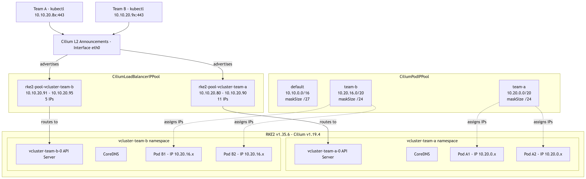

**Summary**:

When I started the vCluster series, I did not expect to keep writing and have already releases a few parts. Having said that, I strongly believe that combining an RKE2 Kubernetes cluster with vCluster and Cilium Multi-Pool IPAM allows us to create powerful multitenant setups for teams building development environments following a GitOps approach. In today's part, we extend the setup to include individual PodCIDRs and LoadBalancer IP ranges for each tenant. This is made possible by Cilium's Multi-Pool IPAM mode, which assigns pod IPs from different pools on a per-namespace basis. We also cover the RKE2 1.35.x cluster bootstrap, touching the cgroup v2 migration required by newer Kubelet versions.

<!--truncate-->


## Introduction

While the first parts of series [1](./vcluster-updates-01.md) and [2](./vcluster-updates-02.md) covered the foundation and, with all honesty, a fast and easy way to create multitenant environments, this part of the series looks into extending this to enable teams to use different PodCIDRs for individual environments. This is made possible with the power of Cilium.

[Cilium's IPAM](https://docs.cilium.io/en/stable/network/concepts/ipam/index.html) works in three different modes: Kubernetes Host Scope, Cluster Scope, and Multi-Pool Scope. The first one is when Kubernetes assigns the PodCIDRs to each node. In the second mode, Cilium manages the PodCIDR allocation with the help of the Cilium Operator. The third and more flexible mode allows pods to receive an IP address from multiple IP pools, either from an annotated namespace or an annotation appended to an application manifest. Keep in mind, the default Cilium mode is set to Cluster Scope. For more information about the Cilium Helm chart values, take a look at the [Cilium official GitHub repository](https://github.com/cilium/cilium/blob/main/install/kubernetes/cilium/values.yaml#L2317).

What are the advantages of enabling Cilium Multi-Pool IPAM for multitenant environments? It enables us to allocate IP addresses to pods on the same node, but from different `CiliumPodIPPool` resources. This is ideal for teams who want to have granular control over per-namespace IP allocation while having the flexibility to add new CIDRs dynamically when required. Combined with `CiliumLoadBalancerIPPool` and L2 announcements or BGP, we can also scope the LoadBalancer IPs per tenant, ensuring no resource exhaustion between teams. This is a strong use case when teams provide services to different tenants and want to control the traffic exiting the cluster. They now have an easy way to identify the tenant behind the environment by source IP alone.

If you are new to RKE2 and Cilium, the [Cilium Cluster Mesh on RKE2](../2024-07-18-rke2-cilium/cilium-cluster-mesh-rke2.md) post covers the foundational setup. For advanced Cilium networking on RKE2, take a look at the [Dual-Stack RKE2 with Cilium on Proxmox](../2025-03-09-dual-stack-proxmox-pfsense-rke2-cilium/proxmox-pfsense-rke2-dual-stack-cilium.md) series.

## Lab Setup

```bash
+-------------------------+--------------+------------------+
|        Resources        |     Type     |     Version      |
+-------------------------+--------------+------------------+
|  Control Plane Cluster  |     RKE2     | v1.35.6+rke2r1   |
|     vcluster-team-a     |     K8s      |     v1.36.0      |
|     vcluster-team-b     |     K8s      |     v1.36.0      |
|         Cilium          |     CNI      |     v1.19.4      |
+-------------------------+--------------+------------------+
```

:::note
The control plane cluster is the cluster that hosts the virtualised control planes for the tenant clusters.
:::

## Prerequisites

Go through parts 1,2 and 3 of the series to gain a better understanding of the concept and what we aim to achieve.

## RKE2 Initial Cluster Setup

Before we dive into the Cilium configuration, it is worth taking a look at the control plane cluster configuration first. We will use the recommended way to build a cluster. This is usually via an Infrastructure as Code (IaC) approach, or, to keep things simple and easy, the automated installer. As the demo focuses on the underlying Cilium configuration, I decided to use the automated installer configuration for simplicity purposes. In case you want to explore what an IaC example looks like, take a look at the [RKE2 on Azure blog](../2024-08-21-opentofu-rke2-cilium-azure/opentofu-rke2-cilium-azure.md).

:::warning
As we moved to **RKE2 1.35.x**, keep in mind that [Kubelet works only with `cgroup v2`](https://kubernetes.io/docs/concepts/architecture/cgroups/). If your underlying machine uses `cgroup v1`, it is time to upgrade and migrate to v2.

Common errors during cluster bootstrap.

```bash
$ journalctl -xu rke2-server.service -f
level=error msg="Kubelet exited: exit status 1"
msg="Failed to test etcd connection: failed to get etcd status: rpc error: code = Unavailable desc = connection error: desc = \"transport: Error while dialing: dial tcp 127.0.0.1:2379: connect: connection refused\""
```

If you see messages like the above, the next steps are to check the kubelet logs.

```bash
$ tail /var/lib/rancher/rke2/agent/logs/kubelet.log
E0731 07:50:00.631256    1983 run.go:72] "command failed" err="failed to validate kubelet configuration, error: kubelet is configured to not run on a host using cgroup v1. cgroup v1 support is unsupported and will be removed in a future release, path: &TypeMeta{Kind:,APIVersion:,}"
```

To migrate to `cgroup v2`, check out the official Kubernetes documentation mentioned above.
:::

### Configuration

Once any issues with the `cgroup` version are resolved, it is time to set up the RKE2 cluster to support the Cilium Multi-Pool scope. Before going any further, ensure you have an understanding of the [RKE2 official documentation server and agent settings](https://docs.rke2.io/reference/server_config).

```yaml showLineNumbers
write-kubeconfig-mode: 0644
tls-san:
  - <YOUR TLS SAN>
token: <YOUR token to connect nodes to the cluster>
cni: cilium
node-ip: "YOUR NODE IP Address"
advertise-address: "YOUR NODE IP Address"
disable-kube-proxy: true
```

:::tip
The following arguments can be excluded from the RKE2 configuration as they get default values by the automated installer.

- `cluster-cidr: "10.42.0.0/16"`
- `service-cidr: "10.43.0.0/16"`
:::

```yaml showLineNumbers
apiVersion: helm.cattle.io/v1
kind: HelmChartConfig
metadata:
  name: rke2-cilium
  namespace: kube-system
spec:
  valuesContent: |-
    image:
      tag: v1.19.4 # The Cilium Version supported by [RKE2 v1.35.6+rke2r1](https://docs.rke2.io/release-notes/v1.35.X)
    kubeProxyReplacement: true # We want to enable Cilium with kube-proxy replacement
    k8sServiceHost: 127.0.0.1
    k8sServicePort: 6443
    operator:
      replicas: 1
    bpf:
      masquerade: true # This is required by the Multi-Pool scope setup for Cilium.
    ipam:
      mode: "multi-pool"
      operator:
        autoCreateCiliumPodIPPools:
          default: # A default pool will be created by Cilium at start-up and assign prefixes to Nodes based on the `ipam.operator.autoCreateCiliumPodIPPools.default` value.
            ipv4:
              cidrs:
                - 10.10.0.0/16
              maskSize: 27
    l2announcements:
      enabled: true
    k8sClientRateLimit:
      qps: 50
      burst: 200
    hubble:
      enabled: true
      relay:
        enabled: true
      ui:
        enabled: true
```

### Validation

The validation needs to take place on the RKE2 side and the Cilium side. For RKE2, ensure the `journal -xu rke2-server.service` logs are clean, and the `systemctl status rke2-server` service is set to `active (running)`. The next step is to validate the state of the cluster, Cilium, and assigned CIDRs.

```bash
$ kubectl get nodes
NAME            STATUS   ROLES                AGE     VERSION
mt08-master     Ready    control-plane,etcd   7d22h   v1.35.6+rke2r1
mt08-worker01   Ready    <none>               7d6h    v1.35.6+rke2r1
mt08-worker02   Ready    <none>               7d5h    v1.35.6+rke2r1

$ kubectl get pods -n kube-system -o wide -l k8s-app=cilium
NAME           READY   STATUS    RESTARTS       AGE
cilium-m9sp5   1/1     Running   0              7d6h
cilium-wwcbn   1/1     Running   0              7d22h
cilium-xm4qt   1/1     Running   0              7d5h

$ kubectl get ciliumpodippools.cilium.io default -o yaml
apiVersion: cilium.io/v2alpha1
kind: CiliumPodIPPool
metadata:
  creationTimestamp: "2026-07-31T09:03:55Z"
  generation: 1
  name: default
  resourceVersion: "841"
  uid: 8987b28f-d362-4fa7-8b0d-4dd00f31dd7a
spec:
  ipv4:
    cidrs:
    - 10.10.0.0/16
    maskSize: 27
```

As expected, Cilium used the `default` pool set during the configuration. Now, we can continue with the configuration of the individual pools and LoadBalancer pools per namespace.

## Cilium CRDs

### CiliumLoadBalancerIPPool

As mentioned at the beginning of the post, we would like to assign each of the tenants its own unique `CiliumLoadBalancerIPPool` pool. For the `vcluster-team-a` tenant, we assign 11 IP addresses, while for the `vcluster-team-b` only 5. The flexibility of the setup is that we could extend the pool of LoadBalancer IPs based on the tenant's needs as we follow a declarative approach.

```yaml showLineNumbers
apiVersion: cilium.io/v2
kind: CiliumLoadBalancerIPPool
  name: rke2-pool-vcluster-team-a
spec:
  blocks:
  - start: 10.10.20.80
    stop: 10.10.20.90
  serviceSelector:
    matchLabels:
      io.kubernetes.service.namespace: vcluster-team-a
```

```yaml showLineNumbers
apiVersion: cilium.io/v2
kind: CiliumLoadBalancerIPPool
  name: rke2-pool-vcluster-team-b
spec:
  blocks:
  - start: 10.10.20.91
    stop: 10.10.20.95
  serviceSelector:
    matchLabels:
      io.kubernetes.service.namespace: vcluster-team-b
```

```bash
$ export KUBECONFIG=/path/to/management cluster/kubeconfig

$ kubectl apply -f ciliumloadbalancerippool_team_a.yaml,ciliumloadbalancerippool_team_b.yaml

$ kubectl get CiliumLoadBalancerIPPool
NAME                          DISABLED   CONFLICTING   IPS AVAILABLE   AGE
rke2-pool-vcluster-team-a     false      false         11              3d3h
rke2-pool-vcluster-team-b     false      false         5               2d2h
```

### CiliumPodIPPool

Create dedicated Pools for the PodCIDRs within each tenant deployment.

```yaml showLineNumbers
apiVersion: cilium.io/v2alpha1
kind: CiliumPodIPPool
metadata:
  name: team-a
spec:
  ipv4:
    cidrs:
      - 10.20.0.0/20
    maskSize: 24
---
apiVersion: cilium.io/v2alpha1
kind: CiliumPodIPPool
metadata:
  name: team-b
spec:
  ipv4:
    cidrs:
      - 10.20.16.0/20
    maskSize: 24
```

```bash
$ export KUBECONFIG=/path/to/management cluster/kubeconfig

$ kubectl apply -f ciliumpodippool_team_a.yaml,ciliumpodippool_team_b.yaml

$ kubectl get CiliumPodIPPool
NAME       AGE
default    3d20h
team-a     3d3h
team-b     3d3h
```

:::note
The pools size should be customized based on your own needs and network design. This is just an example how the `CiliumPodIPPool` look like.
:::

### What did we achieve with the setup?

The main goal was for us to have granural control of the CIDRs assigned to each tenant and control over the LoadBalancer IP addresses advertised by L2Announcement. For more details, take a look at the [Part 2](./vcluster-updates-02.md) of the series. Now, we cannot only control the IPs assigned, but also extend the setup to meet future needs of the individual tenants.

## vCluster Creation

We will not go through the vCluster configuration as this is covered extensively by parts [1](./vcluster-updates-01.md) and [2](./vcluster-updates-02.md) of the series. We will install the individual tenant environments and ensure they get the CIDRs based on our specification on the control plane cluster.

```bash
helm upgrade --install vcluster-tean-a vcluster \
--repo https://charts.loft.sh \
--namespace vcluster-team-a \
--create-namespace -f vcluster_team_a_lb.yaml
```

Once the Helm chart is applied to the control plane node, we can describe the pod and extract the logs of the vCluster pod in the `vcluster-team-a` namespace. Keep in mind the pod will go through different stages till it is running. The pod will follow the classic pod creation workflow: kubelet -> Container Runtime -> CNI Plugin Invoke -> Pod creation.

A snippet of the vCluster Pod might look like the below.

```yaml
Events:
  Type     Reason                  Age                From               Message
  ----     ------                  ----               ----               -------
  Normal   Scheduled               112s               default-scheduler  Successfully assigned vcluster-team-a/vcluster-team-a-0 to mt08-worker01
  Warning  FailedCreatePodSandBox  112s               kubelet            Failed to create pod sandbox: rpc error: code = Unknown desc = failed to setup network for sandbox "7177be8a6ed3f41734d8618b3c3124dc4f7a3800da4d97b3addc2664ecc92dda": plugin type="cilium-cni" failed (add): unable to allocate IP via local cilium agent: [POST /ipam][502] postIpamFailure "unable to allocate from pool \"team-a\" (family ipv4): pool not (yet) available"
  Normal   Pulled                  100s               kubelet            spec.initContainers{kubernetes}: Container image "ghcr.io/loft-sh/kubernetes:v1.36.0" already present on machine and can be accessed by the pod
  Normal   Created                 100s               kubelet            spec.initContainers{kubernetes}: Container created
  Normal   Started                 99s                kubelet            spec.initContainers{kubernetes}: Container started
  Normal   Pulled                  96s                kubelet            spec.containers{syncer}: Container image "ghcr.io/loft-sh/vcluster-pro:0.36.0" already present on machine and can be accessed by the pod
  Normal   Created                 96s                kubelet            spec.containers{syncer}: Container created
```

### Validation

```bash
$ export KUBECONFIG=/path/to/tenant/kubeconfig

$ kubectl get nodes -o wide
NAME            STATUS   ROLES    AGE    VERSION   INTERNAL-IP    EXTERNAL-IP   OS-IMAGE                KERNEL-VERSION              CONTAINER-RUNTIME
mt08-worker01   Ready    <none>   2d3h   v1.36.0   10.43.114.26   <none>        Fake Kubernetes Image   4.19.76-fakelinux (amd64)   docker://19.3.12

$ kubectl get pods -n kube-system
NAME                      READY   STATUS    RESTARTS   AGE    IP             NODE            NOMINATED NODE   READINESS GATES
coredns-97ddf668d-7hdgr   1/1     Running   0          2d3h   10.20.18.184   mt08-worker01   <none>           <none>
```

:::note
The IP address `10.43.114.26` is the `ClusterIP` of the `service/vcluster-team-a-node-mt08-worker01` on the control plane node.
:::

## Advantages of Setup

- **Predictable Egress traffic**: Each tenant uses a distinct CIDR. Firewalls and monitoring tools can identify the source tenant by IP
- **Dedicated LoadBalancer pool**: With the `CiliumLoadBalancerIPPool` scoped per namespace, one tenant cannot exhaust the IP pool of another. Each team gets its own range, and we can extend it declaratively when required
- **Dynamic Tenant Onboarding**: Adding a new tenant means creating a new `CiliumPodIPPool`, a new `CiliumLoadBalancerIPPool`, and a vCluster Helm release.

## Conclusion

The proposed setup allows us to work on the next topic, which is Cilium and Gateway API. We will demonstrate how to share Gateway API resources between the control plane cluster and the underlying tenants, while in the final part of the series, we will advance the setup to include Grafana authentication using Keycloack OIDC and Cilium Gateway API. Stay tuned.

## Resources

- [Cilium Up & Running](https://isovalent.com/books/cilium-up-and-running/)
- [Cilium Multi-Pool IPAM](https://docs.cilium.io/en/latest/network/kubernetes/ipam-multi-pool/)

## ✉️ Contact

If you have any questions, feel free to get in touch! You can use the `Discussions` option found [here](https://github.com/egrosdou01/blog.grosdouli.dev/discussions) or reach out to me on any of the social media platforms provided. 😊 We look forward to hearing from you!

## Series Navigation

| Part | Title |
| :--- | :---- |
| [Part 1](./vcluster-updates-01.md) | vCluster Recent Updates |
| [Part 2](./vcluster-updates-02.md) | Introduction to Cilium L2 Announcements and vCluster Platform |
| [Part 3](./vcluster-updates-03.md) | vCluster Networking and Cilium Under the Hood |
| [Part 4 ](./vcluster-updates-04.md)| vCluster and Cilium Multi-Pool Mode |
| [Part 5](./vcluster-updates-05.md) | vCluster and Cilium Gateway API Shared Resources |