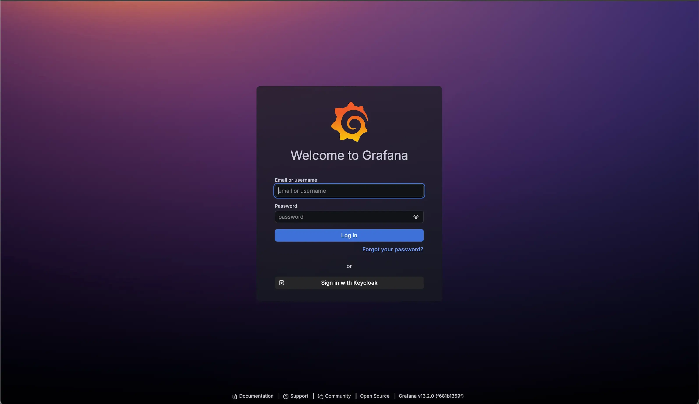
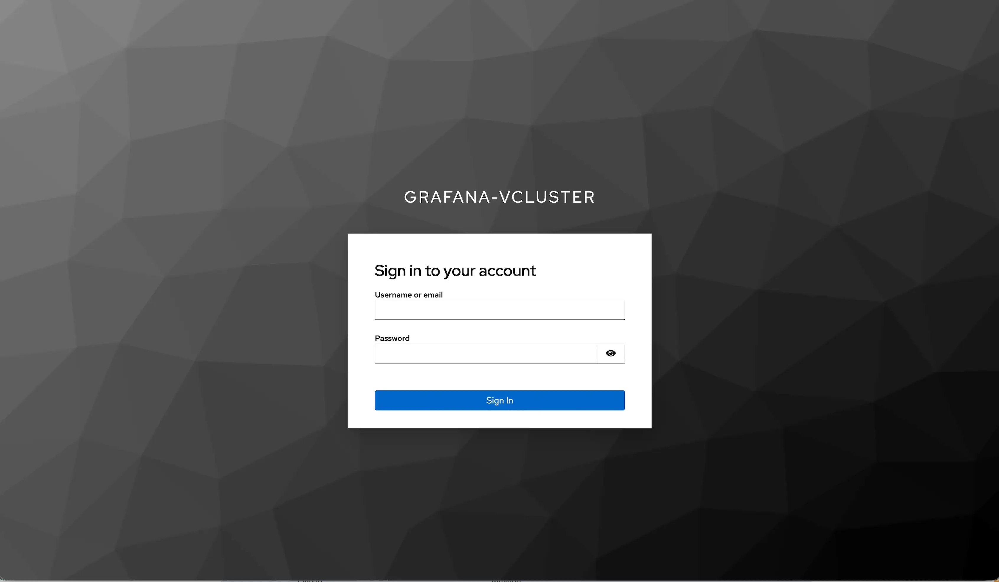

**Summary**:

While in the [vCluster and Cilium Gateway API](./vcluster-updates-05.md) post, we explored how to share Gateway API resources between the Control Plane and the tenant cluster using a simplistic NGINX application; today, we take a step further, and we combine all the parts of the series to demonstrate how [Grafana](https://grafana.com/) performs [OpenID Connect (OIDC)](https://grafana.com/docs/grafana/latest/setup-grafana/configure-access/configure-authentication/keycloak/) authentication  using [Keycloak](https://www.keycloak.org/).

<!--truncate-->

## Introduction

The NGINX example in the [previous post](./vcluster-updates-05.md) did not satisfy me, so I decided to provide an example that covers a commonly used operations task. With an existing Keycloak deployment, I enabled Grafana OIDC authentication using Keycloak and combined everything we covered throughout the series. Both Keycloak and Grafana are exposed via `HTTPRoute` resources using the Cilium and Gateway API integration, with the only difference being that the Keycloak deployment is on a Services cluster in a different network segment. The post aims to provide a comprehensive deployment and troubleshooting section outlining some of the gotchas through the setup.

## Terminology

- **Gateway API**: Is an official Kubernetes project focused on L4 and L7 routing, and it is the next generation of the Kubernetes Ingress, Load Balancing, and Service Mesh APIs
- **Grafana**: Is an open-source analytics and visualisation platform used for interactive dashboard creation
- **Keycloak**: Is an open-source identity and access management solution
- **OIDC**: Is an identity authentication protocol built on top of the OAuth 2.0 framework that verifies users’ identities and enables Single Sign-On (SSO)

## Lab Setup

```bash
+-------------------------+--------------+------------------+
|        Resources        |     Type     |     Version      |
+-------------------------+--------------+------------------+
|  Control Plane Cluster  |     RKE2     | v1.35.6+rke2r1   |
|     vcluster-team-d     |     K8s      |     v1.36.0      |
|  kube-prometheus-stack  |  Helm Chart  |     v88.6.0      |
|         Cilium          |     CNI      |     v1.19.4      |
+-------------------------+--------------+------------------+
```

:::note
The Control Plane cluster is the cluster that hosts the virtualised control planes for the tenant clusters.
:::

## Prerequisites

Go through parts 1 to 5 of the series to gain a better understanding of the concept and what we aim to achieve.

## Grafana Deployment

The `kube-prometheus-stack` was deployed through a Helm chart. For more details about the Helm chart and the available values, take a look at the [official Helm chart](https://artifacthub.io/packages/helm/prometheus-community/kube-prometheus-stack/88.6.0).

```bash
$ helm repo add prometheus-community https://prometheus-community.github.io/helm-charts
$ helm upgrade --install prometheus prometheus/kube-prometheus-stack --version 88.6.0 --namespace monitoring --create-namespace -f vcluster-monitoring.yaml
```

:::note
The values provided to the Helm chart need to match your own Keycloak instance. Below are some of the most important values required to make this deployment successful.

```yaml
grafana:
  grafana.ini:
    server:
      root_url: "https://<Your Grafana FQDN>"
    auth.generic_oauth:
      enabled: true
      name: Keycloak
      allow_sign_up: true
      scopes: openid email profile
      auth_url: https://<Keycloak FQDN>/realms/<Your Realm Name>/protocol/openid-connect/auth
      token_url: https://<Keycloak FQDN>/realms/<Your Realm Name>/protocol/openid-connect/token
      api_url: https://<Keycloak FQDN>/realms/<Your Realm Name>/protocol/openid-connect/userinfo
```

Detailed information about Grafana and Keycloak OAuth2; take a look [here](https://grafana.com/docs/grafana/latest/setup-grafana/configure-access/configure-authentication/keycloak/).
:::

## Recap Cilium Configuration

Since **Cilium v1.19.4** is already installed in the Control Plane and the Gateway API integration is in place, we can continue with the IPAM pool definition for the `vcluster-team-d` cluster alongside the `Gateway` and `HTTPRoute` resources.

```yaml showLineNumbers
apiVersion: cilium.io/v2
kind: CiliumLoadBalancerIPPool
  name: rke2-pool-vcluster-team-d
spec:
  blocks:
  - start: 10.10.20.20
    stop: 10.10.20.30
  serviceSelector:
    matchLabels:
      io.kubernetes.service.namespace: vcluster-team-d
```

```yaml showLineNumbers
apiVersion: gateway.networking.k8s.io/v1
kind: Gateway
metadata:
  name: monitoring-gw
  namespace: monitoring
spec:
  gatewayClassName: cilium
  listeners:
    - name: http
      protocol: HTTP
      port: 80
      hostname: "grafana-vcluster.<Your Domain>"
      allowedRoutes:
        namespaces:
          from: Same
    - name: https
      protocol: HTTPS
      port: 443
      hostname: "grafana-vcluster.<Your Domain>"
      tls:
        mode: Terminate
        certificateRefs:
          - kind: Secret
            name: grafana-vcluster-tls 
      allowedRoutes:
        namespaces:
          from: Same
---
apiVersion: gateway.networking.k8s.io/v1
kind: HTTPRoute
metadata:
  name: grafana
  namespace: monitoring
spec:
  parentRefs:
    - name: monitoring-gw
      sectionName: https
  hostnames:
    - "grafana-vcluster.<Your Domain>"
  rules:
    - matches:
        - path:
            type: PathPrefix
            value: /
      backendRefs:
        - name: prometheus-grafana
          port: 80
```

:::tip
There are many ways to create TLS certificates for Grafana: either use [OpenSSL](https://www.openssl.org/), or the [`mkcert`](https://manpages.ubuntu.com/manpages/jammy/man1/mkcert.1.html) utility or use cert-manager and Gateway API to issue valid TLS certificates and handle their lifecycle automatically. An example of how the second works, take a look at the [Cilium with Gateway API and Let's Encrypt blog post](../2025-07-05-cilium-gateway-api-cert-manager-lets-encrypt/cilium-gateway-api-cert-manager-lets-encrypt.md).
:::

```bash
$ export KUBECONFIG=vcluster-team-d.yaml
$ kubectl apply -f monitoring-gateway.yaml,monitoring-httproute.yaml
```

### Validation vcluster-team-d

```bash
$ export KUBECONFIG=vcluster-team-d.yaml 

$ kubectl get gateway,httproute -n monitoring
NAME                                              CLASS    ADDRESS       PROGRAMMED   AGE
gateway.gateway.networking.k8s.io/monitoring-gw   cilium   10.10.20.25   True         23h

NAME                                          HOSTNAMES                       AGE
httproute.gateway.networking.k8s.io/grafana   ["grafana-vcluster.YOUR DOMAIN"]   23h
```

### Validation Control Plane cluster

```bash
$ export KUBECONFIG=control-plane-cluster.yaml

$ kubectl get gateway,httproute -n vcluster-team-d
NAMESPACE         NAME                                               CLASS    ADDRESS       PROGRAMMED   AGE
vcluster-team-d   gateway.gateway.networking.k8s.io/v5kg04i89gz2vp   cilium   10.10.20.25   True         23h

NAMESPACE         NAME                                                 HOSTNAMES                       AGE
vcluster-team-d   httproute.gateway.networking.k8s.io/v1sw8vlevjjolh   ["grafana-vcluster.YOUR DOMAIN"]   23h
```

## vCluster Helm Chart Updates

In the previous part of the series, we provided an easy way to patch the resources from the tenant to the Control plane cluster. This is enough for the basic NGINX deployment in the `default` namespace, but not enough when we involve more complex deployments, hostname resolution with TLS encryption, etc. To make this example a working one, we will have to perform small updates to the vCluster Helm chart values, especially the `sync` part.

```yaml showLineNumbers
sync:
    customResources:
      gateways.gateway.networking.k8s.io:
        enabled: true
        patches:
          - path: spec.listeners[*].tls.certificateRefs[*] # Rewrite TLS certificateRefs secret name to the synced name on the host
            reference:
              apiVersion: v1
              kind: Secret
              namePath: name
              namespacePath: namespace
```

### Update vCluster Helm Deployment

```bash
$ export KUBECONFIG=control-plane-cluster.yaml

$ helm upgrade --install vcluster-team-d vcluster \
  --repo https://charts.loft.sh \
  --namespace vcluster-team-d \
  --create-namespace \
  -f vcluster_team_d_syncer.yaml
```

Once the vCluster underlying configuration is updated, we will see the routing work as it should, and we will be able to reach the Grafana dashboard using the hostname provided in the configuration mentioned above.

:::note
Ensure your DNS is able to resolve the FQDN defined for the Grafana dashboard. If not, the easiest way to test the setup is by adding an entry to the `/etc/hosts` file on your Linux machine.
:::

### Validation

```yaml
status:
  addresses:
  - type: IPAddress
    value: 10.10.20.25
  conditions:
  - lastTransitionTime: "2026-08-25T07:06:41Z"
    message: Gateway successfully scheduled
    observedGeneration: 1
    reason: Accepted
    status: "True"
    type: Accepted
  - lastTransitionTime: "2026-08-25T07:06:41Z"
    message: Gateway Programmed
    observedGeneration: 1
    reason: Programmed
    status: "True"
    type: Programmed
  listeners:
  - attachedRoutes: 0
    conditions:
    - lastTransitionTime: "2026-08-25T07:06:41Z"
      message: Resolved Refs
      observedGeneration: 1
      reason: ResolvedRefs
      status: "True"
      type: ResolvedRefs
    - lastTransitionTime: "2026-08-25T07:06:41Z"
      message: Listener Accepted
      observedGeneration: 1
      reason: Accepted
      status: "True"
      type: Accepted
    - lastTransitionTime: "2026-08-25T07:06:41Z"
      message: Listener Programmed
      observedGeneration: 1
      reason: Programmed
      status: "True"
      type: Programmed
    name: http
    supportedKinds:
    - group: gateway.networking.k8s.io
      kind: HTTPRoute
    - group: gateway.networking.k8s.io
      kind: GRPCRoute
  - attachedRoutes: 1
    conditions:
    - lastTransitionTime: "2026-08-25T07:06:41Z"
      message: Resolved Refs
      observedGeneration: 1
      reason: ResolvedRefs
      status: "True"
      type: ResolvedRefs
    - lastTransitionTime: "2026-08-25T07:06:41Z"
      message: Listener Accepted
      observedGe
```

Once the setup is complete, we should be able to access the Grafana dashboard via the defined FQDN and authenticate using Keycloak.





:::note
Since in [part 3](./vcluster-updates-03.md) of the series we introduced the Cilium network policies and how they are applied to a tenant environment. It might be worth double-checking the rules defined. There might be a need to allow traffic to and from the Keycloak instance.
:::

## Common Grafana OAuth Issues

While working out the setup, the most commonly faced issues were due to a misconfiguration of the Keycloak Realm or due to the `Gateway` not performing the routing correctly. We will go through these scenarios and provide troubleshooting commands alongside practical solutions.

### vCluster Secret Sharing

Going through the [official vCluster documentation around secret sharing](https://www.vcluster.com/docs/vcluster/configure/vcluster-yaml/sync/to-host/core/secrets), it is mentioned that this capability is enabled by default. What does that mean? The `grafana-vcluster-tls` secret defined in the tenant cluster should be accessible from the Control Plane node. And this is true. However, the patches mentioned above are required for that to work. This is because the system looks for a secret name in a different namespace and with a different name.

**View from Control Plane Node - No full secret sharing**

```yaml
  - attachedRoutes: 0
    conditions:
    - lastTransitionTime: "2026-09-03T09:01:50Z"
      message: Invalid CertificateRef
      reason: InvalidCertificateRef
      status: "False"
      type: ResolvedRefs
    - lastTransitionTime: "2026-09-03T09:01:50Z"
      message: Listener not valid. Invalid CertificateRef, Secret "grafana-vcluster-tls"
        not found
      observedGeneration: 1
      reason: Invalid
      status: "False"
      type: Accepted
```

To solve this issue, we need to instruct the tenant to share all secrets with the Control Plane node. Update the Helm chart values and include the following. Then, upgrade the Helm chart.

```yaml
sync: 
  toHost:
    secrets:
      enabled: true
      all: true
```

**View from Control Plane Node - No patches**

```bash
$ kubectl get secret -n vcluster-team-d | grep -i "grafana-vcluster-tls"
grafana-vcluster-tls-x-monitoring-x-vcluster-team-d               kubernetes.io/tls    2      2m31s
```

```yaml
 - attachedRoutes: 0
    conditions:
    - lastTransitionTime: "2026-09-03T09:08:03Z"
      message: Invalid CertificateRef
      reason: InvalidCertificateRef
      status: "False"
      type: ResolvedRefs
    - lastTransitionTime: "2026-09-03T09:08:03Z"
      message: Listener not valid. Invalid CertificateRef, Secret "grafana-vcluster-tls"
        not found
      observedGeneration: 1
      reason: Invalid
      status: "False"
      type: Accepted
```

From the outputs above, it is obvious that the secret is visible on the Control Plane node; however, not correctly translated for the `Gateway` to route traffic correctly. Update the vCluster Helm charts and include the required patches for the `Gateway` resources as described [here](#update-vcluster-helm-deployment).

**View from Control Plane Node - With patches**

```bash
$ kubectl get secret -n vcluster-team-d | grep -i "grafana-vcluster-tls"
grafana-vcluster-tls-x-monitoring-x-vcluster-team-d               kubernetes.io/tls    2      1d
```

### Grafana OAuth Troubleshooting

There could be issues with the Grafana dashboard authenticating using Keycloak. This could be caused by many issues. My recommendation is to start by checking the issue from the browser and using the **Inspect** and Network tabs to grab the requests and the responses between the two systems. This will give you a good understanding of what has been exchanged between the Grafana dashboard and Keycloak.

From a Kubernetes point of view, I will start troubleshooting by checking the Grafana configuration. Ensure the settings there match the recommendations from the official Grafana documentation.

```bash
$ kubectl exec -n monitoring prometheus-grafana-7db659879-28bdr -c grafana -- grep -A20 'auth.generic_oauth' /etc/grafana/grafana.ini
```

If the configuration is correct, debug the prometheus-grafana-7db659879-28bdr pod using the `nicolaka/netshoot` image on a `baseline` profile.

```bash
$ kubectl debug -it prometheus-grafana-5fcf75c5fc-mxr8v -n monitoring --image=nicolaka/netshoot --target=grafana --profile=baseline
$ curl -kiv https://keycloak.test.lab/realms/grafana-vcluster/.well-known/openid-configuration
```

## Conclusion

In the final part of the vCluster series, we explored how to extend Cilium with Gateway API setup on a tenant environment to cover complexer deployments. If you are already a Gateway API adopter, check out the latest [Cilium and Gateway API news](https://isovalent.com/blog/post/cilium-1-20/). This is the end of the series around vCluster.

## Resources

- [Cilium Up & Running](https://isovalent.com/books/cilium-up-and-running/)
- [Keycloak OAuth2 Authentication for Grafana](https://grafana.com/docs/grafana/latest/setup-grafana/configure-access/configure-authentication/keycloak/)

## ✉️ Contact

If you have any questions, feel free to get in touch! You can use the `Discussions` option found [here](https://github.com/egrosdou01/blog.grosdouli.dev/discussions) or reach out to me on any of the social media platforms provided. 😊 We look forward to hearing from you!

## Series Navigation

| Part | Title |
| :--- | :---- |
| [Part 1](./vcluster-updates-01.md) | vCluster Recent Updates |
| [Part 2](./vcluster-updates-02.md) | Introduction to Cilium L2 Announcements and vCluster Platform |
| [Part 3](./vcluster-updates-03.md) | vCluster Networking and Cilium Under the Hood |
| [Part 4 ](./vcluster-updates-04.md)| vCluster and Cilium Multi-Pool Mode |
| [Part 5](./vcluster-updates-05.md) | vCluster and Cilium Gateway API Shared Resources |
| [Part 6](./vcluster-updates-06.md) | vCluster and Cilium Gateway API Shared Resources - Keycloak and Grafana Example |