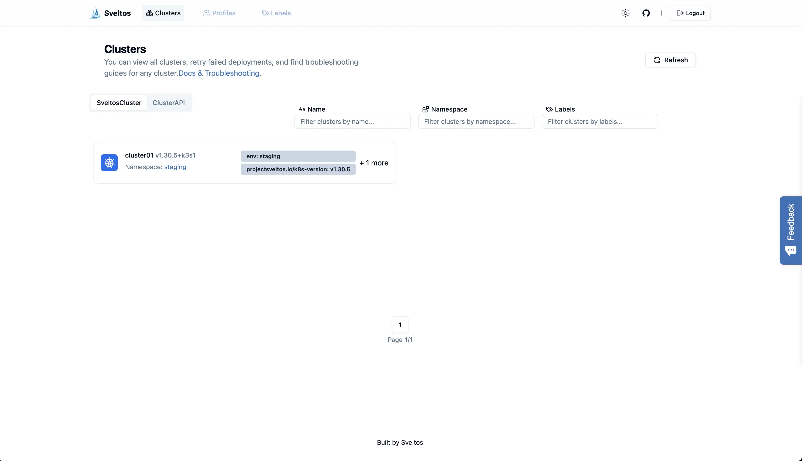

## Introduction

It is already a year since I started getting more involved with [ProjectSveltos](https://github.com/projectsveltos). Over the past few months, a lot of work was put into making Sveltos not only more **intuitive** but also **easier** to use, all while preserving its **core features** and **functionality**.

This post will be split into two parts, with both sections covering the latest updates along with simple deployment examples to help you get started. So, let's dive into the world of Sveltos and explore what's new!
<!--truncate-->

## What is Sveltos?


Sveltos is a set of **Kubernetes controllers** deployed in a **management cluster**. From a management cluster, Sveltos can manage **add-ons** and **applications** to a fleet of clusters independent if they are on-prem or in the Cloud. Sveltos supports a wide range of Kubernetes clusters and multitenant setups!

## Getting Started with Sveltos

Before we go through the latest updates, I would like to provide some pointers on getting started with Sveltos. This involves installing Sveltos on a Kubernetes **management** cluster. We also need to download the latest `sveltosctl` utility to manage the deployments.

### Sveltos Installation

Looking at the [installation](https://projectsveltos.github.io/sveltos/getting_started/install/install/) page, there are many ways to install Sveltos based on the existing environment and use case that need to be covered. For this demonstration, I will install Sveltos as a Helm chart.

```bash
$ helm repo add projectsveltos https://projectsveltos.github.io/helm-charts # Add the Sveltos Helm Chart

$ helm repo update # Update the Helm Chart repositories

$ helm install projectsveltos projectsveltos/projectsveltos -n projectsveltos --create-namespace # Install Sveltos on the `projectsveltos` namespace
```

### sveltosctl Installation

Looking at the [sveltosctl](https://projectsveltos.github.io/sveltos/getting_started/sveltosctl/sveltosctl/) documentation, the binaries and the relevant releases are located [here](https://github.com/projectsveltos/sveltosctl/releases). Download the binary based on the Operating System in place, and once done, validate the installation by executing ```sveltosctl version```.

## Cluster Registration

To manage a fleet of clusters, we have to perform a **Sveltos cluster registration**. That implies we already have a Kubernetes cluster we want to manage with Sveltos. Get a copy of the **managed cluster** `kubeconfig` and perform the below command.

```bash
$ kubectl create namespace staging

$ sveltosctl register cluster \
   --namespace=staging \
   --cluster=cluster01 \
   --kubeconfig=/path/to/kubeconfig/cluster01.yaml \
   --labels=env=staging
```

For this demonstration, I have a cluster named `cluster01` located in a `staging` environment. Thus, I would register the cluster in the `staging` namespace and let Sveltos manage the add-on and application deployments based on the label set to `env:staging`.

### Validation

```bash
$ kubectl get sveltosclusters -A --show-labels
NAMESPACE   NAME        READY   VERSION        LABELS
mgmt        mgmt        true    v1.30.5+k3s1   projectsveltos.io/k8s-version=v1.30.5,sveltos-agent=present
staging     cluster01   true    v1.30.5+k3s1   env=staging,projectsveltos.io/k8s-version=v1.30.5,sveltos-agent=present
```

## Introduction to ClusterProfile/Profile

Sveltos makes it **extremely easy** to deploy add-ons and applications to clusters. As long as the correct `label` is set to a cluster, we can mark the clusters of interest and deploy the needed applications. With Sveltos, we use a top-down approach for deployment order and dependencies. This means we follow the same order as the applications listed in the manifest file (ClusterProfile/Profile).

### ClusterProfile/Profile

ClusterProfile and Profile are the `CustomerResourceDefinitions` used to instruct Sveltos which add-ons to deploy on a set of clusters.

- **ClusterProfile**: It is a cluster-wide resource. It can match any cluster and reference any resource regardless of their namespace.

- **Profile**: It is a namespace-scoped resource that is specific to a single namespace. It can only match clusters and reference resources within its own namespace.

### ClusterProfile - Kyverno Deployment

```yaml
apiVersion: config.projectsveltos.io/v1beta1
kind: ClusterProfile
metadata:
  name: kyverno
spec:
  clusterSelector:
    matchLabels:
      env: staging
  helmCharts:
  - repositoryURL:    https://kyverno.github.io/kyverno/
    repositoryName:   kyverno
    chartName:        kyverno/kyverno
    chartVersion:     v3.3.4
    releaseName:      kyverno-latest
    releaseNamespace: kyverno
    helmChartAction:  Install
```

This is a simple `ClusterProfile` definition that will deploy the latest `Kyverno` Helm chart to any cluster with the label set to `env:staging`. To deploy the manifest, we simply need to perform ```kubectl apply -f <clusterprofile-name>```.

### Validation

Validation can be performed by either accessing the managed cluster, via the use of the `sveltosctl` utility or the Sveltos Dashboard (see later section).

```bash
$ sveltosctl show addons
+-------------------+---------------+-----------+----------------+---------+-------------------------------+------------------------+
|      CLUSTER      | RESOURCE TYPE | NAMESPACE |      NAME      | VERSION |             TIME              |        PROFILES        |
+-------------------+---------------+-----------+----------------+---------+-------------------------------+------------------------+
| staging/cluster01 | helm chart    | kyverno   | kyverno-latest | 3.3.4   | 2024-12-24 09:50:00 +0000 UTC | ClusterProfile/kyverno |
+-------------------+---------------+-----------+----------------+---------+-------------------------------+------------------------+
```

```bash
$ kubectl get nodes
NAME                                             STATUS   ROLES    AGE   VERSION
k3s-cluster01-ecec-64df92-node-pool-df99-4lppd   Ready    <none>   26m   v1.30.5+k3s1
k3s-cluster01-ecec-64df92-node-pool-df99-c9n3b   Ready    <none>   26m   v1.30.5+k3s1

$ kubectl get pods -n kyverno
NAME                                             READY   STATUS    RESTARTS   AGE
kyverno-admission-controller-6c4f8bdd58-zfjh4    1/1     Running   0          2m51s
kyverno-background-controller-548c8879f6-m5krf   1/1     Running   0          2m51s
kyverno-cleanup-controller-57c5fbd75c-vm5wq      1/1     Running   0          2m51s
kyverno-reports-controller-86c4db8cb7-zgbtj      1/1     Running   0          2m51s
```

## Sveltos Dashboard

The `sveltosctl` utility is a fast way of checking the status of the different deployments; but, the [Sveltos Dashboard](https://projectsveltos.github.io/sveltos/getting_started/install/dashboard/) is a convenient way to provide **operators** and **users** access to the deployed applications' information based on Role Based Access Control (RBAC).

### Install Sveltos Dashboard

To install the Sveltos Dashboard, simply below the below manifest.

```bash
$ kubectl apply -f https://raw.githubusercontent.com/projectsveltos/sveltos/main/manifest/dashboard-manifest.yaml

$ kubectl get pods -n projectsveltos | grep -i 'dashboard'
dashboard-5d488744fc-9xlfq              1/1     Running   0          20s
```

### Expose Sveltos Dashboard

To access the Sveltos Dashboard, we can either use the `port-forward` capability or edit the Sveltos Dashboard service to be of type `NodePort` or `LoadBalancer`. For this demonstration, I will patch the service to be of type `LoadBalancer`.

```bash
$ kubectl patch svc dashboard -n projectsveltos -p '{"spec": {"type": "LoadBalancer"}}'
```

### Tenant Admin Definition

Using the below commands, we will create a new `serviceaccount` named `tenant-admin-staging` that will have access only to the registered clusters within the `staging` namespace. That user will have access only to the particular namespace and nowhere else in the cluster.

```bash
$ kubectl create sa tenant-admin-staging -n staging
$ kubectl create rolebinding tenant-admin-staging-access -n staging --clusterrole cluster-admin --serviceaccount staging:tenant-admin-staging
$ kubectl create token tenant-admin-staging -n staging --duration=24h
```

### Sveltos Dashboard Access

Copy the `token` generated in the previous step, choose a browser of your preference and open the Sveltos Dashboard. Check the registered clusters and deploy applications with ease.




## Sveltos Grafana Dashboard

With the latest Sveltos release, users can get the most out of Sveltos by utilising the Sveltos Grafana Dashboard. To use the Grafana dashboard, we first need to enable the Prometheus operator on the Sveltos deployment, have already got Grafana and Prometheus installed, and finally, import the dashboard to Grafana. A simple example is outlined below.

### Install Grafana and Prometheus

I always find it easy to use the `kube-prometheus-stack` Helm chart and deploy Grafana and Prometheus in one go. However, feel free to use your preferred method!

### Update Sveltos Helm Chart Deployment

```bash
$ helm upgrade projectsveltos  projectsveltos/projectsveltos -n projectsveltos --set prometheus.enabled=true
```

:::tip
The upgrade command will not succeed if `Grafana` and `Prometheus` are not installed on the management cluster.
:::

### Patch the projectsveltos ServiceMonitors

As the `kube-prometheus-stack` was installed for the demonstration, the release label for Prometheus is `release:prometheus-community`.

```bash
$ kubectl get servicemonitor -n projectsveltos
NAME               AGE
addon-controller   2m5s
sc-manager         2m4s

$ kubectl patch servicemonitor addon-controller -n projectsveltos -p '{"metadata":{"labels":{"release":"prometheus-community"}}}' --type=merge
servicemonitor.monitoring.coreos.com/addon-controller patched

$ kubectl patch servicemonitor sc-manager -n projectsveltos -p '{"metadata":{"labels":{"release":"prometheus-community"}}}' --type=merge
servicemonitor.monitoring.coreos.com/sc-manager patched
```

### Download Grafana Dashboard

```bash
$ curl -O https://raw.githubusercontent.com/projectsveltos/sveltos/main/docs/assets/sveltosgrafanadashboard.json
```

### Import the Sveltos Dashboard to Grafana

Open the Grafana UI and navigate to **Home > Dashboards > New > Import > Choose the .json file downloaded > Set `Prometheus` as the data source**.

## Conclusion

This is an introduction series to Sveltos, how it works and how the Sveltos Dashboard alongside the Sveltos Grafana Dashboard can be utilised. In [Part 2](sveltos-what's-new-part-2.md), we will update the existing Sveltos ClusterProfle and utilise the latest features for advanced deployments. Stay tuned!

## Resources

- **Sveltos Official Documentation**: https://projectsveltos.github.io/sveltos/
- **Sveltos Add-on Deployment**: https://projectsveltos.github.io/sveltos/addons/addons/
- **Sveltos Dashboard**: https://projectsveltos.github.io/sveltos/getting_started/install/dashboard/
- **Sveltos Grafana Dashboard**: https://projectsveltos.github.io/sveltos/getting_started/install/grafanadashboard/

## ✉️ Contact

We are here to help! Whether you have questions, or issues or need assistance, our Slack channel is the perfect place for you. Click here to [join us](https://join.slack.com/t/projectsveltos/shared_invite/zt-1hraownbr-W8NTs6LTimxLPB8Erj8Q6Q) us.

## 👏 Support this project

Every contribution counts! If you enjoyed this article, check out the Projectsveltos [GitHub repo](https://github.com/projectsveltos). You can [star 🌟 the project](https://github.com/projectsveltos) if you find it helpful.

The GitHub repo is a great resource for getting started with the project. It contains the code, documentation, and many more examples.

Thanks for reading!
