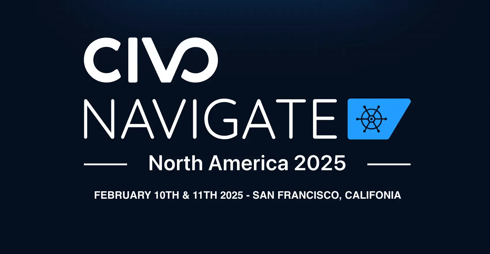

## Introduction

Another amazing [Civo Navigate](https://www.civo.com/navigate/north-america/2025) conference came to an end. In today's blog post, I wanted to share some highlights from the event. I had the chance to present [Sveltos](https://github.com/projectsveltos) and how [templating](https://projectsveltos.github.io/sveltos/template/intro_template/) alongside [Validate Health](https://projectsveltos.github.io/sveltos/addons/clusterprofile/#specvalidatehealths) can be used to deploy and update different Kubernetes add-ons and applications effortlessly. 

Below, I will dive into the key highlights from the conference, provide resources about tooling I found interesting and last but not least, provide more details about the Sveltos presentation!

<!--truncate-->

## Civo Navigate - Day 1

The day started smoothly by registering at the event, receiving a badge and becoming familiar with the location. Great coffee was served all day long!

[Image Source](https://imgflip.com/memegenerator/43713348/large-coffee)

The conference opened with keynotes and a positive outline of cloud computing, sustainability, innovation and AI by Mark Boost, CEO of Civo. Afterwards, Steve Wozniak was on stage to provide his personal experience as an engineer and Co-founder of Apple alongside his perspective and the importance of authenticity and uniqueness on how we approach problems or general issues in life! Later on, Kelsey Hightower got on stage to speak about the latest trends, and thoughts on the industry, AI, Kubernetes etc. Questions asked by the audience "Will AI preplace engineering work? Will AI replace creativity and uniqueness?"

From a technical point of view, I had the chance to speak with many people at different booths who work and develop great stuff around cloud-native landscapes! Below are things I will try in my lab later this year.

- [Dagger](https://github.com/dagger/dagger): Lets users run application delivery pipelines locally while taking advantage of a modern API and cross-language scripting engine.
- [Wolfi](https://github.com/wolfi-dev): Get experience with a Linux distroless build.
- [StackGen](https://docs.appcd.io/): A platform that streamlines the application deployment and infrastructure provisioning by generating Infrastructure as Code (IaC) based on users' requirements.
- [Okteto](https://github.com/okteto/okteto): Enables development inside a container providing seamless IDE and tool integration as if you were working locally.

## Civo Navigate - Day 2

Day 2 keynotes were just amazing! Solomon Hykes, Co-Founder of Dagger, spoke about AI agents, and he dived into a demo on how Dagger can be used to call different LLMs (Large Language Models)! Super fun and impressive how an engineer can use Dagger and contribute to the open-source community. For more information about the so-called "Multi Agents" check out the [link](https://www.youtube.com/watch?v=25Vgj6vLydE).

## Civo Navigate - Sveltos

For the conference, we demonstrated how Sveltos is used to deploy and take over the control of the Container Network Interface (CNI) lifecycle with the use of a single **template manifest** while enabling Cilium Hubble for Network observability. One manfitest that can be instantiated dynamically using the information located at the **management cluster**, acts as the source of truth and is one-file to rule-them-all for this demo. In the second part, we demonstrated how the `ValidateHealth` feature can be used to deploy [Kyverno](https://kyverno.io/) and **Kyverno policies** to different clusters.

### Diagram

### Git Repository

The Git repository with the manifest files and the execution instructions are located [here](https://github.com/egrosdou01/civo-navigate/tree/main/resources/civo_navigate_north_america_2025).

## Conclusion

All in all, it was an awesome experience to have the chance to attend and speak at the conference. If you plan to attend any upcoming Civo Navigate conferences, check out the [link](https://www.civo.com/navigate). I am pretty confident you will have an enjoyable experience!

It's a wrap for this post! 🎉 Thanks for reading! Stay tuned for more exciting updates!