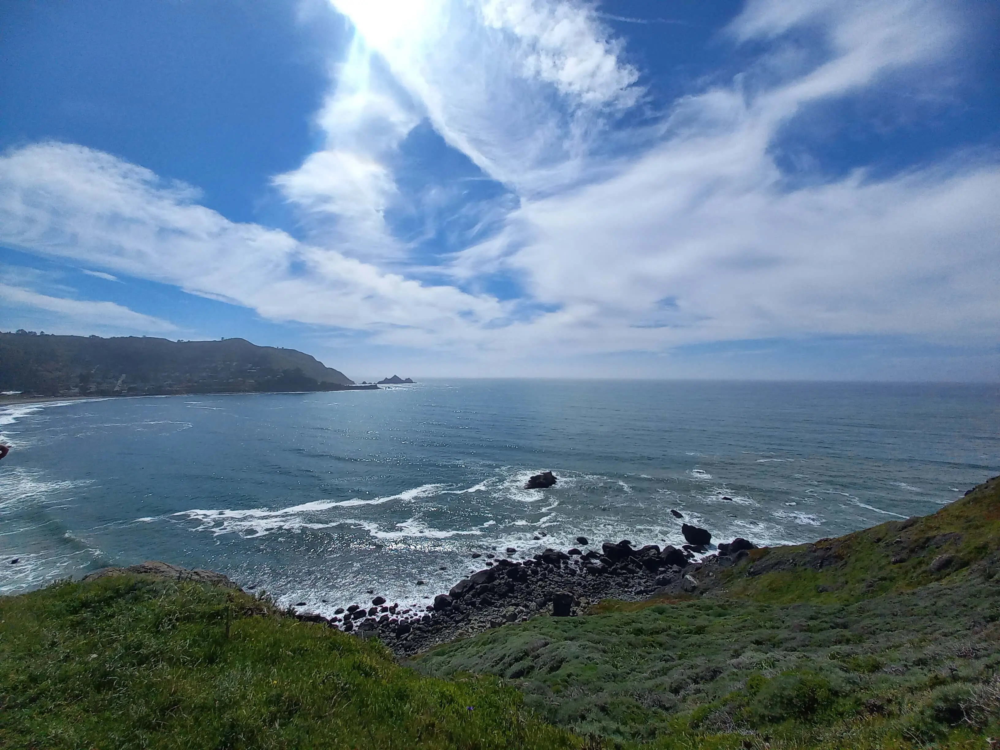
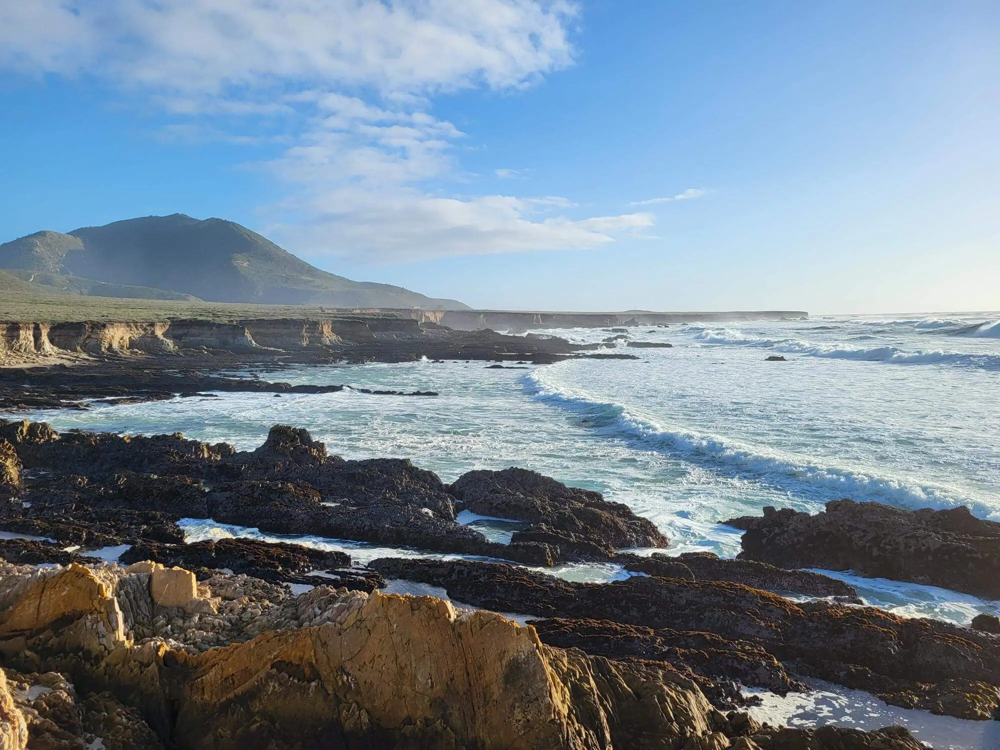

I love it when work and holidays come together! In this post, I am sharing my recent travel to California during February 2025 - a bit of an off-topic post for my usual content.
<!--truncate-->

P.S. California is **HUGE** compared to European destinations! While 15 days might not seem like a lot of time to explore the state, I think we made the most of it and still kept things relaxed.

It has been almost a year since my last visit to San Francisco! So, when the opportunity arose to combine the Civo Navigate Conference with a little California getaway, sounded like the perfect idea!

We spent three days in San Francisco. If you are planning to rent a car, be mindful about parking in the city centre. It can be challenging. A better option might be to use public transport during your stay and rent a car afterwards (definitely something to keep in mind for future trips to the States).

While in San Francisco, we visited [Alcatraz](https://www.nps.gov/alca/index.htm), enjoyed the long walks around the [Marina district](https://en.wikipedia.org/wiki/Marina_District,_San_Francisco), explored the [Fisherman’s Wharf](https://www.fishermanswharf.org/) and [Pier 39](https://www.pier39.com/), and made a quick stop in [Chinatown](https://en.wikipedia.org/wiki/Chinatown,_San_Francisco).

We also visited the [Golden Gate](https://www.goldengate.org/bridge/visiting-the-bridge/) and the [Golder Gate park](https://sfrecpark.org/770/Golden-Gate-Park) on the other side of the town. And, of course, no trip to San Francisco would be complete without a ride on the famous [cable cars](https://www.sfmta.com/getting-around/muni/cable-cars). If you get the chance, definitely hop on and take in the view.

If you have time, a bit outside the city, I highly recommend a visit to [Muir Beach](https://www.nps.gov/goga/planyourvisit/muirbeach.htm) and the [Muir Woods National Monument](https://www.nps.gov/muwo/index.htm). It is an unforgettable experience with breathtaking views and nature!

**Next stop**: [Monterey](https://monterey.gov/)! The weather was not as good as the previous days. It was windy with heavy rain throughout the day. However, we managed to explore the [Point Lobos National Park](https://www.parks.ca.gov/?page_id=571) (entrance fee 10$ per car) and we ended up spending almost 4 hours there. Just take the time and enjoy the nature!

Later, we had a quick stop at [Big Sur](https://www.bigsurcalifornia.org/) as the trails were closed due to a water leak. We did, however, manage to visit [McWay Falls](https://mcwayfalls.com/), which was just stunning.

:::note
During our visit, part of the **Highway 1** was closed due to construction. For more details about the Highway conditions, check out the [link](https://roads.dot.ca.gov/).
:::

The following day, we walked around the [Asilomar Coast Trail](https://www.parks.ca.gov/?page_id=29963), but because of the weather, we ended up in a cosy cafe instead.

[San Luis Obispo](https://www.visittheusa.de/destination/san-luis-obispo) was our **next stop**. We decided to stay there for two nights, however, if I had the chance to replan, I would have stayed longer as there are many trails around. We had a long walk around [Morro Bay State Park](https://www.parks.ca.gov/?page_id=594) - [Cerro Cabrillo Trail](Chttps://www.alltrails.com/trail/us/california/cerro-cabrillo-park-ridge-trail) for a quick hike.

Afterwards, we enjoyed the walk around the [Point Buchon Trail Head](https://www.alltrails.com/trail/us/california/point-buchon-trail--2).

**Next up**: [Death Valley National Park](https://www.nps.gov/deva/index.htm)! Two days were not enough for such an incredible place. As European tourists, a first glimpse at the landscape and [Furnace Creek](https://en.wikipedia.org/wiki/Furnace_Creek,_California) made us understand why it is called `Death Valley`. To enter the national park, a 7-day ticket costs 30$, and can be purchased at the visitor centre/information centre.

While you are there, take a photo at [Badwater](https://en.wikipedia.org/wiki/Badwater_Basin), and take a short walk to the Mesquite Flat Sand Dunes and a short hike to [Mosaic Canyon](https://www.nps.gov/deva/planyourvisit/mosaic-canyon.htm). It is worth it!

Finally, after a 9-hour drive, we arrived in Mariposa, which is a small worn a bit outside the [Yosemite National Park](https://www.nps.gov/yose/index.htm). The town is ideal for exploring the park. A 7-day ticket costs 35$ and can be purchased at the visitor centre/information centre.

We spent four days in Mariposa, taking the time to relax and recharge. As we visited the park during the winter season, many trails were closed, however, many were open in the valley. Before you do anything, have a quick visit at the tourist point and get more details about the road conditions, open trails, and any other important information.

:::tip
In February you have the [Horsetail Fall](https://www.yosemite.com/a-guide-to-yosemites-natural-firefall-horsetail-fall/) phenomenon! Check it out!
:::