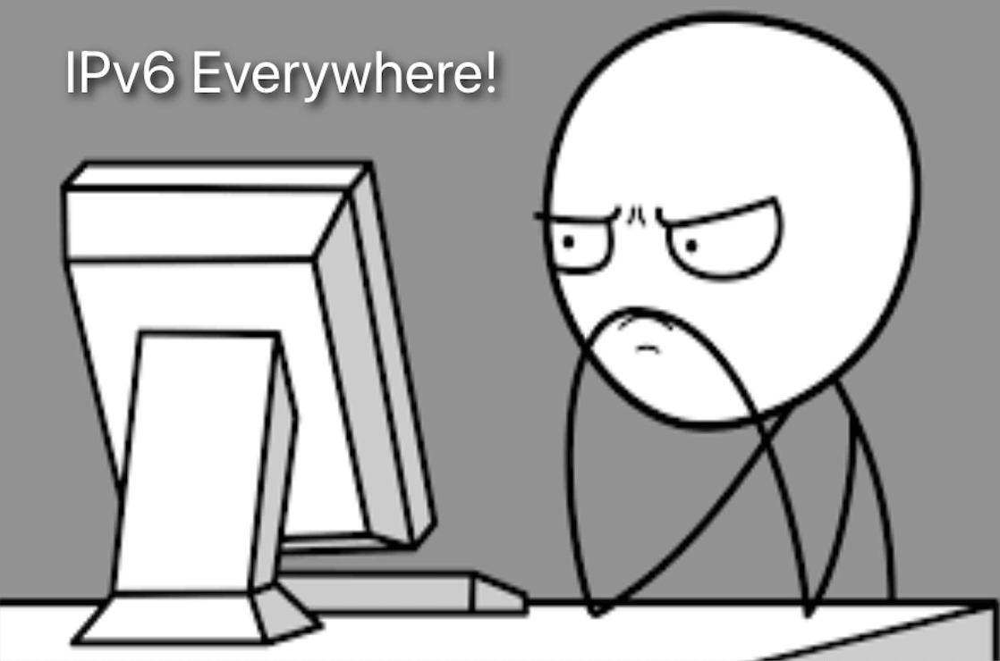

## Introduction

Welcome to the first post in the `dual-stack` deployments series! In **part 1** of the series will set the stage for everything to come. `Dual-stack` is when a machine can talk both [IPv4](https://datatracker.ietf.org/doc/html/rfc791) and [IPv6](https://datatracker.ietf.org/doc/html/rfc8200). **Part 1** aims to guide users through enabling and configuring [IPv6 Prefix](https://networklessons.com/ipv6/how-to-find-ipv6-prefix) allocation for virtual machines in a [Proxmox](https://www.proxmox.com/en/) environment, using [pfsense](https://www.pfsense.org/). The setup will be used later on for **Kubernetes Deployments**, [Service Mesh](https://cilium.io/use-cases/service-mesh/) and [Global Service Sharing](https://docs.cilium.io/en/latest/network/clustermesh/services/) powered by [Cilium](https://cilium.io/).


<!--truncate-->

## Lab Setup

```bash
+--------------------------+-----------+
|        Deployment        |  Version  |
+--------------------------+-----------+
|       Proxmox VE         |   8.2.4   |
|        pfSense           |   1.8.1   |
|        FRITZ!Box         |   N/A     |
+--------------------------+-----------+
```

## Prerequisites

- `Internet Provider` with available IPv6 Prefix
- `pfSense` as a virtual router within the Proxmox environment
- `FRITZ!Box` as a home router

## Motivation and Scenario

I remember in 2009, when I had to pass the Cisco CCNA exam, there was a small section about the basics, an introduction to IPv6. The configuration seemed complex with different Protocols for setting things up, subnetting and familiarisation almost from scratch in comparison to IPv4, many doubts about the deployment etc.. You guessed it already... I left IPv6 deployments for a later point. Fast forward 15 years, why do I even want to write something about `dual-stack` deployments? In the last couple of years, the [European Commission](https://ec.europa.eu/internet-standards/ipv6.html) has been encouraging the European member states to move forward with the adoption of IPv6 deployments and countries like the one I am based, set specific goals for gradual migration to IPv6 networks by a certain date.

Taking all the above as a starting point and while working in the Datacenter space, refreshing my IPv6 knowledge alongside testing advanced Kubernetes deployments on a `dual-stack` setup with `Cilium`, did the trick! The blog post is mainly about the need to enable `dual-stack` capabilities with the **least** effort. I know my Internet provider has an IPv6 Prefix ready for use, but to even start working with Kubernetes deployments, the virtual machines need to somehow talk and understand IPv6.

If you are still with me, let's dive in and start setting up the environment!

## FRITZ!Box - IPv6 Prefix Check

Login to the `FRITZ!Box Admin Portal` and check whether there is an available `IPv6 Prefix` for use. If this is the case, note the `Prefix` for future reference. In a **FRITZ!Box** router, the information is located under **Admin > Internet > Overview**.

In my case, I have two IPv6 information available. A `/64` Prefix is used for **external connections** only and a `/56` Prefix can be used for the home lab. The `/56` gives us 8 bits or 256 `/64` subnets.

:::note
Internet Providers offer to end customers **temporary** IPv6 Prefixes. The Prefix delegation is owned by the Internet Provider. That means the Prefixes could change at any time with no warning. 
:::

## pfSense

The official documentation is located [here](https://docs.netgate.com/pfsense/en/latest/services/dhcp/ipv6.html). However, I found it hard sometimes to understand what exactly needs to be configured to enable an Interface for IPv6. Follow the sub-sections below to enable `DHCPv6` services on pfSense.

### Interface Setup

After logging into **pfSense**, at the landing page at the bottom-left of the screen, we can already see the `WAN` interface (Interface connected to the FRITZ!Box router) has an `IPv4` and an `IPv6` address assigned. In this section, we will look at the `WAN Interface` configuration and later on set up a dedicated Interface to get **routable** IPv6 Prefix from the `FRITZ!Box`.

#### WAN Interface

1. Login to `pfSense`
1. Navigate to **Interfaces > WAN**
1. Check if the below options are set
    - **IPv6 Configuration Type**: `DHCP6`
    - **DHCPv6 Prefix Delegation Size**: `64`
1. Save the changes before proceeding (if any)

:::note
The mentioned settings are the defaults coming from the Internet Provider directly. I left them intact.
:::

#### LAN Interface

1. Login to `pfSense`
1. Navigate to **Interfaces > YOUR LAN NAME**
1. Set the below
    - **IPv6 Configuration Type**: `Track Interface`
    - **Track IPv6 Interface - IPv6 Interface**: `WAN`
    - **Track IPv6 Interface - IPv6 Prefix ID**: `0`
1. Save the changes before proceeding

:::note
As with the `WAN Interface`, we chose to use the full `/64` Prefix, as a result, the `IPv6 Prefix ID` for the **LAN Interface** will be set to `0`. If the `DHCPv6 Prefix Delegation Size` on the `WAN Interface` was a smaller number, for example, a `/63`, the displayed `IPv6 Prefix ID` was going to have a different value.
:::

### DHCPv6 Setup

As the `LAN Interface` was set to monitor the `WAN Interface`, we can proceed with the `DHCPv6` configuration.

1. Login to `pfSense`
1. Navigate to **Settings > DHCPv6**
1. On the **DHCPv6 Server** page, fill out the below details
    - **DHCPv6 Server**: **Check** `Enable DHCPv6 server on interface <YOUR LAN NAME>`
    - **Range**: Set your preferred value. I chose `::1000` to `::2000`
1. Save the configuration
1. Pivot to the **Router Advertisements** page and fill out the below details
    - **Router mode**: `Managed - RA Flags`
1. Save the configuration

## FRITZ!Box Setup

To allow the router to allocate IPv6 Prefixes to a defined LAN Interface, we have to enable this option in the `FRITZ!Box Admin Portal`.

1. Login to the `FRITZ!Box Admin Portal`
1. Naviagte to **Heimnetz > Netzwerk > Netzwerk Einstellungen > IPv6 > DHCPv6-Server im Heimnetz**
1. Enable the `DNS-Server, Praefix (IA_PD) und IPv6-Address(IA_NA) zuweisen`
1. Save the changes performed


## pfSense Validation

If everything works as expected, from the `pfSense` landing page, we will see an `IPv6 address` assigned to the configured `LAN` interface.

## Testing

For testing purposes, we have an `Ubuntu` server to check if the deployment works as expected and an IPv6 address got assigned to the virtual machine. Follow the steps described below.

1. Login to the `Ubuntu` Server via SSH
1. For the `netplan` configuration, we will update it slightly and allow the `ens19` network interface to receive an IPv4 and an IPv6 address
    ```bash
    $ vi /etc/netplan/00-installer-config.yaml
      network:
        ethernets:
          ens19:
            dhcp4: true
            dhcp6: true
            accept-ra: true
    ```
1. Save the netplan configuration
1. Apply the netplan configuration
    - ```$ netplan apply```
1. Perform `ip -6 address` and check if the defined interface has already an IPv6 address assigned. It might take a couple of seconds
1. Perform `ip -6 route` and check the routing table for IPv6 traffic

:::tip
Every network interface has a **link-local** IPv6 address assigned. Something like `fe80::`. However, the network interface needs a **Global** IPv6 address to communicate with the outside.
```bash
2: eth0: <BROADCAST,MULTICAST,UP,LOWER_UP> mtu 1500 qdisc pfifo_fast state UP group default qlen 1000
    link/ether bc:24:11:47:47:e1 brd ff:ff:ff:ff:ff:ff
    altname enp0s18
    altname ens18
    inet 10.10.xx.xxx/24 brd 10.10.20.255 scope global eth0
       valid_lft forever preferred_lft forever
    inet6 2001:xxx:xxxx:xxxx::111f/128 scope global dynamic 
       valid_lft 5045sec preferred_lft 2345sec
    inet6 fe80::be24:11ff:fe47:47e1/64 scope link 
       valid_lft forever preferred_lft forever
```
:::

If the above does work and the interface does not receive a **Global** IPv6 address, perform a `tcpdump` on the interface.

**tcpdump - Example**

```bash
$ tcpdump -i ens19 ip6
```

## Ping Test

Let's perform a **Ping** test for clarity.

```bash
$ ping6 github.com
ping6: github.com: Address family for hostname not supported
```


> Image Source: imgflip.com

Hehe, everything is fine! It is just that `github.com` does not have IPv6 support (**Joke Credit: Justus Mungard**)! For more information about the IPv6 `Wall of Shame` have a look [here](https://whynoipv6.com/).

## Conclusion

IPv6 Prefix allocation on Proxmox with Pfsense, check! ✅ Thanks for reading, and stay tuned for the upcoming posts!

## Resources

- [pfSense - DHCPv6 Server](https://docs.netgate.com/pfsense/en/latest/services/dhcp/ipv6.html)
- [FRITZ!Box - IPv6 Subnets Configuration](https://ch.avm.de/service/wissensdatenbank/dok/FRITZ-Box-7530/1239_IPv6-Subnetz-in-FRITZ-Box-einrichten/)
- [IPv6 Basics on pfSense](https://www.youtube.com/watch?v=u4aZJpZJFeI)
- [IPv6 from Scratch](https://www.youtube.com/watch?v=oItwDXraK1M)

## Next Steps

In the upcoming posts, we will go through enabling `dual-stack` on [RKE2](https://docs.rke2.io/) clusters alongside testing and validation of the deployment. For the last part of the series, we will introduce `Cilium service mesh` and IPv6 `Global services` sharing between clusters.

## ✉️ Contact

If you have any questions, feel free to get in touch! You can use the `Discussions` option found [here](https://github.com/egrosdou01/blog.grosdouli.dev/discussions) or reach out to me on any of the social media platforms provided. 😊 We look forward to hearing from you!
