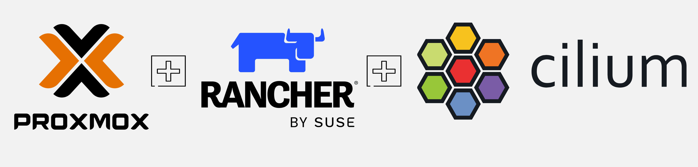

## Introduction

Welcome to **part 4** of the `dual-stack` series! In [parts 1](https://blog.grosdouli.dev/blog/proxmox-pfsense-FRITZ!Box-ipv6-prefix-allocation-setup), [2](https://blog.grosdouli.dev/blog/rke2-dual-stack-cilium-proxmox), and [3](https://blog.grosdouli.dev/blog/rke2-dual-stack-cluster-mesh-cilium-proxmox), we walked through how to set up `dual-stack` networking on a Proxmox server using our Internet Provider. We also showed you how to deploy RKE2 Kubernetes clusters and share both IPv4 and IPv6 services across them. Now, in the **final part** of the series, we are diving into some of the most commonly used features of [Cilium](https://docs.cilium.io/en/stable/index.html) for a home lab setup! Let’s get started!



<!--truncate-->

:::warning
While testing with RKE2 v1.31.9+rke2r1 and Cilium v1.17.3, I realised changes were performed to the way **L2Annoucements** and **Gateway API** work. First off, I had to include the below argument in the Cilium Helm chart values. **The Helm chart was updated after the initial installation of the cluster**. The change will create the `Cilium GatewayClass` in the cluster.

```yaml
gatewayAPI:
  enabled: true
  gatewayClass:
    create: "true"
```

**Optional**

I had to deploy the experimental CRD `TLSRoute`. This is required only if you utilise `TLSRoutes` within the `Gateway` definition.

```bash
$ kubectl apply -f https://raw.githubusercontent.com/kubernetes-sigs/gateway-api/v1.2.0/config/crd/experimental/gateway.networking.k8s.io_tlsroutes.yaml
```

If you still face issues, check out the `cilium-operator` logs.

```bash
$ kubectl logs -n kube-system deployments/cilium-operator | grep gateway
```
:::

:::note
To use the **latest** Cilium features, I decided to update the RKE2 cluster to version `v1.29.15+rke2r1` and Cilium version `v1.17.1`.

To upgrade RKE2 clusters, take a look [here](https://docs.rke2.io/upgrades/manual_upgrade).
:::

## Lab Setup

### Infrastructure

```bash
+----------------------------+-------------------------+
|        Deployment           |         Version         |
+----------------------------+-------------------------+
|        Proxmox VE           |          8.2.4          |
|        RKE2                 |      v1.29.15+rke2r1    |
|        Cilium               |          1.17.1         |
+----------------------------+-------------------------+
```

## GitHub Resources

The showcase repository is available [here](https://github.com/egrosdou01/blog-post-resources/tree/main/cilium-complementary-features/resources).

## Prerequisites

Go through **parts 1** and **2** of the series and ensure any prerequisites are met. If the preparation is taken care of, two `dual-stack` RKE2 clusters powered with `Cilium` will be ready.

## Scenario

As mentioned, we would like to enhance the existing setup done in previous posts and introduce additional powerful [Cilium](https://docs.cilium.io/en/stable/index.html) features! What does that even mean? Was Cilium not good enough as both a CNI and a service mesh?

You guessed it right, there is more! I would like to use the [Cilium Gateway API](https://docs.cilium.io/en/v1.17/network/servicemesh/gateway-api/gateway-api/#gs-gateway-api) instead of the RKE2 Nginx Ingress Controller, as it gives me way more options around filtering on L7, routing and security. Next, I would like to use the [Cilium LB IPAM](https://docs.cilium.io/en/v1.17/network/lb-ipam/#lb-ipam) feature (enabled by default) to assign IP addresses to LoadBalancer services and ultimately, [advertise](https://docs.cilium.io/en/v1.17/network/l2-announcements/#l2-announcements) IPv4 and IPv6 IPs over my local network without the need for a BGP (Border Gateway Protocol) capable machine.

Ready to continue? Let's head into it.


[Source](https://faun.pub/top-20-kubernetes-memes-b5cb4c5af395)

## Enable Features

We would update the existing Cilium configuration to include **L2 Announcements** and **Gateway API** support. The update is super easy, as we need to update the existing Cilium Helm chart and include the additional details. I prefer to first extract the current Cilium config values into a file, include the new ones and afterwards perform a Helm chart upgrade. The upgrade approach of a Helm chart is completely up to you! 😊

### Cilium Configuration - L2 Announcements and Gateway API

Locate and update the Cilium Helm chart.

1. Get a copy of the `kubeconfig`
1. ```export KUBECONFIG=<directory of the kubeconfig>```
1. ```helm list -n kube-system```
1. ```helm get values rke2-cilium -n kube-system -o yaml > values_cluster01.yaml```

Open, update, and save the `values_cluster01.yaml` file with the details below.

```yaml showLineNumbers
externalIPs:
  enabled: true
gatewayAPI:
  enabled: true
k8sClientRateLimit:
  burst: 40 # Important value when many services run on a Kubernetes cluster. Check out the documentation https://docs.cilium.io/en/v1.17/network/l2-announcements/#sizing-client-rate-limit
  qps: 20 # Important value when many services run on a Kubernetes cluster. Check out the documentation https://docs.cilium.io/en/v1.17/network/l2-announcements/#sizing-client-rate-limit
kubeProxyReplacement: true
l2announcements:
  enabled: true
```

The final step is to reapply the Helm Chart with the changes performed.

```bash
$ helm upgrade rke2-cilium rke2-charts/rke2-cilium --version 1.17.100 --namespace kube-system -f values_cluster01.yaml
```

### Gateway API Specific

Apart from the Gateway API pre-requisites found [here](https://docs.cilium.io/en/v1.17/network/servicemesh/gateway-api/gateway-api/#gs-gateway-api), we need to apply the CRDs (Custom  Resource Definition) to the Kubernetes cluster. To apply the CRDs, use the commands below.

```bash
$ kubectl apply -f https://raw.githubusercontent.com/kubernetes-sigs/gateway-api/v1.2.0/config/crd/standard/gateway.networking.k8s.io_gatewayclasses.yaml
$ kubectl apply -f https://raw.githubusercontent.com/kubernetes-sigs/gateway-api/v1.2.0/config/crd/standard/gateway.networking.k8s.io_gateways.yaml
$ kubectl apply -f https://raw.githubusercontent.com/kubernetes-sigs/gateway-api/v1.2.0/config/crd/standard/gateway.networking.k8s.io_httproutes.yaml
$ kubectl apply -f https://raw.githubusercontent.com/kubernetes-sigs/gateway-api/v1.2.0/config/crd/standard/gateway.networking.k8s.io_referencegrants.yaml
$ kubectl apply -f https://raw.githubusercontent.com/kubernetes-sigs/gateway-api/v1.2.0/config/crd/standard/gateway.networking.k8s.io_grpcroutes.yaml
```

### Validation

There might be a need to restart the Cilium `daemonset` to enable the newly added features.

```bash
$ kubectl rollout restart ds/cilium -n kube-system
```

```bash
$ kubectl get crd | grep -E "gateway|http"
$ kubectl exec -it ds/cilium -n kube-system -- cilium status --verbose | grep -i "l2-announcer"
```

## Enable IPv4 and IPv6 Pools

As the **LB IPAM** capabilities are enabled by **default**, there is no prerequisite to create IPv4 and IPv6 `CiliumLoadBalancerIPPool` resources. For this demonstration, I decided to create two separate pools, one for IPv4 and one for IPv6 services. The first pool will be used to expose [ArgoCD](https://argo-cd.readthedocs.io/en/stable/) using the Gateway API, while the second pool will be used for an [Nginx](https://nginx.org/) application.

:::tip
For advanced use cases, we can use `serviceSelectors` and `matchLabels` during the pool definition and specify which pool can be assigned to which service. To assign multiple IPs to a single service, use the `lbipam.cilium.io/ips` **annotation**. For more information, check out the [official documentation](https://docs.cilium.io/en/v1.17/network/lb-ipam/#requesting-ips).
:::

### IPv4 Pool

```yaml showLineNumbers
---
apiVersion: "cilium.io/v2alpha1"
kind: CiliumLoadBalancerIPPool
metadata:
  name: "ipv4-pool"
spec:
  blocks:
  - start: "10.10.20.10"
    stop: "10.10.20.20"
```

```bash
$ kubectl apply -f ipv4_pool.yaml
$ kubectl get ippools
NAME        DISABLED   CONFLICTING   IPS AVAILABLE          AGE
ipv4-pool   false      False         9                      7d3h
```

### IPv6 Pool

```yaml showLineNumbers
---
apiVersion: "cilium.io/v2alpha1"
kind: CiliumLoadBalancerIPPool
metadata:
  name: "ipv6-pool"
spec:
  blocks:
  - cidr: "2004::0/64"
```

```bash
$ kubectl apply -f ipv6_pool.yaml
$ kubectl get ippools
NAME        DISABLED   CONFLICTING   IPS AVAILABLE          AGE
ipv6-pool   false      False         18446744073709551614   7d
```

### CiliumL2AnnouncementPolicy

To announce the IPs to the local network, we would need to create a `CiliumL2AnnouncementPolicy` resource. The IPs will be announced from the network interface of a node with the name `eth0`. If the interface name in your setup is different, modify the file as needed.

```yaml showLineNumbers
---
apiVersion: cilium.io/v2alpha1
kind: CiliumL2AnnouncementPolicy
metadata:
  name: l2-announcement-policy
  namespace: kube-system
spec:
  interfaces:
    - eth0
  externalIPs: true
  loadBalancerIPs: true
```

```bash
$ kubectl apply -f l2_announ.yaml
$ kubectl get CiliumL2AnnouncementPolicy 
NAME                     AGE
l2-announcement-policy   7d
```

:::note
For this setup, we have an interest in `LoadBalancer` IPs and not so much in the `externalIPs`. However, both options are enabled.
:::

## Test L2 Annoucements

### IPv4

Let's deploy an Nginx application and expose it via a `LoadBalancer` service. Simply apply the `yaml` below.

```yaml showLineNumbers
---
apiVersion: v1
kind: ConfigMap
metadata:
  name: html-message
data:
  index.html: |
    <!DOCTYPE html>
    <html>
    <head>
        <title>Welcome</title>
    </head>
    <body>
        <h1>Hello from IPv4!</h1>
    </body>
    </html>
---
apiVersion: apps/v1
kind: Deployment
metadata:
  name: nginx-ipv4
spec:
  replicas: 2
  selector:
    matchLabels:
      app: nginx-ipv4
  template:
    metadata:
      labels:
        app: nginx-ipv4
    spec:
      containers:
      - name: nginx-ipv4
        image: nginx:latest
        ports:
        - containerPort: 80
        volumeMounts:
        - name: html-volume
          mountPath: /usr/share/nginx/html/index.html
          subPath: index.html
      volumes:
      - name: html-volume
        configMap:
          name: html-message
---
apiVersion: v1
kind: Service
metadata:
  name: nginx-service-ipv4
spec:
  type: LoadBalancer
  selector:
    app: nginx-ipv4
  ports:
    - port: 80
      targetPort: 80
```

**Validation**

```bash
$ kubectl get pods,svc | grep -i nginx
pod/nginx-ipv4-54b647476f-jczlq   1/1     Running   0              111s
pod/nginx-ipv4-54b647476f-mkmsb   1/1     Running   0              111s
service/nginx-service   LoadBalancer   10.45.48.226    10.10.20.12   80:32112/TCP   2m20s
```

From another device in the same local network, try and CURL the Nginx `LoadBalancer` service.

```bash
$ ip ad | grep -i ens20
4: ens20: <BROADCAST,MULTICAST,UP,LOWER_UP> mtu 1500 qdisc fq_codel state UP group default qlen 1000
    inet 10.10.20.101/24 brd 10.10.20.255 scope global dynamic noprefixroute ens20

$ curl http://10.10.20.12
<!DOCTYPE html>
<html>
<head>
    <title>Welcome</title>
</head>
<body>
    <h1>Hello from IPv4!</h1>
</body>
</html>
```

### IPv6

Use the `yaml` above, update the names to something else and ensure the `service` gets an `IPv6` `LoadBalancer` address from the pool.

```yaml showLineNumbers
---
apiVersion: v1
kind: Service
metadata:
  name: nginx-service
spec:
  type: LoadBalancer
  selector:
    app: nginx
// highlight-start
  ipFamilies:
  - IPv6
  ipFamilyPolicy: SingleStack
// highlight-end
  ports:
    - port: 80
      targetPort: 80
```

**Validation**

```bash
$ kubectl get pods,svc | grep -i nginx
pod/nginx-deployment-6b4bdcdb4c-l42v9   1/1     Running   3 (110m ago)   6d5h
pod/nginx-deployment-6b4bdcdb4c-z4v47   1/1     Running   3 (110m ago)   6d5h
service/nginx-service   LoadBalancer   2001:face:43::ce0e   2004::1       80:31389/TCP   6d5h
```

To access the service from another device on the local network, we need to add an IPv6 route for the `2004::/64` subnet. This route should point to the IPv6 Gateway. Effectively, we are telling the device how to reach the destination by defining the path. Once the route is set up correctly, we will be able CURL the Nginx `LoadBalancer` service.

```bash
$ ip -6 route add 2004::/64 via 2001:9e8:xxxx:xxxx:: dev ens20 # 2001:9e8:xxxx:xxxx:: is the IPv6 Gateway
$ ip -6 route show | grep -i 2004
2004::/64 via 2001:9e8:xxxx:xxxx:: dev ens20 metric 1024 pref medium

$ curl http://[2004::1]
<!DOCTYPE html>
<html>
<head>
    <title>Welcome</title>
</head>
<body>
    <h1>Hello from IPv6!</h1>
</body>
</html>
```

:::note
For L2 Announcements to work, we need to target machines that can answer ARP and NDP requests for specific service IPs. You can use [Hubble](https://docs.cilium.io/en/stable/overview/intro/) or [Wireshark](https://www.wireshark.org/) to capture traffic for a specific protocol.
:::

## Cilium, Gateway API and ArgoCD

The deployment outlines how the `LB IPAM` setup alongside the `Cilium Gateway API` work for the ArgoCD installation.

### Install ArgoCD

```bash
$ kubectl create namespace argocd
$ kubectl apply -n argocd -f https://raw.githubusercontent.com/argoproj/argo-cd/stable/manifests/install.yaml
```

### ArgoCD TLS Secret

Use Openssl or a utility of your preference to create a valid TLS certificate for the ArgoCD deployment. Once done, create a Kubernetes TLS Secret.

```bash
$ kubectl create secret tls argocd-server-tls -n argocd --key=argocd-key.pem --cert=argocd.example.com.pem
```

### Gateway Resource

```yaml showLineNumbers
---
apiVersion: gateway.networking.k8s.io/v1
kind: Gateway
metadata:
  name: argocd
  namespace: argocd
spec:
  gatewayClassName: cilium
  listeners:
  - hostname: argocd.example.com
    name: argocd-example-com-http
    port: 80
    protocol: HTTP
  - hostname: argocd.example.com
    name: argocd-example-com-https
    port: 443
    protocol: HTTPS
    tls:
      certificateRefs:
      - kind: Secret
        name: argocd-server-tls
```

### HTTPRoute Resource

```yaml showLineNumbers
---
apiVersion: gateway.networking.k8s.io/v1
kind: HTTPRoute
metadata:
  creationTimestamp: null
  name: argocd
  namespace: argocd
spec:
  hostnames:
  - argocd.example.com
  parentRefs:
  - name: argocd
  rules:
  - backendRefs:
    - name: argocd-server
      port: 80
    matches:
    - path:
        type: PathPrefix
        value: /
status:
  parents: []
```

### Validation

```bash
$ kubectl get gateway,httproute -n argocd
NAME                                       CLASS    ADDRESS       PROGRAMMED   AGE
gateway.gateway.networking.k8s.io/argocd   cilium   10.10.20.11   True         7d2h

NAME                                         HOSTNAMES                AGE
httproute.gateway.networking.k8s.io/argocd   ["argocd.example.com"]   7d2h
```

Now that the resources are deployed, we can access the ArgoCD deployment from the hostname `argocd.example.com`. To test the setup, SSH to another machine in your local network, create a new entry in the `/etc/hosts` file and map the domain to the IP address `10.10.20.11`. You are ready to CURL!

```bash
$ curl -ki https://argocd.example.com
HTTP/1.1 200 OK
accept-ranges: bytes
content-length: 788
content-security-policy: frame-ancestors 'self';
content-type: text/html; charset=utf-8
vary: Accept-Encoding
x-frame-options: sameorigin
x-xss-protection: 1
date: Mon, 12 May 2025 11:02:14 GMT
x-envoy-upstream-service-time: 0
server: envoy

<!doctype html><html lang="en"><head><meta charset="UTF-8"><title>Argo CD</title><base href="/"><meta name="viewport" content="width=device-width,initial-scale=1"><link rel="icon" type="image/png" href="assets/favicon/favicon-32x32.png" sizes="32x32"/><link rel="icon" type="image/png" href="assets/favicon/favicon-16x16.png" sizes="16x16"/><link href="assets/fonts.css" rel="stylesheet"><script defer="defer" src="main.67d3d35d60308e91d5f4.js"></script></head><body><noscript><p>Your browser does not support JavaScript. Please enable JavaScript to view the site. Alternatively, Argo CD can be used with the <a href="https://argoproj.github.io/argo-cd/cli_installation/">Argo CD CLI</a>.</p></noscript><div id="app"></div></body><script defer="defer" src="extensions.js"></script></html>
```

:::note
If a 307 Temporary Redirect HTTP Status code is returned, modify the `argocd-cmd-params-cm` ConfigMap in the `argocd` namespace and define the `server.insecure: “true”` below the `data` field. For more information, have a look [here](https://argo-cd.readthedocs.io/en/stable/operator-manual/server-commands/additional-configuration-method/).
:::

## Conclusion

In today's posts we covered some of the most commonly used Cilium features suitable for a home lab setup! For advanced use cases, I would encourage you to have a look at the Cilium official documentation!

## Resources

- [Layer 2 Annoucements with Cilium](https://www.youtube.com/watch?v=SmAKlK37KeU)
- [Layer 2 Annoucements GitHub Issue](https://github.com/cilium/cilium/issues/28985)
- [Cilium LoadBalancer IPAM and L2 Service Announcement](https://isovalent.com/labs/cilium-lb-ipam-l2-announcements/)
- [Cilium Gateway API Lab](https://isovalent.com/labs/cilium-gateway-api/)

## ✉️ Contact

If you have any questions, feel free to get in touch! You can use the `Discussions` option found [here](https://github.com/egrosdou01/blog.grosdouli.dev/discussions) or reach out to me on any of the social media platforms provided. 😊 We look forward to hearing from you!
