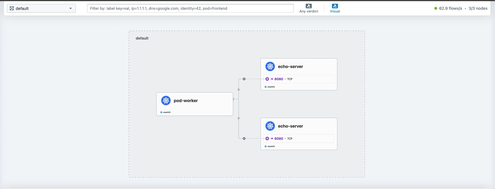

## Introduction

Welcome to **part 3** of the `dual-stack` series! In [part 1](proxmox-pfsense-fritzbox-ipv6-prefix-allocation-setup.md) and [part 2](proxmox-pfsense-rke2-dual-stack-cilium.md), we discovered how to enable `dual-stack` on a Proxmox server using our Internet provider and deploy RKE2 clusters. In today's post, we continue our journey and enable a `Cilium Cluster Mesh` between two RKE2 clusters. The goal is to share `IPv4` and `IPv6` services between the different clusters effortlessly. Let’s dive in!


<!--truncate-->
[Source](https://imgflip.com)

## Lab Setup

### Infrastructure

```bash
+----------------------------+-------------------------+
|        Deployment           |         Version         |
+----------------------------+-------------------------+
|        Proxmox VE           |          8.2.4          |
|        RKE2                 |      v1.29.12+rke2r1    |
|        Cilium               |          1.16.4         |
+----------------------------+-------------------------+
```

### RKE2 Clusters - Network Setup

```bash
+--------------------------+-----------------------------------------------+-----------------------------------------------+
|        Cluster Name       |                Cluster CIDR                   |                Service CIDR                  |
+--------------------------+-----------------------------------------------+-----------------------------------------------+
|       cluster01           | 10.42.0.0/16,2001:face:42::/56                 | 10.43.0.0/16,2001:face:43::/112              |
|       cluster02           | 10.44.0.0/16,2001:cafe:42::/56                 | 10.45.0.0/16,2001:cafe:43::/112              |
+--------------------------+-----------------------------------------------+-----------------------------------------------+
```

## Prerequisites

Go through **part 1** and **part 2** of the series and ensure any prerequisites are met. If the preparation is taken care of, two `dual-stack` RKE2 clusters powered by `Cilium` will be ready.

## What is a Cluster Mesh?

A `Cluster Mesh` can connect internal Kubernetes resources between two or more clusters. Unless a Kubernetes resource is exposed as a `NodePort` or a `LoadBalancer` resource, it will not be accessible from the outside. However, sharing resources between different clusters can be risky, thus the concept of a Cluster Mesh was developed allows operator to share resources in a secure manner.

## Why Cluster Mesh?

In hybrid multi-cloud setups, we need to seamlessly connect multiple Kubernetes clusters, and share resources between them. Network connectivity issues should be hidden from the end-user or operators. This way, they can easily achieve fault isolation, scalability, and geographical distribution. [Cilium Cluster Mesh](https://docs.cilium.io/en/stable/network/clustermesh/clustermesh/#clustermesh) made the setup and deployment easy. A Cluster Mesh was easily created between multiple clusters, regardless of the Kubernetes distribution being used.

:::note
At this point, it is important to highlight that the **Cluster Mesh Requirements** must met before proceeding to the next steps.
:::

### cluster01 Cluster Mesh Configuration

The Cilium installation in an RKE2 setup is expressed as a Helm chart. To check the Helm chart installed, perform the steps below.

1. Get a copy of the `kubeconfig`
1. ```$ export KUBECONFIG=<directory of the kubeconfig>```
1. ```$ helm list -n kube-system```

The output of the command above should look like the one below.

```bash
NAME                            	NAMESPACE  	REVISION	UPDATED                                	STATUS  CHART                                   	APP VERSION
rke2-cilium                     	kube-system	1       	2025-01-29 16:33:43.779224401 +0100 CET	deployedrke2-cilium-1.16.400                    	1.16.4     
rke2-coredns                    	kube-system	1       	2025-01-25 20:29:10.096501804 +0000 UTC	deployedrke2-coredns-1.36.102                   	1.11.3     
rke2-ingress-nginx              	kube-system	1       	2025-01-25 20:30:17.033314447 +0000 UTC	deployedrke2-ingress-nginx-4.10.503             	1.10.5     
...
```

To form a Cluster Mesh, first, extract the current Cilium Helm chart values. Then, update the values file and include the Cluster Mesh configuration.

```bash
$ helm get values rke2-cilium -n kube-system -o yaml > values_cluster01.yaml
```

Open, update and save the `values_cluster01.yaml` file with the details below.

```yaml showLineNumbers
tls:
  ca:
    cert: "YOUR BASE64 CERT"
    key: "YOUR BASE64 KEY"
cluster:
  name: cluster01
  id: 1
clustermesh:
  apiserver:
    replicas: 2
    service:
      type: NodePort # Set the Clustermesh API service to be of type NodePort. Not recommended for production environments
      nodePort: 32379 # Define the listening port of the Clustermesh API service
    tls:
      authMode: cluster
      server:
        extraDnsNames:
          - "cluster01.mesh.cilium.io" # Define the dns for the Cilium mesh formation
  config:
    clusters:
    - address: ""
      ips:
      - 10.10.20.113 # The Node IP of the cluster02 cluster
      name: cluster02
      port: 32380 # The NodePort defined on cluster02 for the Clustermesh API service
    enabled: true
    domain: "mesh.cilium.io" # Define the default domain for the mesh
  useAPIServer: true # This is required for the Cluster Mesh setup
```

The final step is to re-apply the Helm chart with the changes. That will enable the `clustermesh-apiserver` to form TLS connections between the clusters.

```bash
$ helm upgrade rke2-cilium rke2-charts/rke2-cilium --version 1.16.400 --namespace kube-system -f values_cluster01.yaml
```

:::tip
As this is a Lab setup, I am more than happy to connect the cluster via a `NodePort` service. But, for **production** environments, it is recommended to use a `LoadBalancer` service because if the configured node is gone, the mesh will be unformed.
:::

### cluster02 Cluster Mesh Configuration

We take the same approach for `cluster02`. The only difference is the values for the Cluster Mesh.

```yaml showLineNumbers
tls:
  ca:
    cert: "YOUR BASE64 CERT"
    key: "YOUR BASE64 KEY"
cluster:
  name: cluster02
  id: 2
clustermesh:
  apiserver:
    replicas: 2
    service:
      type: NodePort # Set the Clustermesh API service to be of type NodePort. Not recommended for production environments
      nodePort: 32380 # Define the listening port of the Clustermesh API service
    tls:
      authMode: cluster
      server:
        extraDnsNames:
          - "cluster02.mesh.cilium.io" # Define the dns for the Cilium mesh formation
  config:
    clusters:
    - address: ""
      ips:
      - 10.10.20.132 # The Node IP of the cluster01 cluster
      name: cluster01
      port: 32379 # The NodePort defined on cluster01 for the Clustermesh API service
    enabled: true
    domain: "mesh.cilium.io" # Define the default domain for the mesh
  useAPIServer: true # This is required for the Cluster Mesh setup
```

### Validation

The process might take a few seconds till the mesh is formed. Patience is a virtue ⏳!

```bash
$ kubectl exec -it ds/cilium -n kube-system -- cilium status verbose | grep -i mesh
Defaulted container "cilium-agent" out of: cilium-agent, install-portmap-cni-plugin (init), config (init), mount-cgroup (init), apply-sysctl-overwrites (init), mount-bpf-fs (init), clean-cilium-state (init), install-cni-binaries (init)
ClusterMesh:                    1/1 remote clusters ready, 0 global-service
  cluster02/master03 (localhost)   10.10.20.132,2001:xxx:xxxx:xxxx::1539   reachable   reachable
  cluster01/master02               10.10.20.113,2001:xxx:xxxx:xxxx::123a   reachable   reachable
  cluster02/worker03               10.10.20.141,2001:xxx:xxxx:xxxx::1fb3   reachable   reachable
```

On both sides, we should see a similar view. The `ClusterMesh` status is in a `Ready` state.

:::tip
If the Cluster Mesh is not formed, first try and restart the Cilium `daemonset`.

```$ kubectl rollout restart ds/cilium -n kube-system```

If the mesh is still not formed, check out the status of the Cilium agent.

```$ kubectl exec -it ds/cilium -n kube-system -- cilium status verbose```

```$ kubectl exec -it ds/cilium -n kube-system -- cilium-health status```

Additionally, check the status of the `clustermesh`

```$ kubectl exec -it ds/cilium -n kube-system -- cilium-dbg troubleshoot clustermesh```
:::

## Deploy Test Application

The moment of truth! We will deploy a dummy application and expose services via `IPv4` and `IPv6`. The same application will be deployed on both clusters.

```bash
$ kubectl create deploy echo-server --image=inanimate/echo-server
```

### Service Dual-Stack

```yaml showLineNumbers
cat echo_ipv6.yaml
apiVersion: v1
kind: Service
metadata:
// highlight-start
  annotations:
    service.cilium.io/global: "true"
// highlight-end
  labels:
    app: echo-server
  name: echo-dual
  namespace: default
spec:
// highlight-start
  ipFamilies:
  - IPv4
  - IPv6
  ipFamilyPolicy: PreferDualStack
// highlight-end
  ports:
  - port: 8080
    protocol: TCP
    targetPort: 8080
  selector:
    app: echo-server
  sessionAffinity: None
  type: ClusterIP
```

```bash
$ kubectl apply -f echo_dual.yaml
```

:::tip
Do not forget to include the annotation ```service.cilium.io/global: "true"``` to the service.
:::

### Service IPv6 Only

```yaml
apiVersion: v1
kind: Service
metadata:
// highlight-start
  annotations:
    service.cilium.io/global: "true"
// highlight-end
  labels:
    app: echo-server
  name: echo-ipv6
  namespace: default
spec:
// highlight-start
  ipFamilies:
  - IPv6
  ipFamilyPolicy: SingleStack
// highlight-end
  ports:
  - port: 8080
    protocol: TCP
    targetPort: 8080
  selector:
    app: echo-server
  sessionAffinity: None
  type: ClusterIP
```

```bash
$ kubectl apply -f echo_ipv6.yaml
```

:::tip
Do not forget to include the annotation ```service.cilium.io/global: "true"``` to the service.
:::

### Network Tests

Create a test pod using the `netshoot` image and perform `CURL` requests to either the service `echo-ipv6` or `echo-dual`. Reaching the services by their name, the system will resolve them as an `IPv4` or an `IPv6` address in any of the deployed clusters.

#### Both

```bash
$ kubectl exec -it pod-worker -- curl http://echo-ipv6:8080
$ kubectl exec -it pod-worker -- curl http://echo-dual:8080
```

#### IPv4

```bash
$ kubectl exec -it pod-worker -- curl http://echo-dual:8080
$ kubectl exec -it pod-worker -- curl --interface eth0 -4 'http://echo-dual.default.svc:8080'
```

#### IPv6

```bash
$ kubectl exec -it pod-worker -- curl http://echo-dual:8080
$ kubectl exec -it pod-worker -- curl --interface eth0 -6 'http://echo-dual.default.svc:8080'
```

## Hubble Network Observability

### Hubble UI

In **part 2**, we enabled [Hubble](https://github.com/cilium/hubble) for network, service and security observability. Let's use the Hubble UI and check that the services answer from different clusters. You can access the Hubble UI using `port-forward` or with a `NodePort`, `LoadBalancer` IP address. Make your choice.

As the application is deployed in the `default` namespace, from the Hubble UI, choose the `default` namespace from the top left drop-down box and check the traffic flow while performing different `CURL` requests to a test service. You should see something similar and observe `IPv4` and `IPv6` service sharing between clusters within a mesh.




:::note
The names are mismatched in the Hubble UI screenshots: `mesh02` corresponds to the `cluster02` configuration, and `mesh03` corresponds to the `cluster01` configuration.
:::

### Cilium DaemonSet - Hubble Interaction

The same results are visible if we `exec` to the Cilium `daemonset`.

```bash
$ kubectl exec -it ds/cilium -n kube-system -- hubble observe --ipv6 --from-pod pod-worker

$ kubectl exec -it ds/cilium -n kube-system -- hubble observe --ipv4 --from-pod pod-worker
```

:::note
Check out the [Cilium Hubble Cheatsheet](https://isovalent.com/blog/post/cilium-hubble-cheat-sheet-observability/) for more advanced commands.
:::

## Conclusion

Cluster Mesh setup and Global Service Sharing (IPv4 and IPV6) between clusters, check! ✅ In the upcoming and final part of the series, we will explore complementary features of a [Cilium Service Mesh](http://docs.cilium.io/en/latest/network/servicemesh/index.html) approach.

## Resources

- [Cilium Cluster Mesh](https://docs.cilium.io/en/stable/network/clustermesh/clustermesh/)
- [Cilium Cluster Mesh - Tshoot](https://docs.cilium.io/en/stable/operations/troubleshooting/#troubleshooting-clustermesh)
- [Kubernetes IPv6](https://kubernetes.io/docs/concepts/services-networking/dual-stack/)

## ✉️ Contact

If you have any questions, feel free to get in touch! You can use the `Discussions` option found [here](https://github.com/egrosdou01/blog.grosdouli.dev/discussions) or reach out to me on any of the social media platforms provided. 😊 We look forward to hearing from you!
