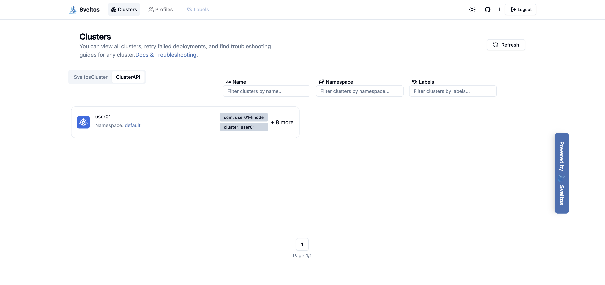
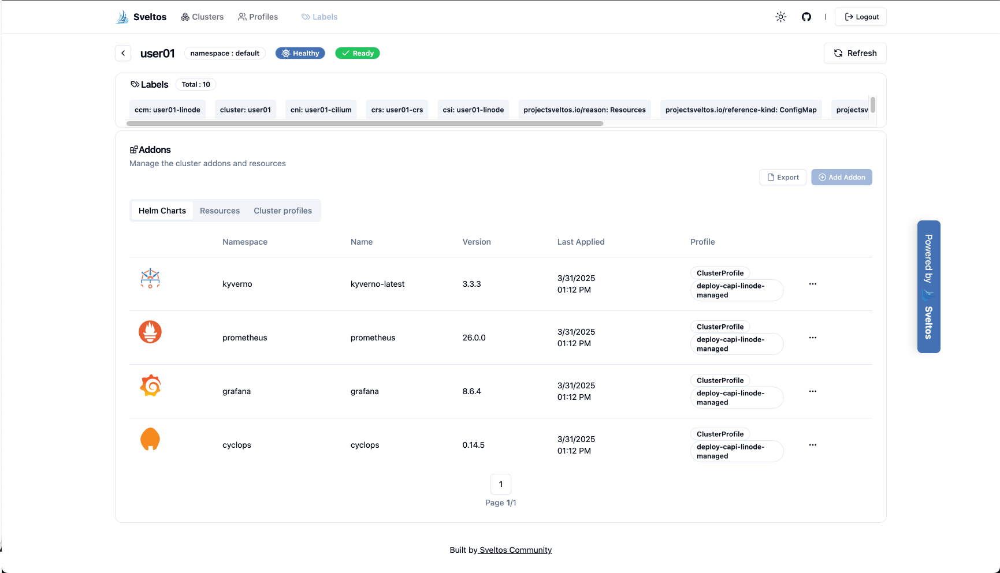
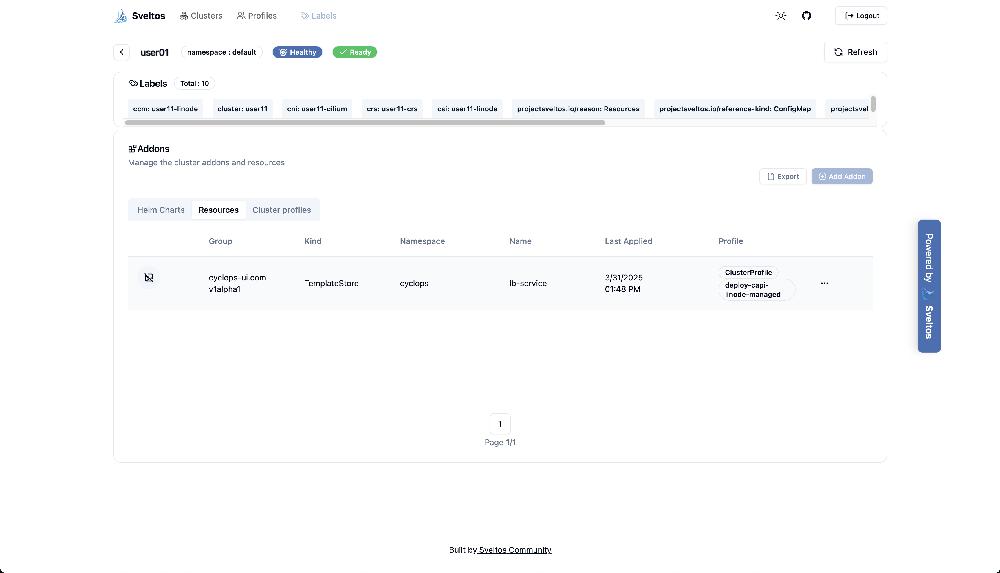
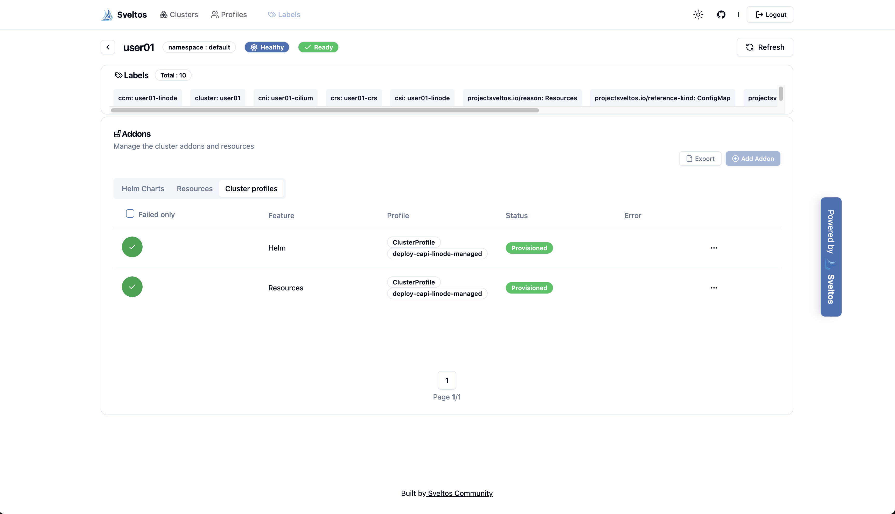
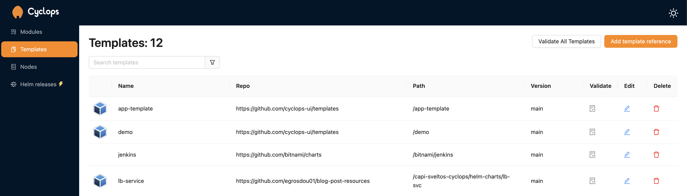
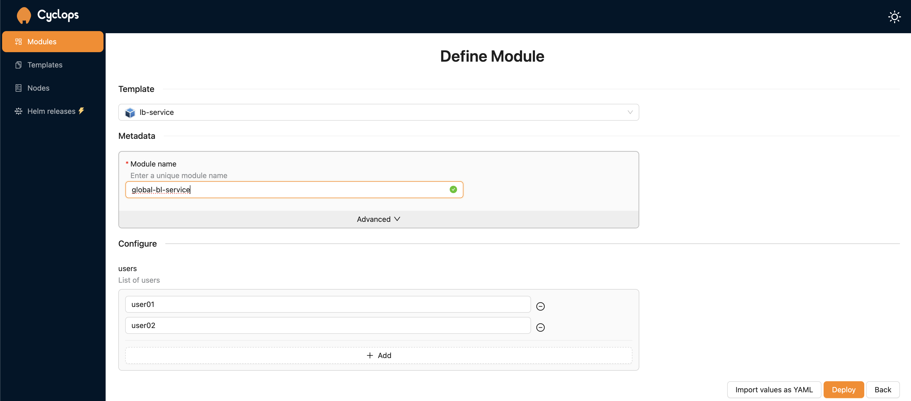
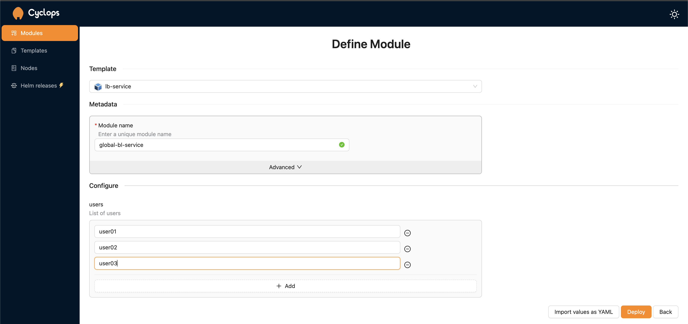
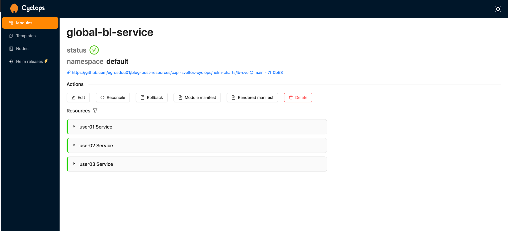

## Introduction

Are you ready to simplify how your Platform team spins up and down development environments while improving [DevX](https://swimm.io/learn/developer-experience/what-is-developer-experience-devx-pillars-and-best-practices)? In this post, we demonstrate how [CAPI](https://cluster-api.sigs.k8s.io/), [Sveltos](https://github.com/projectsveltos), and [Cyclops](https://cyclops-ui.com/) work together to automatically create Kubernetes environments while allowing developers to interact and manage their applications in a user-friendly environment. It is not magic, it is the power of Sveltos combined with the right tooling!
<!--truncate-->

For the demo, I kept the costs to the minimum using [Civo Cloud](https://www.civo.com/) for the management cluster and [Akamai/Linode](https://www.linode.com/) for the CAPI deployments. [Cilium](https://docs.cilium.io/en/stable/index.html) is the preferred CNI for this setup.


## Lab Setup

```bash
+-----------------+-------------------------+--------------------------+
|   Cluster Name  |          Type           |         Version          |
+-----------------+-------------------------+--------------------------+
|      mgmt       |   Civo Medium Standard  |      1.30.5-k3s1         |
+-----------------+-------------------------+--------------------------+

+-----------------+-------------------------+
|    Deployment   |         Version         |
+-----------------+-------------------------+
|   clusterctl    |          v1.9.6         |
|    Sveltos      |          v0.51.1        |
|    Cilium       |          v1.16.4        |
+-----------------+-------------------------+
```

## GitHub Resources

The showcase repository is available [here](https://github.com/egrosdou01/blog-post-resources/tree/main/opentofu-talos-cilium-proxmox-module).

## Prerequisites

1. A Kubernetes management cluster
1. Akamai/Linode Cloud account
1. [Helm](https://helm.sh/docs/intro/install/) installed
1. [kubectl](https://kubernetes.io/docs/tasks/tools/) installed
1. [clusterctl](https://cluster-api.sigs.k8s.io/user/quick-start.html) installed

## Scenario

The idea is to demonstrate how Sveltos automates the deployment of different environments using blueprint configurations with the required global add-ons and applications while allowing users and developers to work in an intuitive UI to easily adjust the number of replicas, configure rolling updates, and monitor deployment progress. We combine the power of CAPI and Sveltos to look out for updates within a `ConfigMap` and once a change is detected, Sveltos spins up or down CAPI clusters on the Akamai/Linode cloud. When the CAPI cluster is ready, Sveltos deploys the required global configuration using a `ClusterProfile` like `Kyverno`, `Grafana Prometheus`, and `Cyclops`. The idea is to provide DevOps engineers and/or seasonal engineers the tools and the understanding to create and manage the lifecycle of a fleet of clusters in a meaningful and manageable way following the GitOps approach while allowing developers to focus on their main task of developement.

## Install Sveltos Management Cluster

On the management cluster, let's install **Sveltos** and **Sveltos Dashboard**. We will use the Helm chart installation for both components as it is easier to deploy and maintain.

### Sveltos

```bash
$ helm repo add projectsveltos https://projectsveltos.github.io/helm-charts
$ helm repo update

$ helm install projectsveltos projectsveltos/projectsveltos -n projectsveltos --create-namespace
$ helm list -n projectsveltos
```

### Sveltos Dashboard

```bash
$ helm install sveltos-projectsveltos projectsveltos/sveltos-dashboard -n projectsveltos
$ helm list -n projectsveltos
```

:::note
Sveltos and the Sveltos Dashboard will be installed in the `projectsveltos` namespace. Check out the resource in the namespace for more information about the installation. For detailed installation of Sveltos, check out the [link](https://projectsveltos.github.io/sveltos/getting_started/install/install/).
:::

### Sveltos Label Management Cluster

Sveltos can also manage add-ons and applications in the **management** cluster. The `SveltosCLuster` instance `mgmt` in the `mgmt` namespace represents the management cluster which is automatically created by Sveltos upon installation. However, to manage this cluster, we will add the cluster label `type=mgmt` and Sveltos will be able to match it with a `specific ClusterProfile`. More details about the Sveltos resources at a later section.

```bash
$ kubectl label sveltoscluster -n mgmt mgmt type=mgmt
```

:::note
This is an important step. If the label is not included, Sveltos will not be able to match any clusters with the label set to `type=mgmt`.
:::

## Linode Environment

Before we continue, ensure a Linode `API token` with the right [permissions](https://linode.github.io/cluster-api-provider-linode/topics/getting-started.html) is available, and then expose the needed variables for the CAPI initialisation.

```bash
export LINODE_TOKEN=xxxxxxxxx
export LINODE_REGION=de-fra-2
export LINODE_CONTROL_PLANE_MACHINE_TYPE=g6-standard-2
export LINODE_MACHINE_TYPE=g6-standard-2
export CONTROL_PLANE_MACHINE_COUNT=1
export WORKER_MACHINE_COUNT=3
```

For the Linode regions and the machine types, have a look [here](https://www.linode.com/global-infrastructure/availability/) and [here](https://www.linode.com/pricing/).

:::tip
`g6-standard-2` is the smallest type I could spin up a CAPI cluster. Feel free to use a larger image if you prefer.
:::

## CAPI Preparation - Management Cluster

### Initialise Provider

Looking at the official [documentation](https://cluster-api.sigs.k8s.io/user/quick-start#initialize-the-management-cluster), we need to initialise the **Linode Provider** for the required resources to be available at the management cluster.

```bash
$ clusterctl init --infrastructure linode-linode --addon helm
```

```bash
Fetching providers
Installing cert-manager version="v1.16.3"
Waiting for cert-manager to be available...
Installing provider="cluster-api" version="v1.9.6" targetNamespace="capi-system"
Installing provider="bootstrap-kubeadm" version="v1.9.6" targetNamespace="capi-kubeadm-bootstrap-system"
Installing provider="control-plane-kubeadm" version="v1.9.6" targetNamespace="capi-kubeadm-control-plane-system"
Installing provider="infrastructure-linode-linode" version="v0.8.6" targetNamespace="capl-system"
Installing provider="addon-helm" version="v0.3.1" targetNamespace="caaph-system"

Your management cluster has been initialized successfully!

You can now create your first workload cluster by running the following:

  clusterctl generate cluster [name] --kubernetes-version [version] | kubectl apply -f -
```

### Create CAPI Cluster Configuration

As long as CAPI is installed in the management cluster, we can continue and create the CAPI cluster configuration. Use the command below.

```bash
$ clusterctl generate cluster capi-sveltos01 --kubernetes-version v1.32.0 > capi-sveltos01.yaml
```

The `capi-sveltos01.yaml` file contains all Kubernetes resources required to create a CAPI cluster in the Linode cloud. The configuration can be updated based on your needs. This file will be converted into a Sveltos Template and be pushed by Sveltos every time a user is added to the monitored `ConfigMap`.

## Sveltos Resources - Management Cluster

To allow Sveltos to automatically spin up and down development environments, we will create and apply a `ConfigMap` which keeps track of users needing a development environment. Then, we will convert the `capi-sveltos01.yaml` file into a [Sveltos Template](https://projectsveltos.github.io/sveltos/template/intro_template/) and later on create two `ClusterProfiles` to control the creation/deletion of CAPI clusters alongside the global add-on and deployments on these clusters.

### ConfigMap existing-users

```yaml
apiVersion: v1
kind: ConfigMap
metadata:
  name: existing-users
  namespace: default
```

```bash
$ kubectl apply -f existing_users.yaml
```

### CAPI Linode Configuration

```yaml
apiVersion: v1
data:
  capi-linode.yaml: |
    {{- if index (getResource "Users") "data" }}
      {{- range $key, $value := (getResource "Users").data }}
        apiVersion: v1
        kind: Secret
        metadata:
          labels:
            clusterctl.cluster.x-k8s.io/move: "true"
          name: {{ $key }}-credentials
          namespace: default
        stringData:
          apiToken: xxx
          dnsToken: xxx
        apiVersion: kind.x-k8s.io/v1alpha4
        kind: Cluster
        name: kind-{{ $key }}
        networking:
          disableDefaultCNI: true
        nodes:
        - role: control-plane
          kubeadmConfigPatches:
          - |
            kind: InitConfiguration
            nodeRegistration:
              kubeletExtraArgs:
                node-ip: "172.0.0.3"
        containerdConfigPatches:
        - |-
          [plugins."io.containerd.grpc.v1.cri".registry.mirrors."localhost:5000"]
            endpoint = ["http://kind-registry:5000"]
        ...
kind: ConfigMap
metadata:
  name: deploy-linode-capi
  namespace: default
  annotations:
    projectsveltos.io/template: ok
```

As the Linode CAPI configuration is long, check out the GitHub repository reference for the full template example. Effectively, we instruct Sveltos to go over the list of users within the `existing-users` `ConfigMap` and either create or remove a CAPI cluster. If a unique user is added, a new CAPI cluster will be deployed. If a user is removed from the `ConfigMap`, the CAPI cluster will be removed immediately! Take advantage of the Sveltos power!

```bash
$ kubectl apply -f deploy_capi_linode.yaml
```

:::tip
The Cilium Helm Chart configuration was updated to support [v1.16.4](https://docs.cilium.io/en/v1.16/).
:::

### ClusterProfile - Linode CAPI Deployment

```yaml
---
apiVersion: config.projectsveltos.io/v1beta1
kind: ClusterProfile
metadata:
  name: deploy-linode-capi
spec:
  clusterSelector:
    matchLabels:
      type: mgmt
  templateResourceRefs:
  - resource:
      apiVersion: v1
      kind: ConfigMap
      name: existing-users
      namespace: default
    identifier: Users
  policyRefs:
  - name: deploy-linode-capi
    namespace: default
    kind: ConfigMap
```

The `ClusterProfile` gets deployed on the management cluster as the `matchLabels` are set to `type: mgmt`. That means, only the management cluster will fit this rule. The `ClusterProfile` deploys a CAPI linode cluster once a new user is added to the `ConfigMap` with the name `existing-users`.

### ClusterProfile - Global Deployments CAPI Linode Cluster

```yaml
apiVersion: config.projectsveltos.io/v1beta1
kind: ClusterProfile
metadata:
  name: deploy-capi-linode-managed
spec:
  clusterSelector:
    matchExpressions:
    - { key: type, operator: In, values: [ staging, production ] }
  syncMode: Continuous
  helmCharts:
  - repositoryURL:    https://kyverno.github.io/kyverno/
    repositoryName:   kyverno
    chartName:        kyverno/kyverno
    chartVersion:     v3.3.3
    releaseName:      kyverno-latest
    releaseNamespace: kyverno
    helmChartAction:  Install
  - repositoryURL:    https://prometheus-community.github.io/helm-charts
    repositoryName:   prometheus-community
    chartName:        prometheus-community/prometheus
    chartVersion:     26.0.0
    releaseName:      prometheus
    releaseNamespace: prometheus
    helmChartAction:  Install
  - repositoryURL:    https://grafana.github.io/helm-charts
    repositoryName:   grafana
    chartName:        grafana/grafana
    chartVersion:     8.6.4
    releaseName:      grafana
    releaseNamespace: grafana
    helmChartAction:  Install
  - repositoryURL: https://cyclops-ui.com/helm
    repositoryName: cyclops-ui
    chartName: cyclops-ui/cyclops
    chartVersion: 0.14.5
    releaseName: cyclops
    releaseNamespace: cyclops
    helmChartAction: Install
  policyRefs:
  - name: deploy-cyclops-template
    namespace: default
    kind: ConfigMap
```

The `ClusterProfile` installs `Kyverno`, `Grafana Prometheus` alongside `Cyclops` as Helm Charts and once the CAPI cluster is successfully deployed. For Cyclops, we have a custom template located in a `ConfigMap` named `deploy-cyclops-template`. Check out the Git repository for more details.

```bash
$ kubectl apply -f clusterprofile_linode.yaml,clusterprofile_linode_managed.yaml,cm_deploy_cyclops_template.yaml
```

### Create CAPI Cluster

To create a CAPI environment, we need to update the `existing_users.yaml` file and include the below entry.

```yaml
data:
  user01: staging
```

Once the file is saved, Sveltos will notice a change in the `ConfigMap` and will start deploying a CAPI cluster with the name `user01`. The deployment might take some time. Be patience.

## Validation

### kubectl Management Cluster

Use the below commands to validate the status of the CAPI clusters.

```bash
$ kubectl get clusters
$ kubectl get kubeadmcontrolplane
$ kubectl describe kubeadmcontrolplane user01
```

### kubectl CAPI Linode Cluster

```bash
$ clusterctl get kubeconfig user01 > kube_user01.yaml # Collect the user01 kubeconfig from the management cluster
$ export KUBECONFIG=kube_user01.yaml # Connect to the CAPI cluster

$ helm list -A
NAME                                     	NAMESPACE  	REVISION	UPDATED                                	STATUS  	CHART                                	APP VERSION
ccm-linode-1743419479                    	kube-system	1       	2025-03-31 11:11:20.876697746 +0000 UTC	deployed	ccm-linode-v0.4.25                   	v0.4.25    
cilium-1743419479                        	kube-system	1       	2025-03-31 11:11:20.427167074 +0000 UTC	deployed	cilium-1.16.4                        	1.16.4     
cyclops                                  	cyclops    	1       	2025-03-31 11:12:25.991307579 +0000 UTC	deployed	cyclops-0.14.5                       	v0.18.1    
grafana                                  	grafana    	1       	2025-03-31 11:12:24.155170354 +0000 UTC	deployed	grafana-8.6.4                        	11.3.1     
kyverno-latest                           	kyverno    	1       	2025-03-31 11:12:12.901992248 +0000 UTC	deployed	kyverno-3.3.3                        	v1.13.1    
linode-blockstorage-csi-driver-1743419479	kube-system	1       	2025-03-31 11:11:20.734904185 +0000 UTC	deployed	linode-blockstorage-csi-driver-v1.0.3	v1.0.3     
prometheus                               	prometheus 	1       	2025-03-31 11:12:20.376079741 +0000 UTC	deployed	prometheus-26.0.0                    	v3.0.0  
```

### Sveltos Dashboard

CAPI clusters are automatically detected by Sveltos. Meaning, there is no need to perform a Sveltos registration. If the right labels are applied to the CAPI clusters, Sveltos can match them and deploy add-ons and applications.

To login to the Sveltos Dashboard, have a look [here](https://projectsveltos.github.io/sveltos/getting_started/optional/dashboard/#authentication). After deployment, we have the below view.






### Cyclops UI

The developers can work on specific applications based on their needs in a user-friendly UI. They can update the replicas, configuration, perform rolling updates with ease.






## GitOps Integration

Looking at the next steps, we can integrate [ArgoCD](https://argo-cd.readthedocs.io/en/stable/) into the deployment and include a GitOps approach towards Sveltos resources deployed at the management cluster. This requires additional steps to be taken, however, there might be a part 2 outlining what the architecture might look like. The advantage of integrating ArgoCD is that every time a user updates the `existing_users` `ConfigMap` with new details, ArgoCD will synchronise with the repository and automatically push the updates to the management cluster. Then, Sveltos will notice the changes and take action (create or remove CAPI cluster). 

## Conclusions: CAPI, Sveltos and Cyclops Better Together

All in all, the approach simplifies both development and platform administration. The Sveltos use case discussed today focuses on automating the creation of development environments across on-prem and cloud platforms. When combined with Cyclops, it offers a streamlined and intuitive interface, enabling developers to simplify complex operations while efficiently orchestrating applications. This not only makes platform administration easier but also provides developers and users with a user-friendly Kubernetes experience and global control over operations and user permissions.

## Resources

- [Linode CAPI Installation](https://linode.github.io/cluster-api-provider-linode/topics/getting-started.html)
- [Sveltos ClusterProfile](https://projectsveltos.github.io/sveltos/deployment_order/tiers/#efficient-cluster-management-with-clusterprofilesprofiles)
- [Sveltos Deployments](https://projectsveltos.github.io/sveltos/addons/addons/)
- [Cyclops - Quick Start](https://cyclops-ui.com/docs/about/)

## ✉️ Contact

We are here to help! Whether you have questions, or issues or need assistance, our Slack channel is the perfect place for you. Click here to [join us](https://join.slack.com/t/projectsveltos/shared_invite/zt-1hraownbr-W8NTs6LTimxLPB8Erj8Q6Q) us.

## 👏 Support this project

Every contribution counts! If you enjoyed this article, check out the Projectsveltos [GitHub repo](https://github.com/projectsveltos). You can [star 🌟 the project](https://github.com/projectsveltos) if you find it helpful.

The GitHub repo is a great resource for getting started with the project. It contains the code, documentation, and many more examples.

Thanks for reading!
