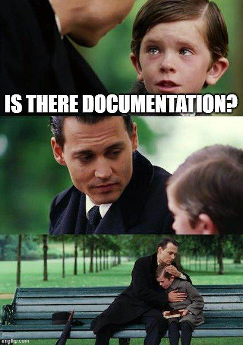

**Summary**:

In a previous post, we looked at using MkDocs and MkDocs Material with the Mike plugin for versioning. This helps in creating a static site on GitHub with GitHub workflows. As MkDocs Material entered maintenance mode on the 6th of November 2025, I decided to migrate to [Zensical](https://zensical.org/).

<!--truncate-->


## Introduction

The team will continue to provide **critical bug fixes** and **security** updates for at **least 12 months**, with **no new features** to MkDocs Material, while users are encouraged to migrate to **Zensical** once dependent features are available.

### What is Zensical?

Zensical is a **modern**, **free**, and **scalable** o**pen-source** toolchain for static sites from the creators of Material for MkDocs. It is designed for speed and superior authoring, and the **alpha** version is already compatible with Material for MkDocs!

Effectively, if you already use MkDocs Material, you can switch to Zensical if the features you depend on are available.

## GitHub Resources

The showcase repository is available [here](https://github.com/egrosdou01/mkdocs-versioning-example).

## Prerequisites

1. Go through parts [one](mkdocs-mike-integration.md) and [two](mkdocs-mike-integration-pt2.md) of the series
1. Basic knowledge and understanding of MkDocs
1. Basic understanding of GitHub workflows

## Migration - Plan Preparation

The [compatibility section](https://zensical.org/compatibility/) shows that the team aimed for a smooth migration. This means users can expect easy compatibility with Material for MkDocs. If you already have an `mkdocs.yml` file, you can keep it and perform only the required changes for Zensical. To learn more about how Zensical understands an existing `mkdocs.yml` file, go through the [configuration section](https://zensical.org/compatibility/configuration/). To learn more about the features, go through the [features section](https://zensical.org/compatibility/features/).

In my case, I performed the steps below to migrate the [Sveltos documentation](https://projectsveltos.io/main/) site to Zensical. The approach might differ based on your project and structure. However, the core idea remains the same.

1. Read the [Zensical documentation](https://zensical.org/docs/get-started/)
1. Go through the [features section](https://zensical.org/compatibility/features/)
1. [Understand](https://zensical.org/docs/setup/versioning/?h=mike#versioning_1) how Mike's for versioning fits into the mix
1. Track down the features used for your deployment. Explore how the `mkdocs.yml` needs to be updated
1. Explore how the [GitHub workflows](https://zensical.org/docs/publish-your-site/?h=github#with-github-actions) can be modified for the migration

In Sveltos' case, the changes performed were minimal. In the sections below, we will outline how the configuration was modified to accommodate the migration.

### Feature Used

- [Python Markdown Extensions](https://zensical.org/docs/setup/extensions/python-markdown-extensions/?h=markdown_extensions#python-markdown-extensions)
    - pymdownx.emoji
- [palette.toggle.icon](https://zensical.org/docs/setup/colors/?h=pal#color-palette-toggle)
- [Mike Versioning](https://zensical.org/docs/setup/versioning/?h=mike#versioning_1)

### mkdocs.yml

#### Before

```yaml
markdown_extensions:
- pymdownx.emoji:
    emoji_index: !!python/name:material.extensions.emoji.twemoji
    emoji_generator: !!python/name:material.extensions.emoji.to_svg
toggle:
    icon: material/brightness-7
toggle:
    icon: material/brightness-4
plugins:
 - search
 - mike
```

#### After

```yaml
markdown_extensions:
- pymdownx.emoji:
    emoji_index: !!python/name:zensical.extensions.emoji.twemoji ""
    emoji_generator: !!python/name:zensical.extensions.emoji.to_svg ""
toggle:
    icon: lucide/sun
toggle:
    icon: lucide/moon
plugins:
 - search
```

### GitHub Workflow - Updates

Only minimal changes were necessary here.

### dev Workflow

```yaml showLineNumbers
name: CI build dev docu
on:
  push:
    branches:
    - main
permissions:
  contents: write
jobs:
  deploy:
    runs-on: ubuntu-latest
    steps:
    - uses: actions/checkout@v6
      with:
        fetch-depth: 0
    - uses: actions/setup-python@v6
      with:
        python-version: 3.x
    - name: Install Dependencies
      run: |
      // highlight-start
        pip install zensical==0.0.32
        pip install git+https://github.com/squidfunk/mike.git
      // highlight-end
    - name: Setup Docs Deploy
      run: |
        git config --global user.name "Example Docu Deploy"
        git config --global user.email "docs.deploy@eleni.dev"
    - name: Build Docs Website
      run: |
        mike deploy --push main --update-aliases
        mike set-default main --push
```

### Production Workflow

```yaml showLineNumbers
name: CI Build Prod Docu
on:
  release:
    types: [published]
permissions:
  contents: write
jobs:
  deploy:
    runs-on: ubuntu-latest
    steps:
      - uses: actions/checkout@v6
        with:
          fetch-depth: 0
      - uses: actions/setup-python@v6
        with:
          python-version: 3.x
      - name: Install Dependencies
        run: |
        // highlight-start
          pip install zensical==0.0.32
          pip install git+https://github.com/squidfunk/mike.git
        // highlight-end
      - name: Setup Docs Deploy
        run: |
          git config --global user.name "Example Docu Deploy"
          git config --global user.email "docs.deploy@eleni.dev"
      - name: Build Docs Website
        run: mike deploy --push --update-aliases ${{ github.event.release.tag_name }} latest
      - name: Hide Old Releases
        run: |
          VISIBLE_RELEASES=2
          # Include only versions starting with `v`.
          # Sort the versions from oldest to latest
          all_releases=$(mike list --json | \
                                 jq -r '.[] | select(.properties.hidden | not) | .version' | \
                                 grep -E '^v?[0-9]+\.[0-9]+\.[0-9]+(\-.*)?$' | \
                                 sort -V)
          # Add the Mike versions into an array
          releases_array=($all_releases)
          num_releases=${#releases_array[@]}

          # Check if more than 2 releases are available
          if (( num_releases > VISIBLE_RELEASES )); then
            hide=$((num_releases - VISIBLE_RELEASES))
            echo "We have to hide $hide versions"
            
            # Take the oldest applicable releases and hide them
            for (( i=0; i<hide; i++ )); do
              hide_version=${releases_array[i]}
              echo "Hiding release version: $hide_version"
              mike props --set hidden=true "$hide_version" --push 
            done
          else
            echo "No release versions to hide. Exit"
          fi
```

A detailed PR for the Sveltos production documentation is available [here](https://github.com/projectsveltos/sveltos/pull/724).

## Local Execution

To run the code locally, only a few things are required. Follow the commands listed below.

### Python Environment Setup

```bash
$ python3 -m venv .venv
$ source .venv/bin/activate
$ pip install zensical==0.0.32
$ pip install git+https://github.com/squidfunk/mike.git
```

### Static Site Execution

```bash
$ zensical build --clean
$ zensical serve
```

The local static site is available at `http://localhost:8000`.

## Conclusion

Easy and headache-free approach to migrating from MkDocs Material to Zensical! Happy coding!

## Resources

- [Zensical - Getting Started](https://zensical.org/docs/get-started/)

## ✉️ Contact

If you have any questions, feel free to get in touch! You can use the `Discussions` option found [here](https://github.com/egrosdou01/blog.grosdouli.dev/discussions) or reach out to me on any of the social media platforms provided. 😊 We look forward to hearing from you!

## Series Navigation

| Part | Title |
| :--- | :---- |
| [Part 1](./mkdocs-mike-integration.md) | MkDocs Material integration with Mike Plugin |
| [Part 2](./mkdocs-mike-integration-pt2.md) | MkDocs Material integration with Mike Plugin Part 2 |
| [Part 3](./mkdocs-material-migration-zensical.md) | MkDocs Material Migration to Zensical |