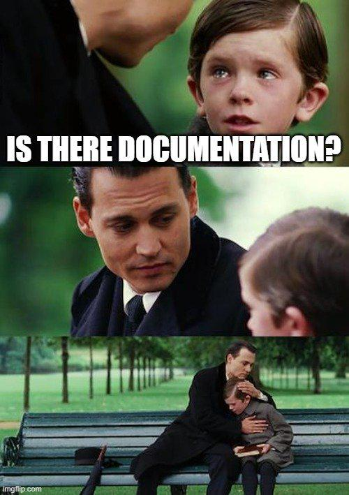

**Summary**:

Learn how to implement documentation versioning in MkDocs using Mike. Mike is a plugin designed for managing multiple documentation versions. The guide covers setting up versioning from day one and integrating it with GitHub Pages for streamlined, automated deployments.
<!--truncate-->


## Introduction

[MkDocs](https://www.mkdocs.org/) is an easy and super fast way to create static sites using `.md` files while [Mike](https://squidfunk.github.io/mkdocs-material/setup/setting-up-versioning/) is a plugin used to enable documentation versioning.

What is document version control? It is a feature that records changes to a document or a set of documents over time. It lets you keep track of the most recent document while preserving earlier versions.

Why document version control is important? There are multiple reasons why keeping track of a document is important. Prevents data loss through easy restoration of previous versions, and ensures consistency and accuracy by tracking changes and maintaining a single updated document. Helps end-users guide through the documentation based on a particular version.

## Scenario

The scenario in my case was the need to keep track of documentation changes and software releases. As the software releases became more frequent, multiple documentation changes had to happen. Thus, keeping a clean state of the `dev` and the `latest` release version was crucial. Having said that, locating descriptive documentation on how to integrate MkDocs with Mike was not easy. The MkDocs [official documentation](https://squidfunk.github.io/mkdocs-material/setup/setting-up-versioning/) provided initial details, but not enough to perform the required changes to include versioning.

Because I was not able to test changes in real-time I decided to create a new repository for the MkDocs site and integrate Mike as the versioning plugin. The approach, commands and configuration details performed  are listed in the below sections.

## GitHub Resources

The showcase repository is available [here](https://github.com/egrosdou01/mkdocs-versioning-example).

## MkDocs Initial Documentation

### Create and Activate a Python Virtual Environment

To work with MkDocs, we need Python 3.x installed locally. Python is used to instantiate a virtual environment and install the required packages for MkDocs.

```bash
$ python3 --version # Use the command to ensure Python3.x is installed locally
$ python3 -m venv ./venv # Use the Python virtual environment module
$ source ./venv/bin/activate # Activate the virtual environment
```

### Install MkDocs

```bash
$ pip3 install mkdocs-material # Install mkdocs-material
```

:::note
We installed the `mkdocs-material` package instead of `mkdocs` as the first one can be easily extended and provides many options to alter the appearance and behaviour of the site.
:::

### Create a New Project

Once MkDocs is installed in the Python virtual environment, we can execute `mkdocs` commands and proceed with our goal of creating a nice documentation with versioning.

```bash
$ mkdocs create example-project # Create a MkDocs project with the name example-project
```

The above command will create the project for us and include all the required components to build and locally serve the documentation. The folder outline is listed below.

```bash
.
├── docs
│   └── index.md
├── LICENSE
├── mkdocs.yml
└── README.md
```

### Build and Serve the Documentation

```bash
$ mkdocs build # The command builds a static site. A new folder named site is included in the existing directory
```

To see how the documentation looks like in a browser, we need to serve the site. To do that, execute the below command.

```bash
$ mkdocs serve
```

If no error occurs while building and/or serving the site, the documentation will be accessible on `http://127.0.0.1:8000/`.

## Install and Configure Mike

To proceed further, we will install Mike in the Python virtual environment and then perform small updates to the `mkdocs.yml` file.

### Install Mike

```bash
$ pip3 install mike
$ mike --version
```

### Update mkdocs.yml

Based on Mike official documentation, we will enable the plugin and include extra variables for aliases and default versioning names in the `mkdocs.yml` file. See the configuration below.

```yaml
extra:
  version:
    provider: mike
    alias: true
    default:
      - latest
plugins:
  - mike
```

Optionally, you can specify the `site_name` and `repo_name` in the same file. Similar the code below.

```yaml
site_name: Mkdocs Versioning Example
site_url: https://egrosdou01.github.io/mkdocs-versioning-example/

repo_name: egrosdou01/mkdocs-versioning-example
repo_url: https://github.com/egrosdou01/mkdocs-versioning-example
```

## Setup GitHub Workflows

As we want to automate the build and deployment of the documentation, we will create two GitHub workflows for a `dev` version and a `prod` version.

**Dev Workflow**

```yaml showLineNumbers
name: CI Build Dev Docu
on:
  push:
    branches:
      - main
permissions:
  contents: write
jobs:
  deploy:
    runs-on: ubuntu-latest
    steps:
      - uses: actions/checkout@v4
        with:
          fetch-depth: 0
      - uses: actions/setup-python@v5
        with:
          python-version: 3.x
      - name: Install Dependencies
        run: |
          pip install mkdocs-material
          pip install mike
      - name: Setup Docs Deploy
        run: |
          git config --global user.name "Example Docu Deploy"
          git config --global user.email "docs.deploy@eleni.dev"
      - name: Build Docs Site
        run: |
          mike deploy dev --update-aliases
          mike set-default dev --push
```

**Prod Workflow**

```yaml
name: CI Build Prod Docu
on:
  release:
    types: [published]
permissions:
  contents: write
jobs:
  deploy:
    runs-on: ubuntu-latest
    steps:
      - uses: actions/checkout@v4
        with:
          fetch-depth: 0
      - uses: actions/setup-python@v5
        with:
          python-version: 3.x
      - name: Install Dependencies
        run: |
          pip install mkdocs-material
          pip install mike
      - name: Setup Docs Deploy
        run: |
          git config --global user.name "Example Docu Deploy"
          git config --global user.email "docs.deploy@eleni.dev"
      - name: Build Docs Site
        run: mike deploy --push --update-aliases ${{ github.event.release.tag_name }} latest
```

Looking at both GitHub workflows, the `dev` workflow is created based on a push action to the `main` branch while the `prod` documentation is created only when a new `Release` is created in the defined repository. The `prod` documentation will be marked as the `latest` version.

## Initial Push

It is time to push our code to GitHub. Ensure the `venv` folder is excluded from the push with the use of the `.gitignore` file. Once we ensure everything is up to date, perform the below to push directly to the `main` branch.

```bash
$ git add .
$ git commit -m "Initial commit"
$ git push origin main
```

:::tip
If you do not have a repository already, feel free to follow the getting started guide from GitHub located [here](https://docs.github.com/en/repositories/creating-and-managing-repositories/creating-a-new-repository). For GitHub Pages to be functional a **public** repository needs to be created.
:::

Once the code is pushed, we will see the `dev` GitHub workflow has already been triggered. Check out the **Repository Name > Actions** section.

**How does Mike keep track of versions?**

The Mike plugin under the hood leverages the Git branches to manage the history of the documentation site. Every version that gets deployed with Mike, is committed to the `gh-pages` branch and into a separate directory. Apart from that, in the `gh-pages` branch, the `versions.json` file is stored and effectively is the source of truth of all existing versions alongside defined aliases.

## Enable GitHub Pages

Once the `dev` GitHub workflow is finished successfully, a new branch named `gh-pages` will be available. This is where our site is built and stored. To make the site available to the world, we have to enable the GitHub pages. Effectively, navigate to **Settings > Code and Automation -> Pages > Build and Deployment -> Branch > Choose the gh-pages > Save**. For more information about the GitHub pages, have a look [here](https://docs.github.com/en/pages/quickstart).

Once you click save for the page configuration, a new Github action will get triggered and will build the site for you. The site will be available at a similar link ```https://<GitHub username>.github.io/<Repository Name>/```.

## Create Release Tag

To include the latest release within our documentation, we can create a new branch, perform and push changes and then create a new Release with an associated tag. For more information about Releases and Tags, have a look [here](https://docs.github.com/en/repositories/releasing-projects-on-github/managing-releases-in-a-repository). Once this is performed, the `prod` GitHub workflow will get triggered and upon successful execution, the `gh-pages` action will be initiated.

## Conclusion

If you want to take your team’s or project’s documentation to the next level, using MkDocs together with Mike offers a clean, structured, and professional way to manage and version your docs! Happy coding!

## Resources

- [MkDocs and Mike Example Repo](https://github.com/mkdocs-material/example-versioning/tree/master)

## ✉️ Contact

If you have any questions, feel free to get in touch! You can use the `Discussions` option found [here](https://github.com/egrosdou01/blog.grosdouli.dev/discussions) or reach out to me on any of the social media platforms provided. 😊 We look forward to hearing from you!