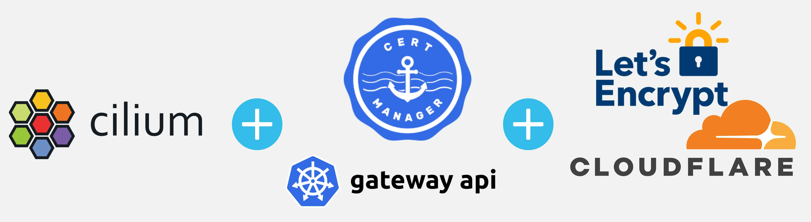

**Summary**:

Learn how to integrate Cilium, Gateway API, cert-manager, let's encrypt and Cloudflare to dynamically provision TLS certificates for ArgoCD.
<!--truncate-->



## Introduction

Whether you are working in a customer environment or a lab setup, being able to automatically provision TLS certificates can save both time and effort. Since the certificate lifecycle is managed by a utility, there is no need for manual intervention or troubleshooting. This means fewer headaches and happier DevOps engineers on the team! 😊

In a [previous post](https://medium.com/itnext/cilium-gateway-api-cert-manager-and-lets-encrypt-updates-cc730818cb17), we described how to utilise [Cilium](https://cilium.io/), [Gateway API](https://gateway-api.sigs.k8s.io/), [cert-manager](https://cert-manager.io/), [let's encrypt](https://letsencrypt.org/) and [Cloudflare](https://www.cloudflare.com/) to dynamically provision TLS certificates for an [ArgoCD](https://argo-cd.readthedocs.io/en/stable/) deployment using an RKE2 cluster. The blog post is an update that includes recent versions and changes performed on individual components.

We do not cover the theory of each component used. For a better understanding of the tools, check out the official documentation provided. In a nutshell, Cilium is used as our Container Network Interface (CNI), cert-manager is used for handling the lifecycle of certificates, let's-encrypt issues certificates and Cloudflare is the provider where we store a valid DNS domain.  Let's dive in!

## Lab Setup

```bash
+-----------------+-------------------------+
|    Deployment   |         Version         |
+-----------------+-------------------------+
|    RKE2         |      v1.31.9+rke2r1     |
|    Cilium       |        v1.17.3          |
|    cert-manager |        v1.18.1          |
+-----------------+-------------------------+
```

## Prerequisites

1. A Kubernetes cluster
1. Cilium as a CNI
1. Familiarity with Kubernetes manifest files

## GitHub Resources

The showcase repository is available [here](https://github.com/egrosdou01/blog-post-resources/tree/main/cilium-gateway-api-cert-manager-lets-encrypt/resources).

## Enable Features

### Gateway API and L2 Announcements

An RKE2 cluster is already deployed and in a `Ready` state with Cilium as the default CNI. As Cilium is a Helm chart deployment, we will update the provided values and redeploy the Helm chart. The below values are required to enable `Gateway API`, `L2Annoucements` and `ExternalIPs` advertisement.

```yaml showLineNumbers
externalIPs:
  enabled: true
gatewayAPI:
  enabled: true
k8sClientRateLimit:
  burst: 40 # Important value when many services run on a Kubernetes cluster. Check out the documentation https://docs.cilium.io/en/v1.17/network/l2-announcements/#sizing-client-rate-limit
  qps: 20 # Important value when many services run on a Kubernetes cluster. Check out the documentation https://docs.cilium.io/en/v1.17/network/l2-announcements/#sizing-client-rate-limit
kubeProxyReplacement: true
l2announcements:
  enabled: true
```

```bash
$ export KUBECONFIG=<directory of the Kubernetes kubeconfig file>

$ helm upgrade rke2-cilium rke2-charts/rke2-cilium --version 1.17.100 --namespace kube-system --reuse-values -f cl05.yaml
```

### Gateway API Specific

To enable Cilium with Gateway API v1.2.0, we need to install the required Custom Resource Definitions (CRDs) to the cluster. For more information, check out the link [here](https://docs.cilium.io/en/v1.17/network/servicemesh/gateway-api/gateway-api/#gs-gateway-api).

```bash
$ kubectl apply -f https://raw.githubusercontent.com/kubernetes-sigs/gateway-api/v1.2.0/config/crd/standard/gateway.networking.k8s.io_gatewayclasses.yaml
$ kubectl apply -f https://raw.githubusercontent.com/kubernetes-sigs/gateway-api/v1.2.0/config/crd/standard/gateway.networking.k8s.io_gateways.yaml
$ kubectl apply -f https://raw.githubusercontent.com/kubernetes-sigs/gateway-api/v1.2.0/config/crd/standard/gateway.networking.k8s.io_httproutes.yaml
$ kubectl apply -f https://raw.githubusercontent.com/kubernetes-sigs/gateway-api/v1.2.0/config/crd/standard/gateway.networking.k8s.io_referencegrants.yaml
$ kubectl apply -f https://raw.githubusercontent.com/kubernetes-sigs/gateway-api/v1.2.0/config/crd/standard/gateway.networking.k8s.io_grpcroutes.yaml
$ kubectl apply -f https://raw.githubusercontent.com/kubernetes-sigs/gateway-api/v1.2.0/config/crd/experimental/gateway.networking.k8s.io_tlsroutes.yaml
```

**Validation**

```bash
$ kubectl get crd | grep -E "gateway|http"
$ kubectl exec -it ds/cilium -n kube-system -- cilium status --verbose | grep -i "l2-announcer"
```

### Cilium GatewayClass

Looking at the Cilium Helm chart values [here](https://github.com/cilium/cilium/blob/v1.17.3/install/kubernetes/cilium/values.yaml#L940-L961), I would expect that once the `Gateway API` value is set to `enabled: true`, the Cilium `GatewayClass` is created automatically. However, it did not happen for my deployment. To force the creation of the Cilium GatewayClass to the cluster, include the below values and update the Cilium Helm chart.

```yaml showLineNumbers
gatewayAPI:
  enabled: true
  gatewayClass:
    create: "true"
```

```bash
$ helm upgrade rke2-cilium rke2-charts/rke2-cilium --version 1.17.100 --namespace kube-system --reuse-values -f cl05.yaml
```

Once the Helm chart is redeployed, the Cilium Kubernetes resources will get restarted and soon enough we should see the Cilium GatewayClass resource.

```bash
$ kubectl get gatewayclass -A
NAME     CONTROLLER                     ACCEPTED   AGE
cilium   io.cilium/gateway-controller   True       4m28s
```

## IPv4 Pool and L2Accouncements

:::note
If you have an IPAM in place and BGP already working, you can skip this section.
:::

### IPv4 Pool

For this lab setup, I would like to allow services of type `LoadBalancer` to get an IP from a custom pool. For that reason, the `CiliumLoadBalancerIPPool` and the `CiliumL2AnnouncementPolicy` resources will be created.

```yaml showLineNumbers
---
apiVersion: "cilium.io/v2alpha1"
kind: CiliumLoadBalancerIPPool
metadata:
  name: "ipv4-pool"
spec:
  blocks:
  - start: "Start Pool - IP Address"
    stop: "End Pool - IP Address"
```

```bash
$ kubectl get ippools
NAME        DISABLED   CONFLICTING   IPS AVAILABLE          AGE
ipv4-pool   false      False         9                      6m20s
```

### CiliumL2AnnouncementPolicy

To announce the IPs to the local network and externally, we would need to create a `CiliumL2AnnouncementPolicy` resource.

```yaml showLineNumbers
---
apiVersion: cilium.io/v2alpha1
kind: CiliumL2AnnouncementPolicy
metadata:
  name: l2-announcement-policy
  namespace: kube-system
spec:
  interfaces:
    - eth0
  externalIPs: true
  loadBalancerIPs: true
```

```bash
$ kubectl get CiliumL2AnnouncementPolicy 
NAME                     AGE
l2-announcement-policy   7m50s
```

## Kubernetes Resources Deployment

The end goal is to automatically provision TLS certificates for ArgoCD using cert-manager, Let's Encrypt and Gateway API resources. cert-manager can issue certificates for clients who own a domain. Two different types of challenge validations exist: HTTP01 and DNS01.

- **HTTP01**: Challenges are completed by presenting a computed key present at an HTTP URL endpoint that is routable over the Internet
- **DNS01**: Challenges are completed by providing a computed key that is present at a DNS TXT record

The second option is more preferred and secure as we do not have to expose an endpoint to the Internet. For more information about the different cert-manager challenges, take a look  [here](https://cert-manager.io/docs/configuration/acme/).

### Install ArgoCD

The installation of ArgoCD is straightforward. We will follow the "Getting Started" [guide](https://argo-cd.readthedocs.io/en/stable/getting_started/).

After installation, ensure all the Kubernetes Resources stored within the `argocd` namespace are in a Ready/Healthy state.

### cert-manager

Follow the commands listed below to install the `cert-manager`. To understand how cert-manager integrates with Gateway API, have a look at the [documentation](https://cert-manager.io/docs/usage/gateway/).

```bash
$ helm repo add jetstack https://charts.jetstack.io # Add Helm repo
$ helm repo update # Update Helm repositories

$ kubectl apply -f https://github.com/cert-manager/cert-manager/releases/download/v1.18.1/cert-manager.crds.yaml # Deploy the cert-manager CRDs before installation

$ helm install cert-manager jetstack/cert-manager --version v1.18.1 \
 --namespace cert-manager --create-namespace \
 --set "extraArgs={--enable-gateway-api}"
```

### Cloudflare Issuer

cert-manager allows us to utilise the `Issuers` and `ClusterIssuers` resources. They represent certificate authorities (CAs) that can generate signed certificates by honouring certificate signing requests.

First off, we need to have a valid [Cloudflare Token](https://developers.cloudflare.com/fundamentals/api/get-started/create-token/) that can **Read** and **Edit** DNS Zones. Once the token is generated, we will create a Kubernete secret. Afterwards, an `Issuer` resource is created that allows us to complete a **DNS01** challenges and issue certificates for a valid DNS domain.

**Secret**

```yaml showLineNumbers
---
apiVersion: v1
kind: Secret
metadata:
  name: cloudflare-api-token
  namespace: argocd
type: Opaque
stringData:
  api-token: <Cloudflare API token>
```

**Issuer**

```yaml showLineNumbers
---
apiVersion: cert-manager.io/v1
kind: Issuer
metadata:
  name: cloudflare-issuer
  namespace: argocd
spec:
  acme:
    server: https://acme-staging-v02.api.letsencrypt.org/directory # For production environments, set the URL to https://acme-v02.api.letsencrypt.org/directory
    email: "<Your email address>"
    privateKeySecretRef:
      name: cloudflare-private-key
    solvers:
      - dns01:
          cloudflare:
            apiTokenSecretRef:
              name: cloudflare-api-token
              key: api-token
```

**Validation**

```bash
$ kubectl get secret -n argocd
NAME                   TYPE     DATA   AGE
cloudflare-api-token   Opaque   1      40s

$ kubectl get issuer -n argocd
NAME                READY   AGE
cloudflare-issuer   True    13s
```

## Gateway API Resources

### Gateway Resource

The `Gateway` resource is an instance of traffic handling infrastructure. Once deployed, it will create a service of type `LoadBalancer` within the `argocd` namespace. If routing is configured properly in your lab, the ArgoCD instance will be accessible via the FQDN. Due to the annotation set to the resource, it will notify cert-manager to initiate the creation of a certificate named `argocd-server-tls`.

```yaml showLineNumbers
---
apiVersion: gateway.networking.k8s.io/v1
kind: Gateway
metadata:
  name: argocd
  namespace: argocd
  annotations:
    cert-manager.io/issuer: cloudflare-issuer # Specify the name of your issuer resource
spec:
  gatewayClassName: cilium
  listeners:
  - hostname: argocd.<your domain> # Specify a valid domain to reach your application
    name: argocd-example-com-http
    port: 80
    protocol: HTTP
  - hostname: argocd.<your domain> # Specify a valid domain to reach your application
    name: argocd-example-com-https
    port: 443
    protocol: HTTPS
    tls:
      certificateRefs:
      - kind: Secret
        name: argocd-server-tls # Specify the secret name to be used with your application
    allowedRoutes:
      namespaces:
        from: All
```

### HTTPRoute Resource

The `HTTPRoute` resource specifies rules for mapping traffic from a `Gateway` listener to a representation of backend network endpoints.

```yaml showLineNumbers
---
apiVersion: gateway.networking.k8s.io/v1
kind: HTTPRoute
metadata:
  name: argocd
  namespace: argocd
spec:
  hostnames:
  - argocd.<your domain> # Specify a valid domain to reach your application
  parentRefs:
  - name: argocd
  rules:
  - backendRefs:
    - name: argocd-server # Specify the service of the application
      port: 80
    matches:
    - path:
        type: PathPrefix
        value: /
status:
  parents: []
```

**Validate**

```bash
$ kubectl get svc -n argocd
NAME TYPE CLUSTER-IP EXTERNAL-IP PORT(S) AGE
cilium-gateway-argocd LoadBalancer 10.43.162.6 x.x.x.x 80:31598/TCP,443:31167/TCP 12s

$ kubectl get gateway,httproute -n argocd
NAME                                       CLASS    ADDRESS       PROGRAMMED   AGE
gateway.gateway.networking.k8s.io/argocd   cilium   x.x.x.x       True         2m30s

NAME                                         HOSTNAMES                AGE
httproute.gateway.networking.k8s.io/argocd   ["argocd.<your domain>"]   2m30s
```

```bash
$ kubectl get certificate,certificaterequest,order -A
NAMESPACE   NAME                                            READY   SECRET              AGE
argocd      certificate.cert-manager.io/argocd-server-tls   True    argocd-server-tls   3m6s

NAMESPACE   NAME                                                     APPROVED   DENIED   READY   ISSUER              REQUESTER                                         AGE
argocd      certificaterequest.cert-manager.io/argocd-server-tls-1   True                True    cloudflare-issuer   system:serviceaccount:cert-manager:cert-manager   3m6s

NAMESPACE   NAME                                                        STATE   AGE
argocd      order.acme.cert-manager.io/argocd-server-tls-1-3355240980   valid   3m6s
```

## Reach ArgoCD UI

If the DNS setup works, the ArgoCD UI should be accessible from the internal network as well as the external if the `LoadBalancer` IP address is routable to the outside.

```bash
$ curl -ki https://argocd.<your-domain>
HTTP/1.1 200 OK
accept-ranges: bytes
content-length: 788
content-security-policy: frame-ancestors 'self';
content-type: text/html; charset=utf-8
vary: Accept-Encoding
x-frame-options: sameorigin
x-xss-protection: 1
date: Mon, 23 Jun 2025 11:05:57 GMT
x-envoy-upstream-service-time: 5
server: envoy

<!doctype html><html lang="en"><head><meta charset="UTF-8"><title>Argo CD</title><base href="/"><meta name="viewport" content="width=device-width,initial-scale=1"><link rel="icon" type="image/png" href="assets/favicon/favicon-32x32.png" sizes="32x32"/><link rel="icon" type="image/png" href="assets/favicon/favicon-16x16.png" sizes="16x16"/><link href="assets/fonts.css" rel="stylesheet"><script defer="defer" src="main.aabf5778d950742bec21.js"></script></head><body><noscript><p>Your browser does not support JavaScript. Please enable JavaScript to view the site. Alternatively, Argo CD can be used with the <a href="https://argoproj.github.io/argo-cd/cli_installation/">Argo CD CLI</a>.</p></noscript><div id="app"></div></body><script defer="defer" src="extensions.js"></script></html>
```

:::note
If a 307 Temporary Redirect HTTP Status code is returned, modify the `argocd-cmd-params-cm` ConfigMap in the `argocd` namespace and define the `server.insecure: “true”` below the `data` field. For more information, have a look [here](https://argo-cd.readthedocs.io/en/stable/operator-manual/server-commands/additional-configuration-method/).
:::

## Conclusion

Integrating **Cilium** and **cert-manager** with **Gateway API** makes TLS certificate management for ArgoCD and other cloud-native applications **simple** and **efficient**. Cilium provides easy and native support for Gateway API, while cert-manager automates certificate provisioning with Let's Encrypt. If the correct solutions are put together, we can achieve a **secure**, **streamlined** solution which is **easy** to **set up** and **maintain**.

## Resources

- [GitHub Issue -  CiliumLoadBalancerIPPool and Gateway API](https://github.com/cilium/cilium/issues/38123)
- [GitHub Issue - Gateway API reconciler fails TLSRoute ](https://github.com/cilium/cilium/issues/38123)
- [Cilium - Dual-Stack Example](../2025-03-09-dual-stack-proxmox-pfsense-rke2-cilium/proxmox-pfsense-rke2-dual-stack-cilium.md)

## ✉️ Contact

If you have any questions, feel free to get in touch! You can use the `Discussions` option found [here](https://github.com/egrosdou01/blog.grosdouli.dev/discussions) or reach out to me on any of the social media platforms provided. 😊 We look forward to hearing from you!