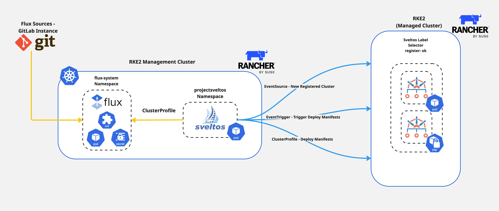

**Summary**:

This post picks up where the Flux Operator [blog](https://blog.grosdouli.dev/blog/flux-operator-and-gitlab-demystifying) left off, diving deeper to demonstrate the power of Sveltos and Flux for Kubernetes add-on deployment and management. Join the club as we explore what next-level Kubernetes deployments and management look like in action!
<!--truncate-->


## Scenario

[Sveltos](https://github.com/projectsveltos) is a Kubernetes add-on controller that simplifies the deployment and management of Kubernetes add-ons and applications across multiple clusters, whether on-prem, in the cloud or in multitenant environments. To achieve a GitOps approach for our deployments, Sveltos integrates nicely with [Flux](https://fluxcd.io/flux/).

What does this mean for us? We can not only use Sveltos to manage the Flux installation on the Kubernetes **management** cluster, but also utilise the advanced Sveltos capabilities like templating, dynamic pre-instantiation, and Event Driven Framework to make our deployments as dynamic and scalable as possible. If you are ready to proceed, let's dive into it! 😊

:::note
The Kubernetes management cluster in our case is the brain of the add-on and application deployments to a fleet of clusters.
:::


## Lab Setup

```bash
+-------------------------------+---------------------+
|          Deployment           |       Version       |
+-------------------------------+---------------------+
|            RKE2               |   v1.31.9+rke2r1    |
|           Sveltos             |       v1.0.0        |
|       Flux Operator           |       v0.25.0       |
|            Flux               |       v2.6.4        |
| Self Managed GitLab Instance  |        v18.1        |
+-------------------------------+---------------------+
```

## Prerequisites

1. A Kubernetes cluster
1. Familiarity with Kubernetes manifest files
1. Familiarity with Flux and GitOps practices

## Diagram



## Sveltos Installation

Before we start exploring the setup, we need to install Sveltos on a Kubernetes **management** cluster. I like to work with Helm charts, thus we will install Sveltos using this approach. Additionally, [Mode 1](https://projectsveltos.github.io/sveltos/main/getting_started/install/install/#installation-modes) is the preferred installation method. To explore more about the different installation methods, have a look [here](https://projectsveltos.github.io/sveltos/main/getting_started/install/install/).

### Helm Chart Installation

Follow the commands below and install Sveltos on a Kubernetes management cluster.

```bash
$ export KUBECONFIG=<directory of the management kubeconfig>

$ helm repo add projectsveltos https://projectsveltos.github.io/helm-charts
$ helm repo update

$ helm install projectsveltos projectsveltos/projectsveltos -n projectsveltos --create-namespace --version=1.0.0
```

**Validation**

```bash
$ kubectl get pods -n projectsveltos

$ kubectl get sveltosclusters -A
```

### Label Management Cluster

It is very common to use Sveltos and deploy add-ons and applications to the **management** cluster where Sveltos is installed. For this demonstration, we will add the Kubernetes label `cluster=mgmt`.

```bash
$ kubectl label sveltoscluster mgmt -n mgmt cluster=mgmt
```

By using the Sveltos label matching approach, we can utilise the Sveltos Custom Resource Definitions (CRDs) and deploy Flux to the **management** cluster.

## Flux Installation

### Flux ClusterProfile

We will use a Sveltos [ClusterProfile](https://projectsveltos.github.io/sveltos/main/addons/addons/#how-it-works) to install the Flux-Operator as a Helm chart and include all the required resources for the desired setup. The official oci registry is used to pull the Flux Operator Helm chart. With Sveltos, we can deploy `ConfigMap` and `Secret` resources that contain information about the cluster. That means we can add the Flux `Instance`, the GitLab `secret` and the `GitRepository` resources into a `ConfigMap` and instruct Sveltos to deploy it to the **management** cluster.

#### Flux Operator ClusterProfile

```yaml showLineNumbers
---
apiVersion: config.projectsveltos.io/v1beta1
kind: ClusterProfile
metadata:
  name: flux
spec:
  clusterSelector:
    matchLabels:
      cluster: mgmt
  helmCharts:
  - repositoryURL: oci://ghcr.io/controlplaneio-fluxcd/charts
    repositoryName: flux-operator
    chartName: flux-operator
    chartVersion: 0.25.0
    releaseName: flux-operator
    releaseNamespace: flux-system
    helmChartAction: Install
// highlight-start
  policyRefs:
  - name: flux-resources
    namespace: default
    kind: ConfigMap
// highlight-end
```

#### flux-resources ConfigMap

```yaml showLineNumbers
apiVersion: v1
data:
  flux_resources.yaml: |
    ---
    apiVersion: fluxcd.controlplane.io/v1
    kind: FluxInstance
    metadata:
      name: flux
      namespace: flux-system
      annotations:
        fluxcd.controlplane.io/reconcileEvery: "1h"
        fluxcd.controlplane.io/reconcileTimeout: "5m"
    spec:
      distribution:
        version: "2.x"
        registry: "ghcr.io/fluxcd"
        artifact: "oci://ghcr.io/controlplaneio-fluxcd/flux-operator-manifests"
      components:
        - source-controller
        - kustomize-controller
        - helm-controller
        - notification-controller
        - image-reflector-controller
        - image-automation-controller
      cluster:
        type: kubernetes
        multitenant: false
        networkPolicy: false
        domain: "cluster.local"
      kustomize:
        patches:
          - target:
              kind: Deployment
              name: "(kustomize-controller|helm-controller)"
            patch: |
              - op: add
                path: /spec/template/spec/containers/0/args/-
                value: --concurrent=10
              - op: add
                path: /spec/template/spec/containers/0/args/-
                value: --requeue-dependency=5s
    ---
    apiVersion: v1
    data:
      password: <BASE64 encoded string>
      username: <BASE64 encoded string>
    kind: Secret
    metadata:
      name: gitlab-creds
      namespace: flux-system
    type: Opaque
    ---
    apiVersion: source.toolkit.fluxcd.io/v1
    kind: GitRepository
    metadata:
      name: staging-env
      namespace: flux-system
    spec:
      interval: 1m0s
      ref:
        branch: main
      secretRef:
        name: gitlab-creds
      timeout: 60s
      url: https://<your GitLab domain>/<group name>/<repository name>.git
kind: ConfigMap
metadata:
  name: flux-resources
  namespace: default
```

:::tip
Ensure the ConfigMap with the name `flux-resources` is deployed to the **management** cluster before deploying the Sveltos `ClusterProfile`. The resources need to exist in the cluster for Sveltos to deploy them.
:::

## Dynamic Flux Sources Deployment

As mentioned in the beginning, we can use the advanced Sveltos Event Framework and perform "magic" 🪄✨ when it comes to application deployment from defined Flux sources. The approach allows us to dynamically target Sveltos **managed** clusters using the information located in the Kubernetes management cluster.

### EventSource

To trigger actions based on concrete events, Sveltos allows us to utilise the [EventSource](https://projectsveltos.github.io/sveltos/main/events/addon_event_deployment/#introduction-to-sveltos-event-framework) resource and define what the triggered action will perform on the **managed** clusters. Check out the [documentation](https://projectsveltos.github.io/sveltos/main/events/addon_event_deployment/#eventsource) and define your own EventSources.

For this demonstration, the trigger is every new registered cluster with the label set to `register: ok`. The following is an example of how the `EventSource` manifest looks.

```yaml showLineNumbers
---
apiVersion: lib.projectsveltos.io/v1beta1
kind: EventSource
metadata:
  name: cluster-registration
spec:
  collectResources: true
  resourceSelectors:
  - group: "lib.projectsveltos.io"
    version: "v1beta1"
    kind: "SveltosCluster"
// highlight-start
    labelFilters:
    - key: register
      operation: Equal
      value: ok
// highlight-end
```

Once a new cluster with the label set to `register: ok` is registered with Sveltos, we use the following `EventTrigger` resource to dynamiccally deploy Flux syncronised resources for the new registered **managed** clusters.

### EventTrigger

```yaml showLineNumbers
---
apiVersion: lib.projectsveltos.io/v1beta1
kind: EventTrigger
metadata:
  name: deploy-manifests
spec:
// highlight-start
  sourceClusterSelector:
    matchLabels:
      cluster: mgmt
// highlight-end
  destinationCluster:
    name: "{{ .Resource.metadata.name }}"
    namespace: "{{ .Resource.metadata.namespace }}"
    kind: SveltosCluster
    apiVersion: lib.projectsveltos.io/v1beta1
// highlight-start
  eventSourceName: cluster-registration
// highlight-end
  oneForEvent: true
// highlight-start
  policyRefs:
  - kind: GitRepository
    name: staging-env
    namespace: flux-system
    path: "test/{{ .Resource.metadata.name }}"
// highlight-end
```

:::tip
Looking at line **21**, we instruct Sveltos to deploy any Kubernetes manifests included under the repository directory `test/<cluster-name>/`. If the directory does not exist, Sveltos will not deploy something to the cluster.
:::

### Validation

Once the `EventSource` and the `EventTrigger` resources are deployed to the Kubernetes **management** cluster, we can check and evaluate them. The `eventsource` and the `eventsummary` resources are what we look for.

```bash
$ kubectl get eventsource,eventsummary

$ kubectl get eventsource <name> -n <namespace> -o yaml
$ kubectl get eventsummary <name> -n <namespace> -o yaml
```

The `status` of the output above is what we want to validate. If the resources are `provisioned`, Sveltos deployed the Flux syncronised resources to the cluster and those should already been visible to the **managed** cluster.

## Conclusion

Throughout this series, we demonstrated how to automate the installation of the Flux Operator, along with all the necessary resources for a fully functional setup. We showcased the power of Sveltos, leveraging the Event Driven Framework to seamlessly automate deployments to newly registered clusters. Using the right tools, we can achieve a high level of automation in a straightforward and meaningful way!

## Resources

- [Flux Operator Documentation](https://fluxcd.control-plane.io/operator/)
- [Sveltos Quick Start](https://projectsveltos.github.io/sveltos/v1.0.0/getting_started/install/quick_start/)
- [Sveltos Event Framework](https://projectsveltos.github.io/sveltos/v1.0.0/events/addon_event_deployment/)

## ✉️ Contact

We are here to help! Whether you have questions, or issues or need assistance, our Slack channel is the perfect place for you. Click here to [join us](https://join.slack.com/t/projectsveltos/shared_invite/zt-1hraownbr-W8NTs6LTimxLPB8Erj8Q6Q).

## 👏 Support this project

Every contribution counts! If you enjoyed this article, check out the Projectsveltos [GitHub repo](https://github.com/projectsveltos). You can [star 🌟 the project](https://github.com/projectsveltos) if you find it helpful.

The GitHub repo is a great resource for getting started with the project. It contains the code, documentation, and many more examples.

Thanks for reading!