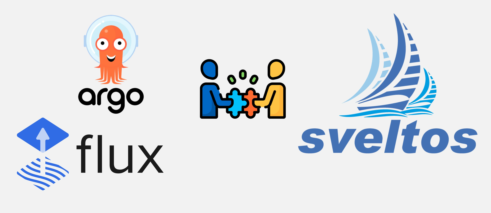
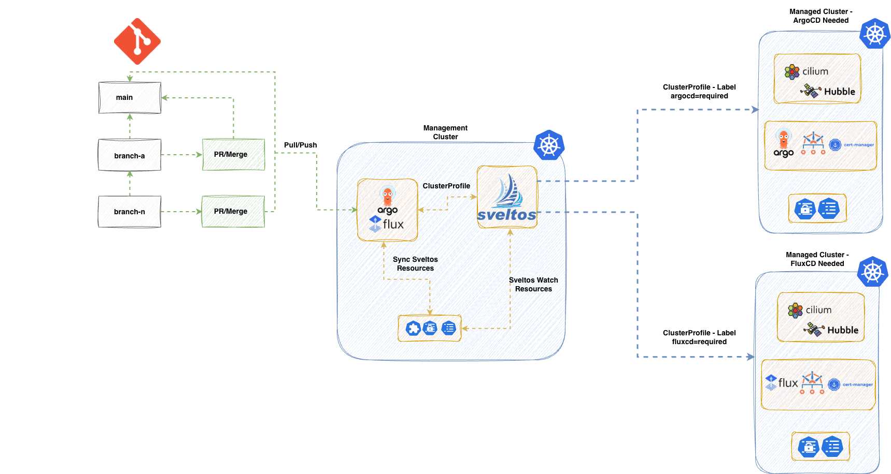

**Summary**:

After many discussions at the KubeCon Europe in Amsterdam, I decided to start a new series covering the most commonly seen scenarios and approaches on how Sveltos and different GitOps Controllers can work together. Sveltos is not a replacement of your GitOps Controller. It is a tool to enhance and extend existing capabilities. When we talk about GitOps Controllers, we primarily refer to either ArgoCD or Flux. In the first part of the series, we will demonstrate how Sveltos fits into the Platform engineering space and, more specifically, in the Continuous Deployment (CD) part. We will provide a commonly seen scenario and explore how Sveltos can control all the deployments.

<!--truncate-->



## Motivation

I had the chance to meet [Gianluca Mardenete](https://github.com/gianlucam76) (creator of [Sveltos](https://github.com/projectsveltos/addon-controller) and [K8Scleaner](https://github.com/gianlucam76/k8s-cleaner)) during an internal call while working on a project. He introduced me to Sveltos almost two and a half years ago. I was impressed by the functionality and features that came out-of-the-box, one tool to rule them all, and decided to give it a spin. Since then, I can say it not only gave me back time to work on other issues, but also made deployments way easier and scalable for us! Follow along to explore Sveltos together!

## Scenario

Let’s start with a quick introduction to [Sveltos](https://github.com/projectsveltos). It is a Kubernetes add-on controller. It makes deploying and managing Kubernetes add-ons and applications easier using a label approach. We can use it across multiple clusters, whether on-premises, in the cloud, or in multitenant setups. Sveltos integrates very well with existing GitOps Controllers and extends its capabilities using out-of-the-box features like advanced templating, Event Framework, and native integration with Cluster API (CAPI). To learn more about the Sveltos features, take a look at the [official documentation](https://projectsveltos.io/main/). As mentioned in the beginning, the goal of the new series is to demonstrate the different scenarios when it comes to CD. How can someone use Sveltos capabilities when starting with deployments, and how can Sveltos fit and collaborate with other Controllers to help teams scale their operations?

In this post, we will focus on the scenario where Sveltos is the “brain” of our deployments. We will showcase how Sveltos can install ArgoCD and Flux to a central Kubernetes **management** cluster and how the same approach can be used to deploy a GitOps controller to a managed cluster that requires a GitOps Controller with a custom definition. What that means is that we will bring any Sveltos manifests stored in a git repo using an available GitOps Controller. From there, Sveltos takes over and works with the deployments based on the labeling concept.

By the end of this post, you will have a working setup where Sveltos installs and orchestrates both ArgoCD and Flux on a management cluster, and deploys the appropriate GitOps controller to managed clusters based on labels.

## Lab Setup

```bash
+---------------------------+------------------+
|        Deployment         |     Version      |
+---------------------------+------------------+
|           RKE2            | v1.35.3+rke2r3   |
|         Sveltos           |     v1.8.0       |
|    ArgoCD Helm Chart      |     v9.4.17      |
|    Flux2 Helm Chart       |     v2.18.3      |
|    Flux Operator Helm     |     v0.40.0      |
+---------------------------+------------------+
```

## GitHub Resources

The YAML outputs are not complete. Have a look at the [GitHub repository](https://github.com/egrosdou01/blog-post-resources/tree/main/sveltos-gitops-controllers/pt1).

## Prerequisites

1. A Kubernetes cluster acting as the **management** cluster
1. At least two **managed** clusters
1. Familiarity with Kubernetes manifest files
1. Familiarity with ArgoCD, Flux and GitOps practices

## Diagram



Taking a look at the diagram, we follow a classic GitOps approach. The DevOps or Platform engineering team will store the source of truth in a git or multiple git repositories. In this scenario, we instruct ArgoCD or Flux to synchronise with any repositories that hold the Sveltos resources like ClusterProfiles, Profiles, EventSource, and EventTrigger to a central **management** cluster. Then, Sveltos takes over the deployment of applications and add-ons using a label approach. Once a change is performed following a standard Merge or PR request, the GitOps controller will bring the updated code to the **management** cluster, and Sveltos will ensure the changes are performed to the affected managed clusters.

We start by installing the different GitOps Controllers to a Kubernetes management cluster (the same cluster where Sveltos is installed) using a ClusterProfile. Then, synchronise the required repositories, and Sveltos performs different deployments across different managed clusters following the Kubernetes labelling approach. For example, if a managed cluster has the label `git-controller: argo`, Sveltos will deploy ArgoCD to that cluster. If there is another managed cluster with the label set to `git-controller: flux`, Sveltos will deploy Flux to that cluster. The labelling approach provides teams with extra flexibility while keeping deployments as simple as possible. The [DRY](https://en.wikipedia.org/wiki/Don't_repeat_yourself) and [KISS](https://en.wikipedia.org/wiki/KISS_principle) frameworks are embraced by Sveltos architecture.

## My Project Structure

I like to keep things organised. When I use Sveltos as the brains of operations, usually I have the below file structure in a repository.

```
sveltos-resources/
├── mgmt/               # Resources for the management cluster
├── base/               # Global configurations (applied to all clusters)
│   ├── cni/
│   └── security-baseline/
├── providers/          # Provider-specific configurations (Labels: provider=aks/eks/on-prem)
│   ├── aks/
│   ├── eks/
│   └── on-prem/
├── environments/       # Env-specific configurations (Labels: env=dev/staging/prod)
│   ├── dev/
│   ├── staging/
│   └── prod/
```

The `mgmt/` holds the Sveltos resources to be applied in the Kubernetes **management** cluster. The `base/` directory holds the Sveltos manifests that apply to every cluster, such as the Container Network Interface (CNI) and network policies. For specialised needs, we use `providers/` and `environments/` folders. Instead of nesting these, we use labels to target the right Sveltos resources, allowing each cluster to automatically pick up the configurations it needs based on its specific role.

As our demonstration is way simpler, we will use the labels `env: dev`, `env: staging`, `gitops: argocd`, and `gitops: flux` to deploy specific resources to these clusters. Feel free to experiment with your own file structure based on your use-cases.

## Sveltos Installation

To start with the demo, we need to install Sveltos to the **management** cluster. I will use the Helm installation using **Mode 1**. Choose your preferred installation mode by reading the [installation documentation](https://projectsveltos.io/main/getting_started/install/install/).

### Helm Chart Installation

```bash
$ export KUBECONFIG=<directory of the management kubeconfig>

$ helm repo add projectsveltos https://projectsveltos.github.io/helm-charts
$ helm repo update

$ helm install projectsveltos projectsveltos/projectsveltos -n projectsveltos --create-namespace --version=1.8.0
```

### Label Management Cluster

To control resources in the **management** cluster using Sveltos, we will simply add the label `type: mgmt` to the `sveltoscluster` named `mgmt` in the `mgmt` namespace. The registration is done by Sveltos during installation.

```bash
$ kubectl label sveltoscluster mgmt -n mgmt type=mgmt
```

### GitOps Controller - Management Cluster

#### Flux Deployment

We will use a Sveltos [ClusterProfile](https://projectsveltos.github.io/sveltos/main/addons/addons/#how-it-works) to install the Flux-Operator as a Helm chart and include all the required resources for the desired setup. The official OCI registry is used to pull the Flux Operator Helm chart. With Sveltos, we can deploy `ConfigMap` and `Secret` resources that contain information about the cluster. That means we can add the Flux `Instance`, the GitLab `secret`, and the `GitRepository` resources into a `ConfigMap` and instruct Sveltos to deploy it to the **management** cluster.

##### Flux Operator ClusterProfile

```yaml showLineNumbers
apiVersion: config.projectsveltos.io/v1beta1
kind: ClusterProfile
metadata:
  name: flux
spec:
// highlight-start
  clusterSelector:
    matchLabels:
      type: mgmt
// highlight-end
  helmCharts:
  - repositoryURL: oci://ghcr.io/controlplaneio-fluxcd/charts
    repositoryName: flux-operator
    chartName: flux-operator
    chartVersion: 0.40.0
    releaseName: flux-operator
    releaseNamespace: flux-system
    helmChartAction: Install
// highlight-start
  policyRefs:
  - name: flux-resources
    namespace: default
    kind: ConfigMap

  - kind: GitRepository
    name: sveltos-repo-sync # Define the Flux GitRepository resource name defined in the flux-resources ConfigMap
    namespace: flux-system
    path: ./resources/sveltos-manifests/
// highlight-end
```

##### flux-resources ConfigMap

```yaml showLineNumbers
apiVersion: v1
kind: ConfigMap
metadata:
  name: flux-resources
  namespace: default
data:
  flux_resources.yaml: |
    ---
    apiVersion: fluxcd.controlplane.io/v1
    kind: FluxInstance
    metadata:
      name: flux
      namespace: flux-system
      annotations:
        fluxcd.controlplane.io/reconcile: "enabled"
        fluxcd.controlplane.io/reconcileEvery: "1h"
        fluxcd.controlplane.io/reconcileTimeout: "5m"
    spec:
      distribution:
        version: "2.x"
        registry: "ghcr.io/fluxcd"
      components:
        - source-controller
        - kustomize-controller
        - helm-controller
        - notification-controller
        - image-reflector-controller
        - image-automation-controller
      cluster:
        type: kubernetes
        size: medium
        multitenant: false
        networkPolicy: false
        domain: "cluster.local"
      commonMetadata:
        labels:
          app.kubernetes.io/name: flux
      kustomize:
        patches:
          - target:
              kind: Deployment
            patch: |
              - op: replace
                path: /spec/template/spec/nodeSelector
                value:
                  kubernetes.io/os: linux
              - op: add
                path: /spec/template/spec/tolerations
                value:
                  - key: "CriticalAddonsOnly"
                    operator: "Exists"
    ---
    apiVersion: source.toolkit.fluxcd.io/v1
    kind: GitRepository
    metadata:
      name: sveltos-repo-sync
      namespace: flux-system
    spec:
      interval: 30s
      ref:
        branch: main
      timeout: 60s
      url: https://<your domain>/<group name>/<repository name>.git
```

:::tip
Ensure the ConfigMap with the name `flux-resources` is deployed to the **management** cluster before deploying the Sveltos `ClusterProfile`. The `ConfigMap` can contain any relevant information required for the Flux installation. Feel free to update the example and include the required details. In case authentication is required to sync a repo. Include the code listed below.

```yaml
apiVersion: v1
kind: Secret
data:
  password: <BASE64 encoded string>
  username: <BASE64 encoded string>
metadata:
  name: git-creds
  namespace: flux-system
type: Opaque
---
apiVersion: source.toolkit.fluxcd.io/v1
kind: GitRepository
metadata:
  name: a-repo-sync
  namespace: flux-system
spec:
  interval: 1m0s
  ref:
    branch: main
  secretRef:
    name: git-creds
  timeout: 60s
  url: https://<your domain>/<group name>/<repository name>.git
```
:::

### ArgoCD Installation - Management Cluster

#### ArgoCD ClusterProfile

```yaml showLineNumbers
apiVersion: config.projectsveltos.io/v1beta1
kind: ClusterProfile
metadata:
  name: argocd
spec:
// highlight-start
  clusterSelector:
    matchLabels:
      type: mgmt
// highlight-end
  helmCharts:
  - repositoryURL: https://argoproj.github.io/argo-helm
    repositoryName: argo
    chartName: argo-cd
    chartVersion: 9.4.17
    releaseName: argocd
    releaseNamespace: argocd
    helmChartAction: Install
// highlight-start
  policyRefs:
  - name: argo-resources
    namespace: default
    kind: ConfigMap
// highlight-end
```

##### argo-resources ConfigMap

```yaml showLineNumbers
apiVersion: v1
kind: ConfigMap
metadata:
  name: argo-resources
  namespace: default
data:
  argo_resources.yaml: |
    ---
    apiVersion: argoproj.io/v1alpha1
    kind: Application
    metadata:
      name: sveltos-manifests
      namespace: argocd
      finalizers:
        - resources-finalizer.argocd.argoproj.io
    spec:
      project: default
      source:
        repoURL: "https://<your domain>/<group name>/<repository name>.git"
        targetRevision: HEAD
        path: resources/sveltos-manifests/
      destination:
        server: https://kubernetes.default.svc
        namespace: default
      syncPolicy:
        automated:
          selfHeal: true
          prune: true
        retry:
          limit: 5
          backoff:
            duration: 5s
            maxDuration: 3m0s
            factor: 2
      ---
      apiVersion: v1
      kind: Secret
      metadata:
        name: sveltos-repo-sync
        namespace: argocd
        labels:
          argocd.argoproj.io/secret-type: repository
      stringData:
        url: "https://<your domain>/<group name>/<repository name>.git"
```

## Register Managed Clusters

The Sveltos "magic" 🪄✨ happens when we want to deploy add-ons and applications to a fleet of clusters. First, we need to register the clusters with Sveltos using either the `sveltosctl` or the [programmatic approach](https://projectsveltos.io/main/register/register-cluster/#programmatic-registration). Make your choice. During the registration process, we assign specific labels to the managed clusters. For example, define the environment, whether they need a special configuration etc.

### Flux vs ArgoCD ClusterProfile

### Base ClusterProfile

```yaml showLineNumbers
apiVersion: config.projectsveltos.io/v1beta1
kind: ClusterProfile
metadata:
  name: common-staging
spec:
  clusterSelector:
    matchExpressions:
    - {key: env, operator: In, values: [dev, staging]}
  helmCharts:
  - chartName: cilium/cilium
    chartVersion: 1.18.5
    helmChartAction: Install
    releaseName: cilium
    releaseNamespace: kube-system
    repositoryName: cilium
    repositoryURL: https://helm.cilium.io/
    values: |
      hubble:
        enabled: true
        peerService:
          clusterDomain: cluster.local
        relay:
          enabled: true
        tls:
          auto:
            certValidityDuration: 1095
            enabled: true
            method: helm
        ui:
          enabled: true
      nodePort:
        enabled: true
      debug:
        enabled: true
  - repositoryURL: https://charts.jetstack.io
    repositoryName: jetstack
    chartName: jetstack/cert-manager
    chartVersion: v1.16.3
    releaseName: cert-manager
    releaseNamespace: cert-manager
    helmChartAction: Install
    values: |
      crds:
        enabled: true
```

The base configuration will be applied to every managed cluster that has the label `env: dev` or `env: staging` defined. In this case, we would like to install a specific version of [Cilium](https://docs.cilium.io/en/stable/) and [cert-manager](https://cert-manager.io/docs/) for certificate management.

Now, depending on whether the developers like to work with ArgoCD or Flux, we can create two different `ClusterProfile` resources and deploy the preferred GitOps Controller based on the `git-controller` label defined. Check out the below configuration for more details.

### ArgoCD Controller

```yaml showLineNumbers
apiVersion: config.projectsveltos.io/v1beta1
kind: ClusterProfile
metadata:
  name: argocd
spec:
  clusterSelector:
    matchLabels:
      git-controller: argo
  helmCharts:
  - repositoryURL: https://argoproj.github.io/argo-helm
    repositoryName: argo
    chartName: argo-cd
    chartVersion: 9.4.17
    releaseName: argocd
    releaseNamespace: argocd
    helmChartAction: Install
  policyRefs:
  - name: argo-resources
    namespace: default
    kind: ConfigMap
```
### Flux GitOps Controller

```yaml showLineNumbers
apiVersion: config.projectsveltos.io/v1beta1
kind: ClusterProfile
metadata:
  name: flux
spec:
  clusterSelector:
    matchLabels: 
      git-controller: flux
  helmCharts:
  - repositoryURL: oci://ghcr.io/controlplaneio-fluxcd/charts
    repositoryName: flux-operator
    chartName: flux-operator
    chartVersion: 0.40.0
    releaseName: flux-operator
    releaseNamespace: flux-system
    helmChartAction: Install
  policyRefs:
  - name: flux-resources
    namespace: default
    kind: ConfigMap
```

:::tip
Because we use already a GitOps Controller to our **management** cluster and sync any manifests with our cluster, we should not deploy these manifests to our cluster. It is the GitOps Controller's job to do so.
:::

## Conclusion

In today's blog, we demonstrated a simple yet powerful and extensible way of using Sveltos as our main-brain for the application and add-on deployments across a fleet of clusters. Using a labeling approach and expanding to complex deployments becomes easy using features like Sveltos templating and Event Framework, which we will cover in Parts 2 and 3.

In the next two blog posts, we will work on how Sveltos integrates with an existing Flux deployment and how we can extend Flux capabilities using Sveltos out-of-the-box advanced features. Stay tuned.

## Resources

- [Flux Operator Documentation](https://fluxcd.control-plane.io/operator/)
- [Sveltos Quick Start](https://projectsveltos.github.io/sveltos/v1.0.0/getting_started/install/quick_start/)
- [Sveltos Event Framework](https://projectsveltos.github.io/sveltos/v1.0.0/events/addon_event_deployment/)

## ✉️ Contact

We are here to help! Whether you have questions, or issues or need assistance, our Slack channel is the perfect place for you. Click here to [join us](https://join.slack.com/t/projectsveltos/shared_invite/zt-1hraownbr-W8NTs6LTimxLPB8Erj8Q6Q).

## 👏 Support this project

Every contribution counts! If you enjoyed this article, check out the Projectsveltos [GitHub repo](https://github.com/projectsveltos). You can [star 🌟 the project](https://github.com/projectsveltos) if you find it helpful.

The GitHub repo is a great resource for getting started with the project. It contains the code, documentation, and many more examples.

Thanks for reading!

## Series Navigation

| Part | Title |
| :--- | :---- |
| [Part 1](./sveltos-and-gitops-controllers-pt1.md) | Sveltos As the Brain of Deployments |
| Part 2 | Flux and Sveltos To Automate Flux Helm Releases |
| Part 3  | Running the Demo: Hub-Spoke With Event Framework |
