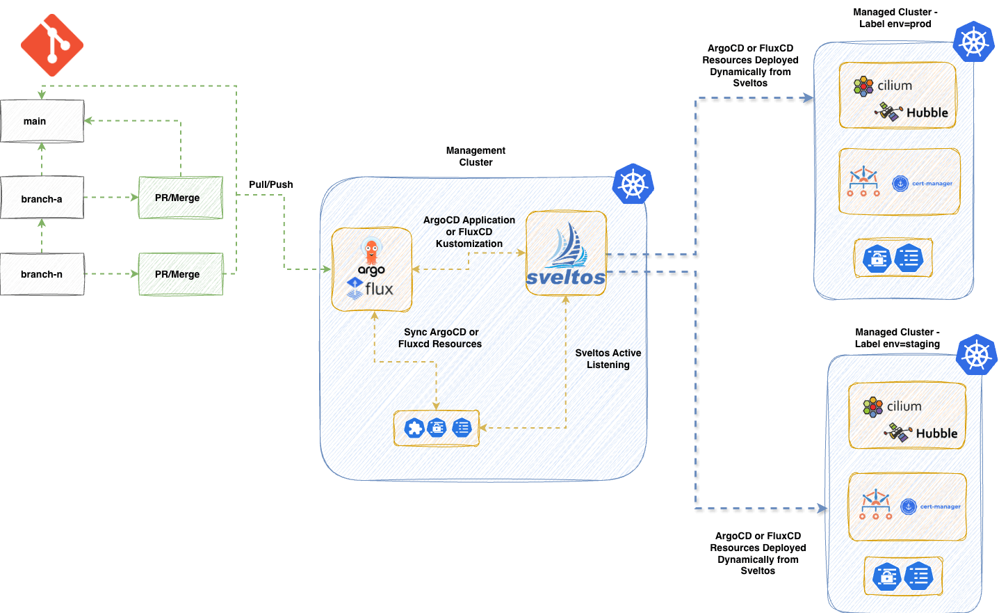

**Summary**:

In [part 1](./sveltos-and-gitops-controllers-pt1.md) of the series, we explored how [Sveltos](https://projectsveltos.io/main/) acts as the main brain for our deployments to a fleet of clusters. However, this is the case when we start with Continuous Deployments (CD) or when we are willing to perform a full migration to a new architecture. The next two posts are dedicated to the collaboration between [Flux](https://fluxcd.io/) and Sveltos. Flux remains the core way of deploying applications using the Flux Customer Resource Definitions (CRDs), while Sveltos enters the play when we talk about scalability, automation, and dynamic instantiation of deployments.

<!--truncate-->


## Motivation

Most engineers working in Platform Engineering already have a GitOps Controller like ArgoCD or Flux in place for Kubernetes deployments. It works, and it works well, until it does not. As teams grow and deployments spread across ten or more clusters, multiple environments, and different Hyperscalers, a once clean GitOps repository quickly ends up with duplicated Helm Releases, environment-specific overrides, and manual interventions nobody wants to own.

Having only a GitOps Controller in place is not enough when it comes to complex workloads, scalability, and management of deployments and add-ons across different environments. Teams end up juggling multiple tools just to add flexibility to an existing setup. Can we help teams work smaller, simpler, and not harder when it comes to continuous deployments? The answer is yes; follow along to explore the Sveltos magic! 🪄

## Scenario

In today's post, we will showcase a flexible way of using an existing Flux configuration, and how by adding Sveltos into the mix, we provide out-of-the-box capabilities like templating, event-driven workloads, and many more. We will work with an existing Flux deployment, and Sveltos will automate the dynamic creation of [Flux Helm Releases](https://fluxcd.io/flux/components/helm/helmreleases/) based on a **cluster type** or **identity**.

## Lab Setup

```bash
+-------------------------------+---------------------+
|          Deployment           |       Version       |
+-------------------------------+---------------------+
|             RKE2              |   v1.35.3+rke2r3    |
|           Sveltos             |       v1.8.0        |
|          Flux2 Helm           |       v2.18.3       |
|      Flux Operator Helm       |       v0.40.0       |
+-------------------------------+---------------------+
```

## GitHub Resources

The YAML outputs are not complete. Have a look at the [GitHub repository](https://github.com/egrosdou01/blog-post-resources/tree/main/sveltos-gitops-controllers/pt2).

## Prerequisites

1. A Kubernetes cluster acting as the **management** cluster
1. At least one **managed** cluster
1. Familiarity with Kubernetes manifest files
1. Familiarity with Flux

## Diagram



The diagram looks very similar to the one we saw in [part 1](./sveltos-and-gitops-controllers-pt1.md) of the series. The difference here is that we already have a Flux deployment and project outline. We will install Sveltos using the native deployment options and let Sveltos listen for Events or specific resources and automate the deployment of Flux Helm Releases. Let's dive into the details.

## Sveltos Installation

The installation of Sveltos using Flux could be similar to the below. Feel free to use your preferred way of installing Sveltos to the management cluster.

```yaml showLineNumbers
---
apiVersion: v1
kind: Namespace
metadata:
  name: projectsveltos
---
apiVersion: source.toolkit.fluxcd.io/v1
kind: HelmRepository
metadata:
  name: projectsveltos
  namespace: flux-system
spec:
  interval: 24h
  url: https://projectsveltos.github.io/helm-charts
---
apiVersion: helm.toolkit.fluxcd.io/v2
kind: HelmRelease
metadata:
  name: projectsveltos
  namespace: flux-system
spec:
  interval: 30m
  targetNamespace: projectsveltos
  storageNamespace: projectsveltos
  chart:
    spec:
      chart: projectsveltos
      version: ">=1.6.1"
      sourceRef:
        kind: HelmRepository
        name: projectsveltos
        namespace: flux-system
      interval: 12h
  install:
    crds: Create
    createNamespace: true
    timeout: 10m
    strategy:
      name: RetryOnFailure
  upgrade:
    crds: CreateReplace
    timeout: 10m
    cleanupOnFail: true
    strategy:
      name: RetryOnFailure
```

```yaml showLineNumbers
apiVersion: kustomize.config.k8s.io/v1beta1
kind: Kustomization
resources:
  - sveltos-helmrelease.yaml
```

The above yaml definition will install Sveltos to the **management** cluster in the `projectsveltos` nasmespace. The namespace is not negotiable. Sveltos has to be installed in this namespace.

### Label Management Cluster

To control resources in the **management** cluster with Sveltos, we will simply add the label `type: mgmt` to the `sveltoscluster` named `mgmt` in the `mgmt` namespace. The registration is done by Sveltos during installation. No manual intervention is needed. When we refer to the **management** cluster, is the cluster where Flux and Sveltos are installed.

```bash
$ kubectl label sveltoscluster mgmt -n mgmt type=mgmt
```

## Automate Flux Helm Releases

### How does it work?

Sveltos works very well with the concept of labeling. We can label clusters with a dedicated `key: value` pair and use this information to dynamically create **Flux Helm Releases** based on our needs. In this example, everytime a cluster with the label `cert-manager: required` appears, we trigger an action and dynamically pre-instantiate and deploy a Flux Helm Release using the information located in the **management** cluster. To achieve our goal, we use the [Sveltos Event Framework](https://projectsveltos.io/main/events/addon_event_deployment/).

### Define an EventSource

A Sveltos `EventSource` is a simple way of instructing Sveltos to look for an event or a specific resource. This can be an Event within a cluster or an Event outside a cluster like NATs. In our case, we want to detect clusters with the label set to `cert-manager: required`.

```yaml showLineNumbers
apiVersion: lib.projectsveltos.io/v1beta1
kind: EventSource
metadata:
  name: detect-cluster-requiring-cert-manager
spec:
  collectResources: true
  resourceSelectors:
  - group: "lib.projectsveltos.io"
    version: "v1beta1"
    kind: "SveltosCluster"
    // highlight-start
    labelFilters:
    - key: cert-manager
      operation: Equal
      value: required
    // highlight-end
```

### Define an EventTrigger

Once an `EventSource` is detected, an action or multiple actions can be triggered. In this example, once an event is detected, we will deploy a ConfigMap to the **management** cluster which includes the Flux Helm Releases details expressed as a Sveltos template.

```yaml showLineNumbers
apiVersion: lib.projectsveltos.io/v1beta1
kind: EventTrigger
metadata:
  name: deploy-cert-manager
spec:
  sourceClusterSelector:
    matchLabels:
      type: mgmt
  destinationClusterSelector:
    matchLabels:
      type: mgmt
// highlight-start
  eventSourceName: detect-cluster-requiring-cert-manager
  oneForEvent: true
  policyRefs:
  - name: cert-manager-helmrelease
    namespace: default
    kind: ConfigMap
// highlight-end
```

### Automate Flux Helm Releases

Now that we have our `EventSource` and `EventTrigger` in place, we need to define what actually gets deployed when an event is detected. We do this using a `ConfigMap` that holds the Flux Helm Release definition expressed as a Sveltos template.

```yaml showLineNumbers
apiVersion: v1
kind: ConfigMap
metadata:
  name: cert-manager-helmrelease
  namespace: default
// highlight-start
  annotations:
    projectsveltos.io/instantiate: ok
// highlight-end
data:
  cert-manager.yaml: |
    apiVersion: helm.toolkit.fluxcd.io/v2
    kind: HelmRelease
    metadata:
      name: cert-manager-{{ .Resource.metadata.name  }}
      namespace: {{ .Resource.metadata.namespace }}
    spec:
      interval: 15m
      kubeConfig:
        secretRef:
          name: {{ .Resource.metadata.name }}-sveltos-kubeconfig
          key: kubeconfig
      chart:
        spec:
          chart: cert-manager
          version: "v1.16.x"
          sourceRef:
            kind: HelmRepository
            name: jetstack
            namespace: flux-system
          interval: 15m
      install:
        createNamespace: true
        timeout: 10m
        remediation:
          retries: 3
      upgrade:
        timeout: 10m
        cleanupOnFail: true
        remediation:
          retries: 3
          strategy: rollback
      values:
        crds:
          enabled: true
          keep: true
```

The annotation `projectsveltos.io/instantiate: ok` is what converts a plain `ConfigMap` into a Sveltos template. Sveltos will pull information directly from the **management** cluster and dynamically pre-instantiate and deploy the resource using the detected cluster's metadata. Notice how `{{ .Resource.metadata.name }}` and `{{ .Resource.metadata.namespace }}` are automatically resolved per cluster, one template, many clusters. The `ConfigMap` can be further templatised based on different use cases. Both Lua and CEL languages are supported for Sveltos templating.

:::tip
The label-based approach covered here applies to **any** application. Explore the patterns that fit your use case and adapt them to your needs.
:::

### Result

Every time a cluster with the label `cert-manager: required` appears, Sveltos detects the event, resolves the template, and dynamically creates a dedicated Flux Helm Release using that cluster's information. No manual intervention, no duplicated YAML. **One template, one label, done**.

## Conclusion

In this post, we explored how Sveltos and Flux can work together without replacing one another. Flux remains the backbone of your GitOps workflow, while Sveltos adds the intelligence layer on top, handling scalability, dynamic templating, and event-driven automation with minimal overhead. By combining the `EventSource`, `EventTrigger`, and a templated ConfigMap, we reduced what would otherwise be repetitive, manually maintained Flux Helm Release definitions into a single, reusable template. The moment a cluster is labeled `cert-manager: required`, Sveltos takes over and does the heavy lifting automatically.

The key takeaway: **you do not need to abandon your existing Flux setup to benefit from Sveltos. You layer it in, and your platform becomes smarter, not more complex**.

## What's Next?

In the next post, we will work with a simple hub-spoke Flux deployment as our basis, and include Sveltos installation alongside the Event Framework approach to automate Flux Helm Releases. Stay tuned!

## Resources

- [Flux Operator Documentation](https://fluxcd.control-plane.io/operator/)
- [Sveltos Quick Start](https://projectsveltos.github.io/sveltos/v1.0.0/getting_started/install/quick_start/)
- [Sveltos Event Framework](https://projectsveltos.github.io/sveltos/v1.0.0/events/addon_event_deployment/)

## ✉️ Contact

We are here to help! Whether you have questions, or issues or need assistance, our Slack channel is the perfect place for you. Click here to [join us](https://join.slack.com/t/projectsveltos/shared_invite/zt-1hraownbr-W8NTs6LTimxLPB8Erj8Q6Q).

## 👏 Support this project

Every contribution counts! If you enjoyed this article, check out the Projectsveltos [GitHub repo](https://github.com/projectsveltos). You can [star 🌟 the project](https://github.com/projectsveltos/addon-controller) if you find it helpful.

The GitHub repo is a great resource for getting started with the project. It contains the code, documentation, and many more examples.

Thanks for reading!

## Series Navigation

| Part | Title |
| :--- | :---- |
| [Part 1](./sveltos-and-gitops-controllers-pt1.md) | Sveltos as the brain of deployments |
| [Part 2](./sveltos-and-gitops-controllers-pt2.md) | Flux and Sveltos to automate Flux Helm Releases |
| Part 3 | Running the demo: hub-spoke with Event Framework |
