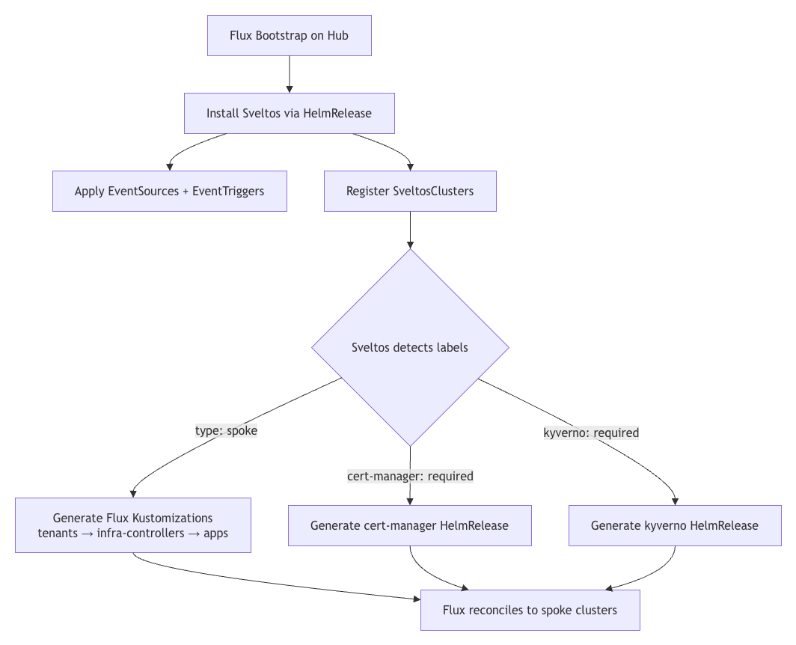

**Summary**:

In [part 2](./sveltos-and-gitops-controllers-pt2.md), we introduced the concept of using the Sveltos Event Framework and templating capabilities to dynamically instantiate a Flux HelmRelease based on cluster labels. This blog brings to life the concept of automated Flux HelmReleases using a hub-and-spoke case scenario. We will run a local Kubernetes fleet using [KinD](https://kind.sigs.k8s.io/), bootstrap Flux, and watch Sveltos automatically generate and deploy Flux HelmReleases based on labels.

<!--truncate-->


## Motivation

Platform teams already have a working Flux setup configured to their specifications and needs. Flux is used to deliver applications, manage infrastructure, and, most importantly, the teams know how to operate it. The challenge comes when adding, extending, and scaling workflows without rewriting everything or introducing yet another layer of complexity that makes operations harder.

The demo setup is based on the [official Flux Hub and Spoke example repository](https://github.com/fluxcd/flux2-hub-spoke-example). It aims to show teams how to integrate [Sveltos](https://github.com/projectsveltos/addon-controller) into an existing Flux setup in a clean, non-disruptive way. We add Sveltos on top, and immediately we profit from label-driven automation, dynamic templating, and scalability that expands from 2 clusters to 50, 100, 10000 while keeping the repository size minimal.

The demo highlights two distinct events;

1. The cluster bootstrap approach, where Sveltos detects the label `type: spoke` on the managed clusters, Sveltos generates the Flux Kustomizations dynamically, and then Flux reconciles to the spoke clusters
1. The application deployment, where Sveltos detects the label `cert-manager: required|kyverno: required`, Sveltos generates a HelmRelease dynamically, and then the Flux helm-controller deploys to the specified spoke clusters

:::note
In today's blog, the terms hub or management and spoke or managed clusters are used interchangeably.
:::

## Lab Setup

```bash
+-------------------------------+---------------------+
|          Deployment           |       Version       |
+-------------------------------+---------------------+
|           Sveltos             |       v1.12.0       |
|          Flux2 Helm           |       v2.18.3       |
|      Flux Operator Helm       |       v0.40.0       |
+-------------------------------+---------------------+
```

## GitHub Resources

The YAML outputs are not complete. Have a look at the [GitHub repository](https://github.com/egrosdou01/flux2-sveltos-hub-spoke-blog-demo.git).

## Prerequisites

1. [Docker](https://docs.docker.com/engine/install/binaries/) and [KinD](https://kind.sigs.k8s.io/docs/user/quick-start/) installed
1. [Flux Command Line](https://fluxcd.io/flux/installation/) for the bootstrap process
1. [make utility](https://www.gnu.org/software/make/) installed
1. Familiarity with Kubernetes manifest files
1. Familiarity with Flux and Sveltos

## Flux Hub and Spoke Original Repository Structure

Before we start talking about potential changes to the [official Flux Hub and Spoke repository](https://github.com/fluxcd/flux2-hub-spoke-example), let's take a look at the project structure and the logic behind it and its purpose.

Flux runs only on the hub cluster and plays the role of the "brain" around operations. Once Flux is deployed, the Flux controllers are responsible for reconciling workloads to different spoke clusters using their kubeconfig secrets. Everything related to clusters and their configuration is stored under the `hub/` directory as a static YAML file.

### Repository Outline

Looking at the current project outline, it uses a static, explicit approach where each cluster's configuration is defined in the repository.

```bash
flux2-hub-spoke-example/
├── hub/                          # Hub cluster configuration
│   ├── flux-system/              # Flux bootstrap manifests
│   ├── staging.yaml              # Static Kustomizations for staging cluster
│   └── production.yaml           # Static Kustomizations for production cluster
│
├── clusters/                     # Per-cluster Kustomize overlays
│   ├── staging/
│   │   ├── tenants/
│   │   ├── infra-controllers/
│   │   ├── infra-configs/
│   │   └── apps/
│   └── production/
│   │   ├── tenants/
│   │   ├── infra-controllers/
│   │   ├── infra-configs/
│   │   └── apps/
│
└── deploy/                       # Base manifests
    ├── tenants/                  # Namespaces, ServiceAccounts, RBAC etc.
    ├── infra-controllers/        # Controller Flux HelmReleases
    ├── infra-configs/            # Infrastructure Components
    └── apps/                     # podinfo HelmRelease
```

To add a new cluster to the setup, a number of things need to happen before we can provision anything to the spoke cluster. First, create a new cluster under `hub/<your cluster name>.yaml` alongside four Kustomizations. Create a new overlay under `clusters/<your cluster name>/`. Provision the kubeconfig secret in the hub cluster and finally, commit and push the changes to Git so that Flux applies the defined configuration to this brand new cluster.

In today's demonstration, we would like to offer an alternative, fresh approach and propose a few changes to the existing repository structure to allow Sveltos flexibility to extend the setup and support automatic deployment of resources while keeping the manifest in the repository minimal.

## Flux and Sveltos Repository Structure

The whole idea is to give teams the flexibility to scale and expand their fleet with minimal effort, fewer changes, and fewer headaches. Once Sveltos is up and running, we deploy a few manifests to describe Sveltos logic and how it should work when a new spoke cluster is detected. More information about the files, outline, and logic is provided later in the post.

### What Remains Unchanged

The `deploy/`, `clusters/<env>/`, and `hub/flux-system/` directories are untouched. Later on, we will see how Sveltos is used to dynamically bootstrap the managed clusters and deploy the information stored under the `deploy/` directory.

### What Changes

The static `hub/staging.yaml` and `hub/production.yaml` files are replaced by dynamic generation taken over by the Sveltos Event Framework when a new managed cluster with the label `type: spoke` is detected.

The changes are introduced primarily in the `hub/` directory as it reflects the brain of our operations. We kept the Flux configuration and added the Sveltos installation details and its logic to perform event-driven decisions based on spoke clusters with specific labels applied. The `clusters/` directory contains the `sveltos-clusters/` definition, which is used in this particular demo to apply the right labels to the managed clusters.

```
hub/
- hub/sveltos-install.yaml # Flux Kustomization to install Sveltos
- hub/sveltos-event-framework.yaml # Flux Kustomization to apply EventSources/EventTriggers
- hub/sveltos-clusters.yaml # Flux Kustomization to register SveltosClusters
- hub/sveltos/ # Sveltos main logic
  - install/ # Sveltos Flux HelmRelease
  - event-framework/event-sources/ # Sveltos EventSource resources
  - event-framework/event-triggers/ # EventTrigger resources and ConfigMap templates

clusters/
- clusters/sveltos-clusters/
  - hub.yaml # Hub cluster registration with `type: mgmt` label
  - staging.yaml # Namespace + SveltosCluster with labels (`type: spoke`, `environment: staging`)
  - production.yaml # Namespace + SveltosCluster with labels (`type: spoke`, `environment: production`)
```

### Updated Repository Structure

```bash
flux2-hub-spoke-example/
├── hub/
│   ├── flux-system/
│   ├── kustomization.yaml
│   ├── sveltos-install.yaml              # Installs Sveltos as a Flux HelmRelease
│   ├── sveltos-event-framework.yaml      # Applies the Sveltos Event Framework
│   ├── sveltos-clusters.yaml             # Automatically registers SveltosClusters (managed/spoke clusters)
│   └── sveltos/                          # Sveltos configuration and logic
│       ├── install/
│       │   ├── kustomization.yaml
│       │   └── sveltos-helmrelease.yaml
│       └── event-framework/
│           ├── kustomization.yaml
│           ├── event-sources/            # Sveltos Event Sources to detect when a cluster needs a particular deployment
│           │   ├── cert-manager.yaml
│           │   ├── kustomization.yaml
│           │   ├── kyverno.yaml
│           │   └── spoke-cluster.yaml
│           └── event-triggers/            # Sveltos Event Trigger to perform a specific deployment based on an Event
│               ├── bootstrap-cluster.yaml
│               ├── cert-manager.yaml
│               ├── kustomization.yaml
│               └── kyverno.yaml
├── clusters/
│   ├── production/                       # The production/ uses the old deployment approach
│   ├── staging/                          # The staging/ uses the old deployment approach
│   └── sveltos-clusters/                 # Includes the dynamic cluster registrations powered by Sveltos suitable for this demo
│       ├── hub.yaml
│       ├── kustomization.yaml
│       ├── production.yaml
│       └── staging.yaml
└── deploy/                               # Unchanged base manifests
```

### Demo Flow Diagram



### Deployment Order Details

The deployment of the demo follows a logical continuation. We start by creating three Kubernetes clusters. Once those are ready, we perform a Flux bootstrap on the management cluster and ensure Flux is healthy. Once this is done, Sveltos is installed in the management cluster using a Kustomization pointing to the `./hub/sveltos/install` path. When Sveltos is healthy, we continue with the Sveltos Event Framework manifests and the registration of the managed clusters with Sveltos.

The Sveltos Event Framework follows as it detects managed clusters with specific labels. For example, once a managed cluster with the label set to `type: spoke` is detected, Sveltos will bootstrap the clusters using Kustomization pointing to the paths `./clusters/{{ .Resource.metadata.name }}/apps`, `./clusters/{{ .Resource.metadata.name }}/infra-controllers` and `./clusters/{{ .Resource.metadata.name }}/tenants`. Traefik and podinfo will get deployed on the managed clusters.

Finally, cert-manager and kyverno are deployed on demand when a managed cluster with the labels set to `cert-manager: required` and `kyverno: required` is spotted. They are expressed as Sveltos templates and are dynamically instantiated using information from the management cluster. A `HelmRepository` and a `HelmRelease` are dynamically created for every cluster that needs them.

:::tip
We discussed the original Flux Hub and Spoke repository changes; the table below describes how Flux and Sveltos work together to scale deployments beyond static cluster configuration definition.

| Layer | Tool | Responsibility |
|---|---|---|
| Source of truth | Flux | Pulls from Git, reconciles Sveltos configuration onto the hub directory |
| Runtime templating | Sveltos EventTrigger | Detects new managed clusters by label, renders Kustomizations and HelmReleases dynamically |
| Execution | Flux controllers | Reconciles the rendered objects to the managed clusters via the Kubeconfig file |
:::

## Running the Demo

The repository has already been modified with the proposed changes to give readers the chance to execute it locally in any environment running Docker and KinD.

### Step 1: Fork and Clone

Fork the [flux2-hub-spoke-example](https://github.com/egrosdou01/flux2-hub-spoke-example) repository and clone it in a local directory.

```bash
$ git clone https://github.com/<your-username>/flux2-hub-spoke-example && cd flux2-hub-spoke-example
```

### Step 2: Fleet-up

By executing the `make fleet-up` command, we create **three KinD** clusters. One reflects the **management** cluster where **Flux** and **Sveltos** are installed. The other two serve as the **managed** clusters, which are registered with Sveltos and have specific labels assigned.

```bash
$ make fleet-up
```

The script will perform a programmatic Sveltos cluster registration as described in the [official guide](https://projectsveltos.io/main/register/register-cluster/#programmatic-registration). Additionally, a number of secrets required by Flux and Sveltos are created during this phase.

| Secret | Key | Namespace | Used by |
|---|---|---|---|
| `cluster-kubeconfig` | `value` | `staging` / `production` | Flux-generated Kustomizations |
| `staging-sveltos-kubeconfig` | `kubeconfig` | `staging` | Sveltos rendered HelmReleases |
| `production-sveltos-kubeconfig` | `kubeconfig` | `production` | Sveltos rendered HelmReleases |

### Step 3: Bootstrap Flux

This is the most important part, as we need to have a working Flux deployment before we continue. To bootstrap Flux, we can either use the `make` utility and perform a `make flux-up`, or we can use the Flux CLI.

### Automatic Flux Bootstrap

Ensure the `scripts/flux-up.sh` is updated to reflect the repository of interest and authentication credentials. Once updated, perform `make flux-up` and wait until Flux is initialised in the **management** cluster.

:::note
The **flux-up.sh** script was not updated to reflect more recent Flux versions. That means the method used by the script has been deprecated. Use it with caution.
:::

### Manual Flux Bootstrap

To perform a manual Flux bootstrap, ensure the following points are satisfied. Start by exporting the required **repository** and **authentication** variables.

```bash
$ export GITHUB_TOKEN=<your-token>
$ export GITHUB_USER=<your-username>
$ export GITHUB_REPO=<repo-name>
```

Then, bootstrap Flux to the **management** cluster.

```bash
$ export KUBECONFIG=/path/to/management cluster/kubeconfig

$ flux bootstrap github \
    --token-auth \
    --context=kind-hub \
    --owner=${GITHUB_USER} \
    --repository=${GITHUB_REPO} \
    --branch=main \
    --personal \
    --path=hub
```

The `flux bootstrap github` command installs the Flux controllers in the **management** to reconcile everything under the `hub/` directory. Once the phase is complete, Flux will automatically perform a number of tasks.

- Install Sveltos via the `sveltos-install` Kustomization
- Register the two **managed** clusters via the `sveltos-clusters`
- Apply the Sveltos Event Framework manifests to the **management** cluster via `sveltos-event-framework`

### Step 4: Validation

If the Flux CLI is already installed, we can perform the `watch flux get kustomizations -A` command to list the kustomization status in the **management** cluster. As every resource is controlled and managed by Flux, the output will give us a good understanding of what is happening within the cluster, alongside what works and what does not.

#### Initial Flux bootstrap

```bash
$ export KUBECONFIG=/path/to/management cluster/kubeconfig

$ flux get kustomizations -A
NAMESPACE       NAME            REVISION                SUSPENDED       READY   MESSAGE                              
flux-system     flux-system     main@sha1:eab79367      False           True    Applied revision: main@sha1:eab79367
```

#### Sveltos Deployment and Manifests

```bash
$ export KUBECONFIG=/path/to/management cluster/kubeconfig

$ flux get kustomizations -A   
NAMESPACE       NAME                    REVISION                SUSPENDED       READY   MESSAGE                              
flux-system     flux-system             main@sha1:eab79367      False           True    Applied revision: main@sha1:eab79367
flux-system     sveltos-clusters        main@sha1:eab79367      False           True    Applied revision: main@sha1:eab79367
flux-system     sveltos-event-framework main@sha1:eab79367      False           True    Applied revision: main@sha1:eab79367
flux-system     sveltos-install         main@sha1:eab79367      False           True    Applied revision: main@sha1:eab79367
```

#### All-in-One Output

```bash
$ export KUBECONFIG=/path/to/management cluster/kubeconfig

$ flux get kustomizations -A -w
NAMESPACE       NAME                    REVISION                SUSPENDED       READY   MESSAGE                              
flux-system     flux-system             main@sha1:19c2ef24      False           True    Applied revision: main@sha1:19c2ef24
flux-system     sveltos-clusters        main@sha1:19c2ef24      False           True    Applied revision: main@sha1:19c2ef24
flux-system     sveltos-event-framework main@sha1:19c2ef24      False           True    Applied revision: main@sha1:19c2ef24
flux-system     sveltos-install         main@sha1:19c2ef24      False           True    Applied revision: main@sha1:19c2ef24
production      apps                    main@sha1:19c2ef24      False           True    Applied revision: main@sha1:19c2ef24
production      infra-controllers       main@sha1:19c2ef24      False           True    Applied revision: main@sha1:19c2ef24
production      tenants                 main@sha1:19c2ef24      False           True    Applied revision: main@sha1:19c2ef24
staging         apps                    main@sha1:19c2ef24      False           True    Applied revision: main@sha1:19c2ef24
staging         infra-controllers       main@sha1:19c2ef24      False           True    Applied revision: main@sha1:19c2ef24
staging         tenants                 main@sha1:19c2ef24      False           True    Applied revision: main@sha1:19c2ef24
```

Notice how `staging` and `production` Kustomizations appeared automatically. Sveltos generated those dynamically using the Event Framework and by detecting managed clusters with the label set to `type: spoke`!

```bash
$ export KUBECONFIG=/path/to/management cluster/kubeconfig

$ kubectl get helmrelease.helm.toolkit.fluxcd.io -A
NAMESPACE     NAME                      AGE   READY   STATUS
flux-system   projectsveltos            35h   True    Helm install succeeded for release projectsveltos/projectsveltos-projectsveltos.v1 with chart projectsveltos@1.11.4
production    cert-manager-production   35h   True    Helm install succeeded for release cert-manager/cert-manager-cert-manager-production.v1 with chart cert-manager@v1.18.6
production    kyverno-production        35h   True    Helm install succeeded for release kyverno/kyverno-kyverno-production.v1 with chart kyverno@3.6.3
production    podinfo                   35h   True    Helm install succeeded for release podinfo/podinfo.v1 with chart podinfo@6.14.0
production    traefik                   35h   True    Helm install succeeded for release traefik/traefik.v1 with chart traefik@40.3.0
staging       cert-manager-staging      35h   True    Helm install succeeded for release cert-manager/cert-manager-cert-manager-staging.v1 with chart cert-manager@v1.19.4
staging       kyverno-staging           35h   True    Helm install succeeded for release kyverno/kyverno-kyverno-staging.v1 with chart kyverno@3.7.1
staging       podinfo                   35h   True    Helm install succeeded for release podinfo/podinfo.v1 with chart podinfo@6.14.0
staging       traefik                   35h   True    Helm install succeeded for release traefik/traefik.v1 with chart traefik@40.3.0
```

From the output above, it is clear that Sveltos dynamically created the Flux HelmReleases based on an event. The event is the managed clusters with the right set of labels.

## How does Sveltos work?

The following sections and sub-sections describe how Sveltos logic is applied and how to automatically register and deploy resources across the managed clusters using a label approach. For this demo, the managed clusters are registered with Sveltos using the labels `type: spoke`, `environment: staging|production`, `cert-manager: required`, and `kyverno: required`.

Having different labels in place, we cannot only distinguish in an easy manner the different environments, but also add or remove add-ons and applications based on the identity of the cluster.

:::note
We heavily use the `ClusterProfile` Sveltos resource, which applies add-ons and application to a cluster as a whole. If working with multi-tenant setups, take a look at the [`Profile` Sveltos resource](https://projectsveltos.io/main/addons/profile/#profiles).
:::

### Pre-validation

#### SveltosClusters Output

```bash
$ export KUBECONFIG=/path/to/management cluster/kubeconfig

$ kubectl get sveltosclusters -A --show-labels
NAMESPACE    NAME         READY   VERSION   AGE     SHARD   LABELS
mgmt         mgmt         true    v1.35.0   4h37m           kustomize.toolkit.fluxcd.io/name=sveltos-clusters,kustomize.toolkit.fluxcd.io/namespace=flux-system,projectsveltos.io/k8s-version=v1.35.0,sveltos-agent=present,type=mgmt
production   production   true    v1.35.0   4h37m           cert-manager=required,environment=production,kustomize.toolkit.fluxcd.io/name=sveltos-clusters,kustomize.toolkit.fluxcd.io/namespace=flux-system,kyverno=required,projectsveltos.io/k8s-version=v1.35.0,sveltos-agent=present,type=spoke
staging      staging      true    v1.35.0   4h37m           cert-manager=required,environment=staging,kustomize.toolkit.fluxcd.io/name=sveltos-clusters,kustomize.toolkit.fluxcd.io/namespace=flux-system,kyverno=required,projectsveltos.io/k8s-version=v1.35.0,sveltos-agent=present,type=spoke
```

Notice the custom labels added to each of the created clusters.

#### EventSource and EventTrigger Resources

```bash
$ export KUBECONFIG=/path/to/management cluster/kubeconfig

$ kubectl get eventsource,eventtrigger -A
NAME                                                                      AGE
eventsource.lib.projectsveltos.io/detect-cluster-requiring-cert-manager   4m7s
eventsource.lib.projectsveltos.io/detect-cluster-requiring-kyverno        4m7s
eventsource.lib.projectsveltos.io/detect-spoke-cluster                    4m7s

NAME                                                         AGE
eventtrigger.lib.projectsveltos.io/bootstrap-spoke-cluster   4m7s
eventtrigger.lib.projectsveltos.io/deploy-cert-manager       4m7s
eventtrigger.lib.projectsveltos.io/deploy-kyverno            4m7s
```

The different Sveltos resources are applied in the management cluster.

#### Sveltos ClusterProfile and ClusterSummary Resources

```bash
$ export KUBECONFIG=/path/to/management cluster/kubeconfig

$ kubectl get clusterprofile,clustersummary -A

NAME                                                                   AGE
clusterprofile.config.projectsveltos.io/sveltos-2ned8r1c51d5m82fxyz7   4h39m
clusterprofile.config.projectsveltos.io/sveltos-3xtrl5sg1dgzqnspfup7   4h39m
clusterprofile.config.projectsveltos.io/sveltos-6bkznpyd5kbp3wujgftg   4h39m
clusterprofile.config.projectsveltos.io/sveltos-bs7nw7dhsper5pypyxbx   4h39m
clusterprofile.config.projectsveltos.io/sveltos-foajrwp2g7y3ablcstdr   4h39m
clusterprofile.config.projectsveltos.io/sveltos-sy2obzjictcys4y2w1je   4h39m

NAMESPACE   NAME                                                                                AGE
mgmt        clustersummary.config.projectsveltos.io/sveltos-2ned8r1c51d5m82fxyz7-sveltos-mgmt   4h39m
mgmt        clustersummary.config.projectsveltos.io/sveltos-3xtrl5sg1dgzqnspfup7-sveltos-mgmt   4h39m
mgmt        clustersummary.config.projectsveltos.io/sveltos-6bkznpyd5kbp3wujgftg-sveltos-mgmt   4h39m
mgmt        clustersummary.config.projectsveltos.io/sveltos-bs7nw7dhsper5pypyxbx-sveltos-mgmt   4h39m
mgmt        clustersummary.config.projectsveltos.io/sveltos-foajrwp2g7y3ablcstdr-sveltos-mgmt   4h39m
mgmt        clustersummary.config.projectsveltos.io/sveltos-sy2obzjictcys4y2w1je-sveltos-mgmt   4h39m
```

The available resources triggered by the Event Framework while Sveltos detected spoke clusters with specific labels set.

:::tip
We can have predictable `ClusterProfile` names by defining the field `profileNameFormat` under the `EventTrigger.spec` of every resource we have. For example, `profileNameFormat: "{{ .Cluster.metadata.name }}-{{ .Resource.metadata.name }}-certmanager"|kyverno`.

```bash
$ kubectl get clusterprofile,clustersummary -A
NAME                                                                   AGE
clusterprofile.config.projectsveltos.io/cert-manager-helmrepository    10m
clusterprofile.config.projectsveltos.io/kyverno-helmrepository         10m
clusterprofile.config.projectsveltos.io/mgmt-production-certmanager    115s
clusterprofile.config.projectsveltos.io/mgmt-production-kyverno        115s
clusterprofile.config.projectsveltos.io/mgmt-staging-certmanager       115s
clusterprofile.config.projectsveltos.io/mgmt-staging-kyverno           115s
clusterprofile.config.projectsveltos.io/sveltos-84646v00sc2ep9kutpif   10m
clusterprofile.config.projectsveltos.io/sveltos-9ne8pa9e04d3scfqomuo   10m

NAMESPACE   NAME                                                                                AGE
mgmt        clustersummary.config.projectsveltos.io/cert-manager-helmrepository-sveltos-mgmt    10m
mgmt        clustersummary.config.projectsveltos.io/kyverno-helmrepository-sveltos-mgmt         10m
mgmt        clustersummary.config.projectsveltos.io/mgmt-production-certmanager-sveltos-mgmt    115s
mgmt        clustersummary.config.projectsveltos.io/mgmt-production-kyverno-sveltos-mgmt        115s
mgmt        clustersummary.config.projectsveltos.io/mgmt-staging-certmanager-sveltos-mgmt       115s
mgmt        clustersummary.config.projectsveltos.io/mgmt-staging-kyverno-sveltos-mgmt           115s
mgmt        clustersummary.config.projectsveltos.io/sveltos-84646v00sc2ep9kutpif-sveltos-mgmt   10m
mgmt        clustersummary.config.projectsveltos.io/sveltos-9ne8pa9e04d3scfqomuo-sveltos-mgmt   10m
```
:::

:::note
If something does not work as expected, check the status of the individual `ClusterSummary` resources. Use the command `kubectl get clustersummary.config.projectsveltos.io/sveltos-sy2obzjictcys4y2w1je-sveltos-mgmt -n mgmt -o yaml`.
:::

### Sveltos Installation via Flux

The Sveltos installation is declared as a Flux Kustomization defined in the `hub/sveltos-install.yaml` file. The reference directory defines a `HelmRepository` and a `HelmRelease` used by Flux to deploy Sveltos in the management cluster. Find the full demo code here.

```yaml showLineNumbers
apiVersion: kustomize.toolkit.fluxcd.io/v1
kind: Kustomization
metadata:
  name: sveltos-install
  namespace: flux-system
spec:
  interval: 1h
  retryInterval: 3m
  timeout: 5m
  sourceRef:
    kind: GitRepository
    name: flux-system
  path: ./hub/sveltos/install
  prune: true
  wait: true
```

Once Sveltos is deployed, it auto-registers the **management** cluster as a `SveltosCluster` instance under the `mgmt` namespace. The `sveltos-clusters` Kustomization patches the `type: mgmt` label onto it so Sveltos Event Framework can manage resources in the **management** cluster.

### How does the Sveltos Event Framework Work?

The Sveltos resources are applied to the management cluster using Kustomization. The Sveltos Event Framework is the magic behind the automation. Two important resources are used: the **EventSource** and the **EventTrigger**.

#### EventSource

An `EventSource` tells Sveltos what to watch for. We want to watch for the labels below and deploy the required add-on to the managed cluster. Thus, three `EventSource` resources have been created.

1. **detect-spoke-cluster**: It watches for new clusters with the label set to `type: spoke`
1. **detect-cluster-requiring-cert-manager**: It watches for clusters with the label set to `cert-manager: required`
1. **detect-cluster-requiring-kyverno**: It watches for clusters with the label set to `kyverno: required`

```yaml showLineNumbers
apiVersion: lib.projectsveltos.io/v1beta1
kind: EventSource
metadata:
  name: detect-cluster-requiring-cert-manager
spec:
  collectResources: true
  resourceSelectors:
  - group: "lib.projectsveltos.io"
    version: "v1beta1"
    kind: "SveltosCluster"
    labelFilters:
    - key: cert-manager
      operation: Equal
      value: required
```

Sveltos watches the `SveltosCluster` resources. When it detects, for example, a managed cluster with the label set to `cert-manager: required`, it fires the associated `EventTrigger`.

#### EventTrigger

An `EventTrigger` defines what happens when an event is detected. The `sourceClusterSelector` defines where to detect the event, the `destinationClusterSelector` defines where to apply the rendered resources, the `eventSourceName` defines the `EventSource` to watch, and finally, the `policyRefs` list any `ConfigMaps` or `Secrets` containing information to be applied.

```yaml showLineNumbers
apiVersion: lib.projectsveltos.io/v1beta1
kind: EventTrigger
metadata:
  name: deploy-cert-manager
spec:
  sourceClusterSelector:
    matchLabels:
      type: mgmt
  destinationClusterSelector:
    matchLabels:
      type: mgmt
  eventSourceName: detect-cluster-requiring-cert-manager
  oneForEvent: true
  policyRefs:
  - name: cert-manager-helmreleases
    namespace: default
    kind: ConfigMap
```

#### ConfigMap cert-manager-helmreleases

The ConfigMap is what Sveltos deploys to the management cluster, and it is nothing more than a Sveltos template of a `HelmRepository` and a `HelmRelease` for cert-manager.

```yaml showLineNumbers
apiVersion: v1
kind: ConfigMap
metadata:
  name: cert-manager-helmreleases
  namespace: default
  annotations:
    projectsveltos.io/instantiate: ok
data:
  helmreleases.yaml: |
    apiVersion: source.toolkit.fluxcd.io/v1
    kind: HelmRepository
    metadata:
      name: jetstack
      namespace: flux-system
    spec:
      interval: 1h
      url: https://charts.jetstack.io
    ---
    apiVersion: helm.toolkit.fluxcd.io/v2
    kind: HelmRelease
    metadata:
      name: cert-manager-{{ .Resource.metadata.name }}
      namespace: {{ .Resource.metadata.namespace }}
    spec:
      interval: 15m
      targetNamespace: cert-manager
      kubeConfig:
        secretRef:
          name: {{ .Resource.metadata.name }}-sveltos-kubeconfig
          key: kubeconfig
      chart:
        spec:
          chart: cert-manager
          version: "{{ if eq (index .Resource.metadata.labels "environment") "production" }}v1.18.6{{ else }}v1.19.4{{ end }}"
          sourceRef:
            kind: HelmRepository
            name: jetstack
            namespace: flux-system
          interval: 15m
      install:
        createNamespace: true
        timeout: 10m
        strategy:
          name: RetryOnFailure
      upgrade:
        timeout: 10m
        cleanupOnFail: true
        strategy:
          name: RetryOnFailure
      values:
        crds:
          enabled: true
          keep: true
```

:::note
The annotation `projectsveltos.io/instantiate: ok` is required as it converts a ConfigMap into a Sveltos template. At render time, Sveltos dynamically instantiates the template using information from the matching **managed** cluster.

- `{{ .Resource.metadata.name }}`: The cluster name (e.g., `staging`)
- `{{ .Resource.metadata.namespace }}`: The cluster namespace (e.g., `staging`)
- `{{ index .Resource.metadata.labels "environment" }}`: The environment label value
:::

```yaml
version: "{{ if eq (index .Resource.metadata.labels "environment") "production" }}v1.18.6{{ else }}v1.19.4{{ end }}"
```

As we are working with templates, we have the ability to use simple logic and control what version of cert-manager should get deployed to which managed cluster. For example, if a managed cluster has the label set to `environment: production`, then install **v1.18.6**. Else, install **v1.19.4**. No overlay files, no duplication, just work with labels.

## How to expand the Demo?

To add a new managed cluster to the setup, it is pretty simple. Create a new managed cluster with the right set of labels. [Register it with Sveltos](https://projectsveltos.io/main/register/register-cluster/). If the new cluster needs to get the `podinfo` and `traefik Ingress Controller`, add the required overlays.

```bash
$ mkdir -p clusters/cluster01/{tenants,infra-controllers,apps}
```

:::note

Ensure the right set of Kubeconfig secrets is available on the management cluster.

```bash
$ kubectl --context kind-hub create secret generic -n cluster01 cluster01-kubeconfig \
  --from-file=value=<path-to-kubeconfig>
$ kubectl --context kind-hub create secret generic -n cluster01 cluster01-sveltos-kubeconfig \
  --from-file=kubeconfig=<path-to-kubeconfig>
```
:::

## Clean Up

To clean up the environment, simply execute the command below.

```bash
$ make fleet-down
```

## Benefits

The Flux and Sveltos combination solves the scalability problem of the traditional multi-cluster GitOps. A two-layer approach is used: Flux handles source reconciliation while Sveltos provides event-driven templating. The key benefit is effortless fleet scaling. Adding the 10th cluster requires the same single file as adding the 2nd cluster, with no growth in repository complexity. Simply label the cluster, and Sveltos will automatically generate all the necessary Flux Kustomizations and 
HelmReleases, eliminating manual per-cluster manifest creation.

## Conclusion

In this post, we walked through a demo of Flux and Sveltos working together. The hub-spoke model scales nicely. The repository does not grow regardless of the fleet size. Labels drive the cluster identity, workload deployment, and Helm chart version selection. Automation does not mean complexity. The Sveltos Event Framework simplifies multi-cluster deployments by making templates reusable and clusters self-describing. To learn more about how Sveltos completes the setup, take a look at the introductory blog post to [Sveltos Progressive Rollouts ](../2026-02-19-sveltos-progressive-rollouts/sveltos-progressive-rollouts-pt1.md) alongside a more [complex example](../2026-02-19-sveltos-progressive-rollouts/sveltos-progressive-rollouts-pt2.md).

## Resources

- [Flux Documentation](https://fluxcd.io/)
- [Sveltos GitHub Repo](https://github.com/projectsveltos)
- [Sveltos Event Framework](https://projectsveltos.io/main/events/addon_event_deployment/)

## ✉️ Contact

We are here to help! Whether you have questions, or issues or need assistance, our Slack channel is the perfect place for you. Click here to [join us](https://join.slack.com/t/projectsveltos/shared_invite/zt-1hraownbr-W8NTs6LTimxLPB8Erj8Q6Q).

## 👏 Support this project

Every contribution counts! If you enjoyed this article, check out the Projectsveltos [GitHub repo](https://github.com/projectsveltos). You can [star 🌟 the project](https://github.com/projectsveltos/addon-controller) if you find it helpful.

The GitHub repo is a great resource for getting started with the project. It contains the code, documentation, and many more examples.

Thanks for reading!

## Series Navigation

| Part | Title |
| :--- | :---- |
| [Part 1](./sveltos-and-gitops-controllers-pt1.md) | Sveltos the core of deployments |
| [Part 2](./sveltos-and-gitops-controllers-pt2.md) | Flux and Sveltos for automated Flux HelmReleases |
| [Part 3](./sveltos-and-gitops-controllers-pt3.md) | Flux and Sveltos: Hub and spoke demo using an Event Driven Framework |

