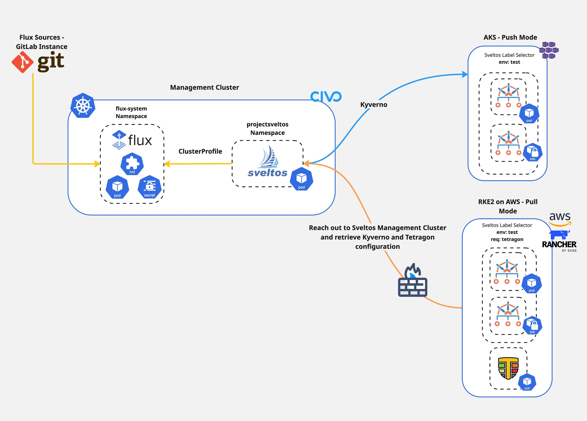

**Summary**:

[Sveltos](https://projectsveltos.github.io/sveltos/main/) **v1.0.0** release introduced a way to manage Kubernetes clusters in restricted network, environments behind a firewall or edge locations. Follow along to understand how the Sveltos **Pull Mode** works and how it can be deployed.
<!--truncate-->

## Diagram



## Scenario

In multi-cloud setups, Kubernetes clusters can be in isolated network segments. They might sit behind firewalls, at edge locations with limited connectivity, or in air-gapped environments. Each of these scenarios needs careful configuration and strong security controls. How can we manage these clusters and deploy add-ons and applications seamlessly while ensuring continuous drift-detection and reconciliation?

In today's post, we will install Sveltos in a [Civo](https://www.civo.com/) cluster, register an [RKE2](https://docs.rke2.io/) cluster hosted in [AWS](https://aws.amazon.com/) behind a firewall using the **Pull Mode** and an [AKS](https://azure.microsoft.com/products/kubernetes-service) cluster in default mode, **Push Mode**.

After the cluster registration, we will install [Kyverno](https://kyverno.io/) on both clusters for policy management, security, and compliance. Also, we will install [Cilium Tetragon](https://tetragon.io/docs/installation/) on the RKE2 cluster for security observability and runtime enforcement. Let's dive into the details!

## Lab Setup

```bash
+-------------------------------+---------------------+
|         Deployment             |       Version      |
+-------------------------------+---------------------+
|           Civo                 |   v1.31.6+k3s1     |
|           RKE2                 |     v1.32.5        |
|           AKS                  |     v0.24.1        |
|          Sveltos               |      v1.0.1        |
+-------------------------------+---------------------+
```

## Prerequisites

1. A Kubernetes management cluster
1. [sveltosctl](https://github.com/projectsveltos/sveltosctl/releases) installed
1. Sufficient rights to access the **management** and the **managed** clusters
1. (Optional) access to the AWS and AKS environment

## How does Pull Mode work?

Coming directly from the [Sveltos official documentation](https://projectsveltos.github.io/sveltos/main/register/register_cluster_pull_mode/).

>1. **Management Cluster**: It defines the desired state. We define our `ClusterProfile/Profile` resources in the **management** cluster, specifying which add-ons and configurations should be applied to which managed clusters by utilising the Kubernetes labels selection concept.
>2. **Managed Cluster**: Rather than the **management** cluster initiating all deployments, a component on the managed cluster initiates a connection to the management cluster.
>3. **Configuration Fetching**: The managed cluster pulls the relevant configuration, manifest, or Helm chart **from** the **management** cluster. The management cluster prepares the relevant configuration bundle for the managed clusters in Pull Mode.
>4. **Apply**: The managed cluster's local agent applies the pulled configurations to the cluster.

As the **managed** cluster sits in a restricted location, the **configuration bundle** is prepared by the **management** cluster. The **managed** cluster **initiates** a **connection** to the **management** cluster and gets the configuration bundle. Once the resources are provisioned, the configuration bundle is removed from the **management** cluster.

## Sveltos Installation

We will install Sveltos as a Helm chart in **Mode 1**. To explore more about the different installation methods, have a look [here](https://projectsveltos.github.io/sveltos/main/getting_started/install/install/).

### Helm Chart Installation

Follow the commands below and install Sveltos on a Kubernetes management cluster.

```bash
$ export KUBECONFIG=</path/to/Civo/management-cluster/kubeconfig>

$ helm repo add projectsveltos https://projectsveltos.github.io/helm-charts
$ helm repo update

$ helm install projectsveltos projectsveltos/projectsveltos -n projectsveltos --create-namespace --version=1.0.1
```

**Validation**

```bash
$ kubectl get pods -n projectsveltos

$ kubectl get sveltoscluster -A
NAMESPACE   NAME         READY   VERSION        AGE
mgmt        mgmt         true    v1.31.6+k3s1   39m
```

## Sveltos Managed Cluster Registration

### RKE2 on AWS - Pull Mode

As mentioned, the RKE2 cluster is behind a firewall. Only specific resources can be reached by the cluster. Thus, we will register this cluster in **Pull Mode**. Pointing the `KUBECONFIG` to the **management** cluster, execute the registration command. For more information about the registration process, visit [here](https://projectsveltos.github.io/sveltos/main/register/register_cluster_pull_mode/).

```bash showLineNumbers
$ export KUBECONFIG=</path/to/Civo/management-cluster/kubeconfig>

$ sveltosctl register cluster \
    --namespace=rke2\
    --cluster=cluster01 \
    --pullmode \
    --labels=env=test \
    > rke2_reg.yaml
```

Once the command is executed, Sveltos creates a manifest file that holds relevant resources about the cluster to be registered in **Pull Mode**. The secret contains the `kubeconfig` that is dynamically generated using the **token** associated with the **service account** located in the same file. Apart from that, Sveltos adds a new entry to the `Sveltoscluster` resource.

```bash
$ kubectl get sveltosclusters -A
NAMESPACE   NAME        READY   VERSION        AGE
mgmt        mgmt        true    v1.31.6+k3s1   50m
rke2        cluster01                          2s
```

We can see that `cluster01` in the `rke2` namespace is **not** **READY** yet, as it has no way to connect with the Sveltos management cluster. Let's go ahead and register the RKE2 cluster with Sveltos.

Ensure the **KUBECONFIG** points to the **RKE2** cluster and apply the `rke2_reg.yaml` manifest created above.

```bash
$ export KUBECONFIG=</path/to/RKE2/managed-cluster/kubeconfig>

$ kubectl apply -f rke2_reg.yaml 
namespace/projectsveltos created
serviceaccount/sveltos-applier-manager created
clusterrole.rbac.authorization.k8s.io/sveltos-applier-manager-role created
clusterrolebinding.rbac.authorization.k8s.io/sveltos-applier-manager-rolebinding created
service/sveltos-applier-metrics-service created
deployment.apps/sveltos-applier-manager created
secret/cluster01-sveltos-kubeconfig created
```
#### Validation

Once the resources are available, heading back to the Sveltos **management** cluster, we can see that `cluster01` is in a **READY** state.

```bash
$ export KUBECONFIG=</path/to/Civo/management-cluster/kubeconfig>

$ kubectl get sveltosclusters -A
NAMESPACE   NAME        READY   VERSION        AGE
mgmt        mgmt        true    v1.31.6+k3s1   51m
rke2        cluster01   true    v1.32.5        65s
```

This is great! We can now proceed with the AKS cluster and then start with the deployment of add-ons and applications to the cluster!

### AKS - Push Mode

Either using the `sveltosctl` or the [programmatic approach](https://projectsveltos.github.io/sveltos/main/register/register-cluster/#programmatic-registration), we will register the AKS cluster with Sveltos in **Push Mode**. To keep it concise, the `sveltosctl` is used.

```bash showLineNumbers
$ export KUBECONFIG=</path/to/Civo/management-cluster/kubeconfig>

$ sveltosctl register cluster \
    --namespace=aks \
    --cluster=cluster02 \
    --kubeconfig=aks_kubeconfig.yaml \
    --labels=env=test
```

#### Validation

```bash
$ export KUBECONFIG=</path/to/Civo/management-cluster/kubeconfig>

$ kubectl get sveltosclusters -A --show-labels
NAMESPACE   NAME        READY   VERSION        AGE      LABELS
aks         cluster02   true    v1.32.6        20s      env=test,projectsveltos.io/k8s-version=v1.32.6,sveltos-agent=present
mgmt        mgmt        true    v1.31.6+k3s1   52m      projectsveltos.io/k8s-version=v1.31.6+k3s1,sveltos-agent=present
rke2        cluster01   true    v1.32.5        125s     env=test
```

## Sveltos ClusterProfiles

During the registration process, we assigned the label `env: test` to both clusters. In this section, we will install **Kyverno** as a common Helm chart deployment and then **Cilium Tetragon** only in the **RKE2** cluster.

### Kyverno

```yaml showLineNumbers
---
apiVersion: config.projectsveltos.io/v1beta1
kind: ClusterProfile
metadata:
  name: deploy-kyverno
spec:
  clusterSelector:
    matchLabels:
      env: test
  syncMode: Continuous
  helmCharts:
  - repositoryURL:    https://kyverno.github.io/kyverno/
    repositoryName:   kyverno
    chartName:        kyverno/kyverno
    chartVersion:     v3.5.1
    releaseName:      kyverno-latest
    releaseNamespace: kyverno
    helmChartAction:  Install
```

```bash
$ export KUBECONFIG=</path/to/Civo/management-cluster/kubeconfig>

$ kubectl apply -f clusterprofile_kyverno.yaml
```

**What are the differences between Pull and Push mode when it comes to the Kyverno Helm chart deployment?**

- **AKS Push Mode**: In the default mode, Sveltos fetches the Kyverno Helm Chart to the **management** cluster and uses the **Helm golang libraries** to deploy it to the selected managed clusters.
- **RKE2 Pull Mode**: In this mode, Sveltos fetches the required resources and builds a **configuration bundle** for the **management** cluster. The agent in the RKE2 cluster starts a watcher and immediately knows when a new configuration needs to be depoloyed or withdrawn. **The managed cluster initiates a connection to the management cluster**.

To check what the configuration bundle looks like in the management cluster, execute the command below.

```bash
$ kubectl get configurationbundle -A
NAMESPACE   NAME                          AGE
rke2        config-0gdr5cqfqeb2ch6vnd9i   10s
rke2        config-2mdu7uw2vleritlx74xx   10s
rke2        config-2n2spj29ntt13v13gnlq   10s
rke2        config-6967nmjsiivmoluf5et5   12s
rke2        config-6g4e21ujapn8fh0yxsqm   10s
...
```

:::note
In **Pull Mode**, once the resources are provisioned, they are deleted from the **management** cluster.
:::

### Cilium Tetragon

>Cilium Tetragon enables powerful realtime, eBPF-based Security Observability and Runtime Enforcement.

It is required only on the **RKE2** cluster. For that reason, we will add a new label to the `cluster01` named `req: tetragon` and create a new `ClusterProfile`.

```bash
$ kubectl label sveltosclusters cluster01 -n rke2 req=tetragon
```

```yaml showLineNumbers
---
apiVersion: config.projectsveltos.io/v1beta1
kind: ClusterProfile
metadata:
  name: tetragon-rke2-deploy
spec:
  clusterSelector:
    matchLabels:
      req: tetragon
  helmCharts:
  - chartName: cilium/tetragon
    chartVersion: 1.5.0
    helmChartAction: Install
    releaseName: tetragon
    releaseNamespace: kube-system
    repositoryName: cilium
    repositoryURL: https://helm.cilium.io/
```

```bash
$ export KUBECONFIG=</path/to/Civo/management-cluster/kubeconfig>

$ kubectl apply -f clusterprofile_tetragon.yaml
```

Because we target the RKE2 cluster, Cilium Tetragon will get deployed only on this cluster, following the approach described above. The AKS cluster will remain intact.

### Validation

```bash
$ kubectl get clusterprofile,clustersummary -A
NAME                                                     AGE
clusterprofile.config.projectsveltos.io/deploy-kyverno   39s
clusterprofile.config.projectsveltos.io/tetragon-rke2-deploy  10s

NAMESPACE   NAME                                                                       AGE
aks         clustersummary.config.projectsveltos.io/deploy-kyverno-sveltos-cluster02   39s
rke2        clustersummary.config.projectsveltos.io/deploy-kyverno-sveltos-cluster01   39s
rke2        clustersummary.config.projectsveltos.io/tetragon-rke2-deploy-cluster01     10s
```

## Conclusion

With Sveltos, you can easily manage different Kubernetes clusters, no matter where they are or how their networks are set up! 🎉

## Resources

- [Sveltos - Quick Start](https://projectsveltos.github.io/sveltos/main/getting_started/install/quick_start/)
- [Sveltos Pull Mode](https://projectsveltos.github.io/sveltos/main/register/register_cluster_pull_mode/)
- [Deploy Add-ons and Applications](https://projectsveltos.github.io/sveltos/main/addons/addons/)
- [Sveltos What's New - Part 1](../2025-01-06-sveltos-what's-new/sveltos-what's-new-part-1.md)
- [Sveltos What's New - Part 2](../2025-01-06-sveltos-what's-new/sveltos-what's-new-part-2.md)
- [Sveltos Day 2 Operations](../2024-10-05-sveltos-day2-operations/sveltos-cilium-tetragon-day2-operations.md)

## ✉️ Contact

We are here to help! Whether you have questions, or issues or need assistance, our Slack channel is the perfect place for you. Click here to [join us](https://join.slack.com/t/projectsveltos/shared_invite/zt-1hraownbr-W8NTs6LTimxLPB8Erj8Q6Q).

## 👏 Support this project

Every contribution counts! If you enjoyed this article, check out the Projectsveltos [GitHub repo](https://github.com/projectsveltos). You can [star 🌟 the project](https://github.com/projectsveltos) if you find it helpful.

The GitHub repo is a great resource for getting started with the project. It contains the code, documentation, and many more examples.

Thanks for reading!