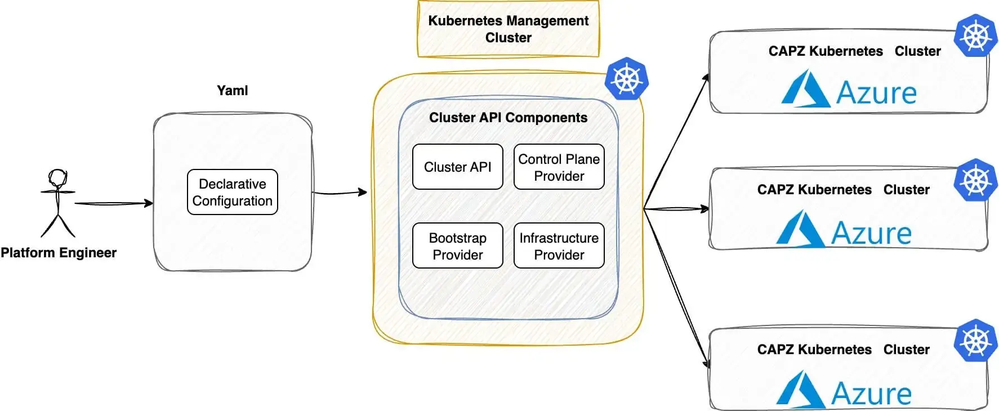

**Summary**:

In this post, we show how to use Cluster API (CAPI) to create Azure Kubernetes managed clusters. We will use Cilium as our Container Network Interface (CNI) and explore additional features. Follow along to experiment with CAPI and explore the Azure cloud.

<!--truncate-->


## Scenario

As organisations move towards hybrid-cloud strategies for Kubernetes, the demand for [Azure cloud](https://azure.microsoft.com/en-gb/) services rises in 2025. With the release of Kubernetes v1.34.1 in early September, I wanted to dive into its new features and revisit what Azure offers for cloud-native workloads.

It has been six months since I deployed Rancher RKE2 clusters on Azure, integrating service and cluster meshes with [Cilium](https://cilium.io/). Since then, the Kubernetes ecosystem has rapidly evolved, bringing new capabilities into sight. In today’s post, we will show you how to use [CAPI](https://cluster-api.sigs.k8s.io/) and [Cluster API Provider Azure (CAPZ)](https://capz.sigs.k8s.io/introduction) to automatically create Kubernetes clusters on Azure. We will take a fully declarative approach. Plus, we will use Cilium as a CNI and for added security and observability.

As this post is long, in [part 2](./azure-k8s-managed-clusters-with-capi-pt2.md) we will continue with the deployment of the CAPI cluster and the configuration of Cilium. In **part 3** of this series, we will dive into how [Sveltos](https://projectsveltos.github.io/sveltos/main/) can further automate and optimise the entire setup. Stay tuned!

## Prerequisites

1. An Azure cloud account
1. A Kubernetes cluster
1. Familiarity with Kubernetes manifest files
1. [Helm](https://helm.sh/docs/intro/install/) version > v3.17.x installed
1. [kubectl](https://kubernetes.io/docs/tasks/tools/#kubectl) and [clusterctl](https://cluster-api.sigs.k8s.io/user/quick-start#install-clusterctl) are installed

## Lab Setup

```bash
+-----------------------------+------------------+----------------------+
|          Resources          |      Type        |       Version        |
+-----------------------------+------------------+----------------------+
|        Ubuntu Server        |       VM         |     24.04.3 LTS      |
|     Management Cluster      |      Kind        |       v1.34.0        |
+-----------------------------+------------------+----------------------+

+-------------------+----------+
|      Tools        | Version  |
+-------------------+----------+
|      kind         | v0.30.0  |
|   clusterctl      | v1.11.1  |
+-------------------+----------+

+-------------------------------+----------+
|         Deployment            | Version  |
+-------------------------------+----------+
| cluster-api-azure-controller  | v1.21.0  |
|      azureserviceoperator     | v2.11.0  |
|     Cloud Provider Azure      | v1.34.1  |
|           Cilium              | v1.17.7  |
+-------------------------------+----------+

```

## GitHub Resources

The showcase repository is available [here](https://github.com/egrosdou01/blog-post-resources/tree/main/capi-azure-sveltos).

## Definitions

- **CAPI**: Bring a declarative, Kubernetes-style APIs to cluster creation, configuration, and management
- **CAPZ**: Enables efficient management of self-managed or managed AKS clusters on Azure at scale

## Kubernetes Management Cluster

Normally, I work with [RKE2](https://ranchermanager.docs.rancher.com/reference-guides/cluster-configuration/rancher-server-configuration/rke2-cluster-configuration) clusters; however, for this demonstration, we will use [Kind](https://kind.sigs.k8s.io/docs/user/quick-start/) as our management cluster. The reason for this change is that my lab is in maintenance mode. Below is the configuration used.

```bash
cat <<EOF > kind_cluster_extramounts.yaml
kind: Cluster
apiVersion: kind.x-k8s.io/v1alpha4
name: mgmt
networking:
  ipFamily: dual
nodes:
- role: control-plane
  extraMounts:
    - hostPath: /var/run/docker.sock
      containerPath: /var/run/docker.sock
EOF
```

To create and validate the cluster, use the commands listed below.

```bash
$ kind create cluster --config kind_cluster_extramounts.yaml

$ kubectl get nodes
NAME                 STATUS   ROLES           AGE   VERSION
mgmt-control-plane   Ready    control-plane   20m   v1.34.0
```

## Azure Cloud Setup

Before we begin creating the Kubernetes manifest files, we should set up the Azure cloud environment. That includes a definition of an application with the right permissions, a resource group, a managed identity in a dedicated area, etc..

### Azure CAPI Image Availability

I checked the documentation and saw that not all Azure locations have the latest CAPI version. The simplest way to check if the image works in your area is to use the **Azure command line utility**. For more details, have a look [here](https://learn.microsoft.com/en-us/cli/azure/install-azure-cli?view=azure-cli-latest).

```bash
$ az sig image-version list-community --public-gallery-name ClusterAPI-f72ceb4f-5159-4c26-a0fe-2ea738f0d019 --gallery-image-definition capi-ubun2-2404 --location <your location>
```

If `1.34.1` is not yet available, use a version of your preference.

:::note
As I am based in Europe, the `francecentral` location was used for this setup.
:::

### App Registration and Permissions

This is an important step as we will register an application that will allow us to authenticate and access Azure resources securely using OAuth 2.0. As this configuration was previously covered, go over the section [Set up Azure Cloud Environment](../2024-07-26-rancher-rke2-azure/rancher-rke2-cilium-azure.md#set-up-the-azure-cloud-environment) and perform the required steps.

:::tip
If you prefer to use the Azure cli, have a look at the [app registration](https://learn.microsoft.com/en-us/cli/azure/ad/app?view=azure-cli-latest) and the [permissions assigment](https://learn.microsoft.com/en-us/cli/azure/ad/app/permission?view=azure-cli-latest).
:::

### Resource Group

An Azure `resource group` is a logical container for related resources, such as virtual machines, storage, databases, and network interfaces. For the CAPI setup, we want to place all created resources into one logical container. For this demonstration, the resource group `capi-test` will be used.

1. Log in to the Azure Portal
1. From the Home search bar, type `Resource Groups`
1. Click the `+ Create` button
1. Provide a **subscription** name, the **resource group** name and the **region** the resources will be locatedin. Keep in mind to choose the same region as the CAPI image availability
1. Click "Review + create"

:::tip
The Azure cli reference: ```az group create --name "capi-test" --location "francecentral"```. Check out the [official documentation](https://learn.microsoft.com/en-us/azure/azure-resource-manager/management/manage-resource-groups-cli) for further details.
:::

### Managed Identities

In Azure, `managed identities` are automatic credentials. They let Azure resources securely log in and access other Azure services. This means we do not need to handle username or password details.

For the CAPI deployment, we will create a managed identity with the name set to `cloud-provider-user-identity` in the `capi-test` resource group.

1. Log in to the Azure Portal
1. From the Home search bar, type `Managed Identities`
1. Click the `+ Create` button
1. Provide a **subscription** name, the **resource group** name, and the **name** of the instance alongside the **region**. Keep in mind to choose the same region as the CAPI image availability
1. Click "Review + create"

:::tip
The Azure cli command reference: ```az identity create --name "cloud-provider-user-identity" --resource-group "capi-test" --location "francecentral"```. Check out the [official documentation](https://learn.microsoft.com/fr-fr/cli/azure/identity?view=azure-cli-latest) for further details.
:::

:::warning
If this step is skipped, the virtual machines will fail to be created.
:::

## clusterctl

To use the `clusterctl` utility, we must export variables related to the Azure environment. This step helps CAPI create the resources we need. For more information about this process, have a look at the official documentation located [here](https://cluster-api.sigs.k8s.io/user/quick-start#initialize-the-management-cluster).

### Export Required Variables

Start by exporting the Azure environment variables while continuing with the Azure Kubernetes resources in the management cluster.

```bash
$ export CLUSTER_TOPOLOGY=true

$ export AZURE_SUBSCRIPTION_ID="<your azure subscription ID>"

$ export AZURE_TENANT_ID="<your azure tenant ID>"
$ export AZURE_CLIENT_ID="<the client ID generated with the creation of the app in the previous step>"
$ export AZURE_CLIENT_ID_USER_ASSIGNED_IDENTITY=$AZURE_CLIENT_ID
$ export AZURE_CLIENT_SECRET="<the client Secret generated with the creation of the app in the previous step>"
```

```bash
$ export AZURE_CLUSTER_IDENTITY_SECRET_NAME="cluster-identity-secret"
$ export CLUSTER_IDENTITY_NAME="cluster-identity"
$ export AZURE_CLUSTER_IDENTITY_SECRET_NAMESPACE="default"
```

:::note
For the second set of commands, feel free to update the `secret` name and `identify` name alongside the `namespace` definition based on your needs. I will stick with the default ones.
:::

### Kubernetes Secret for AzureClusterIdentity

We will create a Kubernetes secret to include the password of the Service Principal identity created in Azure. This will be used by the AzureClusterIdentify referenced by the Azure cluster.

```bash
$ kubectl create secret generic "${AZURE_CLUSTER_IDENTITY_SECRET_NAME}" --from-literal=clientSecret="${AZURE_CLIENT_SECRET}" --namespace "${AZURE_CLUSTER_IDENTITY_SECRET_NAMESPACE}"
```

### Initialise Management Cluster

```bash
$ clusterctl init --infrastructure azure
Fetching providers
Installing cert-manager version="v1.18.2"
Installing provider="cluster-api" version="v1.11.1" targetNamespace="capi-system"
Installing provider="bootstrap-kubeadm" version="v1.11.1" targetNamespace="capi-kubeadm-bootstrap-system"
Installing provider="control-plane-kubeadm" version="v1.11.1" targetNamespace="capi-kubeadm-control-plane-system"
Installing provider="infrastructure-azure" version="v1.21.0" targetNamespace="capz-system"

Your management cluster has been initialized successfully!

You can now create your first workload cluster by running the following:

  clusterctl generate cluster [name] --kubernetes-version [version] | kubectl apply -f -
```

The above command will install many resources in the management clusters, including [`cert-manager`](https://cert-manager.io/), if it is not available. An example of what these resources look like is shown in the output below.

```bash
$ kubectl get ns
NAME                                STATUS   AGE
capi-kubeadm-bootstrap-system       Active   33s
capi-kubeadm-control-plane-system   Active   33s
capi-system                         Active   34s
capz-system                         Active   33s
cert-manager                        Active   64s
default                             Active   3m48s
kube-node-lease                     Active   3m48s
kube-public                         Active   3m48s
kube-system                         Active   3m49s
local-path-storage                  Active   3m45s
```

```bash
$ kubectl get all -n capz-system
NAME                                                           READY   STATUS              RESTARTS   AGE
pod/azureserviceoperator-controller-manager-58c5999595-tlw6q   1/1     Running             0          48s
pod/capz-controller-manager-79759545fd-lmxfm                   1/1     Running             0          48s

NAME                                                              TYPE        CLUSTER-IP      EXTERNAL-IP   PORT(S)    AGE
service/azureserviceoperator-controller-manager-metrics-service   ClusterIP   10.96.214.87    <none>        8443/TCP   48s
service/azureserviceoperator-webhook-service                      ClusterIP   10.96.233.161   <none>        443/TCP    48s
service/capz-webhook-service                                      ClusterIP   10.96.85.33     <none>        443/TCP    48s

NAME                                                      READY   UP-TO-DATE   AVAILABLE   AGE
deployment.apps/azureserviceoperator-controller-manager   1/1     1            1           48s
deployment.apps/capz-controller-manager                   1/1     1            1           48s

NAME                                                                 DESIRED   CURRENT   READY   AGE
replicaset.apps/azureserviceoperator-controller-manager-58c5999595   1         1         0       48s
replicaset.apps/capz-controller-manager-79759545fd                   1         1         0       48s
```

What is the purpose of the mentioned namespaces?

- **capi-kubeadm-bootstrap-system**: It contains CAPI bootstrap provider components that generate cloud-init scripts
- **capi-kubeadm-control-plane-system**: It holds the CAPI control plane provider that manages the Kubernetes control plane components
- **capi-system**: It is the core namespace for the CAPI deployment on the management cluster
- **capz-system**: It contains the CAPI provider for Azure details. CAPZ is an infrastructure provider for CAPI that allows the management and provisioning of Kubernetes clusters on Azure
- **cert-manager**: CAPI deploys the namespace and related resources during initialisation. It automates the issuance, management, and renewal of TLS certificates

:::note
Ensure all the resources in the mentioned namespaces are in a "Ready" state. If not, the CAPI deployment will be unsuccessful.
:::

### Azure Cluster Details

The next step is to define our Kubernetes cluster details, including the size of the virtual machines, the location, the resource group, etc.

```bash
$ export AZURE_LOCATION="francecentral"
$ export AZURE_CONTROL_PLANE_MACHINE_TYPE="Standard_D2s_v3"
$ export AZURE_NODE_MACHINE_TYPE="Standard_D2s_v3"
$ export AZURE_RESOURCE_GROUP="capi-test"
```

For this demonstration, we want to keep the deployment **costs as low as possible**. So, the smallest general-purpose virtual machine, `Standard_D2s_v3`, was defined for that location.

Let's create the Kubernetes manifests using the `clusterctl` command.

```bash
clusterctl generate cluster az04 \
  --infrastructure azure \
  --kubernetes-version v1.34.1 \
  --control-plane-machine-count=3 \
  --worker-machine-count=2 \
  > az04_capi_cluster.yaml
```

The command above will create the `az04_capi_cluster.yaml` file in the working directory and will include all the required resources to create a Kubernetes-managed cluster in Azure based on the specifications defined in the export variables. The resources below are included in the file, and below you can find a short description of each resource.

- **Cluster**: Represents the Kubernetes cluster abstraction
- **AzureCluster**: It holds Azure-specifix cluster resources
- **KubeadmControlPlane**: Manages the Kubernetes control plane lifecycle using kubeadm
- **AzureMachineTemplate**: Defines the Azure virtual machine specifications for the cluster nodes
- **MachineDeployment**: Manages a set of machines with rolling updates
- **KubeadmConfigTemplate**: It holds a template of the kubeadm configuration used by machines
- **AzureClusterIdentity**: Manages the Azure Identity and credentials for the newly created cluster operations

The next step is to update the `az04_capi_cluster.yaml` file with the correct Cluster Identity secret name and namespace details.

```bash
$ yq -i "with(. | select(.kind == \"AzureClusterIdentity\"); .spec.type |= \"ServicePrincipal\" | .spec.clientSecret.name |= \"${AZURE_CLUSTER_IDENTITY_SECRET_NAME}\" | .spec.clientSecret.namespace |= \"${AZURE_CLUSTER_IDENTITY_SECRET_NAMESPACE}\")" az04_capi_cluster.yaml
```

:::warning
To make the setup work, **two** manual changes had to happen!

1. An incorrect definition of the `secret` name under the `KubeadmControlPlane` resource exist. Update the line `name: az04-control-plane-azure-json` to `az04-md-0-azure-json`.

2. A change relates to the `ManagedIdentity` name under a specified resource group in Azure. Update the line `/subscriptions/123456788/resourceGroups/capz-ci/providers/Microsoft.ManagedIdentity/userAssignedIdentities/cloud-provider-user-identity` to `/subscriptions/123456788/resourceGroups/capi-test/providers/Microsoft.ManagedIdentity/userAssignedIdentities/cloud-provider-user-identity`. It appears the variable `AZURE_RESOURCE_GROUP` does not have an effect.
:::

The blog post is getting too long! Continue with [part 2](./azure-k8s-managed-clusters-with-capi-pt2.md).

## Conclusion

In **part 1** of the series we demonstrated the pre-work to use CAPI for Azure managed clusters. Continue with [**part 2**](./azure-k8s-managed-clusters-with-capi-pt2.md) to complete the setup! 🚀

## Resources

- [Cluster API Introduction](https://cluster-api.sigs.k8s.io/introduction)
- [Cluster API Provider Azure](https://capz.sigs.k8s.io/)
- [Cluster API Provider Azure - Troubleshooting](https://capz.sigs.k8s.io/self-managed/troubleshooting)
- [Azure Virtual Machines and Images per Location](https://capz.sigs.k8s.io/self-managed/custom-images)

## ✉️ Contact

If you have any questions, feel free to get in touch! You can use the `Discussions` option found [here](https://github.com/egrosdou01/blog.grosdouli.dev/discussions) or reach out to me on any of the social media platforms provided. 😊 We look forward to hearing from you!
