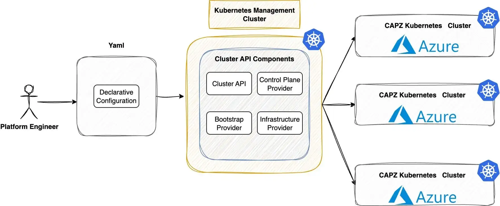

**Summary**:

This is part 2 of our series. Here, we show how to use Cluster API (CAPI) to create Azure Kubernetes managed clusters. We’ll use Cilium as our Container Network Interface (CNI) and explore additional features. Follow along to experiment with CAPI and explore the Azure cloud.

<!--truncate-->



## Scenario

As organisations move towards hybrid-cloud strategies for Kubernetes, the demand for [Azure cloud](https://azure.microsoft.com/en-gb/) services rises in 2025. With the release of **Kubernetes v1.34.1** in early September, I wanted to dive into its new features and revisit what Azure offers for cloud-native workloads.

It has been six months since I deployed Rancher RKE2 clusters on Azure, integrating service and cluster meshes with [Cilium](https://cilium.io/). Since then, the Kubernetes ecosystem has rapidly evolved, bringing new capabilities into sight. In today’s post, we will show you how to use [CAPI](https://cluster-api.sigs.k8s.io/) and [Cluster API Provider Azure (CAPZ)](https://capz.sigs.k8s.io/introduction) to automatically create Kubernetes clusters on Azure. We will take a fully declarative approach. Plus, we will use Cilium as a CNI and for added security and observability.

In part 3 of this series, we will dive into how [Sveltos](https://projectsveltos.github.io/sveltos/main/) can further automate and optimise the entire setup. Stay tuned!

## Prerequisites

Go through [part 1](azure-k8s-managed-clusters-with-capi-pt1.md) and ensure the setup is valid.

## Lab Setup

```bash
+-----------------------------+------------------+----------------------+
|          Resources          |      Type        |       Version        |
+-----------------------------+------------------+----------------------+
|        Ubuntu Server        |       VM         |     24.04.3 LTS      |
|     Management Cluster      |      Kind        |       v1.34.0        |
+-----------------------------+------------------+----------------------+

+-------------------+----------+
|      Tools        | Version  |
+-------------------+----------+
|      kind         | v0.30.0  |
|   clusterctl      | v1.11.1  |
+-------------------+----------+

+-------------------------------+----------+
|         Deployment            | Version  |
+-------------------------------+----------+
| cluster-api-azure-controller  | v1.21.0  |
|      azureserviceoperator     | v2.11.0  |
|     Cloud Provider Azure      | v1.34.1  |
|           Cilium              | v1.17.7  |
+-------------------------------+----------+

```

## GitHub Resources

The YAML outputs above are not complete. Have a look at the [GitHub repository](https://github.com/egrosdou01/blog-post-resources/tree/main/capi-azure-sveltos/pt1-2).

## Deployment

Once we are happy with the changes, we can proceed and apply the manifest `az04_capi_cluster.yaml` to the Kubernetes management cluster.

```bash
$ export KUBECONFIG=~/.kube/config

$ kubectl apply -f az04_capi_cluster.yaml
cluster.cluster.x-k8s.io/az04 created
azurecluster.infrastructure.cluster.x-k8s.io/az04 created
kubeadmcontrolplane.controlplane.cluster.x-k8s.io/az04-control-plane created
azuremachinetemplate.infrastructure.cluster.x-k8s.io/az04-control-plane created
machinedeployment.cluster.x-k8s.io/az04-md-0 created
azuremachinetemplate.infrastructure.cluster.x-k8s.io/az04-md-0 created
kubeadmconfigtemplate.bootstrap.cluster.x-k8s.io/az04-md-0 created
azureclusteridentity.infrastructure.cluster.x-k8s.io/cluster-identity created
```

### Validation

This is an ongoing process and many resources are deployed in the management cluster. There are many ways to keep track of the deployment and troubleshoot any issues that may arise during the process. Below are some of the commands used during the deployment.

```bash
$ kubectl get clusters
$ kubectl describe cluster <cluster name>
$ kubectl get kubeadmcontrolplane
$ kubectl describe kubeadmcontrolplane <name>
$ kubectl get machines,azuremachines
$ kubectl describe machine <machine-name>
$ kubectl describe azuremachine <azuremachine-name>
```

An easy way to check an understanding of what is happening with the deployment and whether it progresses with no issues, is by utilising the `watch kubectl get events --sort-by='.lastTimestamp'`. The command will give you a nice description of the latest events, and usually, they will point to the actions taken by the system to deploy the `az04` cluster in Azure.

Additionally, by looking into the Azure UI or by using the Azure CLI, check the `resource group` resources and the virtual machines section, which will start appearing very soon.

Once one controller and one worker node are successfully provisioned, we will be able to interact with the new cluster and check its status. The output of that would look like the following.

```bash
$ kubectl get machines,azuremachines -A
NAME                                                CLUSTER   NODE NAME   READY     AVAILABLE   UP-TO-DATE   PHASE         AGE    VERSION
machine.cluster.x-k8s.io/az04-control-plane-tbpg5   az04                  Unknown   False       True         Provisioned   4m3s   v1.34.1
machine.cluster.x-k8s.io/az04-md-0-44z9r-2r8sf      az04                  Unknown   False       True         Provisioned   4m2s   v1.34.1
machine.cluster.x-k8s.io/az04-md-0-44z9r-9m2cl      az04                  Unknown   False       True         Provisioned   4m2s   v1.34.1

NAME                                                                    READY   SEVERITY   REASON   STATE       AGE
azuremachine.infrastructure.cluster.x-k8s.io/az04-control-plane-tbpg5   True                        Succeeded   4m3s
azuremachine.infrastructure.cluster.x-k8s.io/az04-md-0-44z9r-2r8sf      True                        Succeeded   4m3s
azuremachine.infrastructure.cluster.x-k8s.io/az04-md-0-44z9r-9m2cl      True                        Succeeded   4m2s
```

## Azure Kubernetes Cluster

### Export Kubeconfig

On the machine where the `clusterctl` utility was installed and pointing to the **kind** management cluster (```export KUBECONFIG=~/.kube/config```), perform the command ```clusterctl get kubeconfig az04 > az04.kubeconfig```.

```bash
$ export KUBECONFIG=az04.kubeconfig

$ kubectl get nodes -o wide
NAME                       STATUS     ROLES           AGE     VERSION   INTERNAL-IP   EXTERNAL-IP   OS-IMAGE             KERNEL-VERSION      CONTAINER-RUNTIME
az04-control-plane-tbpg5   NotReady   control-plane   3m37s   v1.34.1   <none>        <none>        Ubuntu 24.04.3 LTS   6.11.0-1018-azure   containerd://1.7.25
az04-md-0-44z9r-2r8sf      NotReady   <none>          90s     v1.34.1   <none>        <none>        Ubuntu 24.04.3 LTS   6.11.0-1018-azure   containerd://1.7.25
az04-md-0-44z9r-9m2cl      NotReady   <none>          97s     v1.34.1   <none>        <none>        Ubuntu 24.04.3 LTS   6.11.0-1018-azure   containerd://1.7.25
```

From the output above, we can see that not all defined nodes are available and in a "NotReady" state. This is because the required additional component, `cloud-controller-manager`, is required alongside a CNI.

### Deploy Helm Chart - Azure Cloud Provider

Based on the official documentation, we need to install a cloud provider which is responsible for running cloud-specific controllers. Once the Helm chart is deployed in the Azure cluster, the remaining nodes will begin populating.

```bash
$ export KUBECONFIG=az04.kubeconfig

$ helm install --repo https://raw.githubusercontent.com/kubernetes-sigs/cloud-provider-azure/master/helm/repo cloud-provider-azure --generate-name --set infra.clusterName=az04 --set cloudControllerManager.clusterCIDR="192.168.0.0/16"
```

After deploying the Helm chart, the pods named `cloud-node-manager-<id>` will appear in the `kube-system` namespace. Their count will match the number of Kubernetes cluster nodes.

```bash
$ kubectl get pods -n kube-system | grep -i cloud
cloud-controller-manager-5b85cd9cb4-ldph4          0/1     Pending   0          18s
cloud-node-manager-5h5qw                           1/1     Running   0          18s
cloud-node-manager-llf5d                           1/1     Running   0          18s
cloud-node-manager-vtsvb                           1/1     Running   0          18s
```

:::note
The `cloud-controller-manager-5b85cd9cb4-ldph4` pod is in "Pending" state as there is no CNI defined. Continue to the next section and install Cilium!
:::

### kube-proxy

The CAPI deployment does not allow us to disable the `kube-proxy` during the creation of the cluster. Because we installed Cilium with `kubeProxyReplacement` enabled, it is safe to remove any `kube-proxy` components and let Cilium be our proxy.

### Deploy Helm Chart -  Cilium CNI

For the Azure CAPI deployment, we cannot specify a CNI while creating the manifest files; we need to install the Cilium Helm chart during the creation process of the cluster. We will enable `kubeProxyReplacement`, `Hubble`, `Hubble Relay` for now.

```bash
$ export KUBECONFIG=az04.kubeconfig

$ helm install cilium cilium/cilium --namespace kube-system --create-namespace --version 1.17.7 --set ipam.mode="cluster-pool" --set ipam.operator.clusterPoolIPv4PodCIDRList="{192.168.0.0/16}" --set ipam.operator.clusterPoolIPv4MaskSize=24 --set kubeProxyReplacement=true --set bpf.masquerade=true --set hubble.ui.enabled=true  --set hubble.relay.enabled=true
```

#### Validation
```bash
$ export KUBECONFIG=az04.kubeconfig

$ kubectl get pods -n kube-system -w
NAME                                               READY   STATUS    RESTARTS   AGE
cilium-cmd8f                                       1/1     Running   0          4m38s
cilium-cqz92                                       1/1     Running   0          4m38s
cilium-envoy-7j4mj                                 1/1     Running   0          2m3s
cilium-envoy-g4pbs                                 1/1     Running   0          4m38s
cilium-envoy-gcblb                                 1/1     Running   0          4m38s
cilium-envoy-hplb9                                 1/1     Running   0          4m38s
cilium-envoy-ndcjw                                 1/1     Running   0          4m38s
cilium-kbwz6                                       1/1     Running   0          2m3s
cilium-operator-6774d6498f-kws4x                   1/1     Running   0          4m38s
cilium-operator-6774d6498f-w6nsb                   1/1     Running   0          4m38s
cilium-rcbsd                                       1/1     Running   0          4m38s
cilium-s65vj                                       1/1     Running   0          4m38s
cloud-controller-manager-5b85cd9cb4-ldph4          1/1     Running   0          8m19s
cloud-node-manager-55mfh                           1/1     Running   0          2m3s
cloud-node-manager-5h5qw                           1/1     Running   0          8m19s
cloud-node-manager-llf5d                           1/1     Running   0          8m19s
cloud-node-manager-vtsvb                           1/1     Running   0          8m19s
cloud-node-manager-vv26l                           1/1     Running   0          6m4s
coredns-66bc5c9577-dqwtw                           1/1     Running   0          12m
coredns-66bc5c9577-ll72s                           1/1     Running   0          12m
etcd-az04-control-plane-f9xhp                      1/1     Running   0          107s
etcd-az04-control-plane-tbpg5                      1/1     Running   0          12m
etcd-az04-control-plane-wn2jk                      1/1     Running   0          6m4s
hubble-relay-7f6ffb44fb-bvds8                      1/1     Running   0          4m38s
hubble-ui-5f65bfb688-szzb6                         2/2     Running   0          4m38s
kube-apiserver-az04-control-plane-f9xhp            1/1     Running   0          107s
kube-apiserver-az04-control-plane-tbpg5            1/1     Running   0          12m
kube-apiserver-az04-control-plane-wn2jk            1/1     Running   0          6m4s
kube-controller-manager-az04-control-plane-f9xhp   1/1     Running   0          107s
kube-controller-manager-az04-control-plane-tbpg5   1/1     Running   0          12m
kube-controller-manager-az04-control-plane-wn2jk   1/1     Running   0          6m4s
kube-scheduler-az04-control-plane-f9xhp            1/1     Running   0          107s
kube-scheduler-az04-control-plane-tbpg5            1/1     Running   0          12m
kube-scheduler-az04-control-plane-wn2jk            1/1     Running   0          6m4s
```

```bash
$ kubectl exec -it ds/cilium -n kube-system -- cilium status
Defaulted container "cilium-agent" out of: cilium-agent, config (init), mount-cgroup (init), apply-sysctl-overwrites (init), mount-bpf-fs (init), clean-cilium-state (init), install-cni-binaries (init)
KVStore:                 Disabled   
Kubernetes:              Ok         1.34 (v1.34.1) [linux/amd64]
Kubernetes APIs:         ["EndpointSliceOrEndpoint", "cilium/v2::CiliumClusterwideNetworkPolicy", "cilium/v2::CiliumEndpoint", "cilium/v2::CiliumNetworkPolicy", "cilium/v2::CiliumNode", "cilium/v2alpha1::CiliumCIDRGroup", "core/v1::Namespace", "core/v1::Pods", "core/v1::Service", "networking.k8s.io/v1::NetworkPolicy"]
KubeProxyReplacement:    True   [eth0   10.0.0.4 fe80::6245:bdff:fe6f:1d83 (Direct Routing)]
Host firewall:           Disabled
SRv6:                    Disabled
CNI Chaining:            none
CNI Config file:         successfully wrote CNI configuration file to /host/etc/cni/net.d/05-cilium.conflist
Cilium:                  Ok   1.17.7 (v1.17.7-621ebf56)
NodeMonitor:             Listening for events on 2 CPUs with 64x4096 of shared memory
Cilium health daemon:    Ok   
IPAM:                    IPv4: 4/254 allocated from 192.168.0.0/24, 
IPv4 BIG TCP:            Disabled
IPv6 BIG TCP:            Disabled
BandwidthManager:        Disabled
Routing:                 Network: Tunnel [vxlan]   Host: BPF
Attach Mode:             TCX
Device Mode:             veth
Masquerading:            BPF   [eth0]   192.168.0.0/24 [IPv4: Enabled, IPv6: Disabled]
Controller Status:       32/32 healthy
Proxy Status:            OK, ip 192.168.0.47, 0 redirects active on ports 10000-20000, Envoy: external
Global Identity Range:   min 256, max 65535
Hubble:                  Ok              Current/Max Flows: 4095/4095 (100.00%), Flows/s: 53.83   Metrics: Disabled
Encryption:              Disabled        
Cluster health:          5/5 reachable   (2025-09-29T07:02:27Z)
Name                     IP              Node   Endpoints
Modules Health:          Stopped(0) Degraded(0) OK(60)
```

## Overall Validation


```bash
$ export KUBECONFIG=~/.kube/config

$ kubectl get nodes -o wide
NAME                       STATUS   ROLES           AGE     VERSION   INTERNAL-IP   EXTERNAL-IP   OS-IMAGE             KERNEL-VERSION      CONTAINER-RUNTIME
az04-control-plane-f9xhp   Ready    control-plane   8m31s   v1.34.1   10.0.0.6      <none>        Ubuntu 24.04.3 LTS   6.11.0-1018-azure   containerd://1.7.25
az04-control-plane-tbpg5   Ready    control-plane   18m     v1.34.1   10.0.0.4      <none>        Ubuntu 24.04.3 LTS   6.11.0-1018-azure   containerd://1.7.25
az04-control-plane-wn2jk   Ready    control-plane   12m     v1.34.1   10.0.0.5      <none>        Ubuntu 24.04.3 LTS   6.11.0-1018-azure   containerd://1.7.25
az04-md-0-44z9r-2r8sf      Ready    <none>          16m     v1.34.1   10.1.0.5      <none>        Ubuntu 24.04.3 LTS   6.11.0-1018-azure   containerd://1.7.25
az04-md-0-44z9r-9m2cl      Ready    <none>          16m     v1.34.1   10.1.0.4      <none>        Ubuntu 24.04.3 LTS   6.11.0-1018-azure   containerd://1.7.25

$ kubectl get machines,azuremachines -A
NAMESPACE   NAME                                                CLUSTER   NODE NAME                  READY   AVAILABLE   UP-TO-DATE   PHASE     AGE   VERSION
default     machine.cluster.x-k8s.io/az04-control-plane-f9xhp   az04      az04-control-plane-f9xhp   True    True        True         Running   12m   v1.34.1
default     machine.cluster.x-k8s.io/az04-control-plane-tbpg5   az04      az04-control-plane-tbpg5   True    True        True         Running   21m   v1.34.1
default     machine.cluster.x-k8s.io/az04-control-plane-wn2jk   az04      az04-control-plane-wn2jk   True    True        True         Running   16m   v1.34.1
default     machine.cluster.x-k8s.io/az04-md-0-44z9r-2r8sf      az04      az04-md-0-44z9r-2r8sf      True    True        True         Running   21m   v1.34.1
default     machine.cluster.x-k8s.io/az04-md-0-44z9r-9m2cl      az04      az04-md-0-44z9r-9m2cl      True    True        True         Running   21m   v1.34.1

NAMESPACE   NAME                                                                    READY   SEVERITY   REASON   STATE       AGE
default     azuremachine.infrastructure.cluster.x-k8s.io/az04-control-plane-f9xhp   True                        Succeeded   12m
default     azuremachine.infrastructure.cluster.x-k8s.io/az04-control-plane-tbpg5   True                        Succeeded   21m
default     azuremachine.infrastructure.cluster.x-k8s.io/az04-control-plane-wn2jk   True                        Succeeded   16m
default     azuremachine.infrastructure.cluster.x-k8s.io/az04-md-0-44z9r-2r8sf      True                        Succeeded   21m
default     azuremachine.infrastructure.cluster.x-k8s.io/az04-md-0-44z9r-9m2cl      True                        Succeeded   21m

$ kubectl get kubeadmcontrolplane
NAME                 CLUSTER   AVAILABLE   DESIRED   CURRENT   READY   AVAILABLE   UP-TO-DATE   INITIALIZED   AGE   VERSION
az04-control-plane   az04      True        3         3         3       3           3            true          25m   v1.34.1

```

## Test Deployment - Azure Cluster

To test the deployment, we will simply create an Nginx application and ensure everything is working as expected.

```bash
$ export KUBECONFIG=az04.kubeconfig

$ kubectl create deployment nginx --image=nginx:latest --replicas=3   
deployment.apps/nginx created

$ kubectl expose deployment nginx --port=80 --target-port=80
service/nginx exposed

$ kubectl get pods,svc
NAME                         READY   STATUS    RESTARTS   AGE
pod/nginx-7c5d8bf9f7-hpr52   1/1     Running   0          48s
pod/nginx-7c5d8bf9f7-kbsxj   1/1     Running   0          48s
pod/nginx-7c5d8bf9f7-v2m5d   1/1     Running   0          48s

NAME                 TYPE        CLUSTER-IP      EXTERNAL-IP   PORT(S)   AGE
service/kubernetes   ClusterIP   10.96.0.1       <none>        443/TCP   16m
service/nginx        ClusterIP   10.111.235.43   <none>        80/TCP    6s
```

```bash
$ kubectl run curl-test --image=busybox:latest --restart=Never -it --rm -- /bin/sh
All commands and output from this session will be recorded in container logs, including credentials and sensitive information passed through the command prompt.
If you don't see a command prompt, try pressing enter.
/ # wget -qO- http://nginx
<!DOCTYPE html>
<html>
<head>
<title>Welcome to nginx!</title>
<style>
html { color-scheme: light dark; }
body { width: 35em; margin: 0 auto;
font-family: Tahoma, Verdana, Arial, sans-serif; }
</style>
</head>
<body>
<h1>Welcome to nginx!</h1>
<p>If you see this page, the nginx web server is successfully installed and
working. Further configuration is required.</p>

<p>For online documentation and support please refer to
<a href="http://nginx.org/">nginx.org</a>.<br/>
Commercial support is available at
<a href="http://nginx.com/">nginx.com</a>.</p>

<p><em>Thank you for using nginx.</em></p>
</body>
</html>
```


## Upgrade Approach

As everything is defined in a declarative manner, to upgrade a CAPI cluster to a newer Kubernetes version it becomes an easy and straighforward approach. We only need to update the `KubeadmControlPlane` and the `MachineDeployment` Kubernetes version to the desired one. CAPI will perform the following in exchange.

1. Spin up new nodes with the targeted Kubernetes version
1. Drain and effectively delete the old nodes
1. The node count and the virtual machine capacity will remain unchanged
1. The workloads remain uneffected from the upgrade

In **part 3**, we will demonstrate how the upgrade of CAPI clusters becomes seamless with the use of Sveltos.

## Deployment Cost

The creation of the cluster took around 25 minutes, and the cost was only **0,28 Euro**. Keeping in mind the prices applied to the virtual machines created in the setup.


## Conclusion

In parts 1 and 2, we demonstrated a way to use CAPI to provision and deploy Kubernetes clusters on Azure based on our needs. In **part 3** of the series, we will demonstrate how to use [Sveltos](https://projectsveltos.github.io/sveltos/main/) and allow Platform teams to build highly scalable and maintainable Kubernetes clusters following a GitOps approach.

## Resources

- [Cloud Azure Provider Helm chart](https://github.com/kubernetes-sigs/cloud-provider-azure/tree/master/helm/cloud-provider-azure)
- [Cilium Helm Chart](https://artifacthub.io/packages/helm/cilium/cilium/1.17.7)
- [Cilium Official Documentation](https://docs.cilium.io/en/v1.17/)
- [Cluster API Provider Azure - Troubleshooting](https://capz.sigs.k8s.io/self-managed/troubleshooting)

## ✉️ Contact

If you have any questions, feel free to get in touch! You can use the `Discussions` option found [here](https://github.com/egrosdou01/blog.grosdouli.dev/discussions) or reach out to me on any of the social media platforms provided. 😊 We look forward to hearing from you!
