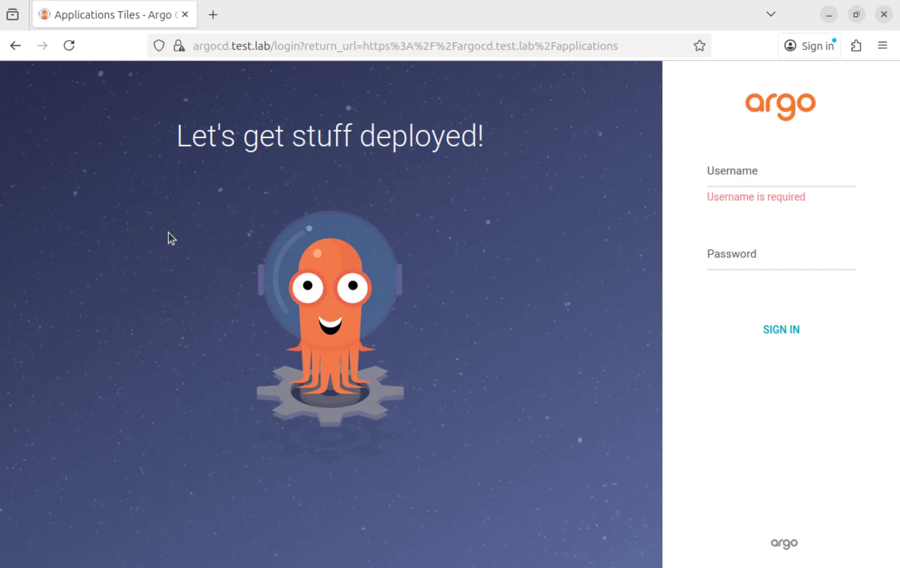

**Summary**:

An easy way to migrate ArgoCD running on an RKE2 cluster from Ingress NGINX to Cilium Ingress.

<!--truncate-->

## Scenario

If you are a Platform, DevOps, or seasonal engineer using Kubernetes, you have likely heard about the Ingress NGINX retirement. The project will be archived at the beginning of 2026, and no active maintenance, security patches or bug fixes will be provided. For more information, read the relevant [announcement](https://kubernetes.io/blog/2025/11/11/ingress-nginx-retirement/). Now, there is no need to panic. For a quick migration, we will use the [Cilium Ingress](https://docs.cilium.io/en/stable/network/servicemesh/ingress/#tls-passthrough-and-source-ip-visibility). But feel free to explore other alternatives like [HAProxy Ingress](https://www.haproxy.com/documentation/kubernetes-ingress/) or [Traefik](https://traefik.io/traefik).

**Cilium Ingress** supports standard Kubernetes ingress resources. So, it can be used for path-based routing and for TLS termination. That means, we will keep the existing Ingress manifest and update only the required fields specific to Cilium. For the demonstration, I already have an RKE2 cluster up and running. I will show you the required parameters to deploy Cilium and enable its Ingress functionality. If you are as excited as I am, let's dive into the Cilium magic! ✨🪄

## Lab Setup

```bash
+-----------------+----------------------+------------------------+
|  Cluster Name   |         Type         |        Version         |
+-----------------+----------------------+------------------------+
|    RKE2         |  Management Cluster  | RKE2 v1.34.1+rke2r1    |
+-----------------+----------------------+------------------------+

+-------------+----------+
|  Deployment | Version  |
+-------------+----------+
|    ArgoCD   |  v3.2.0  |
|    Cilium   |  v1.18.1 |
+-------------+----------+
```

## RKE2 Parameters

Here are the parameters needed to install an [RKE2](https://docs.rke2.io/) cluster, deploy Cilium as the Container Network Interface (CNI), and enable Cilium Ingress. As I am not running BGP locally, I utilise the [**l2announcements**](https://docs.cilium.io/en/latest/network/l2-announcements/) alongside the [**Ciliums IP Address Management(IPAM)**](https://docs.cilium.io/en/stable/network/concepts/ipam/index.html) capabilities. To explore the l2announcements with the IPAM setup, take a look at a [**previous post**](../2025-03-09-dual-stack-proxmox-pfsense-rke2-cilium/proxmox-pfsense-rke2-dual-stack-cilium-complementary-features.md).

### Server Configuration

```yaml showLineNumbers
cat << 'EOF' > /etc/rancher/rke2/config.yaml
write-kubeconfig-mode: 0644
tls-san:
  - <your cluster name>
token: rke2
cni: cilium
cluster-cidr: "10.42.0.0/16"
service-cidr: "10.43.0.0/16"
node-ip: "the node IP of the master node"
disable: rke2-ingress-nginx # You can disable the RKE2 Ingress NGINX from the setup (optional)
disable-kube-proxy: true
EOF
```

### Cilium Helm Chart Configuration

Specific to the Cilium Ingress setup, have a look at the [Cilium official documentation](https://docs.cilium.io/en/stable/network/servicemesh/ingress/#cilium-s-ingress-config-and-ciliumnetworkpolicy). Effectively, `kubeProxyReplacement=true` or `nodePort.enabled=true` needs to be set. Then, we can activate Ingress-specific details.

```yaml showLineNumbers
cat << 'EOF' > /var/lib/rancher/rke2/server/manifests/rke2-cilium-config.yaml
apiVersion: helm.cattle.io/v1
kind: HelmChartConfig
metadata:
  name: rke2-cilium
  namespace: kube-system
spec:
  valuesContent: |-
    image:
      tag: v1.18.1
    // highlight-start
    kubeProxyReplacement: true
    // highlight-end
    k8sServiceHost: 127.0.0.1
    k8sServicePort: 6443
    operator:
      replicas: 1
    // highlight-start
    ingressController:
       enabled: true
       loadbalancerMode: dedicated
    // highlight-end
    hubble:
      enabled: true
      relay:
        enabled: true
      ui:
        enabled: true
EOF
```

Check out the [Cilium Helm chart values](https://github.com/cilium/cilium/blob/main/install/kubernetes/cilium/values.yaml) for more information.

### Existing RKE2 Cluster with Cilium

For an existing RKE2 cluster powered with Cilium, we only need to perform a Helm chart upgrade.

```yaml showLineNumbers
kubeProxyReplacement: true
ingressController:
    enabled: true
    loadbalancerMode: dedicated
```

```bash
$ helm upgrade rke2-cilium rke2-charts/rke2-cilium --version 1.18.103 --namespace kube-system -f values.yaml
```

### Validation

```bash
$ kubectl get ingressclass | grep cilium
cilium   cilium.io/ingress-controller   <none>       135m
```

## ArgoCD with Ingress NGINX Configuration

Below is the old ArgoCD configuration using the Ingress NGINX controller.

```yaml showLineNumbers
apiVersion: networking.k8s.io/v1
kind: Ingress
metadata:
  name: argocd-server-ingress
  namespace: argocd
  // highlight-start
  annotations:
    nginx.ingress.kubernetes.io/force-ssl-redirect: "true"
    nginx.ingress.kubernetes.io/ssl-passthrough: "true"
    // highlight-end
spec:
  // highlight-start
  ingressClassName: nginx
  // highlight-end
  rules:
  - host: argocd-nginx.test.lab
    http:
      paths:
      - path: /
        pathType: Prefix
        backend:
          service:
            name: argocd-server
            port:
              name: http
  tls:
  - hosts:
    - argocd-nginx.test.lab
    secretName: argocd-server-tls # as expected by argocd-server
```

## ArgoCD with Cilium Ingress Configuration

```yaml showLineNumbers
apiVersion: networking.k8s.io/v1
kind: Ingress
metadata:
  name: argocd-cilium-ingress
  namespace: argocd
  // highlight-start
  annotations:
    ingress.cilium.io/tls-passthrough: enabled
    ingress.cilium.io/loadbalancer-class: io.cilium/l2-announcer
    // highlight-end
spec:
  // highlight-start
  ingressClassName: cilium
    // highlight-end
  rules:
    - host: argocd.test.lab
      http:
        paths:
          - path: /
            pathType: Prefix
            backend:
              service:
                name: argocd-server
                port:
                  name: http
  tls:
    - hosts:
        - argocd.test.lab
      secretName: argocd-server-cilium-tls
```

:::note
The `ingress.cilium.io/loadbalancer-class: io.cilium/l2-announcer` annotation can be used because the `loadbalancerMode: dedicated` was defined, and allows us to choose a specific loadbalancer class for the ingress.
:::

If we compare the old with the new configuration, the changes are **minimal**. We define the [Cilium TLS passthrough annotation](https://docs.cilium.io/en/stable/network/servicemesh/ingress/#tls-passthrough-and-source-ip-visibility) alongside the `ingressClassName` to Cilium. Once the new configuration has been applied, check the `Ingress` resource.

```bash
$ kubectl get svc -n kube-system | grep cilium
cilium-ingress                            LoadBalancer   10.43.213.160   10.10.20.10   80:31172/TCP,443:31657/TCP   48m

$ kubectl apply -f cilium_ingress.yaml

$ kubectl get ingress -n argocd
NAME                    CLASS    HOSTS                   ADDRESS        PORTS     AGE
argocd-ingress-nginx    nginx    argocd-nginx.test.lab   10.10.20.114   80, 443   8m35s
argocd-cilium-ingress   cilium   argocd.test.lab         10.10.20.11    80, 443   5s
```

The easiest way to simultaneously test the new setup is by creating a temporary subdomain for the Cilium Ingress. Once testing is complete, migrate to the Cilium ingress controller.

:::tip
As we defined the `loadbalancerMode: dedicated`, the Ingress controller creates a dedicated `LoadBalancer` sevice. Looking at the ingress with name **argocd-cilium-ingress**, the ADDRESS field comes from the `CiliumLoadBalancerIPPool` resource. The IPv4 pool was created in the cluster.
:::

## Access ArgoCD UI

As long as the DNS is working as expected, we will be able to resolve the FQDN defined in the `Ingress` configuration.

To test locally on Linux and macOS, update the '/etc/hosts' file. Add the IP address of a Kubernetes worker node, then the FQDN. For Windows-based systems, you can modify the 'C:\Windows\System32\Drivers\etc\hosts' file.

**URL**: https://argocd.test.lab



## Further Reading

A great [article by Dean Lewis](https://isovalent.com/blog/post/navigating-the-ingress-nginx-archival-why-now-is-the-time-to-move-to-cilium/) describes alternatives and easy-to-follow steps to move from Ingress NGINX to Cilium. If you want to explore how Cilium integrates with [Gateway API](https://gateway-api.sigs.k8s.io/) and [cert-manager](https://cert-manager.io/), take a look at the [Cilium Complementary Features blog](../2025-03-09-dual-stack-proxmox-pfsense-rke2-cilium/proxmox-pfsense-rke2-dual-stack-cilium-complementary-features.md).

## Resources

- [Cilium ingress support](https://docs.cilium.io/en/stable/network/servicemesh/ingress/)


## Conclusion

With a few tweaks, migrate the ArgoCD deployment to the Cilium ingress controller! 

## ✉️ Contact

If you have any questions, feel free to get in touch! You can use the `Discussions` option found [here](https://github.com/egrosdou01/blog.grosdouli.dev/discussions) or reach out to me on any of the social media platforms provided. 😊 We look forward to hearing from you!
