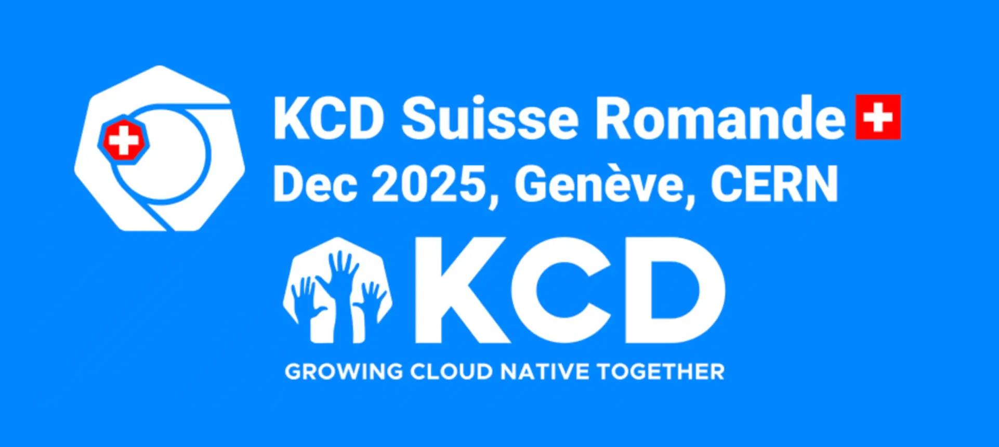
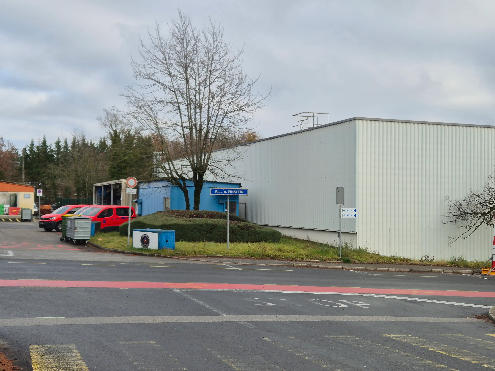
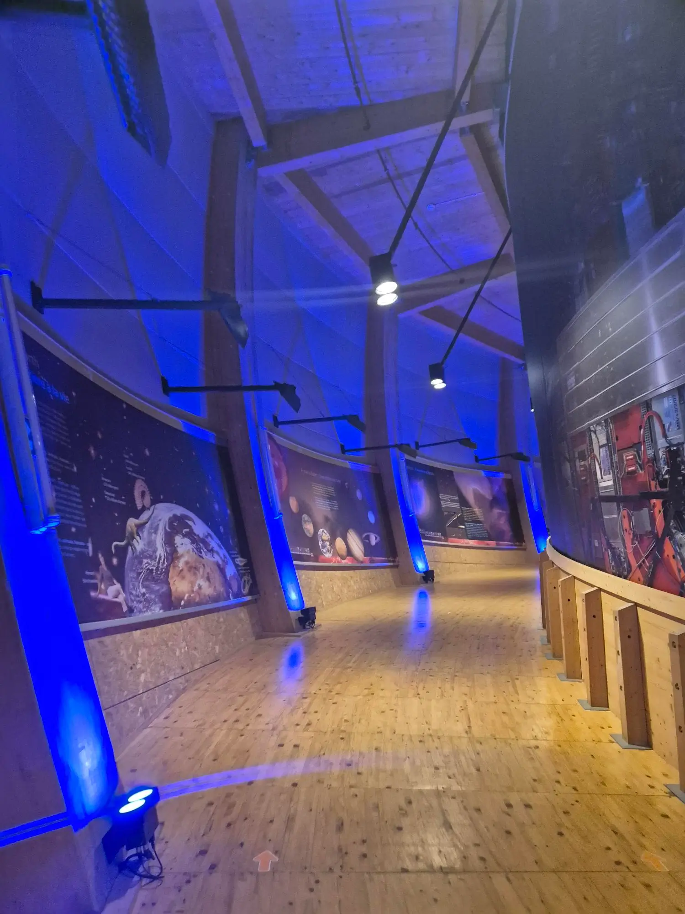
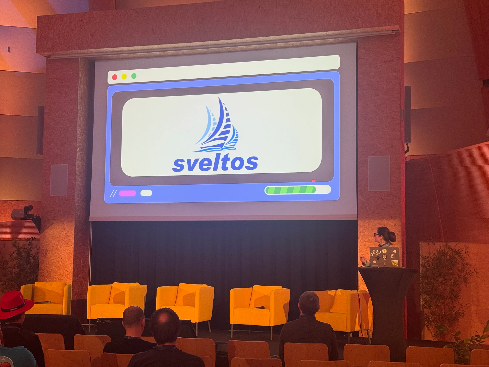

**Summary**:

My KCD Geneva 2025 highlights.

<!--truncate-->

[Image Source](https://community.cncf.io/events/details/cncf-kcd-suisse-romande-presents-kcd-suisse-romande/)

## Introduction

Between the 4th and the 5th of December, the first KCD in Geneva took place! Since the event was in CERN, participating was a no-brainer. Great organisers, speakers, and attendees wanted to share and learn the latest news and trends in Kubernetes. Below are some of the things and technologies I learned, alongside meeting great people!

## Day 1

The day started early for me as I took my flight at 06:00 AM and landed around 9:00 AM in Geneva. After a quick look at the airport and a warm black coffee, I headed to CERN to attend the tour around Antiproton Decelerator (AD). If you visit Geneva, CERN is something you want to see. The campus is easily accessible from the city centre and the airport using the tram line 18. Check out the [tour dates and details](https://visits.web.cern.ch/families-individual-visitors), and the [museum exhibitions](https://visits.web.cern.ch/index.php/exhibitions) which are available all year long.

Besides sightseeing, the day featured great workshops. Rachid Zarouali led a deep dive into Cluster API. Luc Juggery ran a capture the flag session, and Manuel Schindler explored Platform Engineering in the Age of AI. [The full schedule is available here](https://sessionize.com/view/rlq5we3p/GridSmart).

The day concluded with a lovely dinner downtown and us enjoying a super tasty cheese fondue.

[Image Source](https://www.geneve.com/)

## Day 2

When I got to Geneva, the mountain view was breath taking. After a walk through the old town and by the river, the city's beauty revealed itself. A quick run around the lake, and before heading to the main KCD event.

Moving to the specifics. The day was packed with talks, discussions and lightning talks. Below are some of the technologies I learned, and how others use different tools and approaches in production systems. The first talk was from Swisscom on the evolution in Telecom. The session showed how Swisscom built a cloud-native automation framework that converts high-level intent into ready-to-deploy network configurations within seconds. It highlighted how Kubernetes Resource Models, MetalLB, and NetBox work together to create a scalable, repeatable workflow capable of launching a 5G Core network in minutes.

The next session was about asynchronous workflows and how [Dapr](https://github.com/dapr/dapr) and [OpenTelemetry](https://github.com/open-telemetry) work together to simplify building and observing asynchronous microservice workflows. It demonstrated how Dapr Workflows enable clean, boilerplate-free service orchestration, and how the OpenTelemetry Operator provides automatic instrumentation to generate consistent traces, metrics, and logs—even across asynchronous boundaries. I am not sure this is something I will try in my lab anytime soon, but it might be interesting to explore if you are more in the development space. On the plus side, the pizza delivery demo was fun!

Why not a panel discussion about AI in Kubernetes or Kubernetes in AI? From the questions asked and the answers provided, there seem to be different approaches, challenges and use cases when it comes to AI in the cloud-native landscape. There is definitely no one-size-fits-all approach, but there is a lot of space for improvement, innovation and Platform engineering that can shape the use of AI. More interestingly, topics around sovereignty in Europe came up. For more information about the topic, have a look at the [link](https://www.heise.de/en/news/CNCF-Standardizes-AI-Infrastructure-with-New-Kubernetes-Program-11074526.html).

[Cluster API](https://cluster-api.sigs.k8s.io/introduction) and its wider usage were explored by Michele Gazzetti and Michele Tagliani. They demonstrated how Cluster API and [Metal3](https://github.com/metal3-io/baremetal-operator) streamline bare-metal Kubernetes cluster management, and proposed extending the Cluster API to manage non-Kubernetes hosts as well. By leveraging  [Virtual Kubelet](https://virtual-kubelet.io/docs/), the speakers presented a proof of concept showing how a Cluster API Bootstrap Provider could unify management across diverse environments. If you want to explore or support their efforts, take a look at the [GitHub repo](https://github.com/IBM/cluster-api-bootstrap-virtual-kubelet).

Closing notes by Sarah Novotny about building communities that challenge corporate concentration and how trust fits in the open source communities, the importance concluded the two day conference with a positive message.

## Sveltos in CERN

Of course, Sveltos was not missing from the event. A lightning talk showed how Sveltos helps teams deploy easily and confidently. It also explained how Sveltos tackles tool sprawl and breaks down silos between teams!

## Resources

- [KCD Geneva](https://community.cncf.io/events/details/cncf-kcd-suisse-romande-presents-kcd-suisse-romande/)
- [Getting Started with Sveltos](https://projectsveltos.github.io/sveltos/main/getting_started/install/quick_start/)

## Conclusion

The open-source and cloud-native community, both in Geneva and around the world, makes these events unique and special. Thanks to the organisers, the experience was fantastic, and the event delivered real value to everyone who attended. Until next year!

## ✉️ Contact

If you have any questions, feel free to get in touch! You can use the `Discussions` option found [here](https://github.com/egrosdou01/blog.grosdouli.dev/discussions) or reach out to me on any of the social media platforms provided. 😊 We look forward to hearing from you!
