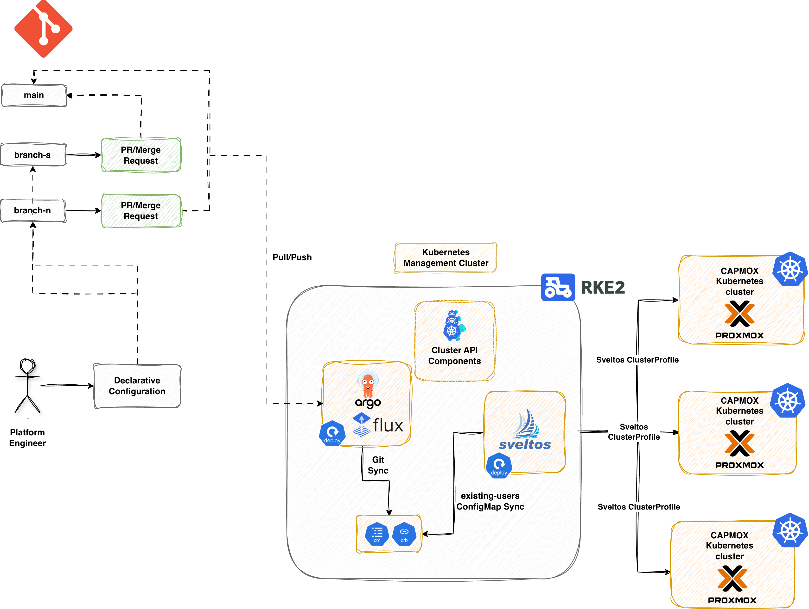

**Summary**:

Learn how to use [Sveltos](https://github.com/projectsveltos) to automate the creation of Cluster API (CAPI) clusters on Proxmox using the CAPMOX provider.

<!--truncate-->


## Scenario

In [part 1](./k8s-managed-clusters-capmox.md) of the series we explored how to use the [CAPMOX provider](https://github.com/ionos-cloud/cluster-api-provider-proxmox) to spin up and down Kubernetes clusters on [Proxmox](https://proxmox.com/en/). [Cilium](https://cilium.io/) was the prefered Container Network Interface (CNI) for the setup.

In the initial part, we saw how to deploy a cluster step-by-step and executed the commands locally to create clusters. Today, we will explore how Sveltos using its advanced templating capabilities can automate the workflow for us using just a few manifest files.

## Prerequisites

Go through the previous posts and get an understanding of how the existing setup looks like. Ensure any prerequisites are satisfied.

## Lab Setup

```bash
+-----------------------------+------------------+----------------------+
|          Resources          |      Type        |       Version        |
+-----------------------------+------------------+----------------------+
|        Ubuntu Server        |       VM         |     24.04.3 LTS      |
|     Management Cluster      |      RKE2        |     v1.33.7+rke2r1   |
+-----------------------------+------------------+----------------------+

+-------------------+----------+
|      Tools        | Version  |
+-------------------+----------+
|   clusterctl      | v1.10.6  |
+-------------------+----------+

+-------------------------------+----------+
|         Deployment            | Version  |
+-------------------------------+----------+
|           CAPMOX              | v0.7.5   |
|           Cilium              | v1.18.5  |
|           Sveltos             | v1.2.1   |
+-------------------------------+----------+
```

## GitHub Resources

The YAML outputs are not complete. Take a look at the [GitHub repository](https://github.com/egrosdou01/blog-post-resources/tree/main/capi-proxmox-sveltos/pt3) for the complete code examples.

## What is Sveltos?

Sveltos is a set of **Kubernetes controllers** deployed in a **management** cluster. From a management cluster, Sveltos can control **add-ons** and **applications** for a fleet of clusters. This works whether they are on-prem or in the Cloud. Sveltos supports a wide range of Kubernetes clusters and multitenant setups!

## Sveltos - Management Cluster

In a Kubernetes management cluster of your preference, go ahead and [install Sveltos](https://projectsveltos.github.io/sveltos/main/getting_started/install/install/) either as a **Helm chart** or as a **manifest** file. Whatever your preferred method is.

```bash
$ export KUBECONFIG=</path/to/management/cluster/kubeconfig>

$ helm repo add projectsveltos https://projectsveltos.github.io/helm-charts
$ helm repo update

$ helm install projectsveltos projectsveltos/projectsveltos -n projectsveltos --create-namespace --version 1.2.1 --set agent.managementCluster=true # Install Sveltos in Mode 2: Centralised Agent Mode
```

### Label Management Cluster

To apply and manage resources in the Sveltos **management** cluster, we will add the label `type=mgmt.` Sveltos will then deploy the required resources directly there.

```bash
$ export KUBECONFIG=</path/to/management/cluster/kubeconfig>

$ kubectl get sveltosclusters -A --show-labels
NAMESPACE   NAME   READY   VERSION   AGE     LABELS
mgmt        mgmt   true    v1.34.0   3m33s   projectsveltos.io/k8s-version=v1.34.0,sveltos-agent=present,type=mgmt
```

## CAPI - Management Cluster

Ensure CAPI is already installed in the Kubernetes management cluster! In case of doubts, have a look at the [official CAPI documentation](https://cluster-api.sigs.k8s.io/user/quick-start).

## Manifest Preparation

Our goal is to remove all manual processes from deploying self-managed Kubernetes clusters on **Proxmox** via **CAPI**. We also want to avoid managing multiple automation and templating tools simultaneously. Sveltos offers robust [templating features](https://projectsveltos.github.io/sveltos/main/template/intro_template/) that allow you to customise manifest files for various requirements. From there, it can provision any required add-ons or applications—all within a single, unified workflow. This results in reduced complexity, fewer dependencies, and a more efficient process for platform teams and developers.

The resources listed below are intended to be deployed exclusively through Sveltos. In production setups, manifests are usually stored in a Git repository. [ArgoCD](https://argo-cd.readthedocs.io/en/stable/) or [FluxCD](https://fluxcd.io/) handles synchronization in the management cluster where Sveltos runs.

### CAPI Resources

In our GitOps setup, we will transform the [manifest file](k8s-managed-clusters-capmox.md#proxmox-cluster-details) created by CAPI into a Sveltos template. This **Sveltos template** will be filled with developer information sourced from a ConfigMap called `existing-users`. Next, we will process it to instantiate the CAPI template beforehand using the data contained in that ConfigMap.

**Users ConfigMap**

```yaml showLineNumbers
cat << EOF > cm_ext_users.yaml
apiVersion: v1
kind: ConfigMap
metadata:
  name: existing-users
  namespace: default
data:
  user01: |
    env: test
    version: "1.33.3"
    controlplaneendpoint: "10.10.10.10"
    addresses: "10.10.10.11-10.10.10.15"
    gateway: "10.10.10.1"
#   user02: |
#     env: staging
#     version: "1.33.3"
#     controlplaneendpoint: "10.10.10.16"
#     addresses: "10.10.10.17-10.10.10.22"
#     gateway: "10.10.10.1"
EOF
```

**CAPI Manifest - Sveltos Template**

Let's go ahead and convert the [mentioned manifest](./k8s-managed-clusters-capmox.md#proxmox-cluster-details) into a Sveltos template. We will itterate through the `existing-users` ConfigMap and craft the file with the given information. Pay attention to the highlighted lines as they show how Sveltos templating works.

```yaml showLineNumbers
---
apiVersion: v1
kind: ConfigMap
metadata:
  name: deploy-capmox
  namespace: default
  annotations:
    projectsveltos.io/template: ok
data:
  capmox.yaml: |
    // highlight-start
    {{- if index (getResource "Users") "data" }}
      {{- range $key, $value := (getResource "Users").data }}
        {{- $user := $value | fromYaml }}
    // highlight-end
          apiVersion: cluster.x-k8s.io/v1beta1
          kind: Cluster
        // highlight-start
          metadata:
            name: {{ $key }}
            namespace: default
            labels:
              env: {{ $user.env }}
        // highlight-end
          spec:
            clusterNetwork:
              pods:
                cidrBlocks:
                - 10.44.0.0/16
            controlPlaneRef:
              apiVersion: controlplane.cluster.x-k8s.io/v1beta1
              kind: KubeadmControlPlane
              name: {{ $key }}-control-plane
            infrastructureRef:
              apiVersion: infrastructure.cluster.x-k8s.io/v1alpha1
              kind: ProxmoxCluster
              name: {{ $key }}
    ---
          apiVersion: infrastructure.cluster.x-k8s.io/v1alpha1
          kind: ProxmoxCluster
          metadata:
            name: {{ $key }}
            namespace: default
        // highlight-start
          spec:
            allowedNodes:
            - pve
            controlPlaneEndpoint:
              host: {{ $user.controlplaneendpoint }}
              port: 6443
            dnsServers:
            - {{ $user.gateway }}
            ipv4Config:
              addresses:
              - {{ $user.addresses }}
              gateway: {{ $user.gateway }}
              prefix: 24
        // highlight-end
            schedulerHints:
              memoryAdjustment: 0
    ...
    ---
    {{- end }}
    {{- end }}
```

:::note
The `projectsveltos.io/template: ok` annotation is required and instructs Sveltos to  instantiate the content of the ConfigMap.
:::

In a GitOps scenario, ArgoCD or Flux will syncronise the code to the **management** cluster. As we do not include the installation of ArgoCD or Flux, we will deploy the manifests to the **management** clusters manually.

```bash
$ export KUBECONFIG=</path/to/management/cluster/kubeconfig>

$ kubectl apply -f cm_capmox.yaml
$ kubectl apply -f cm_users.yaml
```

### Sveltos Resources

Now that we have created the ConfigMap resources, we will use two [Sveltos `ClusterProfiles`](https://projectsveltos.github.io/sveltos/main/addons/combining_all/). First, we will deploy the required resources to the management cluster. Then, we will perform the Cilium deployment to the newly created managed clusters.

**CAPI main deployment**

```yaml showLineNumbers
cat << EOF > clusterprofile_capmox.yaml
---
apiVersion: config.projectsveltos.io/v1beta1
kind: ClusterProfile
metadata:
  name: deploy-capmox
spec:
  clusterSelector:
    matchLabels:
      type: mgmt
  templateResourceRefs:
  - resource:
      apiVersion: v1
      kind: ConfigMap
      name: existing-users
      namespace: default
    identifier: Users
  policyRefs:
  - name: deploy-capmox
    namespace: default
    kind: ConfigMap
EOF
```

```bash
$ export KUBECONFIG=</path/to/management/cluster/kubeconfig>

$ kubectl apply -f clusterprofile_capmox.yaml
```

Once the `ClusterProfile` resources are deployed in the **management** cluster, Sveltos will match the cluster using the defined Kubernetes label `type: mgmt`.

### Managed Cluster - Sveltos Resources

As mentioned before, as soon as the Kubernetes API server is available, we can install the CNI of our preference. However, we can solve this manual step with a Sveltos `ClusterProfile` that targets the **newly** created clusters. As we tag the clusters using the labels `test|staging`, we can filter for those and apply the below Sveltos `ClusterProfile` resource.

**Managed Cluster - Common Resources**

```yaml showLineNumbers
cat << EOF > clusterprofile_managed.yaml
---
apiVersion: config.projectsveltos.io/v1beta1
kind: ClusterProfile
metadata:
  name: deploy-capmox-managed
spec:
  clusterSelector:
    matchExpressions:
    - { key: env, operator: In, values: [ test, staging ] }
  syncMode: Continuous
  helmCharts:
  - chartName: cilium/cilium
    chartVersion: 1.18.5
    helmChartAction: Install
    releaseName: cilium
    releaseNamespace: kube-system
    repositoryName: cilium
    repositoryURL: https://helm.cilium.io/
    values: |
      ipam:
        mode: "cluster-pool"
        operator:
          clusterPoolIPv4PodCIDRList:
            - "10.44.0.0/16"
          clusterPoolIPv4MaskSize: 24
        kubeProxyReplacement: true
        operator:
          replicas: 1
EOF
```

The YAML above will deploy Cilium as a Helm chart once the CAPI cluster is in "Ready" state. Deploy both manifest files in the **management** cluster.

```bash
$ export KUBECONFIG=</path/to/management/cluster/kubeconfig>

$ kubectl apply -f clusterprofile_managed.yaml
```

### Validation

#### General CAPMOX Validation

```bash
$ export KUBECONFIG=</path/to/management/cluster/kubeconfig>

$ kubectl get machines,proxmoxmachines -A
NAMESPACE   NAME                                                  CLUSTER   NODENAME                     PROVIDERID                                       PHASE     AGE    VERSION
default     machine.cluster.x-k8s.io/user01-control-plane-t4g4d   user01    user01-control-plane-t4g4d   proxmox://d06df583-7812-42a3-9562-f14b90c0a089   Running   116s   v1.33.3
default     machine.cluster.x-k8s.io/user01-workers-5w4kf-92rl5   user01    user01-workers-5w4kf-92rl5   proxmox://56cb6565-fffd-4afc-825c-083dfee0411b   Running   102s   v1.33.3

NAMESPACE   NAME                                                                        CLUSTER   READY   NODE   PROVIDER_ID                                      MACHINE
default     proxmoxmachine.infrastructure.cluster.x-k8s.io/user01-control-plane-t4g4d   user01    true    pve    proxmox://d06df583-7812-42a3-9562-f14b90c0a089   user01-control-plane-t4g4d
default     proxmoxmachine.infrastructure.cluster.x-k8s.io/user01-workers-5w4kf-92rl5   user01    true    pve    proxmox://56cb6565-fffd-4afc-825c-083dfee0411b   user01-workers-5w4kf-92rl5
```

#### General Sveltos Resources

```bash
$ export KUBECONFIG=</path/to/management/cluster/kubeconfig>
$ kubectl get clusterprofile,clustersummary -A
```

#### ClusterSummary - CAPI Cluster Validation Creation

```yaml
$ kubectl get clustersummary.config.projectsveltos.io/deploy-capmox-sveltos-mgmt -n mgmt -o yaml
status:
  dependencies: no dependencies
  deployedGVKs:
  - deployedGroupVersionKind:
    - Cluster.v1beta1.cluster.x-k8s.io
    - ProxmoxCluster.v1alpha1.infrastructure.cluster.x-k8s.io
    - KubeadmControlPlane.v1beta1.controlplane.cluster.x-k8s.io
    - ProxmoxMachineTemplate.v1alpha1.infrastructure.cluster.x-k8s.io
    - MachineDeployment.v1beta1.cluster.x-k8s.io
    - KubeadmConfigTemplate.v1beta1.bootstrap.cluster.x-k8s.io
    featureID: Resources
  featureSummaries:
  - featureID: Resources
    hash: lMvsHAyJdQh7knshsfindBy/8U2AGjwDmVgOQbePOzI=
    lastAppliedTime: "2026-01-26T13:16:06Z"
    status: Provisioned
```

#### ClusterSummary - Managed Cluster Validation Resources

```yaml
$ kubectl get clustersummary.config.projectsveltos.io/deploy-capmox-managed-capi-user01 -o yaml
status:
  dependencies: no dependencies
  featureSummaries:
  - featureID: Helm
    hash: VNTjfOJaQalaKvh0/CrSLPjVSWq5ejmiZJB4wAwfpME=
    lastAppliedTime: "2026-01-26T13:17:14Z"
    status: Provisioned
  helmReleaseSummaries:
  - releaseName: cilium
    releaseNamespace: kube-system
    status: Managing
    valuesHash: ulFRcRWvp09XwjfSMPZCdnkdzjTTx7GniUV9dfCVybQ=
```
The outputs show the CAPI cluster named `user01` has been set up successfully by Sveltos!

## How does it work?

The logic we follow is straightforward. Ideally, a GitOps controller will be used to synchronise the **Kubernetes** and **Sveltos** resources to the **management** cluster. Then, Sveltos handles the creation of the clusters alongside the deployment of the add-ons and the applications, like we did with [Cilium and the Azure Cloud Provider](../2025-10-08-capi-azure-cilium-sveltos/azure-k8s-managed-clusters-with-capi-and-sveltos.md).

When a change is detected in the `existing-users` ConfigMap, the GitOps controller updates the **management** cluster. Sveltos notices this change and takes action. If, for example, we add an additional cluster, Sveltos is going to create the CAPI cluster for us. If we remove a cluster from the ConfigMap, Sveltos is going to delete the CAPI cluster. If we update the Kubernetes version in the ConfigMap for a CAPI cluster, Sveltos will apply the changes. Then, CAPI will smoothly update the cluster.

## CAPI Cluster Upgrade

Previously, we talked about a CAPI cluster upgrade and how CAPI handles this situation. Since the current setup uses Sveltos, the Kubernetes cluster upgrades become seamless. We only need to update the Kubernetes version of the cluster defined in the `existing-users` ConfigMap, and Sveltos takes care of the rest. Sveltos will apply the changes, and CAPI will follow the standard process for updating the cluster. First, create the controlplane virutal machines with the defined version, remove the old controlplane machines and then continue with the worker nodes. The snippet shows an upgrade of a cluster from `v1.33.3` to `v1.33.7`.

```yaml showLineNumbers
cat << EOF > cm_ext_users.yaml
---
apiVersion: v1
kind: ConfigMap
metadata:
  name: existing-users
  namespace: default
data:
  user01: |
    env: test
    // highlight-start
    version: "1.33.7"
    // highlight-end
    controlplaneendpoint: "10.10.10.10"
    addresses: "10.10.10.11-10.10.10.15"
    gateway: "10.10.10.1"
EOF
```

```bash
$ export KUBECONFIG=</path/to/management/cluster/kubeconfig>

$ kubectl get machines,proxmoxmachines -A
NAMESPACE   NAME                                                  CLUSTER   NODENAME                     PROVIDERID                                       PHASE          AGE     VERSION
default     machine.cluster.x-k8s.io/user01-control-plane-cptfb   user01                                                                                  Provisioning   16s     v1.33.7
default     machine.cluster.x-k8s.io/user01-control-plane-t4g4d   user01    user01-control-plane-t4g4d   proxmox://d06df583-7812-42a3-9562-f14b90c0a089   Running        4m49s   v1.33.3
default     machine.cluster.x-k8s.io/user01-workers-5w4kf-92rl5   user01    user01-workers-5w4kf-92rl5   proxmox://56cb6565-fffd-4afc-825c-083dfee0411b   Running        4m35s   v1.33.3

NAMESPACE   NAME                                                                        CLUSTER   READY   NODE   PROVIDER_ID                                      MACHINE
default     proxmoxmachine.infrastructure.cluster.x-k8s.io/user01-control-plane-cptfb   user01            pve                                                     user01-control-plane-cptfb
default     proxmoxmachine.infrastructure.cluster.x-k8s.io/user01-control-plane-t4g4d   user01    true    pve    proxmox://d06df583-7812-42a3-9562-f14b90c0a089   user01-control-plane-t4g4d
default     proxmoxmachine.infrastructure.cluster.x-k8s.io/user01-workers-5w4kf-92rl5   user01    true    pve    proxmox://56cb6565-fffd-4afc-825c-083dfee0411b   user01-workers-5w4kf-92rl5

$ kubectl get machines
NAME                         CLUSTER   NODENAME                     PROVIDERID                                       PHASE      AGE     VERSION
user01-control-plane-cptfb   user01    user01-control-plane-cptfb   proxmox://c1d04461-4741-4148-946a-fea1a354ff0b   Running    97s     v1.33.7
user01-control-plane-t4g4d   user01    user01-control-plane-t4g4d   proxmox://d06df583-7812-42a3-9562-f14b90c0a089   Deleting   6m10s   v1.33.3
user01-workers-5w4kf-92rl5   user01    user01-workers-5w4kf-92rl5   proxmox://56cb6565-fffd-4afc-825c-083dfee0411b   Running    5m56s   v1.33.3

$ kubectl get machines
NAME                         CLUSTER   NODENAME                     PROVIDERID                                       PHASE          AGE     VERSION
user01-control-plane-cptfb   user01    user01-control-plane-cptfb   proxmox://c1d04461-4741-4148-946a-fea1a354ff0b   Running        2m34s   v1.33.7
user01-workers-5w4kf-92rl5   user01    user01-workers-5w4kf-92rl5   proxmox://56cb6565-fffd-4afc-825c-083dfee0411b   Running        6m53s   v1.33.3
user01-workers-94hjx-4c7hx   user01                                                                                  Provisioning   4s      v1.33.7
```

## Conclusion

You made it to the end of the series! In this part, we showed how to use Sveltos. The approach taken helps Platform teams to create scalable and maintainable Kubernetes clusters. We used CAPI on Proxmox and followed a GitOps approach to achieve our goal. With the proposed setup, teams own and manage the infrastructure, ensure add-ons and application deployments stay up to date on managed clusters, and maintain versioned, auditable applications and manifests. 🚀

## Resources

- [Sveltos Quick Start](https://projectsveltos.github.io/sveltos/main/getting_started/install/quick_start/)
- [Sveltos Installation Details](https://projectsveltos.github.io/sveltos/main/getting_started/install/install/)
- [Cluster API Introduction](https://cluster-api.sigs.k8s.io/introduction)

## ✉️ Contact

If you have any questions, feel free to get in touch! You can use the `Discussions` option found [here](https://github.com/egrosdou01/blog.grosdouli.dev/discussions) or reach out to me on any of the social media platforms provided. 😊 We look forward to hearing from you!

## Series Narigation

| Part | Title |
| :--- | :---- |
| [Part 1](./k8s-managed-clusters-capmox.md) | Introduction to CAPMOX |
| [Part 2](./k8s-managed-clusters-capmox-tshoot-insights.md) | Troubleshooting CAPMOX deployments |
| [Part 3](./k8s-managed-clusters-capmox-sveltos.md) | CAPMOX with Sveltos |
