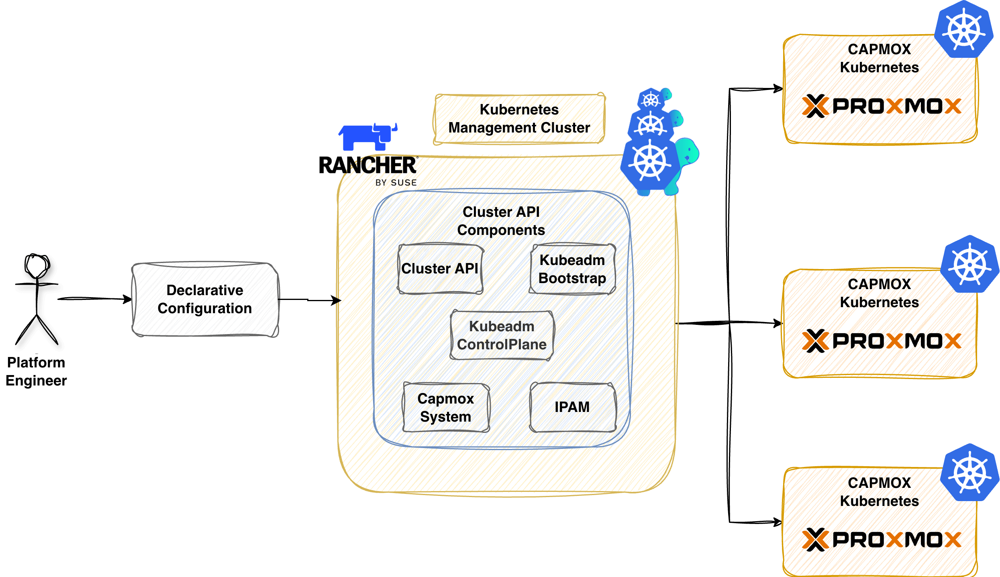

**Summary**:

Learn how to use the [image-builder](https://github.com/kubernetes-sigs/image-builder) to craft a base Ubuntu 24.04 image for Kubernetes and how [Cluster API (CAPI)](https://cluster-api.sigs.k8s.io/introduction) helps teams provision, manage, and automate the lifecycle of Kubernetes clusters on a Proxmox server.

<!--truncate-->


## Scenario

If someone were to tell me that CAPI will solve most of my issues when it comes to the lifecycle of Kubernetes clusters across on-premises and Cloud environments, I would smile and stay silent. My first interaction with CAPI was overwhelming. I found it hard to navigate through the documentation, as many of the providers were in an early or experimental state, and the main question was whether the project would continue to evolve or be forgotten. The choice back then was hard to make.  More stable or safer bets were available, like Infrastructure as Code (IaC) tools using Terraform providers and Ansible for configuration.

Fast forward now, and the CAPI ecosystem has significantly evolved. Major hyperscalers and virtualisation technologies have their own provider, allowing teams to provision Kubernetes clusters in any infrastructure using Kubernetes Custom Resource Definitions (CRDs) and manifests.

Working more and more with CAPI, I decided to start building Kubernetes clusters on [Proxmox](https://www.proxmox.com/en/). My initial attempt failed miserably in June 2025. As many different components are involved, attention to the used versions, underlying management cluster, local networking etc. could affect the success the process. In December 2025, performed a number of software updates and after [Kyriakos Akriotis motivation post](https://www.linkedin.com/posts/akyriako_build-your-own-managed-kubernetes-service-activity-7385295814992224256-xx-i/), I decided to revisit the topic.

## Prerequisites

1. Sufficient permissions to create a dedicated Proxmox PVE user and a Token
1. A Kubernetes cluster
1. Familiarity with Kubernetes manifest files
1. [Helm](https://helm.sh/docs/intro/install/) version > v3.17.x installed
1. [kubectl](https://kubernetes.io/docs/tasks/tools/#kubectl) and [clusterctl](https://cluster-api.sigs.k8s.io/user/quick-start#install-clusterctl) are installed

## Lab Setup

```bash
+-----------------------------+------------------+----------------------+
|          Resources          |      Type        |       Version        |
+-----------------------------+------------------+----------------------+
|        Ubuntu Server        |       VM         |     24.04.3 LTS      |
|     Management Cluster      |      RKE2        |     v1.33.6+rke2r1   |
+-----------------------------+------------------+----------------------+

+-------------------+----------+
|      Tools        | Version  |
+-------------------+----------+
|   clusterctl      | v1.10.6  |
+-------------------+----------+

+-------------------------------+----------+
|         Deployment            | Version  |
+-------------------------------+----------+
|           CAPMOX              | v0.7.5   |
|           Cilium              | v1.18.5  |
+-------------------------------+----------+

```

## GitHub Resources

The YAML outputs are not complete. Have a look at the [GitHub repository](https://github.com/egrosdou01/blog-post-resources/tree/main/capi-proxmox-sveltos/pt1-2) for the complete code examples.

## Definitions

- **Image Builder**: It is a tool for building Kubernetes virtual machines across different infrastructure providers. Check out the [official GitHub repository](https://github.com/kubernetes-sigs/image-builder) for more details about the available options
- **CAPI**: Bring a declarative, Kubernetes-style API to cluster creation, configuration, and management
- **CAPMOX**: Enables efficient management of self-managed Kubernetes clusters on Proxmox

## Workflow

Below is a simplification of the steps taken to build an Ubuntu 24.04 image with everything it needs to spin up and down Kubernetes clusters ([kubeadm installation](https://kubernetes.io/docs/setup/production-environment/tools/kubeadm/install-kubeadm/)). We deploy CAPI on an [RKE2](https://docs.rke2.io/) management cluster alongside the cluster creation using CAPMOX.

- Create a base Ubuntu 24.04 image using the `image-builder`
- Install `clusterctl` on a workstation
- Initialise CAPI for Proxmox as a provider on an RKE2 management cluster
- Generate the required manifests for the downstream clusters

## Image Builder

Going through the [official CAPI Provider Proxmox documentation](https://github.com/ionos-cloud/cluster-api-provider-proxmox/blob/main/docs/Usage.md), the **Proxmox VE builder** is the way to go when it comes to standardizing the base image creation for Kubernetes clusters. We followed the steps outlined in the [documentation](https://image-builder.sigs.k8s.io/capi/providers/proxmox).

### Proxmox - Create CAPMOX User

To allow the image-builder to push the generated `.iso` to the Proxmox server, we need a user with the right set of permissions. We can either create a `PVEAdmin` user or create a user following the [least privileges approach](https://github.com/ionos-cloud/cluster-api-provider-proxmox/blob/main/docs/advanced-setups.md#proxmox-rbac-with-least-privileges). For more information about the user management in Proxmox, have a look [here](https://pve.proxmox.com/wiki/User_Management). The documentation is well written with real world examples provided. The documentation uses the Proxmox User Management utility directly from the Proxmox server.

```bash
$ ssh username@IP Address Proxmox Server

$ pveum user add image-builder@pve --expire 1767225600 # Create a new user named image-builder@pve
$ pveum aclmod / -user image-builder@pve -role PVEVMAdmin # Assign the PVEAdmin role
$ pveum user token add image-builder@pve image-builder --expire 1767225600 -privsep 0 # Create a token with name image-builder associated with the image-builder user,  disable privileged separation, and set the Unix expiry date to 01.01.2026
```

:::note
Working with Infrastructure as Code tools, I have a dedicated user with the right set of permissions defined and a token with an expiration date set. I do not like the fact that a user has the `PVEAdmin` role assigned and privilege separation disabled because if the token is leaked, we have a problem. Having said that, I had issues working with a less privileged user; I was not able to spin up virtual machines, and Kyriakos already reported the [GitHub Issue #513](https://github.com/ionos-cloud/cluster-api-provider-proxmox/issues/513).

If you find a way to make it work, let me know the versions used, and I will give it a spin! 💪
:::

### Clone Repository

First, we clone the `image-builder` public repo and navigate to the `capi` directory.

```bash
$ git clone git@github.com:kubernetes-sigs/image-builder.git && cd image-builder/images/capi
```

### Install Proxmox Dependencies

```bash
$ make deps-proxmox
```

### Export Required Variables

We can either use our favourite secret management solution or, for non-production deployments, store them in a `setenv` file and exclude it using `.gitignore`.

```bash
$ export PROXMOX_URL="https://PROXMOX_IP/HOSTNAME:PORT/api2/json"
$ export PROXMOX_USERNAME='image-builder@pve!image-builder'
$ export PROXMOX_TOKEN='5d44bf10-1234-5678-9101-ff7bdd8963fa'
$ export PROXMOX_NODE="pve"
$ export PROXMOX_ISO_POOL="local"
$ export PROXMOX_STORAGE_POOL="local-lvm"
$ export PROXMOX_BRIDGE="vmbr0"
$ export PROXMOX_NIC_MODEL="virtio"
```

Because we use a single Proxmox node, the `PROXMOX_STORAGE_POOL` is set to `local-lvm`, and the `DISK_FORMAT` should be set to `raw`. The second variable can be defined directly as a `PACKER_FLAGS` argument. See below.

```bash
$ export PACKER_LOG=1

$ export PACKER_FLAGS="--var 'kubernetes_rpm_version=1.33.3' --var 'kubernetes_semver=v1.33.3' --var 'kubernetes_series=v1.33' --var 'kubernetes_deb_version=1.33.3-1.1' --var 'disk_format=raw'"
```

:::warning
Ensure the `PROXMOX_URL` contains the API endpoint. It you provide only the `PROXMOX_IP/HOSTNAME:PORT`, the image-builder will fail as it cannot talk via API calls with the Proxmox server.
:::

:::tip
The machine where the image is built should be in the same subnet/network as the Proxmox server. If not, the process will fail. Ensure the `PROXMOX_BRIDGE` variable is the one that the underlying machine and the Proxmox server are located.
:::

### Build Base Image

The build process can take a few minutes. For my setup, it took no more than 10-15 minutes.

```bash
$ make build-proxmox-ubuntu-2404
```

Once the process is complete, a new template will be available with the next available VM ID based on the system setup. The base image will be used to spin up the Kubernetes clusters.

## Kubernetes Management Cluster

An RKE2 cluster will act as the management cluster.

## clusterctl

To use the `clusterctl` utility, we must export the variables related to our Proxmox environment. This step helps CAPI to craft the required Kubernetes resources for us. The required variables are documented [here](https://image-builder.sigs.k8s.io/capi/providers/proxmox#example).

### Initialise Management Cluster

```bash
$ export KUBECONFIG=/path/to/management/kubeconfig

$ clusterctl init --infrastructure proxmox --ipam in-cluster
```

The above command will install many resources in the management clusters, including [`cert-manager`](https://cert-manager.io/), if not available. An example of the resources is shown below.

```bash
$ kubectl get ns
NAME                                STATUS   AGE
capi-ipam-in-cluster-system         Active   33s
capi-kubeadm-bootstrap-system       Active   33s
capi-kubeadm-control-plane-system   Active   33s
capmox-system                       Active   34s
capz-system                         Active   33s
cert-manager                        Active   64s
...
```

```bash
$ kubectl get pods -A
NAMESPACE                           NAME                                                            READY   STATUS      RESTARTS        AGE
capi-ipam-in-cluster-system         capi-ipam-in-cluster-controller-manager-7bfb69dc8d-gsvqw        1/1     Running     0               58s
capi-kubeadm-bootstrap-system       capi-kubeadm-bootstrap-controller-manager-6dfc57f946-k52h6      1/1     Running     0               61s
capi-kubeadm-control-plane-system   capi-kubeadm-control-plane-controller-manager-c97f8ddd9-pjfwq   1/1     Running     0               60s
capi-system                         capi-controller-manager-65c7ccb9b4-pcr65                        1/1     Running     0               62s
capmox-system                       capmox-controller-manager-7898557fd8-4csl9                      1/1     Running     0               59s
cert-manager                        cert-manager-7f6864ff99-4g5d4                                   1/1     Running     0               115s
cert-manager                        cert-manager-cainjector-6595c6777-v2bjv                         1/1     Running     0               115s
cert-manager                        cert-manager-webhook-58fd9998b4-w58v8                           1/1     Running     0               115s
```

What is the purpose of the mentioned namespaces?

- **capi-kubeadm-bootstrap-system**: It contains CAPI bootstrap provider components that generate cloud-init scripts
- **capi-kubeadm-control-plane-system**: It holds the CAPI control plane provider that manages the Kubernetes control plane components
- **capi-system**: It is the core namespace for the CAPI deployment on the management cluster
- **capmox-system**: It contains the CAPI provider for Proxmix details. It allows us to provision Kubernets cluster on Proxmox
- **capi-ipam-in-cluster-system**: It is responsible for managing the IP address pools using Kubernetes resources responsible for assigning IP addresses to the nodes
- **cert-manager**: CAPI deploys the namespace and related resources during initialisation. It automates the issuance, management, and renewal of TLS certificates

:::warning
Ensure all the resources in the mentioned namespaces are in a "Ready" state. If not, the CAPI deployment will fail with errors. If the management Kubernetes cluster cannot reach the Proxmox server, the pods in the `capmox-system` will be in a CrashLoopBackOff state. Ensure network connectivity.
:::

### Proxmox Cluster Details

Let's define the Kubernetes cluster details, including the Proxmox server details, the networking details of the nodes, the resources, etc.

```bash
# Proxmox Details
$ export PROXMOX_URL="https://<PROXMOX_IP/HOSTNAME>:<LISTENING PORT>"
$ export PROXMOX_TOKEN='capi-user@pve!capi-user'
$ export PROXMOX_SECRET="5d44bf10-1234-5678-9101-ff7bdd8963fb"
$ export PROXMOX_SOURCENODE="pve"
$ export TEMPLATE_VMID="The VM ID from the Ubuntu 24.04 template"

# Node Network Details
$ export VM_SSH_KEYS="ssh-ed25519"
$ export CONTROL_PLANE_ENDPOINT_IP=10.10.10.10
$ export NODE_IP_RANGES="[10.10.10.11-10.10.10.15]"
$ export BOOT_VOLUME_DEVICE="scsi0"
$ export GATEWAY="10.10.10.1"
$ export DNS_SERVERS="[10.10.10.1]"
$ export IP_PREFIX=24
$ export BRIDGE="vmbr2"
$ export NETWORK_MODEL="virtio" 
$ export ALLOWED_NODES="[pve]"

# Node Resource Details
$ export BOOT_VOLUME_SIZE="20"
$ export NUM_SOCKETS="1"
$ export NUM_CORE="1"
$ export MEMORY_MIB="4096"
$ export EXP_CLUSTER_RESOURCE_SET="true"
$ export CLOUD_INIT_CONFIG="#cloud-config package_update=true packages=- net-tools"
$ export CLUSTER_TOPOLOGY="true"
```

:::warning
Ensure the `PROXMOX_URL` follows the pattern `https://PROXMOX_IP/HOSTNAME:8006`. The `CONTROL_PLANE_ENDPOINT_IP` will be used to reach the `kubeapi-server` and needs to be a non-conflict IP address within your network. Thus, should be excluded from the `NODE_IP_RANGES` variable and the DHCP server (if used).
:::

:::note
The information above is just an example outline of my lab. Ensure the values are updated to fit your environment.
:::

```bash
clusterctl generate cluster proxmox01 \
  --kubernetes-version v1.33.3 \
  --control-plane-machine-count=1 \
  --worker-machine-count=2 \
  > proxmox01.yaml
```

The command above will generate the `proxmox01.yaml` file in the current working directory and include the details from the exported variables. Below is an overview of the details included in the generated file.

- **Cluster**: Represents the Kubernetes cluster abstraction
- **ProxmoxCluster**: It holds Proxmox specific cluster resources
- **KubeadmControlPlane**: Manages the Kubernetes control plane lifecycle using kubeadm
- **ProxmoxMachineTemplate**: Defines the virtual machine specifications for the cluster nodes
- **MachineDeployment**: Manages a set of machines with rolling updates
- **KubeadmConfigTemplate**: It holds a template of the kubeadm configuration used by machines

To ensure the generated YAML file works as it should, we need to include a few details.

1. Enable memory over-commit

We will simply patch the `proxmox01.yaml` file and add the details under the `ProxmoxCluster.spec` section.

```yaml showLineNumbers
apiVersion: infrastructure.cluster.x-k8s.io/v1alpha1
kind: ProxmoxCluster
metadata:
  name: proxmox01
  namespace: default
spec:
  ...
// highlight-start
  schedulerHints:
    memoryAdjustment: 0
// highlight-end
```

### Create Cluster

The complete code examples are available [here](https://github.com/egrosdou01/blog-post-resources/tree/main/capi-azure-sveltos/pt1-2). We simply need to apply the file and let Proxmox create a cluster with one controller and two worker nodes.

```bash
$ kubectl apply -f proxmox01.yaml
```

### Validation

The following are only a few commands to validate the status of the cluster.

```bash
$ kubectl get cluster
$ kubectl get kubeadmcontrolplane
$ kubectl get machines,proxmoxmachines
```

## Cilium as CNI

Once the controller node is fully provisioned, we can collect the `kubeconfig` and install [Cilium](https://docs.cilium.io/en/stable/) as our CNI using Helm. The content of the `proxmox01_values.yaml` file can be found [here](https://github.com/egrosdou01/blog-post-resources/tree/main/capi-azure-sveltos/pt1-2).

```bash
$ clusterctl get kubeconfig proxmox01 > proxmox01_kubeconfig

$ export KUBECONFIG=proxmox01_kubeconfig
$ helm install cilium cilium/cilium --version 1.18.5 --namespace kube-system -f proxmox01_values.yaml 
```

Once the Cilium resources are up and running, the nodes should be in a Ready state.

```bash
$ clusterctl get kubeconfig proxmox01 > proxmox01_kubeconfig

$ kubectl get nodes
NAME                            STATUS   ROLES           AGE     VERSION
proxmox01-control-plane-m7h47   Ready    control-plane   5m9s    v1.33.3
proxmox01-workers-vbck2-29rv4   Ready    node            3m39s   v1.33.3
proxmox01-workers-tm5xg-jc2mg   Ready    node            2m20s   v1.33.3
```

### Validation

```bash
$ kubectl get machines,proxmoxmachines,cluster
NAME                                                     CLUSTER     NODE NAME                       READY   AVAILABLE   UP-TO-DATE   PHASE     AGE     VERSION
machine.cluster.x-k8s.io/proxmox01-control-plane-m7h47   proxmox01   proxmox01-control-plane-m7h47   True    True        True         Running   5m17s   v1.33.3
machine.cluster.x-k8s.io/proxmox01-workers-vbck2-29rv4   proxmox01   proxmox01-workers-vbck2-29rv4   True    True        True         Running   4m35s   v1.33.3
machine.cluster.x-k8s.io/proxmox01-workers-tm5xg-jc2mg   proxmox01   proxmox01-workers-tm5xg-jc2mg   True    True        True         Running   3m50s   v1.33.3

NAME                                                                           CLUSTER     READY   NODE   PROVIDER_ID                                      MACHINE
proxmoxmachine.infrastructure.cluster.x-k8s.io/proxmox01-control-plane-m7h47   proxmox01   true    pve    proxmox://3a4ac8ae-41dd-49d9-986c-a3e37b6e8619   proxmox01-control-plane-m7h47
proxmoxmachine.infrastructure.cluster.x-k8s.io/proxmox01-workers-vbck2-29rv4   proxmox01   true    pve    proxmox://3c46041d-dbfd-418e-8209-55477a3db05d   proxmox01-workers-vbck2-29rv4
proxmoxmachine.infrastructure.cluster.x-k8s.io/proxmox01-workers-tm5xg-jc2mg   proxmox01   true    pve    proxmox://14a150ea-3e17-4861-bd9e-27ed29c52fed   proxmox01-workers-tm5xg-jc2mg

NAME                                 CLUSTERCLASS   AVAILABLE   CP DESIRED   CP AVAILABLE   CP UP-TO-DATE   W DESIRED   W AVAILABLE   W UP-TO-DATE   PHASE         AGE     VERSION
cluster.cluster.x-k8s.io/proxmox01                  True        1            1              1               1           1             1              Provisioned   5m18s   
```

## Next Steps

Continue with the [troubleshooting insights section](k8s-managed-clusters-capmox-tshoot-insights.md) to get an idea of common pitfalls and potential resolutions. In a future post will demonstrate how [Sveltos](https://projectsveltos.github.io/sveltos/main/) helps us automate the whole workflow and provide a comprehensive way of managing hundreds of clusters at once. Stay tuned!

## Resources

- [Cluster API Proxmox Provider](https://github.com/k8s-proxmox/cluster-api-provider-proxmox)
- [CAPMOX Official Guide](https://github.com/ionos-cloud/cluster-api-provider-proxmox/blob/main/docs/Usage.md)

## ✉️ Contact

If you have any questions, feel free to get in touch! You can use the `Discussions` option found [here](https://github.com/egrosdou01/blog.grosdouli.dev/discussions) or reach out to me on any of the social media platforms provided. 😊 We look forward to hearing from you!

## Series Narigation

| Part | Title |
| :--- | :---- |
| [Part 1](./k8s-managed-clusters-capmox.md) | Introduction to CAPMOX |
| [Part 2](./k8s-managed-clusters-capmox-tshoot-insights.md) | Troubleshooting CAPMOX deployments |
| [Part 3](./k8s-managed-clusters-capmox-sveltos.md) | CAPMOX with Sveltos |