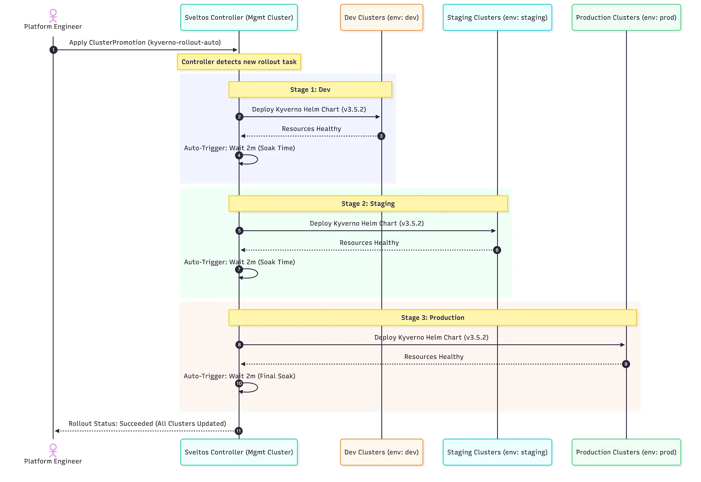

**Summary**:

Rollouts and progressive rollouts are essential for operation teams and developers. They help deploy new features and updates safely and with less risk. Today, we will explore how Sveltos' Rollout and Progressive Rollout features enable platform teams and engineers to update confidently, without fear! 💪

<!--truncate-->


## Motivation

It has been a while working with developers, engineers and teams crafting reliable, scalable and usable solutions that allow them to perform better and focus on what is important. Creating solutions while embracing the DevOps/GitOps mentality alongside the [DRY (Don's Repeat Yourself)](https://en.wikipedia.org/wiki/Don't_repeat_yourself) and the [KISS (Keep it simple, stupid)](https://en.wikipedia.org/wiki/KISS_principle) principles was always important to me. With AI and the active development of AI agents and Models in different infrastructures, the above principles of paramount importance and the concept of Rollouts and Progressive Rollouts are a crucial part, especially when experimenting or rolling out an update which could be unpredictable and lead to issues in production.

Let's take it from the start.

- Rollout is a general term used when deploying software, an update or a new feature to every user at once.
- Progressive rollout refers to the act of rolling out an update or a new feature gradually to a subset of users. We can roll it out incrementally, starting with a small percentage and gradually increasing it over time.

There are many popular strategies out there, like the canary, blue-green deployments and A/B testing, alongside different tools that support these operations like [Argo Rollouts](https://argoproj.github.io/rollouts/) and [Flagger](https://flagger.app/). Both mentioned tools are CNCF graduated projects and can work as standalone solutions without a prerequisite for installing ArgoCD or Flux to do the CI/CD part. However, they are not designed to accommodate rollouts in a fleet of clusters across different environments. And if they can do it, the configuration can be before complex fast.

While Flagger and Argo Rollouts are indispensable for managing progressive delivery within a single Kubernetes cluster by handling traffic shifting and in-cluster analysis, Sveltos excels at the higher-level challenge of orchestrating progressive rollouts and updates across a fleet of Kubernetes clusters. Its [ClusterProfile rolling update strategy](https://projectsveltos.github.io/sveltos/main/deployment_order/rolling_update_strategy/) with `MaxUpdate` and ValidateHealths, along with the `ClusterPromotion` Custom Resource Definition (CRD) for staged rollouts, provides a simpler, declarative, and robust solution for platform teams and engineers who need to manage application and configuration lifecycles across a distributed environment with confidence. It transforms fleet-wide deployments from a source of fear into a reliable, automated process.

In this blog, we will demonstrate how Sveltos cannot only control the deployment across a fleet of clusters but also help teams define a fine-grained strategy for progressive rollouts of applications using a simple manifest file. Sveltos already supported rollout strategies for deployment, but with Release [v1.2.0](https://github.com/projectsveltos/addon-controller/releases/tag/v1.2.0), progressive rollouts capabilities were added.

## Why Sveltos' progressive rollouts?

- **Staged Promotion**: Gradual rollout across environments
- **Lower Risk**: Catch issues early
- **Easy Management**: Define once, Sveltos handles the rest
- **Flexible Control**: Auto or manual promotion
- **Health Checks**: Ensure cluster readiness

Take a look at the [Sveltos Progressive Rollouts](https://projectsveltos.github.io/sveltos/main/deployment_order/progressive_rollout/) documentation for more details on the topic.

## Scenario

Today's scenario includes the update of [Kyverno](https://kyverno.io/) **v3.5.2** to the latest stable available **v3.6.2** across a fleet of clusters representing different environments (`dev`, `staging`, `prod`). We will outline, using a simple example, how the **automatic** and the **manual** progressive rollout work across the different environments. Then, introduce a failure and inspect how Sveltos handles these scenarios. If you are ready, let's continue!

## Lab Setup

```bash
+-----------------------------+------------------+----------------------+
|          Resources          |      Type        |       Version        |
+-----------------------------+------------------+----------------------+
|     Management Cluster      |    RKE2         |      v1.34.3+rke2r1   |
|     3x Managed Clusters     |    K3S          |      v1.34.2+k3s1     |
+-----------------------------+------------------+----------------------+

+-------------------+----------+
|      Tools        | Version  |
+-------------------+----------+
|     Sveltos       | v1.4.0   |
|     kubectl       | v1.34.1  |
+-------------------+----------+
```

## GitHub Resources

The YAML outputs are not complete. Have a look at the [GitHub repository](https://github.com/egrosdou01/blog-post-resources/tree/main/sveltos-progressive-rollouts/pt1).

## Prerequisites

1. A Kubernetes management cluster
1. At least **two** Kubernetes clusters to represent the different development environments
1. Familiarity with Kubernetes manifest files
1. [kubectl](https://kubernetes.io/docs/tasks/tools/#kubectl) installed

## Sveltos

### Installation

To keep the setup simple, we will install Sveltos using the [manifest approach](https://projectsveltos.github.io/sveltos/main/getting_started/install/install/#installation-modes). However, Sveltos can be installed using the dedicated Helm chart or Kustomize. Check out the [official documentation](https://projectsveltos.github.io/sveltos/main/getting_started/install/install/) for more installation details.

```bash
$ kubectl apply -f https://raw.githubusercontent.com/projectsveltos/sveltos/v1.4.0/manifest/manifest.yaml
```

### Cluster Registration

Registration of the managed clusters is required as Sveltos needs to have a way to control the add-ons and applications on a cluster. Two registration options are available: using the [sveltosctl](https://projectsveltos.github.io/sveltos/main/register/register-cluster/#sveltosctl-registration) utility or performing a [programmatic registration](https://projectsveltos.github.io/sveltos/main/register/register-cluster/#programmatic-registration).

For simplicity, I will use the `sveltosctl` utility and register all three **managed** clusters with Sveltos.

```bash
$ kubectl create namespace dev|staging|prod # Create the different namespaces based on your environment. We would like to separate the managed clusters in their own namespace.

$ sveltosctl register cluster \
   --namespace=dev \
   --cluster=dev \
   --kubeconfig=/path/to/kubeconfig/dev \
   --labels=env=dev
```

:::note
If you are new to Sveltos, go through the [Quick Start](https://projectsveltos.github.io/sveltos/main/getting_started/install/quick_start/) guide to get a better understanding of the tool.
:::

:::tip
If you want to manage clusters sitting behind a firewall, air-gapped or edge locations, have a look at the [Sveltos Pull Mode](https://projectsveltos.github.io/sveltos/main/register/register_cluster_pull_mode/) approach.
:::

### Validation

```bash
$ export KUBECONFING="path/to/mgmt/kubeconfig"

$ kubectl get pods -n projectsveltos
NAME                                      READY   STATUS    RESTARTS   AGE
access-manager-79cd88fcff-b54rr          1/1     Running     0          82s
addon-controller-795dbcf74-dnt5m         1/1     Running     0          83s
classifier-manager-5bbb89ffbf-2rcks      1/1     Running     0          70s
event-manager-6958c8f4c8-mxxm4           1/1     Running     0          72s
hc-manager-bd8d796c9-85ptj               1/1     Running     0          78s
mcp-server-757bc7847b-zdjwm              1/1     Running     0          64s
register-mgmt-cluster-job-dc8jm          0/1     Completed   0          66s
sc-manager-7d64dffc8d-r5vph              1/1     Running     0          80s
shard-controller-65f97998bb-7d47m        1/1     Running     0          68s
sveltos-agent-manager-64d8db58dc-sq2x5   1/1     Running     0          60s
techsupport-controller-bd668bbf6-x28tp   1/1     Running     0          65s

$ kubectl get sveltoscluster -A --show-labels
NAMESPACE   NAME      READY   VERSION        AGE    LABELS
dev         dev       true    v1.34.2+k3s1   62s     env=dev,projectsveltos.io/k8s-version=v1.34.2,sveltos-agent=present
mgmt        mgmt      true    v1.34.3        28h     projectsveltos.io/k8s-version=v1.34.0,sveltos-agent=present,type=mgmt
prod        prod      true    v1.34.2+k3s1   9s      env=prod,projectsveltos.io/k8s-version=v1.34.2,sveltos-agent=present
staging     staging   true    v1.34.2+k3s1   31s     env=staging,projectsveltos.io/k8s-version=v1.34.2,sveltos-agent=present
```

## Progressive Rollout

As mentioned in the beginning, to demonstrate the progressive rollout, we will use the [`ClusterPromotion`](https://projectsveltos.github.io/sveltos/main/deployment_order/progressive_rollout/) CRD, which was included with the Sveltos [**release v1.2.1**](https://github.com/orgs/projectsveltos/discussions/1489).

We install Kyverno **v3.5.2** and then update to version **v3.6.2**. The CRD solves the challenge of performing phased rollouts of cluster configurations and add-ons managed by Sveltos.

### Automated Rollout

#### Initial Kyverno Installation

When an **automatic** rollout is defined, we do not have any manual interventions when it comes to the gradual update of an application across environments.

For example, if the update of the clusters marked with the Kubernetes label `env: dev` is successful, we continue to the new clusters with the Kubernetes label set to `env: staging` and so on. Let's have a look at the proposed manifest.

```yaml showLineNumbers
apiVersion: config.projectsveltos.io/v1beta1
kind: ClusterPromotion
metadata:
  name: kyverno-rollout-auto
spec:
  profileSpec:
    syncMode: Continuous
    helmCharts:
    - repositoryURL:    https://kyverno.github.io/kyverno/
      repositoryName:   kyverno
      chartName:        kyverno/kyverno
      // highlight-start    
      chartVersion:     3.5.2
      // highlight-end    
      releaseName:      kyverno-latest
      releaseNamespace: kyverno
      helmChartAction:  Install
  # Stages are processed sequentially
  stages:
  - name: dev # Stage 1: dev environment
    clusterSelector:
      matchLabels:
        env: dev
    trigger:
      auto:
        delay: 2m # Wait 2 minutes after successful deployment before promoting
  - name: staging # Stage 2: staging environment
    clusterSelector:
      matchLabels:
        env: staging
    trigger:
      auto:
        delay: 2m # Wait 2 minutes after successful deployment before promoting
  - name: production # Stage 3: Production environment
    clusterSelector:
      matchLabels:
        env: prod
    trigger:
      auto:
        delay: 2m # Wait 2 minutes after successful deployment (optional for final stage)
```

Using the above YAML definition, Kyverno **v3.5.2** will get deployed progressively on every cluster matching the defined Kubernetes labels.

#### Validation

```bash
$ export KUBECONFING="path/to/mgmt/kubeconfig"

$ kubectl get clusterpromotion,clusterprofile,clustersummary -A
NAME                                                             AGE
clusterpromotion.config.projectsveltos.io/kyverno-rollout-auto   9m17s

NAME                                                                      AGE
clusterprofile.config.projectsveltos.io/kyverno-rollout-auto-dev          9m17s
clusterprofile.config.projectsveltos.io/kyverno-rollout-auto-production   77s
clusterprofile.config.projectsveltos.io/kyverno-rollout-auto-staging      5m17s

NAMESPACE   NAME                                                                                   AGE
dev         clustersummary.config.projectsveltos.io/kyverno-rollout-auto-dev-sveltos-dev           9m7s
prod        clustersummary.config.projectsveltos.io/kyverno-rollout-auto-production-sveltos-prod   67s
staging     clustersummary.config.projectsveltos.io/kyverno-rollout-auto-staging-sveltos-staging   5m17s
```

```yaml
$ kubectl get clusterpromotion.config.projectsveltos.io/kyverno-rollout-auto -o yaml
...
status:
 currentStageName: production
  lastPromotionTime: "2026-02-16T06:32:24Z"
  profileSpecHash: 733VG+o3aBR450lx7xW7VEDjNQr4syJT5pukWmJo3c4=
  stages:
  - currentStatusDescription: Successfully provisioned (2026-02-16T06:28:24Z)
    lastStatusCheckTime: "2026-02-16T06:28:24Z"
    lastSuccessfulAppliedTime: "2026-02-16T06:28:24Z"
    lastUpdateReconciledTime: "2026-02-16T06:25:17Z"
    name: dev
  - currentStatusDescription: Successfully provisioned (2026-02-16T06:32:24Z)
    lastStatusCheckTime: "2026-02-16T06:32:24Z"
    lastSuccessfulAppliedTime: "2026-02-16T06:32:24Z"
    lastUpdateReconciledTime: "2026-02-16T06:28:24Z"
    name: staging
  - currentStatusDescription: 'Delayed: Waiting for Time Window: 2026-02-16T06:36:24Z
      (2026-02-16T06:34:24Z)'
    lastStatusCheckTime: "2026-02-16T06:34:24Z"
    lastSuccessfulAppliedTime: "2026-02-16T06:34:24Z"
    lastUpdateReconciledTime: "2026-02-16T06:32:24Z"
    name: production
  stagesHash: K+oVryzpxI5/sCfRe03pIwhkVZ00YPTFDNpRVYmpLOk=
```

```bash
$ export KUBECONFIG=prod.yaml

$ kubectl get pods -n kyverno
NAME                                             READY   STATUS    RESTARTS   AGE
kyverno-admission-controller-5f9699df75-8r8tl    1/1     Running   0          5m9s
kyverno-background-controller-54d568db94-j7wcg   1/1     Running   0          5m10s
kyverno-cleanup-controller-6f5cbbdcc9-95nql      1/1     Running   0          5m10s
kyverno-reports-controller-57bb76897-crl9s       1/1     Running   0          5m10s

$ helm list -n kyverno
NAME          	NAMESPACE	REVISION	UPDATED                                	STATUS  	CHART        	APP VERSION
kyverno-latest	kyverno  	1       	2026-02-16 06:20:25.373575996 +0000 UTC	deployed	kyverno-3.5.2	v1.15.2    
```

#### Kyverno Update Manifest

```yaml showLineNumbers
apiVersion: config.projectsveltos.io/v1beta1
kind: ClusterPromotion
metadata:
  name: kyverno-rollout-auto
spec:
  profileSpec:
    syncMode: Continuous
    helmCharts:
    - repositoryURL:    https://kyverno.github.io/kyverno/
      repositoryName:   kyverno
      chartName:        kyverno/kyverno
      // highlight-start
      chartVersion:     3.6.2
      // highlight-end
      releaseName:      kyverno-latest
      releaseNamespace: kyverno
      helmChartAction:  Install
  # Stages are processed sequentially
  stages:
  - name: dev # Stage 1: dev environment
    clusterSelector:
      matchLabels:
        env: dev
    trigger:
      auto:
        delay: 2m # Wait 2 minutes after successful deployment before promoting
  - name: staging # Stage 2: staging environment
    clusterSelector:
      matchLabels:
        env: staging
    trigger:
      auto:
        delay: 2m # Wait 2 minutes after successful deployment before promoting
  - name: production # Stage 3: Production environment
    clusterSelector:
      matchLabels:
        env: prod
    trigger:
      auto:
        delay: 2m # Wait 2 minutes after successful deployment (optional for final stage)
```

The above instructs Sveltos to gradually update Kyverno from **v3.5.2** to **v3.6.2**, starting with the `dev` environment. Once all the clusters marked with the `dev` label are successfully updated, Sveltos waits **2m** and then continues with the next clusters labelled as `staging`. Finally, Sveltos proceeds with the clusters marked with the `prod` label.

The same validation command can be used as in earlier section.

```bash
$ kubectl get clusterpromotion.config.projectsveltos.io/kyverno-rollout-auto -o yaml
```

```bash
$ export KUBECONFIG=prod.yaml

$ kubectl get pods -n kyverno
NAME                                             READY   STATUS    RESTARTS   AGE
kyverno-admission-controller-5f9699df75-8r8tl    1/1     Running   0          15m
kyverno-admission-controller-6b566689f6-49sb2    0/1     Running   0          33s
kyverno-background-controller-68d5ddd98c-j8n9f   1/1     Running   0          33s
kyverno-cleanup-controller-f99d9c6f4-m2m47       1/1     Running   0          33s
kyverno-reports-controller-85c669c684-4gkzb      1/1     Running   0          33s

$ helm list -n kyverno
NAME          	NAMESPACE	REVISION	UPDATED                                	STATUS  	CHART        	APP VERSION
kyverno-latest	kyverno  	2       	2026-02-16 07:41:50.873592246 +0000 UTC	deployed	kyverno-3.6.2	v1.16.2 
```

### Manual Rollout - Approval Required

Using the automated rollout approach, there was no manual intervention regarding the allowance of the update to an environment. To have more control over deployments, we can use **manual approvals**. Effectively, an engineer can update the manifest manually using `kubectl` commands or integrate it with another system for further automation. In **part 3**, we will showcase how `Botkube` can be used to allow engineers to approve or reject changes. Stay Tuned!

To enable manual approvals to the production clusters, we need to include the following in the `staging` definition. Effectively, Sveltos will perform the progressive rollout to the `staging` cluster, but then wait for approval till they move to the clusters labelled as `prod`.

```yaml showLineNumbers
      - name: staging # Stage 2: staging environment
        clusterSelector:
          matchLabels:
            env: staging
        trigger:
          manual:
            approved: false
```

#### Mid-Validation

```bash
$ export KUBECONFING="path/to/mgmt/kubeconfig"

$ kubectl get clusterpromotion,clusterprofile,clustersummary -A
NAME                                                                 AGE
clusterpromotion.config.projectsveltos.io/kyverno-prog-rollout-man   13m

NAME                                                                       AGE
clusterprofile.config.projectsveltos.io/kyverno-rollout-man-dev            13m
clusterprofile.config.projectsveltos.io/kyverno-rollout-man-staging       8m33s

NAMESPACE   NAME                                                                                       AGE
dev         clustersummary.config.projectsveltos.io/kyverno-rollout-man-dev-sveltos-dev                13m
staging     clustersummary.config.projectsveltos.io/kyverno-rollout-man-staging-sveltos-staging       8m33s
```

As we can see, even after 13 minutes, the deployment did not proceed with the `Production` clusters because Sveltos awaits approval. Let's approve the update of Kyverno.

#### Operator Approval

```bash
$ kubectl patch clusterpromotion kyverno-prog-rollout-man --type=json -p '[{"op": "replace", "path": "/spec/stages/1/trigger/manual/approved", "value": true}]'
```

:::tip
`/spec/stages/1/trigger/manual/approved` the 1 in this context refers to the second stage of the stages, which is the `staging`.
:::

#### Validation

```bash
$ kubectl export KUBECONFIG=prod.yaml 

$ kubectl get pods -n kyverno
NAME                                             READY   STATUS    RESTARTS   AGE
kyverno-admission-controller-6b566689f6-7hdgt    1/1     Running   0          2m33s
kyverno-background-controller-68d5ddd98c-t994h   1/1     Running   0          2m32s
kyverno-cleanup-controller-f99d9c6f4-rbphz       1/1     Running   0          2m32s
kyverno-reports-controller-85c669c684-l5k7p      1/1     Running   0          2m32s

$ helm list -n kyverno
NAME          	NAMESPACE	REVISION	UPDATED                                	STATUS  	CHART        	APP VERSION
kyverno-latest	kyverno  	2       	2026-02-16 07:41:50.873592246 +0000 UTC	deployed	kyverno-3.6.2	v1.16.2 
```

### Failure Scenario

We demonstrated what a successful update looks like, but what will happen if an update does not work as expected? Sveltos will discontinue the progressive rollout and stop at the environment where failure was reported.

Let's update the [automated progressive rollout](#automated-rollout) example and include the lines described below.

```yaml showLineNumbers
    helmCharts:
    - repositoryURL:    https://kyverno.github.io/kyverno/
      repositoryName:   kyverno
      chartName:        kyverno/kyverno
      chartVersion:     3.6.2
      releaseName:      kyverno-latest
      releaseNamespace: kyverno
      helmChartAction:  Install
      // highlight-start
      values: |
        admissionController:
          replicas: true
      // highlight-end
```

The `admissionController.replicas` values defined in the Helm chart should be an `integer` instead of a `boolean` value. This is a silly update, but we ensure the Helm chart deployment will fail.

Once the `ClusterPromotion` named `kyverno-rollout-auto` is deployed in the **management** cluster, Sveltos will deploy the Helm chart to all the clusters marked with the label `dev`. Sveltos will continue with the next stage once **all** clusters in one stage have Kyverno successfully deployed.

#### Validation

```bash
$ export KUBECONFING="path/to/mgmt/kubeconfig"

$ kubectl get clusterpromotion,clusterprofile,clustersummary -A
NAME                                                               AGE
clusterprofile.config.projectsveltos.io/kyverno-rollout-auto-dev   20m

NAME                                                             AGE
clusterpromotion.config.projectsveltos.io/kyverno-rollout-auto   20m

NAMESPACE   NAME                                                                             AGE
dev         clustersummary.config.projectsveltos.io/kyverno-rollout-auto-dev-sveltos-dev01   20m
dev         clustersummary.config.projectsveltos.io/kyverno-rollout-auto-dev-sveltos-dev02   20m
```

```yaml
$ kubectl get clusterpromotion.config.projectsveltos.io/kyverno-rollout-auto -o yaml
...
status:
  currentStageName: dev
  lastPromotionTime: "2026-02-16T07:15:24Z"
  profileSpecHash: 6bQqMGgvUsn49NrDUXOToaAbOyuScngRTiqW8G05HIc=
  stages:
  - failureMessage: ClusterSummary kyverno-rollout-auto-dev-sveltos-dev01 is not yet
      provisioned.
    lastStatusCheckTime: "2026-02-16T07:15:24Z"
    lastUpdateReconciledTime: "2026-02-16T07:15:24Z"
    name: dev
  stagesHash: K+oVryzpxI5/sCfRe03pIwhkVZ00YPTFDNpRVYmpLOk=
```

It is clear that the Helm deployment was **not** successful in any of the clusters marked as `dev`, and Sveltos stopped the automated deployment to the next stage. In part 2 of the series, we will show how to deploy an application in a small cluster within a stage using the [add-on Rollout Strategy](https://projectsveltos.github.io/sveltos/main/deployment_order/rolling_update_strategy/) while the `ClusterPromotion` will perform progressive rollouts and ensure everything is working using different `postValidateHealth` checks.

## Conclusion

[Sveltos progressive rollouts](https://projectsveltos.github.io/sveltos/main/deployment_order/progressive_rollout/) make complex, multi-cluster Day-1 and Day-2 updates **safe** and **simple**. With just a manifest and a few labels, platform teams can confidently push changes across environments, catching issues early and staying in control every step of the way. In part 2, we will dive even deeper with advanced strategies and real-world integrations. Stay tuned! 🚀

## Resources

- [Sveltos Quick Start](https://www.cloudflare.com/en-gb/application-services/products/analytics/)
- [Sveltos Use Cases](https://projectsveltos.github.io/sveltos/main/use_cases/use_case_idp/)
- [Distribute Add-ons](https://projectsveltos.github.io/sveltos/main/addons/addons/)

## ✉️ Contact

If you have any questions, feel free to get in touch! You can use the `Discussions` option found [here](https://github.com/egrosdou01/blog.grosdouli.dev/discussions) or reach out to me on any of the social media platforms provided. 😊 We look forward to hearing from you!

## 👏 Support this project

Every contribution counts! If you enjoyed this article, check out the Projectsveltos [GitHub repo](https://github.com/projectsveltos). You can [star 🌟 the project](https://github.com/projectsveltos) if you find it helpful.

The GitHub repo is a great resource for getting started with the project. It contains the code, documentation, and many more examples.

Thanks for reading!

## Series Narigation

| Part | Title |
| :--- | :---- |
| [Part 1](./sveltos-progressive-rollouts-pt1.md) | Introduction to Sveltos Progressive Rollouts part 1 |
| Part 2 | Introduction to Sveltos Progressive Rollouts part 2 |
| Part 3 | Sveltos Progressive Rollouts and ChatOps|