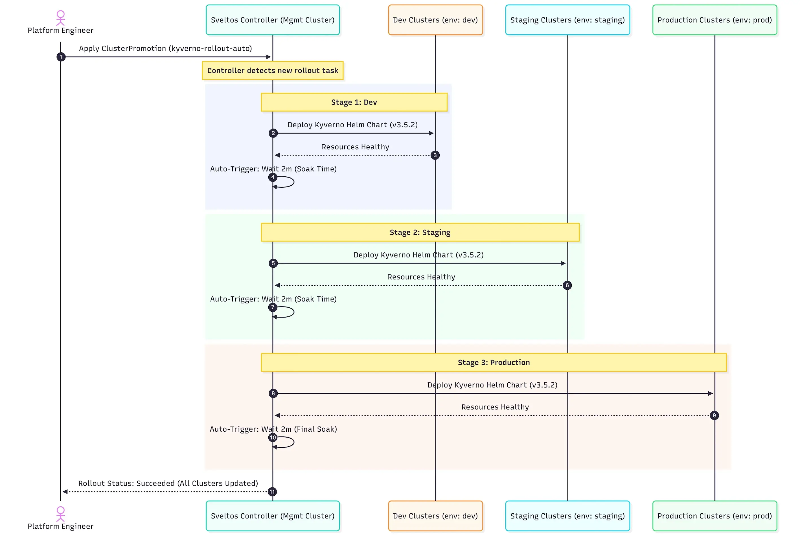

**Summary**:

Taking a step further from where we left off in [part 1](sveltos-progressive-rollouts-pt1.md) of the series. We will look at an example that mixes Sveltos rollouts with progressive rollouts, validation, and checks after validation. This gives us tailored control over deployments and updates.

<!--truncate-->


## Scenario

We will combine the [Sveltos rollout approach](https://projectsveltos.github.io/sveltos/main/use_cases/use_case_idp/) and capabilities alongside the [progressive rollouts](https://projectsveltos.github.io/sveltos/main/deployment_order/progressive_rollout/), `health checks`, and `validations` into a single example. First, we will ensure [Kyverno](https://kyverno.io/) is deployed successfully in clusters using the `ValidationHealths` option. Then, we will move on to the next stages of the pipeline. We will also work on **progressive rollouts**, performing various validations before declaring a rollout successful.

## Lab Setup

```bash
+-----------------------------+------------------+----------------------+
|          Resources          |      Type        |       Version        |
+-----------------------------+------------------+----------------------+
|     Management Cluster      |    RKE2         |      v1.34.3+rke2r1   |
+-----------------------------+------------------+----------------------+

+-------------------+----------+
|      Tools        | Version  |
+-------------------+----------+
|     Sveltos       | v1.4.0   |
|     kubectl       | v1.34.1  |
+-------------------+----------+
```

## GitHub Resources

The YAML outputs are not complete. Have a look at the [GitHub repository](https://github.com/egrosdou01/blog-post-resources/tree/main/sveltos-progressive-rollouts/pt2).

## Prerequisites

Go through [part 1](./sveltos-progressive-rollouts-pt1.md) and understand how progressive rollouts work.

## Rollout and Progressive Rollout - Kyverno and Policies

As a first step, we will install Kyverno in the different environments (dev, staging, prod) available. We will utilise the `maxUpdate` field to define the **maximum** number of clusters to be **updated concurrently**. This value will be set to `30%`, meaning that if we have 12 clusters belonging to the dev stage, we will start with the first 4. In part 1, we showed that **all** clusters were updated all at once within a stage, and that could be problematic if the new update is unstable. Thus, we need to have more control over the deployment.

We will use the `validateHealths` field to ensure the Kyverno helm chart is healthy and successfully installed to a cluster based on a set of meaningful conditions. After this, we will add the `postDelayHealthChecks` to each stage. We will also make sure Kyverno policies are in the cluster once Kyverno is deployed.

### MaxUpdate

```yaml showLineNumbers
apiVersion: config.projectsveltos.io/v1beta1
kind: ClusterPromotion
metadata:
  name: kyverno-rollout-auto
spec:
  profileSpec:
    syncMode: Continuous
    // highlight-start
    maxUpdate: 30%
    // highlight-end
    helmCharts:
    - repositoryURL:    https://kyverno.github.io/kyverno/
      repositoryName:   kyverno
      chartName:        kyverno/kyverno
      chartVersion:     3.5.2
      releaseName:      kyverno-latest
      releaseNamespace: kyverno
      helmChartAction:  Install
```

Define either the number or the percentage of **concurrent** deployments to a particular stage using the `maxUpdate` field. Take a look at the [maxUpdate field on GitHub](https://github.com/projectsveltos/addon-controller/blob/d39fd47080fa2fe5f74103d67c41dfd6994dacf4/api/v1beta1/spec.go#L707) for a detailed description.

### validateHealths
```yaml showLineNumbers
apiVersion: config.projectsveltos.io/v1beta1
kind: ClusterPromotion
metadata:
  name: kyverno-rollout-auto
spec:
  profileSpec:
    // highlight-start
    validateHealths:
    - name: kyverno-deploy-health
      featureID: Helm
      group: "apps"
      version: "v1"
      kind: "Deployment"
      namespace: kyverno
      script: |
        function evaluate()
          hs = {}
          hs.healthy = false
          hs.message = "Available replicas not matching requested replicas"
          if obj.status ~= nil then
            if obj.status.availableReplicas ~= nil then
              if obj.status.availableReplicas == obj.spec.replicas then
                hs.healthy = true
              end
            end
          end
          return hs
        end
    // highlight-end
```

The `validateHealths` field and health conditions defined can be written in [Lua](https://www.lua.org/) or [CEL](https://cel.dev/) languages. In this case, we use Lua and validate if the `availableReplicas` of Kyverno are the desired ones.

### policyRefs

```yaml showLineNumbers
apiVersion: config.projectsveltos.io/v1beta1
kind: ClusterPromotion
metadata:
  name: kyverno-rollout-auto
spec:
  profileSpec:
    // highlight-start
    policyRefs:
    - name: deploy-kyverno-policies
      namespace: default
      kind: ConfigMap
    // highlight-end
```

In this part, we use the `policyRefs` field to deploy a set of Kyverno policies stored in a `configMap`. Take a look at the [policyRefs field on GitHub](https://github.com/projectsveltos/addon-controller/blob/d39fd47080fa2fe5f74103d67c41dfd6994dacf4/api/v1beta1/spec.go#L749) for a detailed description.


### Stages - PostDelayHealthChecks

```yaml showLineNumbers
apiVersion: config.projectsveltos.io/v1beta1
kind: ClusterPromotion
metadata:
  name: kyverno-rollout-auto
spec:
  profileSpec:
  # Stages are processed sequentially
  stages:
  - name: dev # Stage 1: dev environment
    clusterSelector:
      matchLabels:
        env: dev
    trigger:
      auto:
        delay: 2m # Wait 2 minutes after successful deployment before promoting
        // highlight-start
        postDelayHealthChecks:
        - name: kyverno-policy-health
          featureID: Resources
          group: "kyverno.io"
          version: "v1"
          kind: "ClusterPolicy"
          script: |
            function evaluate()
              hs = {}
              hs.healthy = false
              hs.message = "ClusterPolicy not enforced or missing validationFailureAction"

              if obj ~= nil then
                if obj.spec ~= nil and obj.spec.validationFailureAction ~= nil then
                  if obj.spec.validationFailureAction == "Enforce" then
                    hs.healthy = true
                    hs.message = "ClusterPolicy is enforced"
                  else
                    hs.message = "ClusterPolicy exists but is not enforced (set to '" .. obj.spec.validationFailureAction .. "')"
                  end
                else
                  hs.message = "ClusterPolicy exists but has no validationFailureAction defined"
                end
              else
                hs.message = "ClusterPolicy object not found"
              end
              return hs
            end
          // highlight-end
  - name: staging # Stage 2: staging environment
    clusterSelector:
      matchLabels:
        env: staging
    trigger:
      auto:
        delay: 2m # Wait 2 minutes after successful deployment before promoting
  - name: production # Stage 3: Production environment
    clusterSelector:
      matchLabels:
        env: prod
    trigger:
      auto:
        delay: 2m # Wait 2 minutes after successful deployment (optional for final stage)
```

Using the `postDelayHealthChecks` in each stage, we ensure the Kyverno policies deployed are enforced in a cluster. When the condition is met, we declare a successful deployment on a cluster or clusters. Then, we can proceed with the deployment.

:::note
The `preHealthCheckDeployment` and `postDelayHealthChecks` can be used in every stage of our pipeline. To keep it simple, we used a check only at the `dev` stage. More details, take a look at the [documentation](https://projectsveltos.github.io/sveltos/main/deployment_order/progressive_rollout/#concrete-example-running-a-synthetic-test-job).
:::

### Deployment Management Cluster

```bash
$ export KUBECONFIG=/path/to/management/kubeconfig

$ kubectl apply -f clusterpromotion_kyverno.yaml
```

### Mid-Validation

#### Dev Stage

```bash
$ export KUBECONFIG=/path/to/management/kubeconfig

$ kubectl get clusterprofile,clustersummary,clusterpromotion -A
NAME                                                               AGE
clusterprofile.config.projectsveltos.io/kyverno-rollout-auto-dev   13s

NAMESPACE   NAME                                                                             AGE
dev         clustersummary.config.projectsveltos.io/kyverno-rollout-auto-dev-sveltos-dev02   13s
dev         clustersummary.config.projectsveltos.io/kyverno-rollout-auto-dev-sveltos-dev03   13s

NAMESPACE   NAME                                                             AGE
            clusterpromotion.config.projectsveltos.io/kyverno-rollout-auto   13s
```

```bash
$ kubectl get clustersummary.config.projectsveltos.io/kyverno-rollout-auto-dev-sveltos-dev02 -n dev -o yaml
...
status:
  dependencies: no dependencies
  deployedGVKs:
  - deployedGroupVersionKind:
    - ClusterPolicy.v1.kyverno.io
    featureID: Resources
  featureSummaries:
  - featureID: Resources
    hash: 1w1+ysRcCEssyN7P0uVLz3yrQ2moqVQamIY3lrPCdXY=
    lastAppliedTime: "2026-02-27T07:16:57Z"
    status: Provisioned
  - featureID: Helm
    hash: 0JfAd/25ufq+c4+3CUaNdkvOI2poOsJwt2vGouEKXIg=
    lastAppliedTime: "2026-02-27T07:17:38Z"
    status: Provisioned
  helmReleaseSummaries:
  - releaseName: kyverno-latest
    releaseNamespace: kyverno
    status: Managing
    valuesHash: Eq4yyx7ALQHto1gbEnwf7jsNxTVy7WuvI5choD2C4SY=
```


```bash
$ kubectl get clusterpromotion.config.projectsveltos.io/kyverno-rollout-auto -o yaml
...
status:
  currentStageName: dev
  lastPromotionTime: "2026-02-27T07:16:37Z"
  profileSpecHash: qEFJ6XqIDof4c2469X7mL/6I46T7CYkDQybFDz+N16k=
  stages:
  - currentStatusDescription: 'Delayed: Waiting for Time Window: 2026-02-27T07:19:37Z
      (2026-02-27T07:18:37Z)'
    lastStatusCheckTime: "2026-02-27T07:18:37Z"
    lastSuccessfulAppliedTime: "2026-02-27T07:18:37Z"
    lastUpdateReconciledTime: "2026-02-27T07:16:37Z"
    name: dev
  stagesHash: foMYJWnosKajuOrHqn+5p6JBGd38H+XC3O9Vn8EXbzk=
```

```bash
...
status:
  currentStageName: dev
  lastPromotionTime: "2026-02-27T07:16:37Z"
  profileSpecHash: qEFJ6XqIDof4c2469X7mL/6I46T7CYkDQybFDz+N16k=
  stages:
  - currentStatusDescription: Running Post-Promotion Health Checks (2026-02-27T07:20:37Z)
    lastStatusCheckTime: "2026-02-27T07:18:37Z"
    lastSuccessfulAppliedTime: "2026-02-27T07:18:37Z"
    lastUpdateReconciledTime: "2026-02-27T07:16:37Z"
    name: dev
  stagesHash: foMYJWnosKajuOrHqn+5p6JBGd38H+XC3O9Vn8EXbzk=
```

From the output, it is clear that Sveltos starts with the defined percentage of the clusters in the `dev` stage (dev02 and dev03). Once `validateHealths` and `postDelayHealthChecks` are successfully deployed (Kyverno Helm chart + Kyverno policies deployed), it continues with the remaining clusters in the `dev` stage.

```bash
$ kubectl get clusterprofile,clustersummary,clusterpromotion -A
NAME                                                               AGE
clusterprofile.config.projectsveltos.io/kyverno-rollout-auto-dev   3m48s

NAMESPACE   NAME                                                                             AGE
dev         clustersummary.config.projectsveltos.io/kyverno-rollout-auto-dev-sveltos-dev01   67s
dev         clustersummary.config.projectsveltos.io/kyverno-rollout-auto-dev-sveltos-dev02   3m48s
dev         clustersummary.config.projectsveltos.io/kyverno-rollout-auto-dev-sveltos-dev03   3m48s

NAMESPACE   NAME                                                             AGE
            clusterpromotion.config.projectsveltos.io/kyverno-rollout-auto   3m48s
```

#### Staging Stage

The same approach as in the `dev` stage will be followed. The 30% of the clusters included in the `staging` environment will get the Kyverno deployment and the policy. Once this is successful, we will continue with the remaining clusters in the `staging` stage.

```bash
$ kubectl get clusterprofile,clustersummary,clusterpromotion -A
NAME                                                                   AGE
clusterprofile.config.projectsveltos.io/kyverno-rollout-auto-dev       10m
clusterprofile.config.projectsveltos.io/kyverno-rollout-auto-staging   2m26s

NAMESPACE   NAME                                                                                   AGE
dev         clustersummary.config.projectsveltos.io/kyverno-rollout-auto-dev-sveltos-dev01         7m45s
dev         clustersummary.config.projectsveltos.io/kyverno-rollout-auto-dev-sveltos-dev02         10m
dev         clustersummary.config.projectsveltos.io/kyverno-rollout-auto-dev-sveltos-dev03         10m
dev         clustersummary.config.projectsveltos.io/kyverno-rollout-auto-staging-sveltos-staging   2m26s

NAMESPACE   NAME                                                             AGE
            clusterpromotion.config.projectsveltos.io/kyverno-rollout-auto   10m
```

```bash
$ kubectl get clustersummary.config.projectsveltos.io/kyverno-rollout-auto-staging-sveltos-staging -n staging -o yaml
...
status:
  dependencies: no dependencies
  deployedGVKs:
  - deployedGroupVersionKind:
    - ClusterPolicy.v1.kyverno.io
    featureID: Resources
  featureSummaries:
  - featureID: Resources
    hash: hLcajtpkTeUjdrfK/lSnq5Fs/gjMVkKi8bB/Y055RqQ=
    lastAppliedTime: "2026-02-27T11:44:31Z"
    status: Provisioned
  - featureID: Helm
    hash: 0JfAd/25ufq+c4+3CUaNdkvOI2poOsJwt2vGouEKXIg=
    lastAppliedTime: "2026-02-27T11:44:31Z"
    status: Provisioned
  helmReleaseSummaries:
  - releaseName: kyverno-latest
    releaseNamespace: kyverno
    status: Managing
    valuesHash: Eq4yyx7ALQHto1gbEnwf7jsNxTVy7WuvI5choD2C4SY=
```

## Conclusion

Sveltos rollouts, along with `progressive rollouts`, `health checks`, and `validations`, help us manage deployments in different environments more effectively. We use the `maxUpdate` field, `validateHealths`, and `postDelayHealthChecks` to ensure safe updates in the pipeline. This way, policies are enforced before we move to the next stage. The same approach can be repeated for dev, staging, and prod environments.

In part 3 of the series, we will use a **chatOps** approach with [Botkube](https://botkube.io/). This lets engineers approve or reject manual upgrades right from Slack. Stay tuned! 🚀

## Resources

- [Distribute Add-ons](https://projectsveltos.github.io/sveltos/main/addons/addons/)
- [Progressive Rollouts Across Clusters](https://projectsveltos.github.io/sveltos/main/deployment_order/progressive_rollout/)

## ✉️ Contact

If you have any questions, feel free to get in touch! You can use the `Discussions` option found [here](https://github.com/egrosdou01/blog.grosdouli.dev/discussions) or reach out to me on any of the social media platforms provided. 😊 We look forward to hearing from you!

## 👏 Support this project

Every contribution counts! If you enjoyed this article, check out the Projectsveltos [GitHub repo](https://github.com/projectsveltos). You can [star 🌟 the project](https://github.com/projectsveltos) if you find it helpful.

The GitHub repo is a great resource for getting started with the project. It contains the code, documentation, and many more examples.

Thanks for reading!

## Series Navigation

| Part | Title |
| :--- | :---- |
| [Part 1](./sveltos-progressive-rollouts-pt1.md) | Introduction to Sveltos Progressive Rollouts part 1 |
| [Part 2](./sveltos-progressive-rollouts-pt2.md) | Introduction to Sveltos Progressive Rollouts part 2 |
| [Part 3](./sveltos-progressive-rollouts-pt3.md) | Sveltos Progressive Rollouts and ChatOps |