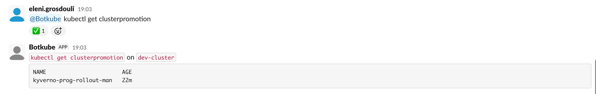
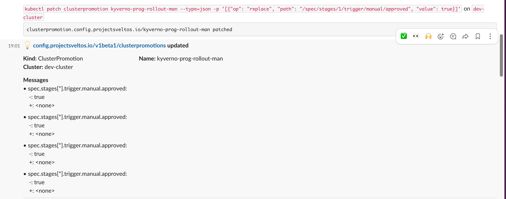

**Summary**:

To make our lives easier when it comes to manual Sveltos progressive rollout approvals, we will use [Botkube](https://github.com/kubeshop/botkube) and [Slack](https://app.slack.com/plans/T09QS26ADJ7?geocode=en-gb).

<!--truncate-->

## Scenario

As we do not want the Platform teams or Kubernetes operators to manually approve or reject progressive rollout deployments by connecting to a Kubernetes cluster (s), we will allow them to use Slack, receive notifications about **new** or **updated** `ClusterPromotion` resources to approve or reject deployments through a Slack space. We will continue with the deployment demonstrated in [part 2](./sveltos-progressive-rollouts-pt2.md).

## Tools

### Botkube

Botkube is used as a ChatOps approach by platform engineers and is designed to integrate Kubernetes with messaging tools like Slack, Discord, and Mattermost. Built primarily in Go, it enables real-time monitoring of Kubernetes clusters by watching events such as pod failures, configuration changes, and deployments, then sending alerts directly to chat channels.

However, the project is considered stale, and there are no new commits. The demonstration here takes place to show the different options that could be used to perform an easy ChatOps approach. In a future post, we will use a Kubernetes MCP server to perform something similar.

:::warning
Botkube is no longer maintained. Folks are looking for help to get the project going. [Join their efforts](https://github.com/kubeshop/botkube/issues/1494)!
:::

### Slack

Slack is a cloud-based messaging platform designed for workplace collaboration, allowing teams to communicate through organised channels, direct messages, and file sharing.

## Lab Setup

```bash
+-----------------------------+------------------+----------------------+
|          Resources          |      Type        |       Version        |
+-----------------------------+------------------+----------------------+
|     Management Cluster      |    RKE2         |      v1.34.3+rke2r1   |
+-----------------------------+------------------+----------------------+

+-------------------+----------+
|      Tools        | Version  |
+-------------------+----------+
|     Sveltos       | v1.4.0   |
|     kubectl       | v1.34.1  |
|     BotKube       | v1.14.x  |
+-------------------+----------+
```

## GitHub Resources

The YAML outputs are not complete. Have a look at the [GitHub repository](https://github.com/egrosdou01/blog-post-resources/tree/main/sveltos-progressive-rollouts/).

## Prerequisites

To perform an integration with Slack, we need a **free-tier** account and the ability to create a Slack application with the correct permissions. Once we have that, we can continue with Sveltos, which will be used to install Botkube alongside the required configuration. Check out the official [Botkube and Slack guide](https://docs.trilio.io/kubernetes/ecosystem/monitoring-tvk-resources-from-slack-using-botkube).

## Slack Caveats

> - Must be installed manually into your Slack workspace using the provided configuration
> - Slack channels must be managed manually, and you need to ensure the Botkube bot is invited to any channel you want to use with Botkube
> - When using executor plugins (e.g. kubectl) in a multi-cluster environment, each cluster needs to have a dedicated Botkube bot for Slack in order to route commands to the correct cluster.

Slack does not support multi-cluster deployments. This could be addressed using [Discord](https://discord.com/) or [Mattermost](https://mattermost.com/). However, having already a Slack account, it was an easier choice for my setup.

### Slack free-tier account

Follow the link to create a [free-tier Slack account](https://slack.com/intl/en-gb/pricing/paid-vs-free).

### Create Slack Workspace

If you do not already have a Slack workspace with admin rights, follow the [Slack official documentation](https://slack.com/intl/en-gb/help/articles/206845317-Create-a-Slack-workspace) for more details.

### Create Slack Application

To allow Botkube to use the **Slack socket**, we need to create an Application for Botkube and define the right permissions for the users who are part of a channel. Perform the steps described below to create an application.

1. Go to the [Slack App console](https://api.slack.com/apps)
1. Create a new App and select "From an app manifest"
1. Choose the workspace created in a previous step
1. For Public and Private channels configuration
  ```yaml showLineNumbers
    display_information:
    name: Botkube
    description: Botkube
    background_color: "#a653a6"
  features:
    bot_user:
      display_name: Botkube
      always_online: false
  oauth_config:
    scopes:
      bot:
        - channels:read
        - groups:read
        - app_mentions:read
        - reactions:write
        - chat:write
        - files:read
        - files:write
        - users:read
        - channels:read
        - usergroups:read
        - im:read
        - mpim:read
        - commands
  settings:
    event_subscriptions:
      bot_events:
        - app_mention
    interactivity:
      is_enabled: true
    org_deploy_enabled: false
    socket_mode_enabled: true
    token_rotation_enabled: false
  ```
1. Install the Botkube in the Slack workspace
1. Bot OAuth Token 
    - Navigate to **Features > OAuth & Permissions**
    - Copy the "Bot Use OAuth Token"
1. App-Level Token 
    - Navigate to "Settings > Basic Information > App-Level Tokens"
    - Click the "Generate Token and Scopes"
    - Define a name of your preference
    - Define the `connections: write` scope
    - Generate and copy the token

### Add Botkube user to Slack Channel

You can either create a new channel within a defined workspace or use one of the autogenerated channels. As we have an application ready, we can invite the `@<your application name>` user to a channel. For more information about inviting a user to a channel, take a look at the [official documentation](https://slack.com/intl/en-gb/help/articles/201980108-Add-people-to-a-channel).

## Install Botkube Helm Chart

As Botkube offer the ability to use a Helm chart installation without needing to use the botkube cli utility, we will follow this approach. But, before we perform the deployment, let’s create a `values.yaml` file that contains all our settings first to enable the connection and communication with a specific Slack channel within a workspace, and then enable the Botkube capabilities and permissions working with the Kubernetes cluster.

### Craft values.yaml file

```yaml showLineNumbers
serviceAccountMountPath: /var/run/7e7fd2f5-b15d-4803-bc52-f54fba357e76/secrets/kubernetes.io/serviceaccount
groups:
  'botkube-plugins-default':
    create: true
    rules:
      - apiGroups: [""]
        resources: ["pods", "services", "configmaps", "events"]
        verbs: ["get", "list", "watch"]
      - apiGroups: ["apiextensions.k8s.io"]
        resources: ["customresourcedefinitions"]
        verbs: ["get", "list", "watch"]
      - apiGroups: ["config.projectsveltos.io"]
        resources: ["clusterpromotions", "clusterpromotions/status"]
        verbs: ["get", "list", "watch", "update", "patch"] 
actions:
'revoke-approval':
  enabled: true
  displayName: "ClusterPromotion Approval Handler"
  command: "kubectl describe {{ .Event.Kind | lower }}{{ if .Event.Namespace }} -n {{ .Event.Namespace }}{{ end }} {{ .Event.Name }}"
  bindings:
    sources:
      - k8s-clusterpromotions
    executors:
      - k8s-default-tools
sources:
'k8s-clusterpromotions':
  displayName: "ClusterPromotion Events"
  botkube/kubernetes:
    context: &default-plugin-context
      rbac:
        group:
          type: Static
          prefix: ""
          static:
            values: ["botkube-plugins-default"]
    enabled: true
    config:
      namespaces: &k8s-events-namespaces
        include:
          - ".*"
      event:
        types:
          - create
          - update
      filters:
        objectAnnotationChecker: true
      resources:
        - type: config.projectsveltos.io/v1beta1/clusterpromotions
          event:
            types:
              - create
              - update
          updateSetting:
            includeDiff: true
            fields:
              - spec.stages[*].trigger.manual.approved
executors:
k8s-default-tools:
  botkube/kubectl:
    displayName: "Kubectl"
    enabled: true
    config:
      defaultNamespace: "default"
    context: *default-plugin-context
aliases:
k:
  command: kubectl
  displayName: "Kubectl alias"
communications:
'default-group':
  socketSlack:
    enabled: true
    channels:
      'default':
        name: 'all-sveltos-promotions-demo'
        bindings:
          executors:
            - k8s-default-tools
          sources:
            - k8s-clusterpromotions
    botToken: 'xoxb-'
    appToken: 'xapp-'
settings:
clusterName: "dev-cluster"
log:
  level: info
plugins:
cacheDir: "/tmp"
repositories:
  botkube:
    url: https://github.com/kubeshop/botkube/releases/download/v1.14.0/plugins-index.yaml
  botkubeExtra:
    url: https://github.com/kubeshop/botkube-plugins/releases/download/v1.14.0/plugins-index.yaml
```

We instruct Botkube to have full permissions on the `ClusterPromotion` resource. Once a new or update `ClusterPromotion` resource is detected, we trigger a describe action. Then, we use `kubectl` to patch the resources from Slack.

### Botkube Deployment

As we have Sveltos already installed in the Kubernetes **management** cluster, we can utilise the `ClusterProfile` Custom Resource definition (CRD) and allow Sveltos to deploy Botkube to the cluster.

```yaml showLineNumbers
apiVersion: config.projectsveltos.io/v1beta1
kind: ClusterProfile
metadata:
  name: deploy-botkube-mgmt
spec:
  clusterSelector:
    matchLabels:
      type: mgmt
  syncMode: Continuous
  helmCharts:
  - repositoryURL:    https://charts.botkube.io
    repositoryName:   botkube
    chartName:        botkube/botkube
    chartVersion:     v1.14.0
    releaseName:      botkube
    releaseNamespace: botkube
    helmChartAction:  Install
    valuesFrom:
    - kind: ConfigMap
      name: botkube-config
      namespace: default
```

The `ConfigMap` information is available at the [blog post resources GitHub repository](https://github.com/egrosdou01/blog-post-resources/tree/main/sveltos-progressive-rollouts/).

Alternatively, the following Helm chart commands will deploy Botkube to the exposed cluster.

```bash
$ export KUBECONFIG=/path/to/management/kubeconfig
$ helm repo add botkube https://charts.botkube.io/  
$ helm install botkube botkube/botkube -n botkube --create-namespace -f values.yaml # values.yaml contains the Helm chart values
$ kubectl get pods -n botkube
```

:::tip
Ensure all the resources related to the Botkube deployment are 'READY' and healthy. If pods are failing or you have other issues in the clusters, troubleshoot the issues before proceeding.
:::

## ClusterPromotion Example

Every time we create or update a `ClusterPromotion` resource, Botkube sends a notification to a Slack channel. The members of the Slack channel can perform limited actions using the `kubectl` command from Slack based on the RBAC definition in the `values.yaml` file.





## Conclusion

In my opinion, ChatOps is a valid approach when it comes to the approval or rejection of `ClusterPromotion` actions. It provides teams with an easy and controlled way of checking what is going on in a cluster. However, nowadays, this could be easily done using an AI Agent instead of using different Slack plugins to achieve the same result.

In part 4 of the series, we will explore how to achieve a ChatOps approach using AI Agents instead. Stay tuned! 🚀

## Resources

- [Sveltos Quick Start](https://www.cloudflare.com/en-gb/application-services/products/analytics/)
- [Sveltos Use Cases](https://projectsveltos.github.io/sveltos/main/use_cases/use_case_idp/)

## ✉️ Contact

If you have any questions, feel free to get in touch! You can use the `Discussions` option found [here](https://github.com/egrosdou01/blog.grosdouli.dev/discussions) or reach out to me on any of the social media platforms provided. 😊 We look forward to hearing from you!

## 👏 Support this project

Every contribution counts! If you enjoyed this article, check out the Projectsveltos [GitHub repo](https://github.com/projectsveltos). You can [star 🌟 the project](https://github.com/projectsveltos) if you find it helpful.

The GitHub repo is a great resource for getting started with the project. It contains the code, documentation, and many more examples.

Thanks for reading!

## Series Narigation

| Part | Title |
| :--- | :---- |
| [Part 1](./sveltos-progressive-rollouts-pt1.md) | Introduction to Sveltos Progressive Rollouts part 1 |
| [Part 2](./sveltos-progressive-rollouts-pt2.md) | Introduction to Sveltos Progressive Rollouts part 2 |
| [Part 3](./sveltos-progressive-rollouts-pt3.md) | Sveltos Progressive Rollouts and ChatOps |