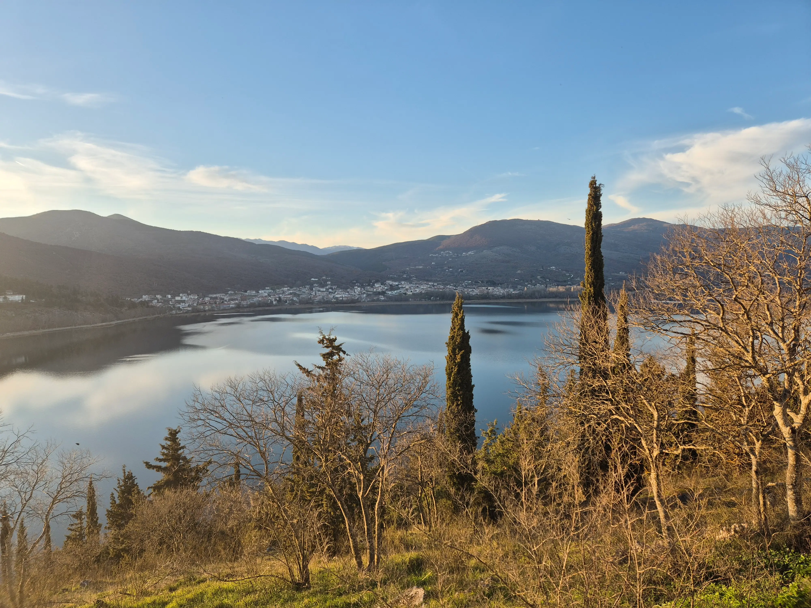
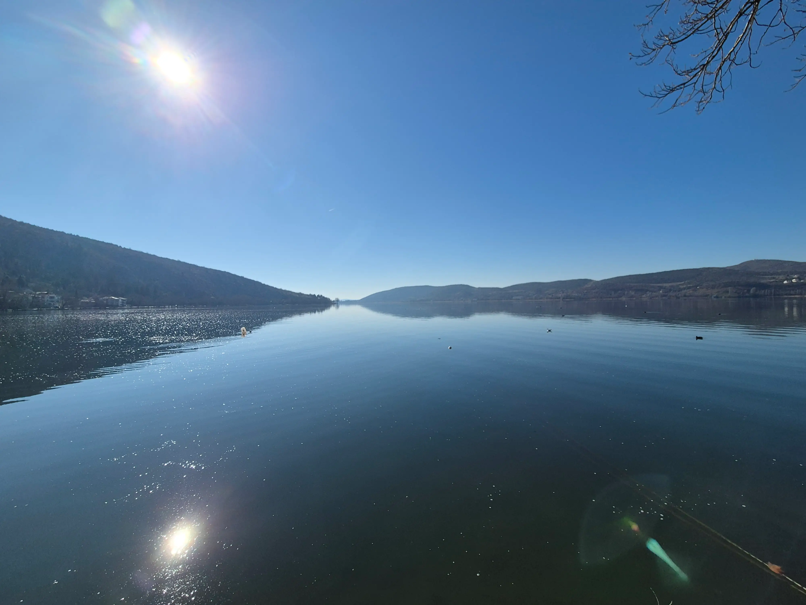
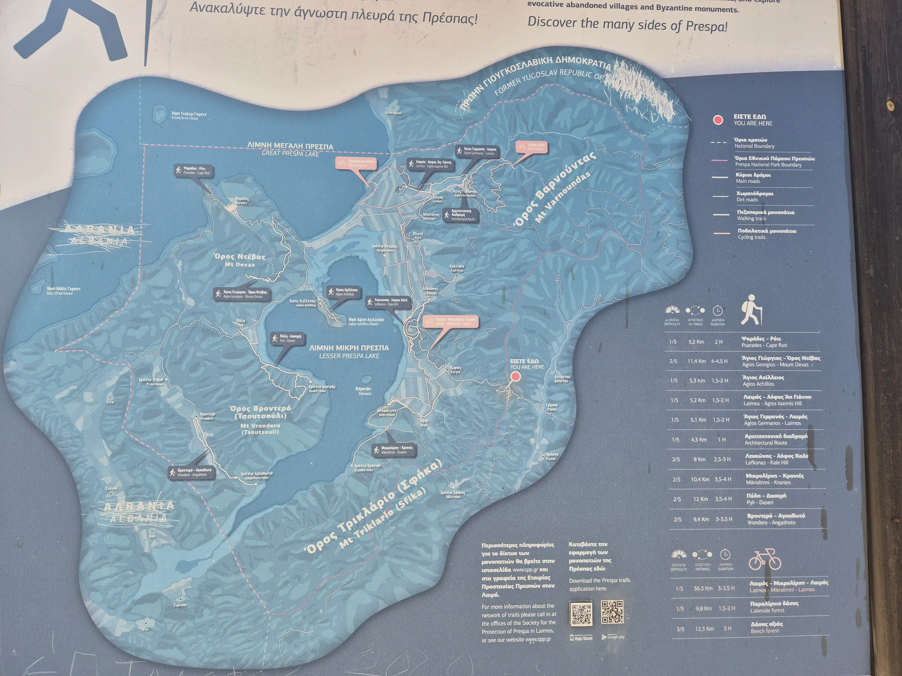
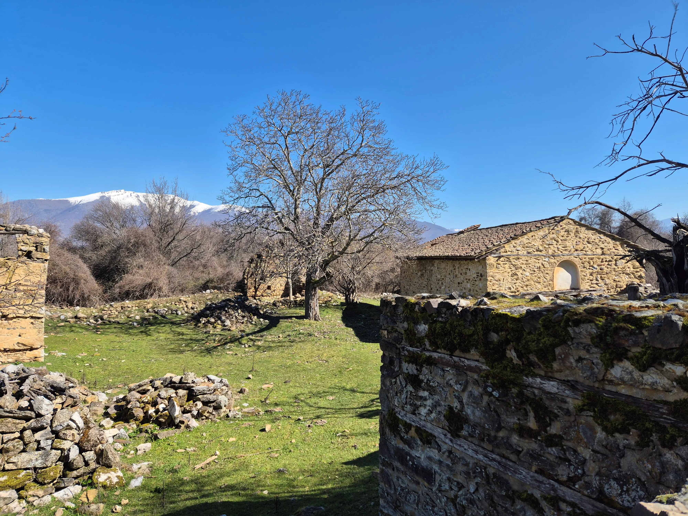
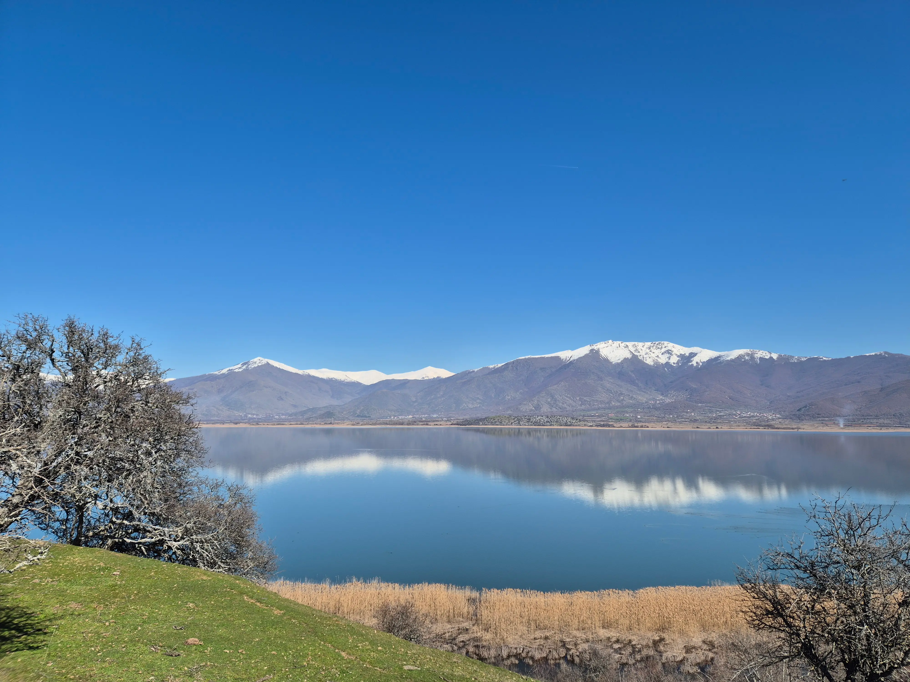

**Summary**:

From one lake to another. From Lake Plastira to [Kastoria](https://www.visitgreece.gr/mainland/macedonia/kastoria/) and [Prespes](https://en.wikipedia.org/wiki/Prespes). If you are a nature lover and have a few more days in Greece, I would recommend visiting them.

<!--truncate-->

## Geography

Starting with Kastoria, it is a city in northern Greece and located in the region of Western Macedonia. Kastoria lies between the [Grammos](https://en.wikipedia.org/wiki/Gramos) and the [Verson/Vitsi](https://en.wikipedia.org/wiki/Verno) mountain range. [Orestiada Lake](https://en.wikipedia.org/wiki/Orestiada) hosts 200 species, including rare and endangered ones.

Continuing with Prespes or the [Prespa National Park](https://whc.unesco.org/en/tentativelists/5864/), from a geographical point of view, it is part of the region of [Florina](https://en.wikipedia.org/wiki/Florina), and is also located in Western Macedonia. It is a UNESCO protected area which spands between three countries, Greece, Albania and Northern Macedonia. Biodiversity within the park is extremely rich with 1,100 plant species, 60 mammal species and 260 bird species. As you can imagine, it is a must-visit destination that is visited by hundreds of people all around the globe.

## Kastoria/Prespes

### How to get there?

You can reach Kastoria by car via the E65 highway from Thessaloniki or the E65/E92 from Ioannina. A bus to the destination is also possible from [Thessaloniki](https://ktelmacedonia.gr/en/routes/tid=19) or from [Athens](https://www.ktel-kastorias.gr/%CE%B1%CE%B8%CE%AE%CE%BD%CE%B1/).

### Accomodation

We decided to stay a bit outside of Kastoria in the [Maniaki town](https://en.wikipedia.org/wiki/Maniakoi). The reasoning behind the decision was the fact that we had a car, and the town is less crowded than the city of Kastoria. Plus, it is only 5 minutes away from Kastoria. But feel free to choose the accommodation of your preference.

### Must See

If you have three days in Kastoria, I would recommend spending one of them in the Prespa National Park. For the remaining two, we visited must-see attractions in Kastoria and spent one day exploring the outskirts of Kastoria.

#### Kastoria

- Cannot miss Lake Orestiada or Kastoria's Lake; just take a refreshment and enjoy the view

- [Dragon's Cave](https://spilaiodrakoukast.gr/en/index) for magnificent stalactites and stalagmites of different shapes and sizes
- After the Dragon's Cave, take the one-way road and visit the [Monastery of Panagia Mavriotissa](https://www.discoverkastoria.gr/en/place/holy-monastery-of-the-virgin-mary-mavriotissa/). The way goes around the lake, and you can see different bird species. I would recommend leaving the car in the parking and walking there.
- From there, continue to the [Ottoman legacy region](https://ilovekastoria.com/history-and-culture/#:~:text=In%20the%2014th%20century%2C%20Kastoria,Blend%20of%20Tradition%20and%20Progress) and just walk to see the different buildings and unique architecture
- And if you feel adventurous, go up the [Prophet Elias](https://westmacedoniamonasteries.gr/en/discover/3/churches-and-pilgrimage-sites/196/church-of-profitis-ilias-in-kastoria) and enjoy the stunning view

- For families, a visit to the local [aquarium](https://enydriokastorias.gr/en/index) is ideal

#### Prespa National Park

Take a look at the latest hiking paths and updates provided by the municipality. From a walking/easy hiking point of view, below are a few destinations you can visit.

- [Agios Achileios](https://www.google.com/maps/place/Agios+Achillios+530+77,+Greece/@40.7880529,21.0740646,17z/data=!3m1!4b1!4m14!1m7!3m6!1s0x1350b2dbd2d9ae69:0xc7f0d1b91f5194e2!2sLake+Prespa!8m2!3d40.8833161!4d21.022196!16zL20vMDV4NTk1!3m5!1s0x1350b33a536712ef:0x97546f65efe082c!8m2!3d40.7883089!4d21.0787698!16s%2Fg%2F11dylvv_h?entry=ttu&g_ep=EgoyMDI2MDMyMy4xIKXMDSoASAFQAw%3D%3D) is the first stop. Leave the car somewhere [here](https://www.google.com/maps/place/%CE%A6%CE%91%CE%A3%CE%9F%CE%9B%CE%99%CE%91+%CE%A0%CE%A1%CE%95%CE%A3%CE%A0%CE%A9%CE%9D+%CE%9D%CE%9F%CE%9D%CE%91+%CE%95%CE%A5%CE%94%CE%9F%CE%9E%CE%99%CE%91/@40.7910784,21.0592166,14.97z/data=!4m14!1m7!3m6!1s0x1350b2dbd2d9ae69:0xc7f0d1b91f5194e2!2sLake+Prespa!8m2!3d40.8833161!4d21.022196!16zL20vMDV4NTk1!3m5!1s0x1350b3071c517d25:0x208fded5da694e68!8m2!3d40.7942746!4d21.0736514!16s%2Fg%2F11yv63k2mc?entry=ttu&g_ep=EgoyMDI2MDMyMy4xIKXMDSoASAFQAw%3D%3D), and take the bridge to the small island.
    - [Basilica of Saint Achillius](https://www.google.com/maps/place/Basilica+of+Saint+Achillius/@40.7866335,21.079899,16.82z/data=!4m14!1m7!3m6!1s0x1350b2dbd2d9ae69:0xc7f0d1b91f5194e2!2sLake+Prespa!8m2!3d40.8833161!4d21.022196!16zL20vMDV4NTk1!3m5!1s0x1350b33a41a68c5b:0x9b4fc3e67486a3fc!8m2!3d40.7876217!4d21.0818276!16s%2Fg%2F11dyjpb5d?entry=ttu&g_ep=EgoyMDI2MDMyMy4xIKXMDSoASAFQAw%3D%3D)
    - Quick hike to the [Holy Monastery of the Virgin Mary Porphyra](https://www.google.com/maps/place/Holy+Monastery+of+the+Virgin+Mary+Porphyra+(16th+c.)/@40.7825802,21.0847105,16.83z/data=!4m14!1m7!3m6!1s0x1350b2dbd2d9ae69:0xc7f0d1b91f5194e2!2sLake+Prespa!8m2!3d40.8833161!4d21.022196!16zL20vMDV4NTk1!3m5!1s0x1350b32c4a799039:0xb9a5bad8dbb196df!8m2!3d40.7808864!4d21.0900725!16s%2Fg%2F12hkzl4rv?entry=ttu&g_ep=EgoyMDI2MDMyMy4xIKXMDSoASAFQAw%3D%3D)
    
    - If you have energy, continue with the [Saint Achilleios Holy Cross](http://google.com/maps/place/Saint+Achilleios+Holy+Cross/@40.7825802,21.0847105,16.83z/data=!4m14!1m7!3m6!1s0x1350b2dbd2d9ae69:0xc7f0d1b91f5194e2!2sLake+Prespa!8m2!3d40.8833161!4d21.022196!16zL20vMDV4NTk1!3m5!1s0x1350b32c13e8a6cd:0xef2ccb0d48fcc4f0!8m2!3d40.779454!4d21.088935!16s%2Fg%2F11gfjb9q49?entry=ttu&g_ep=EgoyMDI2MDMyMy4xIKXMDSoASAFQAw%3D%3D). The road is smaller, but doable for every training level
    
- [Psarades](https://www.google.com/maps/place/Psarades+530+77,+Greece/@40.8293319,21.0262869,17z/data=!3m1!4b1!4m14!1m7!3m6!1s0x1350b2dbd2d9ae69:0xc7f0d1b91f5194e2!2sLake+Prespa!8m2!3d40.8833161!4d21.022196!16zL20vMDV4NTk1!3m5!1s0x1350b470e73ebde9:0x41e5e44b951dcb29!8m2!3d40.8297848!4d21.0317746!16s%2Fm%2F0_qjck1?entry=ttu&g_ep=EgoyMDI2MDMyMy4xIKXMDSoASAFQAw%3D%3D) is ideal for lunch and a guided boat tour of Prespa Lake

## Food and Coffee

Most of the restaurants around the area provide well-cooked, homemade meals at reasonable prices. Below are my recommendations.

### Restaurants

- [Kratergo](https://www.google.com/maps/place/Kratergo/@40.5247081,21.2638769,19z/data=!4m15!1m8!3m7!1s0x13574e951ef68337:0x500bd2ce2ba0710!2sAntartiko+530+76,+Greece!3b1!8m2!3d40.7584718!4d21.2066291!16zL20vMGNwcmI1!3m5!1s0x1359fd3f9c5d1455:0xe2c4dad8cad7a24f!8m2!3d40.5246978!4d21.2638403!16s%2Fg%2F11c5s5xwh3?entry=ttu&g_ep=EgoyMDI2MDMyMy4xIKXMDSoASAFQAw%3D%3D): Well-cooked meals owned by locals at very reasonable prices. We had an excellent lunch.
- [To Steki tis Pareas](https://www.google.com/maps/place/%CE%A4%CE%BF+%CE%A3%CF%84%CE%AD%CE%BA%CE%B9+%CF%84%CE%B7%CF%82+%CE%A0%CE%B1%CF%81%CE%AD%CE%B1%CF%82+-+%CE%A0%CE%B1%CF%8D%CE%BB%CE%BF%CF%85+%CE%9D%CE%B9%CE%BA%CF%8C%CE%BB%CE%B1%CE%BF%CF%82+%26+%CE%A5%CE%B9%CE%BF%CE%B9+%CE%9F.%CE%95/@40.5099884,21.2530816,17z/data=!4m11!1m3!2m2!1sRestaurants!6e5!3m6!1s0x1359fd1d8d458961:0x1d6433944e8ee605!8m2!3d40.5100302!4d21.253094!15sCgtSZXN0YXVyYW50c1oNIgtyZXN0YXVyYW50c5IBEGdyZWVrX3Jlc3RhdXJhbnSaAURDaTlEUVVsUlFVTnZaRU5vZEhsalJqbHZUMnhvYzJSdE5USlJWRXBZVmpCT2JtUXlNWGxhV0Zwc1lqQjBhVlZGUlJBQuABAPoBBQiwARBL!16s%2Fg%2F12hnbw7y9?entry=ttu&g_ep=EgoyMDI2MDMyMy4xIKXMDSoASAFQAw%3D%3D): Traditional and more modern cuisine. We had an early dinner.

### Coffee

You can find coffee pretty much everywhere. Choose your poison!

Enjoy your stay at Kastoria!
