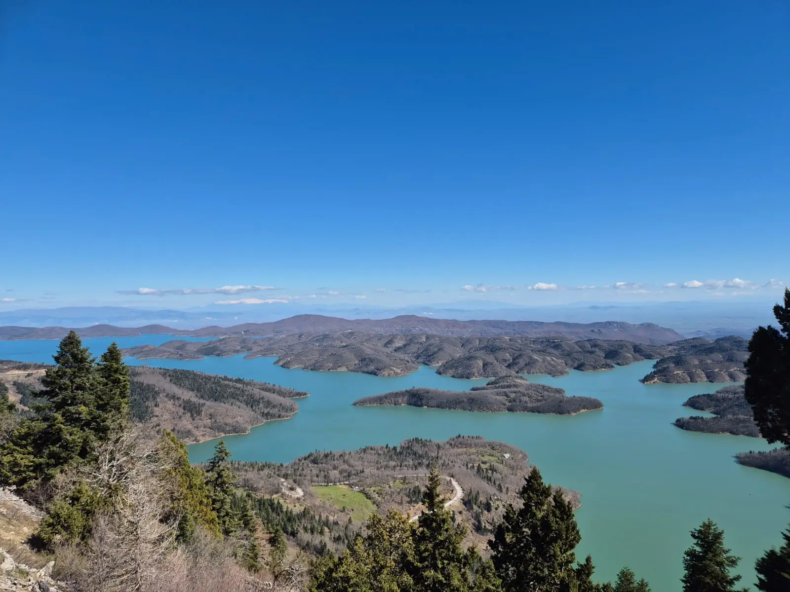
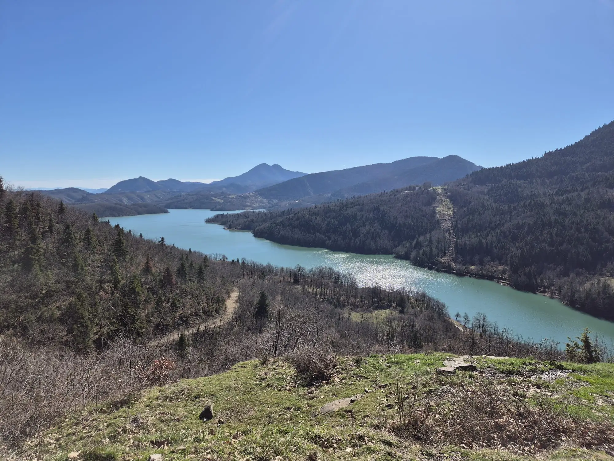
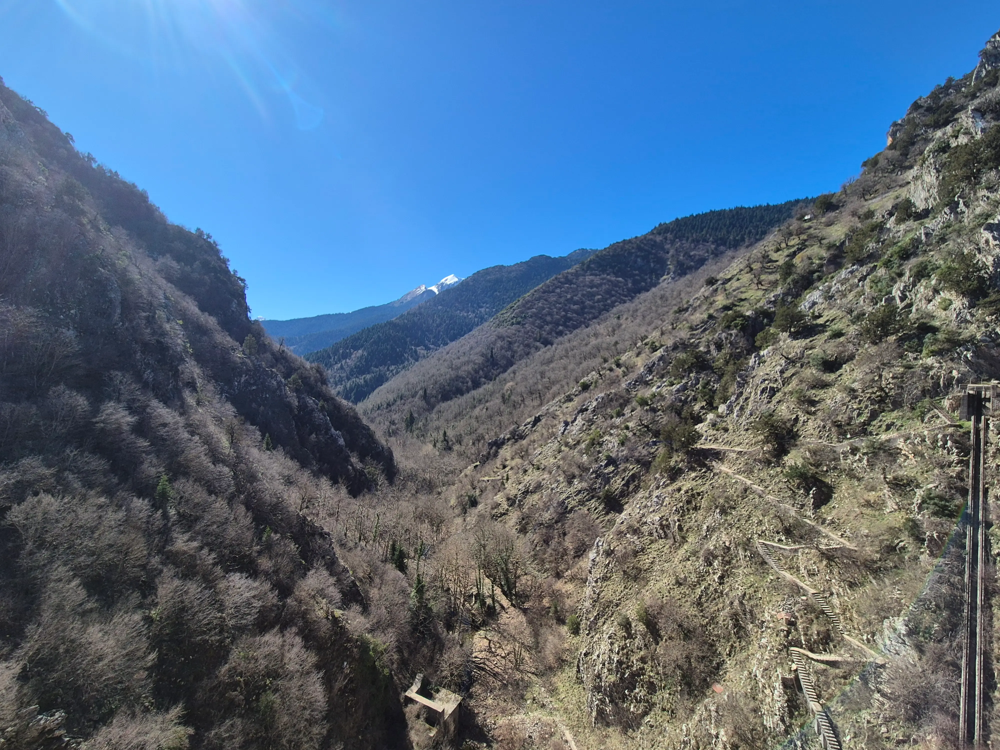
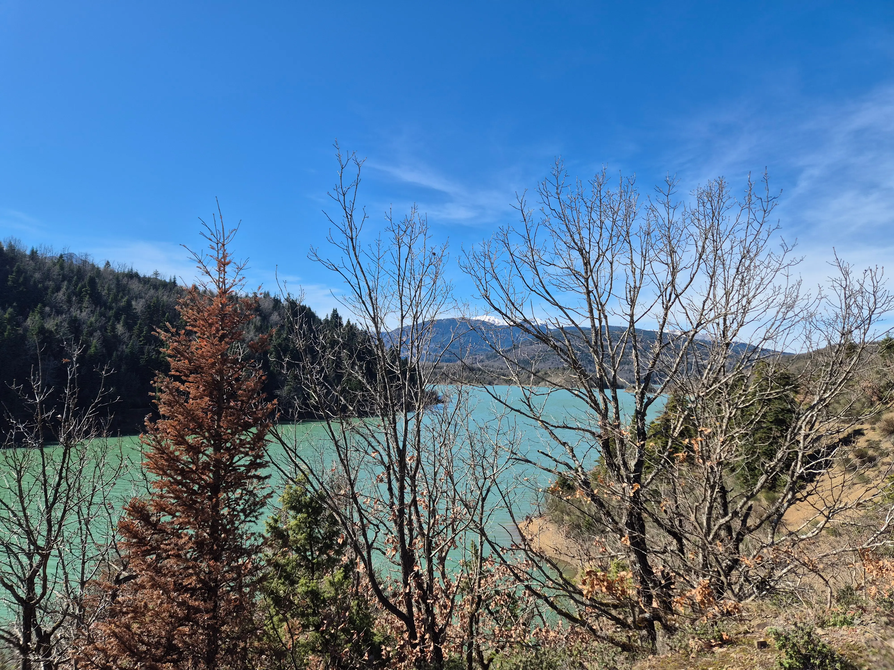
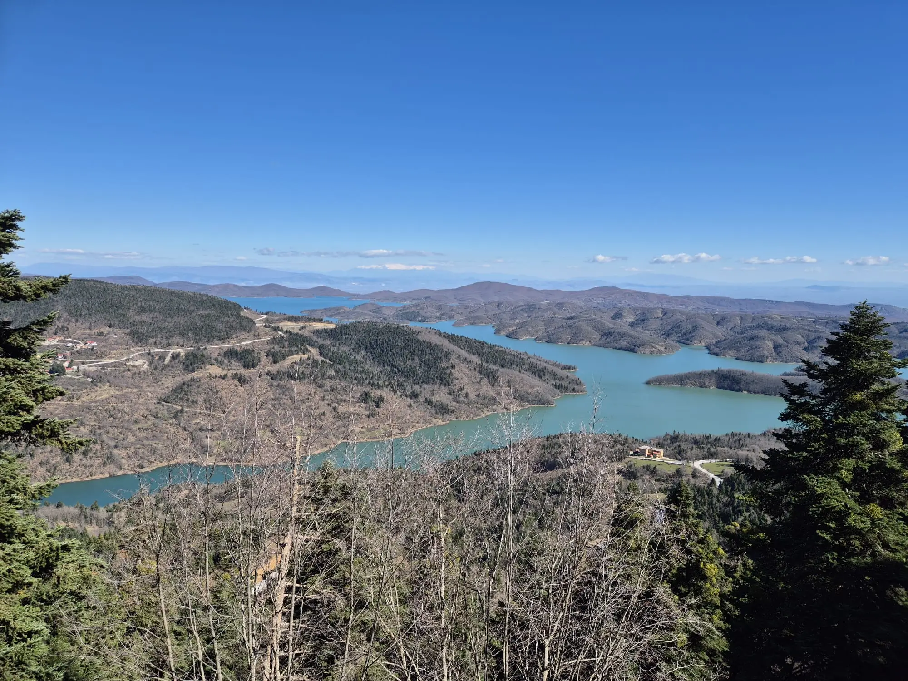

**Summary**:

No work travel this time. Only a few days to recharge my batteries in a quiet, yet magnificent place in Greece, [Lake Plastira](https://en.wikipedia.org/wiki/Lake_Plastiras). If you happen to be there at the end of February or the beginning of March, check out the blog for quick and easy hikes and walks.

<!--truncate-->

## History

Lake Plastira could have been one of the most beautiful natural lakes in Greece; however, this is largely a result of human intervention.

Lake Plastira was created where the river "Tavropos" used to flow, winding its way south to meet the Achelous. This area was called Nevropoli, probably because of the abundance of deer that once lived there. In 1928, a prominent man from Karditsa, General Nikolaos Plastiras, conceived the idea of building a dam that would solve the problem of irrigation in the Thessalian plain, supply water to Karditsa and other communities, and generate electricity by harnessing the power of water. The dam was finalised in 1960, providing all the promised benefits to the surrounding areas.

The lake is located approximately 25 kilometres west of Karditsa, at an altitude of 800 metres. The lake covers an area of approximately 25,000 acres, with a length of 12 kilometres, a width of 4 kilometres, and a depth of approximately 60 metres. The dam is 220 metres long and 83 metres high.

## Accomodation

Lake Plastira is a preferred winter and summer destination for people who love nature, but also for those who want to explore nature and quietness. There are many accommodations available in [Kalyvia](https://www.google.com/maps/place/Kalyvia+430+67/@39.3095292,21.710138,16z/data=!3m1!4b1!4m6!3m5!1s0x13592ef7c06a86c3:0x725700a9c9e4acc1!8m2!3d39.3086972!4d21.7179289!16s%2Fg%2F122k5x8p?entry=ttu&g_ep=EgoyMDI2MDIyNS4wIKXMDSoASAFQAw%3D%3D), [Pezoula](https://www.google.com/maps/place/Pezoula+430+67/@39.3059747,21.690997,17z/data=!3m1!4b1!4m6!3m5!1s0x13592e41c5921627:0x25c1b9aaac9a9cc6!8m2!3d39.3057649!4d21.6948786!16s%2Fg%2F121_zrmj?entry=ttu&g_ep=EgoyMDI2MDIyNS4wIKXMDSoASAFQAw%3D%3D), [Neochori](https://www.google.com/maps/place/Neochori+430+67/@39.27526,21.7249224,16z/data=!3m1!4b1!4m15!1m8!3m7!1s0x13592e41c5921627:0x25c1b9aaac9a9cc6!2sPezoula+430+67!3b1!8m2!3d39.3057649!4d21.6948786!16s%2Fg%2F121_zrmj!3m5!1s0x13592c2737f70b27:0xc64423daec09b2ff!8m2!3d39.2788722!4d21.730263!16s%2Fg%2F121kwbyx?entry=ttu&g_ep=EgoyMDI2MDIyNS4wIKXMDSoASAFQAw%3D%3D), [Moucha](https://www.google.com/maps/place/%CE%9C%CE%BF%CF%8D%CF%87%CE%B1+431+00/@39.2468361,21.7164637,13.83z/data=!4m15!1m8!3m7!1s0x13592e41c5921627:0x25c1b9aaac9a9cc6!2sPezoula+430+67!3b1!8m2!3d39.3057649!4d21.6948786!16s%2Fg%2F121_zrmj!3m5!1s0x13592b86bdb7623b:0xed4ba500b8dfc9be!8m2!3d39.2370503!4d21.7678335!16s%2Fg%2F119tzdndf?entry=ttu&g_ep=EgoyMDI2MDIyNS4wIKXMDSoASAFQAw%3D%3D). Choose whichever location makes sense for you and your budget. A car is required to go around the small villages and proposed locations.

## Day 1

Day 1 for us was short. We had to travel three, fours hours to the final destination. However, the weather was very nice, sunny and around 14 degrees Celcius. We decided to take a quick walk and enjoy the nature around [Pezoula Beach](https://www.google.com/maps/place/Pezoula+Beach/@39.3115126,21.7277527,16.59z/data=!4m15!1m8!3m7!1s0x13592e41c5921627:0x25c1b9aaac9a9cc6!2sPezoula+430+67!3b1!8m2!3d39.3057649!4d21.6948786!16s%2Fg%2F121_zrmj!3m5!1s0x13592ee43b2d1f4b:0xc2624dad704d458a!8m2!3d39.3108233!4d21.7309043!16s%2Fg%2F11cnd9s0ft?entry=ttu&g_ep=EgoyMDI2MDIyNS4wIKXMDSoASAFQAw%3D%3D).

We left the car around [here](https://www.google.com/maps/place/%CE%93%CE%AE%CF%80%CE%B5%CE%B4%CE%BF+%CE%A0%CE%B5%CE%B6%CE%BF%CF%8D%CE%BB%CE%B1%CF%82/@39.3088703,21.7239976,18.44z/data=!4m15!1m8!3m7!1s0x13592e41c5921627:0x25c1b9aaac9a9cc6!2sPezoula+430+67!3b1!8m2!3d39.3057649!4d21.6948786!16s%2Fg%2F121_zrmj!3m5!1s0x13592f7e87787655:0x341caf0e780ce0b2!8m2!3d39.3083137!4d21.7254091!16s%2Fg%2F11fcr8jjhy?entry=ttu&g_ep=EgoyMDI2MDIyNS4wIKXMDSoASAFQAw%3D%3D), and we started walking on the road. 

Depending on the time of the year, the [Trekking Hellas - Plastira lake](https://www.google.com/maps/place/Trekking+Hellas+-+Plastira+lake/@39.3090123,21.7256464,16.71z/data=!4m15!1m8!3m7!1s0x13592e41c5921627:0x25c1b9aaac9a9cc6!2sPezoula+430+67!3b1!8m2!3d39.3057649!4d21.6948786!16s%2Fg%2F121_zrmj!3m5!1s0x13592ee61414af2f:0xf214602016c7da4!8m2!3d39.3086996!4d21.7261017!16s%2Fg%2F1td_7nfg?entry=ttu&g_ep=EgoyMDI2MDIyNS4wIKXMDSoASAFQAw%3D%3D) and the [Tavropos Activities](https://www.google.com/maps/place/Tavropos+Activities/@39.3090123,21.7256464,16.71z/data=!4m15!1m8!3m7!1s0x13592e41c5921627:0x25c1b9aaac9a9cc6!2sPezoula+430+67!3b1!8m2!3d39.3057649!4d21.6948786!16s%2Fg%2F121_zrmj!3m5!1s0x13592f824a6e6bbb:0x8732630cf2bb31f5!8m2!3d39.3092615!4d21.7312328!16s%2Fg%2F11s4hncnjp?entry=ttu&g_ep=EgoyMDI2MDIyNS4wIKXMDSoASAFQAw%3D%3D) will be open and provide different activities to adults and children.

However, if you like walking, take comfortable shoes with you and explore the many different walking/hiking paths in the area.

## Day 2

We started with a quick and easy hike starting at the cemetery of [Belokimiti](https://www.google.com/maps/place/Belokomiti+430+67/@39.2560259,21.7321772,18z/data=!3m1!4b1!4m15!1m8!3m7!1s0x13592e41c5921627:0x25c1b9aaac9a9cc6!2sPezoula+430+67!3b1!8m2!3d39.3057649!4d21.6948786!16s%2Fg%2F121_zrmj!3m5!1s0x13592c40ec8916a7:0xdc7ccf770e3c4aed!8m2!3d39.2561022!4d21.7329724!16s%2Fm%2F02r7d3z?entry=ttu&g_ep=EgoyMDI2MDIyNS4wIKXMDSoASAFQAw%3D%3D). The path takes you down the lake, and someone can enjoy the quietness and the magnificent scenery of the lake's colours in February. The way up might be a bit of a hassle, but it is doable for every training level.

After the quick hike, we decided to continue our exploration with the dam. There is not much to see there, but the size of the [dam](https://en.wikipedia.org/wiki/Plastiras_Dam) is huge and definitely worth a visit.

P.S. The stairs reminded me of Mordor, but in the Greek version of things. :')

Get a quick snack, and let's continue with the next stop. This is called [Paradisos](https://www.google.com/maps/place/%CE%A0%CE%B1%CF%81%CE%AC%CE%B4%CE%B5%CE%B9%CF%83%CE%BF%CF%82+%CE%9B%CE%AF%CE%BC%CE%BD%CE%B7%CF%82+%CE%A0%CE%BB%CE%B1%CF%83%CF%84%CE%AE%CF%81%CE%B1/@39.2353111,21.7542543,14.63z/data=!4m15!1m8!3m7!1s0x13592e41c5921627:0x25c1b9aaac9a9cc6!2sPezoula+430+67!3b1!8m2!3d39.3057649!4d21.6948786!16s%2Fg%2F121_zrmj!3m5!1s0x13592b8bf024dfb5:0x2947c656af623c97!8m2!3d39.2412258!4d21.7809368!16s%2Fg%2F11sy9prdzz?entry=ttu&g_ep=EgoyMDI2MDIyNS4wIKXMDSoASAFQAw%3D%3D) or heaven in english and is indeed a small paradise in Lake Plastira. Leave the car in the [football field](https://www.google.com/maps/place/%CE%A0%CE%B1%CE%BB%CE%B9%CE%AD%CF%82+%CE%9A%CE%B1%CF%84%CE%B1%CF%83%CE%BA%CE%B7%CE%BD%CF%8E%CF%83%CE%B5%CE%B9%CF%82/@39.2393393,21.7877319,17.04z/data=!4m15!1m8!3m7!1s0x13592e41c5921627:0x25c1b9aaac9a9cc6!2sPezoula+430+67!3b1!8m2!3d39.3057649!4d21.6948786!16s%2Fg%2F121_zrmj!3m5!1s0x13592b51dd08c95f:0x14c342f202b363e7!8m2!3d39.2388558!4d21.7904138!16s%2Fg%2F11gxvtqcl1?entry=ttu&g_ep=EgoyMDI2MDIyNS4wIKXMDSoASAFQAw%3D%3D) and choose one of the paths that go around the lake. The walk paths are suitable for all fitness levels.

If you feel hungry after the hike, feel free to explore the different restaurants in the Moucha area. People are super friendly, and the food is excellent. Well prepared with love from the locals!

## Day 3

Our visit to Lake Plastira was not going to be complete without visiting the [observatory](https://www.google.com/maps/place/Observatory+of+Plastiras+Lake/@39.2521159,21.749739,13.76z/data=!4m15!1m8!3m7!1s0x13592e41c5921627:0x25c1b9aaac9a9cc6!2sPezoula+430+67!3b1!8m2!3d39.3057649!4d21.6948786!16s%2Fg%2F121_zrmj!3m5!1s0x13592c5ffcd70899:0xecbb55fcaee4af4b!8m2!3d39.2372891!4d21.7372072!16s%2Fg%2F11c2ls2z4l?entry=ttu&g_ep=EgoyMDI2MDIyNS4wIKXMDSoASAFQAw%3D%3D). You can reach the destination either on foot (recommended) or by car. However, keep in mind this is a dirt road and quite bumpy. If your car is a lower, this might be a challenge.

If you choose to walk to the observatory, I would recommend leaving the car somewhere [here](https://www.google.com/maps/@39.2457064,21.7279161,15.26z?entry=ttu&g_ep=EgoyMDI2MDIyNS4wIKXMDSoASAFQAw%3D%3D) and slowly taking the road up. Ensure to have water and a few snacks. You can have a small picnic once you reach the destination. The views are stunning!

After that, we decided to visit the [botanic garden](https://www.google.com/maps/place/Botanical+Garden+of+Lake+Plastiras/@39.2894294,21.7336035,15.26z/data=!4m6!3m5!1s0x13592ec02035be0d:0x5f5889017a2971af!8m2!3d39.2892108!4d21.7391968!16s%2Fg%2F11c20c9zm5?entry=ttu&g_ep=EgoyMDI2MDIyNS4wIKXMDSoASAFQAw%3D%3D) and then take the path that goes to the Pezoula beach!

## Food and Coffee

Most of the restaurants around the area provide well-cooked, homemade meals at reasonable prices. I would recommend two places for food and a must-go location for coffee.

### Restaurants

- [Gis Chrisopeleia](https://www.google.com/maps/place/Gis+Chrisopeleia/@39.2755705,21.7337662,16.99z/data=!4m9!3m8!1s0x13592c20e85c504d:0x93466feebc086d42!5m2!4m1!1i2!8m2!3d39.2731748!4d21.7329935!16s%2Fg%2F1wnzbz_m?entry=ttu&g_ep=EgoyMDI2MDIyNS4wIKXMDSoASAFQAw%3D%3D): Ideal for meat and fish
- [Tavern Guesthouse Moucha](https://www.google.com/maps/place/%CE%A4%CE%B1%CE%B2%CE%AD%CF%81%CE%BD%CE%B1+%CE%9E%CE%B5%CE%BD%CF%8E%CE%BD%CE%B1%CF%82+%CE%97+%CE%9C%CE%BF%CF%85%CF%87%CE%B1/@39.2534507,21.7477143,14.66z/data=!4m9!3m8!1s0x13592b8418d11983:0x2d59ca29ab2349e9!5m2!4m1!1i2!8m2!3d39.240035!4d21.7688387!16s%2Fg%2F1pp2t_bz8?entry=ttu&g_ep=EgoyMDI2MDIyNS4wIKXMDSoASAFQAw%3D%3D): Ideal for meat, and ask for the daily fish dishes

## Coffee

- [Artemis Cafe-Bar](https://www.google.com/maps/place/Artemis+Cafe-Bar/@39.274574,21.7329382,16.69z/data=!4m6!3m5!1s0x13592c23df5058ef:0xa65a64ffd69269b!8m2!3d39.2722949!4d21.7335001!16s%2Fg%2F11bccjd9yh?entry=ttu&g_ep=EgoyMDI2MDIyNS4wIKXMDSoASAFQAw%3D%3D): If you enjoy your coffee, head to Artemis. A cafe for take-away or dine in. Give the local/traditional sweets a try. You will be surprised!

Enjoy your stay at Lake Plastira!
