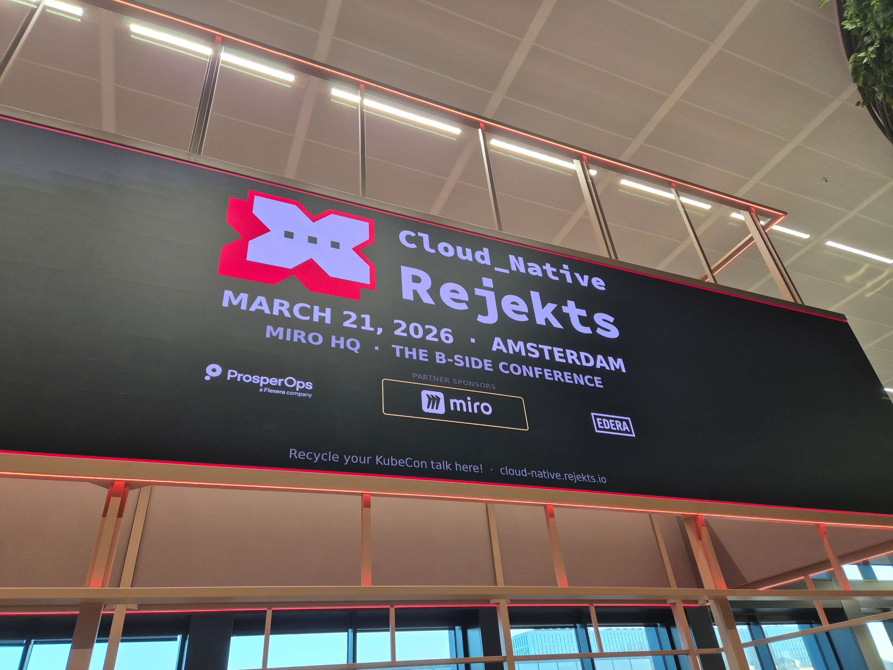
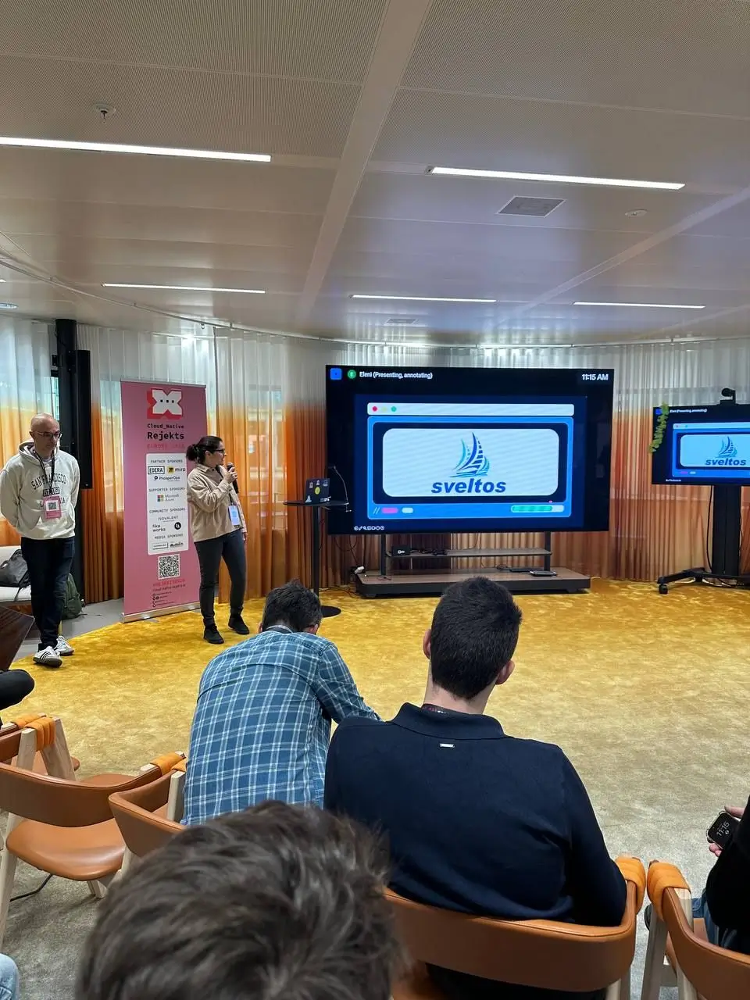
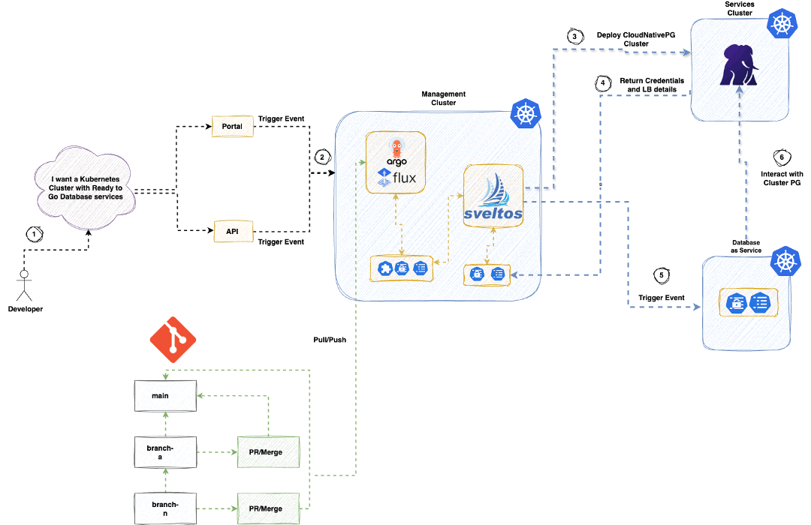

**Summary**:

Cloud Native Rejekts Amsterdam 2026 highlights.

<!--truncate-->

## Introduction

In January 2026, an announcement was made that Cloud Native Rejekts Amsterdam would not take place. However, some people put their efforts together and made this event possible! Thank you, organisers! 💪🎉 Rejekts was primarily and still is a community-driven event. What does that mean? The event typically happens before the main KubeCon. It focuses on people interested in the open-source and cloud-native community. The sessions hosted there usually talk about what's coming next or what the next cool innovation is.

For me, it was my first Rejekts, and prior to this event, I had only heard people talking about it. This year was my turn to experience and understand what the event really means to the community. Of course, a [Sveltos](https://projectsveltos.github.io/sveltos/main/) session was also present. I enjoyed many talks that added value and initiated great discussions. I also met amazing people from diverse backgrounds and experiences. Talking and exchanging ideas were two of my highlights! Of course, great coffee with a barista was part of the event! ☕️

It was a day event and packed with great sessions! Below are some of the highlights.

## Session highlights

The very [first session](https://cloud-native-rejekts-eu-2026.sessionize.com/session/1101964) by [Edera](https://edera.dev/) was about introducing the resurgence of Type 1 hypervisors in Kubernetes for strong workload isolation without the overhead of virtual machines.
The session was all about modern hypervisors and how they stay performant and where solutions like Kata Containers fit into the cloud‑native space. A similar session by Rachid Zarouali explored the different Kubernetes RuntimeClasses as a powerful but often overlooked multi-tenancy tool, enabling multiple container runtimes (e.g., gVisor, Kata) on the same nodes.

A more technical session by [Roberth Strand and Jussi Nummelin](https://cloud-native-rejekts-eu-2026.sessionize.com/session/1122720), where they introduced a Kubernetes‑as‑a‑Service platform using [k0smotron](https://github.com/k0sproject/k0smotron) by separating control and worker planes. For me, the plus point with this approach is the ability to host control planes as pods, but also have them at different datacenters and hyperscales. A declarative approach for provisioning workers with Cluster API, and a GitOps way to manage clusters consistently across cloud, edge, and on‑prem environments. This might be something worth testing out eventually.

Heading to more recent Kubernetes releases, [Abdel Sghiouar](https://cloud-native-rejekts-eu-2026.sessionize.com/session/1109483) covered [In‑Place Pod Resize (IPPR)](https://github.com/kubernetes/enhancements/blob/master/keps/sig-node/5419-pod-level-resources-in-place-resize/README.md) as a breakthrough for Kubernetes resource management, allowing pods to resize without restarts. The session highlighted how true right‑sizing matters and how this approach could improve bin packing, and how combining IPPR with VPA could lead to faster startups and better resource efficiency.

[Maxime Coquerel](https://cloud-native-rejekts-eu-2026.sessionize.com/session/1121501) presented how to perform a forensic investigation in compromised Kubernetes clusters despite their ephemeral nature. The session provided practical techniques for evidence collection, integrity preservation, and post‑incident analysis, while setting realistic expectations about what is possible during Kubernetes incident response. It is worth checking out the tooling presented if you work in the SRE space.

Of course, a [Cilium](https://cilium.io/) session on Kubernetes networking was a must. [Tomasz Tarczyński](https://cloud-native-rejekts-eu-2026.sessionize.com/session/1123960) had a more technical session demystifying Kubernetes networking by tracing the life of a packet through the cluster and explaining how kube‑proxy implements Services using iptables. The approach showed how replacing kube‑proxy with Cilium’s eBPF data path removes bottlenecks by handling load balancing, NAT, and connection tracking directly in the kernel, resulting in simpler, faster, and more scalable networking with a clear understanding of what actually happens under the hood.

## Sveltos at Rejekts

Sveltos was not missing from the event. We held a 30-minute session on tool sprawl. We discussed its impact on Platform teams and how Sveltos can help by allowing teams to deploy with flexibility and confidence without needing extra tools. We also covered how Sveltos addresses tool sprawl and reduces silos between teams!

The code examples can be found at a [GitHub repository](https://github.com/egrosdou01/cloud-native-rejekts-2026).

### Session Diagram

## Resources

- [Rejekts Amsterdam 2026](https://cloud-native.rejekts.io/)
- [Getting Started with Sveltos](https://projectsveltos.github.io/sveltos/main/getting_started/install/quick_start/)

## Conclusion

The open-source and cloud-native communities make these events unique. Thanks to the organisers for making everything as smooth as possible. The team is looking for sponsors and feedback for the next Cloud Native Rejekts in the USA. Give them a shout if you can help in any way! Feel free to get in touch via [Linkedin](https://www.linkedin.com/company/cloud-native-rejekts/posts/?feedView=all) or using the official website provided.

## ✉️ Contact

If you have any questions, feel free to get in touch! You can use the `Discussions` option found [here](https://github.com/egrosdou01/blog.grosdouli.dev/discussions) or reach out to me on any of the social media platforms provided. 😊 We look forward to hearing from you!

## Talk Details

| Youtube | Description | Minutes |
| :--- | :---- |:---- |
| [Room 2](https://www.youtube.com/watch?v=7O8pqiK22wA) | Beyond Tool Sprawl: An Event-Driven Approach to Dynamic Multi-Cloud Operations | Minutes: 0:00-22:58 |
