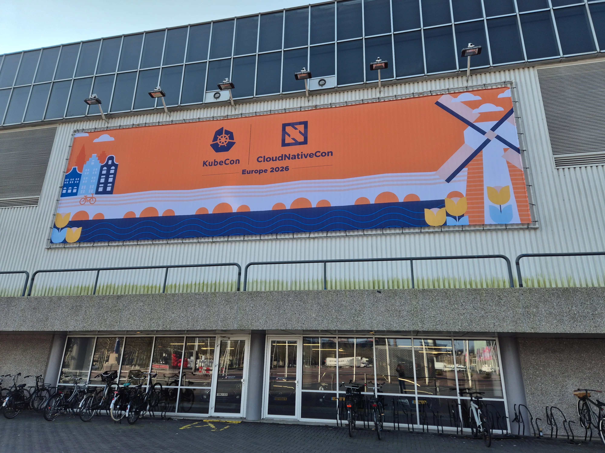
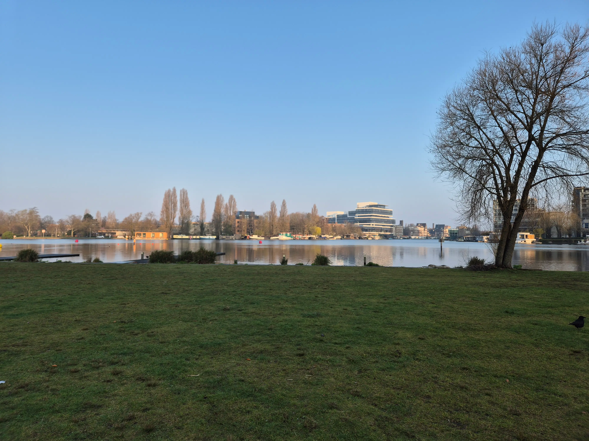
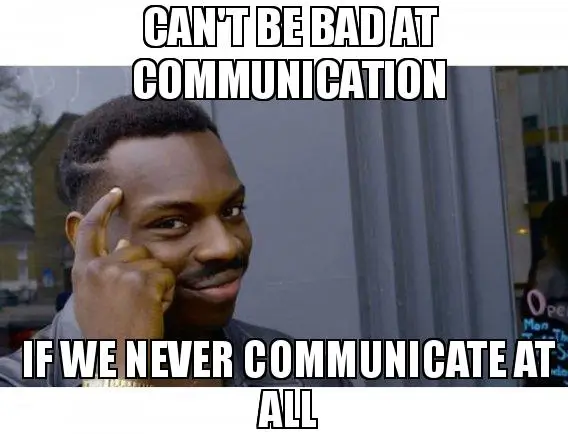

**Summary**:

KubeCon Amsterdam 2026 highlights.

<!--truncate-->

## Introduction

Well, first [KubeCon](https://events.linuxfoundation.org/kubecon-cloudnativecon-europe/) ever for me! I was already hyped by the [Cloud Native Rejekts](https://cloud-native.rejekts.io/) and the energy of the community; I was looking forward to attending this one! [Vlad's post](https://hai.wxs.ro/guides/kubecon-guide/) got me thinking, "You will walk and talk a lot." He also shared useful tips: download the venue map, remember must-see sessions, avoid overscheduling, and pack light. And I would agree with most of the points mentioned! Indeed, it was going to be a long week, and I had to come up with a plan to keep the energy levels high. My plan was simple: I would run almost daily in the morning, shower, eat breakfast, pack, and head to the event. And to be honest, the morning runs were great! They were refreshing, especially with the unpredictable weather in Amsterdam. From sun to wind and rain!

From the moment I entered the venue, I noticed the vibrant community. It struck me that it was full of engineers who work with open-source and cloud-native technologies. They share my passions and interests, and we all face the same issues and frustrations. So, let the week begin. And in all truth, it was an amazing week, with amazing humans!

Briefly, my main focus was to discuss and exchange ideas with fellow platform engineers on scalability, security, and the different ways and approaches of running AI workloads. Apart from that, I wanted to visit a few booths and ask about roadmap items and what is coming next.

## Day-0: Co-located Events

I was lucky enough to attend the KubeCon co-located events. I was between the Platform Engineering, Flux, Cilium and MCP Con. My morning started with the session ["Vibe Coding Meets Gitops" by Stefan Prodan](https://colocatedeventseu2026.sched.com/event/2DY11/vibe-coding-meets-gitops-stefan-prodan-controlplane), where the Flux MCP was introduced alongside its usability and its purpose when it comes to AI agents and GitOps. A bit later on, the session ["Talking To Your Cluster: Conversational Gitops with Flux MCP by William Rizzo"](https://colocatedeventseu2026.sched.com/event/2ICsA/talking-to-your-cluster-conversational-gitops-with-flux-mcp-william-rizzo-mirantis) gave a practical example of how to combine a GitOps approach with an AI agent specialised in Flux.

Max Koerbaecher provided a nice overview and practical insights on how to create an IDP for AI engineering. The session details are available [here](https://colocatedeventseu2026.sched.com/event/2DY2Z/creating-an-idp-for-ai-engineering-max-korbacher-liquid-reply-gmbh). To me, the "AIDP Reference Architecture" mentioned in the slides is something to take and start discussions with the platform team.

Continuing with Dominik Schmidle and the session ["Overwhelmed by Scale: How Product Thinking Fixes Platform Teams"](https://colocatedeventseu2026.sched.com/event/2DY5o/overwhelmed-by-scale-how-product-thinking-fixes-platform-teams-dominik-schmidle-giantswarmio), where he explained how platform teams started off well but ended up overwhelmed with different sorts of issues and concerns, the session explains that the fix is to treat the platform like a product!

At the MCP Con, I had the chance to watch a talk by [Patrick Debois "The New AI Coding Fabric"](https://colocatedeventseu2026.sched.com/event/2DY5H/the-new-ai-coding-fabric-patrick-debois-tessl), on how AI-driven development is evolving and goes beyond traditional IDEs. I kept the phrase "Context is the fuel", and a way to remember that garbage in, garbage out. Context will be one of the most critical aspects when it comes to AI coding.

Last but not least, Cilium Con was a blast! My highlight sessions were one from [Mikael Johansson Länsberg](https://colocatedeventseu2026.sched.com/event/2DY7S/cloud-native-promises-on-premises-bump-your-load-balancing-to-v2-with-cilium-mikael-johansson-lansberg-etraveli-group-ab) on how to replace legacy load balancers with Cilium, the lightning talk from [Martynas Pumputis](https://colocatedeventseu2026.sched.com/event/2DY8x/cllightning-talk-whats-happening-in-cilium-current-projects-you-need-to-see-martynas-pumputis-isovalent-at-cisco) on what's happening in Cilium and the lessons learned when it comes to Tetragon policies from [Alessio Biancalana](https://colocatedeventseu2026.sched.com/event/2DY8B/one-policy-to-rule-them-all-scaling-tetragon-without-flooding-your-cluster-alessio-biancalana-suse).

## KeyNotes

From a keynote's point of view and more on the technical side, I felt we moved away from the AI general talks, and we headed into scalable, secure and extensible platforms for AI. Platforms are once again in the center of operations and serve developers the best way possible by the use of self-service portals or APIs. The Platform teams will have to provide Al infrastructure and capabilities using best practices and guardrails. Let the challenge begin!

Sovereignty and the Open Sovereign Cloud came up as a big topic and names like the [NeoNephos](https://neonephos.org/), [OVH](https://www.ovhcloud.com/en/) and [Upcloud](https://upcloud.com/) popped up. Apart from that, [llm-d](https://www.cncf.io/blog/2026/03/24/welcome-llm-d-to-the-cncf-evolving-kubernetes-into-sota-ai-infrastructure/) joined the Cloud Native Computing Foundation (CNCF), and [solo.io](https://www.solo.io/) announced the launch of **agentevals** and the contribution of the open source project agentregistry to the CNCF.

Last but not least, day 1 keynotes concluded with an [electric glider](https://kccnceu2026.sched.com/event/2CtJP/keynote-riding-the-waves-around-the-world-in-an-electric-glider-powered-by-nature-data-and-open-science-ricardo-rocha-lead-platforms-infrastructure-cern-klaus-ohlmann-founder-mountain-wave-project) powered by renewable energy. A session out of the ordinary. Very interesting topic around sustainability.

## Day-1

[Evangelista Tragni](https://kccnceu2026.sched.com/event/2CVy5/api-is-the-new-ssh-forging-a-zero-trust-vm-platform-on-kubernetes-evangelista-tragni-devoteam) had a great session on [KubeVirt](https://kubevirt.io/). He shared many insights about the technology, how it works, and its current limitations. If your organisation is looking for ways to use Kubernetes for hosting virtual machines, I would recommend taking a look at the session notes.

I particularly enjoyed the session from [Sunny Beatteay](https://kccnceu2026.sched.com/event/2EMyb/1000-services-1-year-0-downtime-airbnbs-zonal-cluster-migration-sunny-beatteay-airbnb). They shared their journey of moving cloud infrastructure from regional to zonal clusters. Their team’s experiences and the lessons learned during the migration were especially insightful. Worth checking out.

[Maciek Różacki and Artur Rodrigues](https://kccnceu2026.sched.com/event/2CVzF/the-future-of-kubernetes-scalability-challenges-of-the-gigawatt-computing-power-of-the-ai-era-maciek-rozacki-google-cloud-artur-rodrigues-anthropic) discussed the architectural shifts required for Kubernetes to remain the backbone of modern computing when it comes to AI and LLMs.

## Day-2

So many great sessions at day 2; however, my personal highlight was a session from [Stefan Bueringer and Fabrizio Pandini "In-place Updates with Cluster API: The Sweet Spot Between Immutable and Mutable Infrastructure"](https://kccnceu2026.sched.com/event/2CW1r/in-place-updates-with-cluster-api-the-sweet-spot-between-immutable-and-mutable-infrastructure-fabrizio-pandini-stefan-buringer-broadcom), where they explored Cluster API's innovative in-place updates feature, which eliminates the need to choose between immutable and mutable infrastructure approaches.

Day 2 for me was mostly spent at the show expo floor and at the booth area, mainly talking to vendors I had an interest in. Apart from that, I met and had discussions with different people from different backgrounds and experiences! Loved it!

### Booths I Always Visit

I make it a point to visit the booths below at conferences and ask what is coming next:

- [vCluster](https://www.vcluster.com/): I use vCluster to set up multitenant environments and automate workflows with [Sveltos](https://projectsveltos.github.io/sveltos/main/)
- [Sidero Labs](https://www.siderolabs.com/): As a Talos fan, I always check in on what is next. I am particularly excited about SBOM capabilities for the open-source version.
- [Isovalent](https://isovalent.com/): Great conversations with knowledgeable people about Cilium and the Isovalent Platform. Plus, nice stickers and hands-on labs to explore Cilium features
- [SUSE](https://documentation.suse.com/cloudnative/rke2/): RKE2 clusters are heavily used in my lab setup alongside Talos. I am always curious about what is coming
- [Dash0](https://www.dash0.com/): Discovered a fresh approach to collecting and displaying metrics; it is worth checking out!

## Day-3

Day-3 was a short one for me as I had to make my way back home. If you are into Kubernetes networking and want to explore how Cilium could fit in your Platform and solve issues on the network layers using a modern and innovative approach, check out the session from [Benoit Entzmann "An Immersive and Virsual Journey Into Kubernetes Networking"](https://kccnceu2026.sched.com/event/2CW5p/an-immersive-and-visual-journey-into-kubernetes-networking-benoit-entzmann-feesh).

## Resources

- [KubeCon Europe Amsterdam Schedule 2026](https://kccnceu2026.sched.com/)
- [Youtube - KubeCon and CloudNativeCon Series](https://www.youtube.com/playlist?list=PLj6h78yzYM2MXCOWSN9CqqID6OOvF7wxL)

## Conclusion

I will take with me the chance to meet new people, build connections, and share ideas on various topics. AI was everywhere at the conference and will remain there. Still, we are humans after all!

[Source](https://makeameme.org)

## ✉️ Contact

If you have any questions, feel free to get in touch! You can use the `Discussions` option found [here](https://github.com/egrosdou01/blog.grosdouli.dev/discussions) or reach out to me on any of the social media platforms provided. 😊 We look forward to hearing from you!
