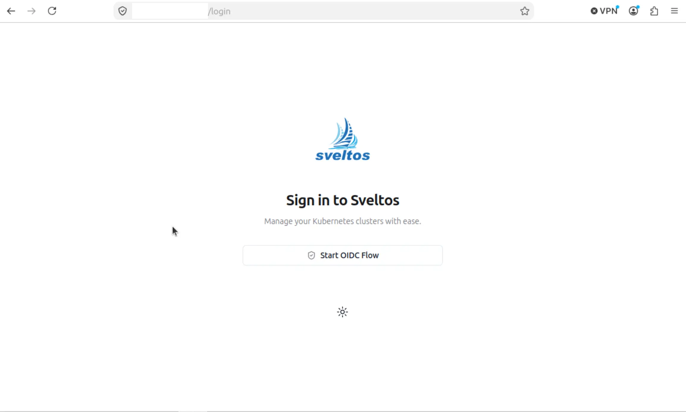
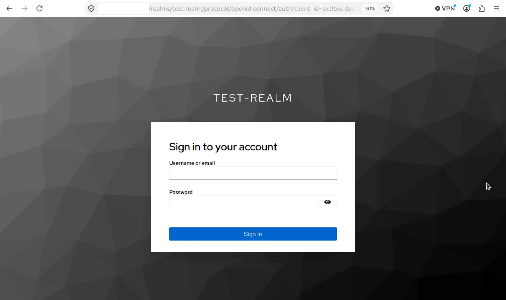
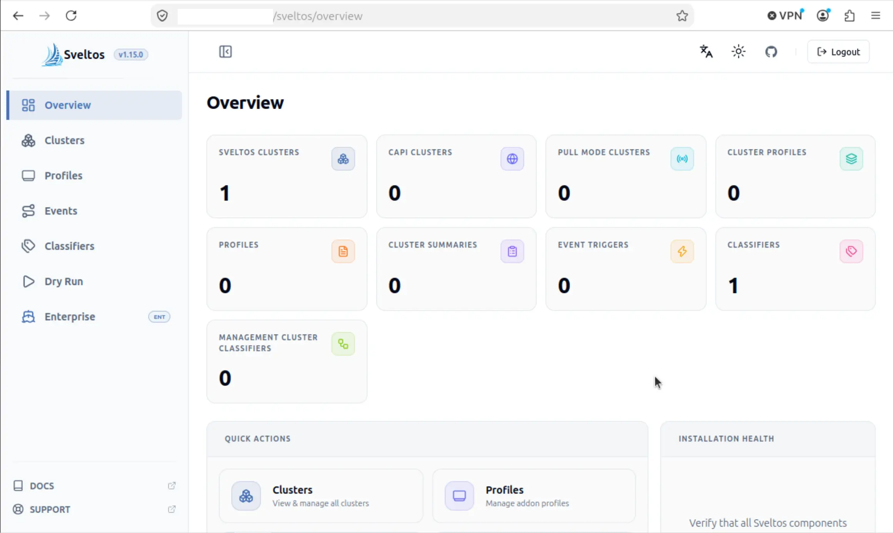

**Summary**:

Let's explore how to enable the Sveltos dashboard with [OpenID Connect (OIDC) Authentication](https://openid.net/developers/how-connect-works/) using [Keycloak](https://www.keycloak.org/). We use an RKE2 cluster powered by **Cilium** and **Gateway API**.

<!--truncate-->

## Introduction

Since the Sveltos release v1.10.0, the Sveltos dashboard supports OIDC authentication using the Authorization Code Flow with PKCE (public client). To enable OIDC, we need to configure the Sveltos dashboard Helm chart values, configure the Kubernetes API server, and set up RBAC for the dashboard users. Keycloak and the Sveltos dashboard are exposed via `HTTPRoute` resources using the [Cilium and Gateway API](https://docs.cilium.io/en/latest/network/servicemesh/gateway-api/gateway-api/) support, with the only difference being that the Keycloak deployment is on a Services cluster in a different network segment.

:::note
In this post, we do not cover how to configure Keycloak. If you would like to see this, contact me, and I will create a blog post on it.
:::

To understand more in-depth how the flow of OAuth2 and OIDC works together, I would highly recommend watching the [OAuth and OpenID Connect Explained video by Okta](https://www.youtube.com/watch?v=t18YB3xDfXI).

## Lab Setup

```bash
+-------------------------+--------------+------------------+
|        Resources        |     Type     |     Version      |
+-------------------------+--------------+------------------+
|  Management Cluster     |     RKE2     | v1.35.6+rke2r1   |
|        Sveltos          |  Helm Chart  |     v1.15.0      |
|    Sveltos Dashboard    |  Helm Chart  |     v1.15.0      |
|         Cilium          |     CNI      |     v1.19.4      |
+-------------------------+--------------+------------------+
```

## Prerequisites

1. A Kubernetes cluster with Keycloak already in place
1. A recent Helm version installed
1. **kubectl** installed/available. Find the guide [here](https://kubernetes.io/docs/tasks/tools/install-kubectl-linux/)

## Keycloak Deployment

The Keycloak instance is exposed via a Gateway API `HTTPRoute` resource. More details on how that works, take a look at a [previous blog post](../2024-12-29-experimenting-with-vCluster-and-multitenancy/vcluster-updates-05.md). To allow Keycloak to authenticate Sveltos dashboard users, we performed the following.

1. Create a Realm called `test-realm`
1. Create a Client ID `sveltos-dashboard`
1. Populate the `Valid redirect URIs`, `Web origins`, and `Admin URL` values as below.
    - https://Sveltos Dashboard FQDN/oidc-callback
    - https://Sveltos Dashboard FQDN
    - https://Sveltos Dashboard FQDN
1. Disable `Client authentication`
1. Enable `Standard flow` under "Authentication flow"
1. Navigate to the "Advanced" tab and set the "Proof Key for Code Exchange Code Challenge Method" to S256. This enforces that the client must use PKCE with the S256 challenge method during authentication.

For more information on how to set up Keycloak, take a look at the [official documentation](https://www.keycloak.org/documentation) and [Sveltos documentation](https://projectsveltos.io/main/getting_started/optional/dashboard/#oidc-authentication).

:::note
The **Client ID** value is important, and it is used in two more places in the configuration: in the RKE2 Kube API server configuration and Sveltos dashboard Helm chart values.
:::

## Update RKE2 Kube API Server Values

Because we want the Kubernetes API server to accept and validate OIDC tokens, we will update the controller configuration to include the arguments listed below. On an RKE2 installation, the server configuration is stored under `/etc/rancher/rke2/config.yaml`. We will update the existing configuration to add the OIDC details. Then, we will restart the `rke2-server` service using `systemctl`.

```yaml showLineNumbers
kube-apiserver-arg:
  - "oidc-issuer-url=https://<your Keycloak domain>/realms/test-realm"
  - "oidc-client-id=sveltos-dashboard"
  - "oidc-username-claim=preferred_username"
  - "oidc-username-prefix=oidc:"
  - "oidc-ca-file=/var/lib/rancher/rke2/server/tls/keycloak-ca.crt"
```

:::note
By default, if the `oidc-username-prefix` is not set, the Kubernetes API server automatically prefixes usernames with the issuer URL to avoid collisions with other authentication methods. Setting the `oidc-username-prefix` to `oidc:` gives us a shorter and predictable prefix, which is what we will use for the RBAC configuration.
:::

:::note
The trusted CA used for Keycloak needs to be copied under `/var/lib/rancher/rke2/server/tls/`. The directory is already mounted for the static RKE2 pods. If the CA is not copied over, we will get issues while contacting the Keycloak instance. Ensure the values provided under the `kube-apiserver-arg` section reflect your Keycloak setup for the Sveltos Dashboard. The `oidc-ca-file` must point to the CA certificate that signed Keycloak's serving TLS certificate.
:::

Once the changes are done, go ahead and restart the `rke2-server` service.

```bash
$ systemctl restart rke2-server
$ systemctl status rke2-server
```

## Sveltos Dashboard

The Sveltos dashboard is installed as a Helm chart, and following the [official documentation](https://projectsveltos.io/main/getting_started/optional/dashboard/), we will provide the required Helm values to enable OIDC authentication.

```bash
$ helm repo add projectsveltos https://projectsveltos.github.io/helm-charts
$ helm repo update
```

```bash
$ helm install sveltos-dashboard projectsveltos/sveltos-dashboard -n projectsveltos \
  --set auth.oidc.issuer=https://<Keycloak domain>/realms/test-realm \
  --set auth.oidc.clientId=sveltos-dashboard \
  --set auth.oidc.redirectUri=https://<Sveltos dashboard domain>/oidc-callback
```

Just ensure the deployment is successfully deployed and the relevant dashboard components are in a **Running** state.

```bash
$ kubectl get pods -n projectsveltos -l app.kubernetes.io/instance=sveltos-dashboard,app.kubernetes.io/name=sveltos-dashboard
NAME                                 READY   STATUS    RESTARTS   AGE
dashboard-6f7b5df444-flwgl           1/1     Running   0          1h
ui-backend-manager-c7649c7bd-65xjd   1/1     Running   0          1h
```

### Permissions - ClusterRoleBinding

#### Admin Permissions

To login to the Sveltos dashboard as an admin user, the below `ClusterRoleBinding` resource maps the `ClusterAdmin` role. Once the resource is applied to the management cluster (where Sveltos is installed), the defined user will have full access to the Sveltos dashboard.

```yaml showLineNumbers
apiVersion: rbac.authorization.k8s.io/v1
kind: ClusterRoleBinding
metadata:
  name: sveltos-dashboard-admin
roleRef:
  apiGroup: rbac.authorization.k8s.io
  kind: ClusterRole
  name: cluster-admin
subjects:
  - apiGroup: rbac.authorization.k8s.io
    kind: User
    name: "oidc:test"
```

```bash
$ kubectl apply -f sveltos-clusterrolebind-admin.yaml
```

:::note
The name defined under `subjects.name` (test) should match the user created in the defined Keycloak realm. If not, the authentication will not work.
:::

#### Restricted Permissions

To restrict access to a specific namespace, we can deploy the following `ClusterRole` and `RoleBinding` resources. The configuration will restrict the defined user to see only resources in the `staging` namespace.

```yaml
apiVersion: rbac.authorization.k8s.io/v1
kind: ClusterRole
metadata:
  name: sveltos-dashboard-reader
rules:
- apiGroups: ["apiextensions.k8s.io"]
  resources: ["customresourcedefinitions"]
  verbs: ["get", "list", "watch"]
- apiGroups: ["authentication.k8s.io"]
  resources: ["tokenreviews"]
  verbs: ["create"]
- apiGroups: ["authorization.k8s.io"]
  resources: ["subjectaccessreviews"]
  verbs: ["create"]
- apiGroups: ["lib.projectsveltos.io"]
  resources: ["*"]
  verbs: ["get", "list", "watch"]
- apiGroups: ["config.projectsveltos.io"]
  resources: ["*"]
  verbs: ["get", "list", "watch"]
- apiGroups: ["cluster.x-k8s.io"]
  resources: ["clusters", "clusters/status"]
  verbs: ["get", "list", "watch"]
---
apiVersion: rbac.authorization.k8s.io/v1
kind: RoleBinding
metadata:
  name: sveltos-dashboard-reader-bind
  namespace: staging
roleRef:
  apiGroup: rbac.authorization.k8s.io
  kind: ClusterRole
  name: sveltos-dashboard-reader
subjects:
- apiGroup: rbac.authorization.k8s.io
  kind: User
  name: "oidc:test"
```

## Cilium Configuration

Since **Cilium v1.19.4** is already installed in the RKE2 cluster and the Gateway API integration is in place, we can continue with deployment of the `Gateway` and `HTTPRoute` resources.

```yaml showLineNumbers
apiVersion: gateway.networking.k8s.io/v1
kind: Gateway
metadata:
  name: sveltos-dashboard-gw
  namespace: projectsveltos
spec:
  gatewayClassName: cilium
  listeners:
    - name: https
      protocol: HTTPS
      port: 443
      hostname: "sveltos.dashboard.domain"
      tls:
        mode: Terminate
        certificateRefs:
          - kind: Secret
            name: test-lab-tls # The secret is already created and contains the TLS details for the Sveltos dashboard 
      allowedRoutes:
        namespaces:
          from: Same
---
apiVersion: gateway.networking.k8s.io/v1
kind: HTTPRoute
metadata:
  name: sveltos-dashboard
  namespace: projectsveltos
spec:
  parentRefs:
    - name: sveltos-dashboard-gw
      sectionName: https
  hostnames:
    - "sveltos.dashboard.domain"
  rules:
    - matches:
        - path:
            type: PathPrefix
            value: /
      backendRefs:
        - name: dashboard
          port: 80
```

If the Cilium and Gateway API deployment is working as expected, the `Gateway` resource should get a valid routable IP address and consequently be able to access the Sveltos dashboard from a browser using the FQDN defined. If something does not work as expected, I would recommend referring at a previous post [containing a troubleshooting section for Gateway API](../2024-12-29-experimenting-with-vCluster-and-multitenancy/vcluster-updates-05.md#common-issues-and-troubleshooting-steps).

### Validation

Run the `kubectl` command below and ensure the `Gateway` and `HTTPRoute` resources are in a Successful state.

```bash
$ kubectl get gateway,httproute -n projectsveltos
NAME                                                     CLASS    ADDRESS     PROGRAMMED   AGE
gateway.gateway.networking.k8s.io/sveltos-dashboard-gw   cilium   x.x.x.x     True         1h

NAME                                                   HOSTNAMES                      AGE
httproute.gateway.networking.k8s.io/sveltos-dashboard  ["sveltos.dashboard.domain"]  1h
```

## Test Sveltos Dashboard UI

:::note
We need at least one user under the defined Realm and Client ID.
:::

Open a browser window and type the FQDN of the Sveltos dashboard. If the DNS in the underlying infrastructure works as expected, we will be able to resolve the hostname to the defined IP address which is the IP address of the `Gateway` resource. Expected behaviour: the Sveltos dashboard is accessible, the OIDC option is enabled, and authentication is done through Keycloak.








## Common Issues

### Incorrect RKE2 Kube API Server Details

This is a critical part of the process. Go through the Sveltos official documentation and ensure the values defined for the Kube API server configuration reflect the reality of your setup. Also, ensure there are no typos and the configuration is free from errors.

A good approach is to check the `rke2-server` service logs for any OIDC output.

```bash
$ journalctl -u rke2-server -f | grep -i oidc
```

We can also check the logs of the `kube-apiserver` at the Kubernetes level.

```bash
$ kubectl logs kube-apiserver-name-of-controller -n kube-system | grep -i oidc
```

### Incorrect Keycloak root CA RKE2

A lot of issues and confusion come from untrusted CAs defined under the OIDC configuration section of the Kube API server. For example, an x509 certificate signed by an unknown authority (wrong/missing root CA), no such file or directory (incorrect mount point), x509 malformed certificate, or a generic 401 HTTP error for unauthorised OIDC requests. For that reason, ensure the provided CA for the `oidc-ca-file` flag maps to the correct CA used for the Keycloak deployment.

We can use `openssl` to validate the issuer of the CA using the command `openssl x509 -in /var/lib/rancher/rke2/server/tls/keycloak-ca.crt -noout -subject -issuer`.

### Misconfigurations

A lot of 401 HTTP errors can pop up due to typos and misconfigurations on the Keycloak side. Ensure the provided Client details for your Realm do not contain typos or incorrect information. It's a good approach to **Inspect** (via your favourite browser) the HTTPS session and capture any errors listed in the **Network** tab. Try to understand what is failing.

Also, check the Sveltos backend deployment details for more logs.

```bash
$ kubectl logs ui-backend-manager-c7649c7bd-65xjd -n projectsveltos 
```

## Conclusion

You made it to the end of this blog post! You can now use the Sveltos dashboard and authenticate users with your preferred OIDC solution! The setup gives us a unified way of authenticating users while providing flexibility to teams who want to have access to the Sveltos dashboard.

## Resources

- [Sveltos Quick Start](https://projectsveltos.io/main/getting_started/install/quick_start/)
- [Keycloak PKCE](https://skycloak.io/blog/keycloak-how-to-create-a-pkce-authorization-flow-client/)
- [OAuth and OpenID Connect Explained](https://www.youtube.com/watch?v=t18YB3xDfXI)

## ✉️ Contact

If you have any questions, feel free to get in touch! You can use the `Discussions` option found [here](https://github.com/egrosdou01/blog.grosdouli.dev/discussions) or reach out to me on any of the social media platforms provided. 😊 We look forward to hearing from you!

